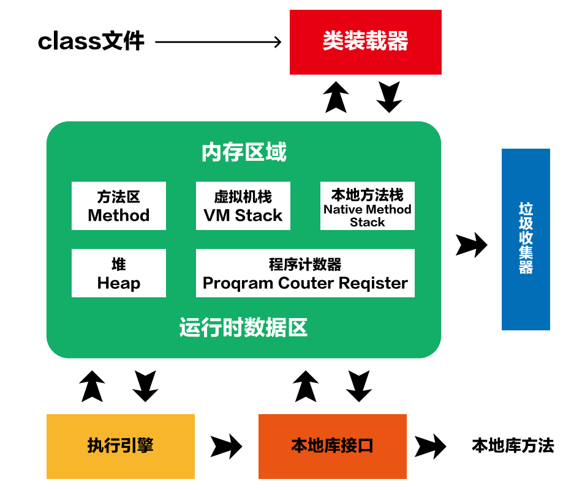

# JVM

# JVM的主要组成部分​

**JVM**：<u>*Java Virtual Machine*</u> 的简写，译为“JAVA虚拟机”。JVM包含两个子系统和两个组件，两个子系统为Class loader(类装载)、Execution engine(执行引擎)；两个组件为Runtime data area(运行时数据区)、Native Interface(本地接口)。

* Class loader(类装载)：根据给定的全限定名类名(如：java.lang.Object)来装载class文件到Runtime data area中的method area。
* Execution engine（执行引擎）：执行classes中的指令。
* Native Interface(本地接口)：与native libraries交互，是其它编程语言交互的接口。
* Runtime data area(运行时数据区域)：这就是我们常说的JVM的内存。

作用 ：首先通过编译器把 Java 代码转换成字节码，类加载器（ClassLoader）再把字节码加载到内存中，将其放在运行时数据区（Runtime data area）的方法区内，而字节码文件只是 JVM 的一套指令集规范，并不能直接交给底层操作系统去执行，因此需要特定的命令解析器执行引擎（Execution Engine），将字节码翻译成底层系统指令，再交由 CPU 去执行，而这个过程中需要调用其他语言的本地库接口（Native Interface）来实现整个程序的功能。

‍

参考资料：

[JVM的主要组成部分及其作用有哪些 - 编程语言 - 亿速云 (yisu.com)](https://www.yisu.com/zixun/539111.html)

[简介 - 《JVM必知必会》 - 书栈网 · BookStack](https://www.bookstack.cn/read/chinageek-jvm/README.md)

[JVM的主要组成部分及其作用有哪些 - 编程语言 - 亿速云 (yisu.com)](https://www.yisu.com/zixun/539111.html)
