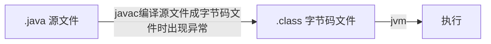
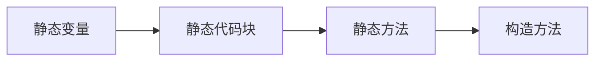

# Java 基础面试题

[(29条消息) 最全java面试题及答案（208道）_十一技术斩的博客-CSDN博客](https://blog.csdn.net/uuqaz/article/details/123502779)

[【Java】包的命名规则 - Nemo&amp; - 博客园 (cnblogs.com)](https://www.cnblogs.com/blknemo/p/10035442.html#:~:text=%E3%80%90Java%E3%80%91%E5%8C%85%E7%9A%84%E5%91%BD%E5%90%8D%E8%A7%84%E5%88%99%20%E5%91%BD%E5%90%8D%E8%A7%84%E8%8C%83%20%E5%8C%85%EF%BC%9A%20%E6%89%80%E6%9C%89%E5%8D%95%E8%AF%8D%E7%9A%84%E5%AD%97%E6%AF%8D%E5%B0%8F%E5%86%99%EF%BC%8C%E4%B9%8B%E5%90%8E%E6%AF%8F%E4%B8%AA%E5%8D%95%E8%AF%8D%E7%94%A8-%E9%9A%94%E5%BC%80%EF%BC%8C%E5%A6%82%20org.nemo.demo%20%E5%B8%B8%E9%87%8F%EF%BC%9A%20%E6%89%80%E6%9C%89%E5%8D%95%E8%AF%8D%E7%9A%84%E5%AD%97%E6%AF%8D%E5%A4%A7%E5%86%99%EF%BC%8C%E4%B9%8B%E5%90%8E%E6%AF%8F%E4%B8%AA%E5%8D%95%E8%AF%8D%E7%94%A8_%E9%9A%94%E5%BC%80%EF%BC%8C%E5%A6%82%20FLAG,%E7%AC%AC%E4%B8%80%E4%B8%AA%E5%8D%95%E8%AF%8D%E7%9A%84%E9%A6%96%E5%AD%97%E6%AF%8D%E5%B0%8F%E5%86%99%EF%BC%8C%E4%B9%8B%E5%90%8E%E6%AF%8F%E4%B8%AA%E5%8D%95%E8%AF%8D%E7%9A%84%E9%A6%96%E5%AD%97%E6%AF%8D%E5%A4%A7%E5%86%99%EF%BC%8C%E5%A6%82%20getInfo%20%28%29%20Java%E5%8C%85%E7%9A%84%E5%91%BD%E5%90%8D%E8%A7%84%E5%88%99%20util%3A%20%E5%AF%B9%E5%BA%94%E8%8B%B1%E6%96%87%20utility%20%EF%BC%88%E5%AE%9E%E7%94%A8%E5%B7%A5%E5%85%B7%EF%BC%89%EF%BC%8C%E4%B8%80%E8%88%AC%E5%AD%98%E6%94%BE%E5%B7%A5%E5%85%B7%E7%B1%BB%EF%BC%8C%E5%B0%B1%E5%83%8Fjava.lang.util%E5%8C%85%E4%B8%80%E6%A0%B7%E5%AD%98%E6%94%BE%E7%9D%80%E5%90%84%E7%A7%8D%E5%90%84%E6%A0%B7%E7%9A%84%E5%B7%A5%E5%85%B7%E7%B1%BB%E6%96%B9%E4%BE%BF%E4%BD%A0%E7%BC%96%E7%A8%8B%EF%BC%8C%E8%BF%99%E9%87%8C%E4%BD%A0%E5%8F%AF%E4%BB%A5%E6%94%BE%E8%87%AA%E5%B7%B1%E5%86%99%E5%A5%BD%E7%9A%84%E5%B7%A5%E5%85%B7%E7%B1%BB%E4%B8%BA%E8%87%AA%E5%B7%B1%E7%9A%84%E7%A8%8B%E5%BA%8F%E6%8F%90%E4%BE%9B%E6%96%B9%E4%BE%BF%E3%80%82)

---

‍Java 语言的三种技术架构

JavaEE：企业版、jsp、servlet等。

JavaME：小型版本，是为开发电子消费产品和嵌入式设备提供的解决方案。手机

JavaSE：Java标准版，集合、多线程、面向对象啊等。

## 标识符命名规则

可以由数字、字母、下划线（_)、$进行组合，不能够以数字作为开头合法的命名：a1、_abc(不推荐)、abc$

## 什么是强制类型转换、隐式类型转换？

将大的数据类型赋值小的数据类型称之为强制类型转换，会出现精度的损失

## native 修饰符是什么意思？

native 代表 java 访问其他语言编写的代码。

## 谈一谈面向对象思想

面向对象是相对于面向过程而言的，面向过程强调的是功能，面向对象强调的是将功能进行封装。

面向对象的 3 大基本特征：封装(private)、继承(extends)、多态

## 面向对象的三个基本特征？

继承： 继承就是子类继承父类的属性和方法。

封装：隐藏部分对象的属性和实现细节，对数据的访问只能通过外公开的接口。

多态：对于同一个行为，不同的子类对象具有不同的表现形式。

多态存在的3个条件：

* 继承；
* 重写；
* 父类引用指向子类对象。

```java
父类类型 对象 = new 子类对象();	// 改变子类对象
对象.get\set();
```

## 什么是编译时异常？什么是运行时异常？



## 一个Java文件里可以有多个类吗（不含内部类）？

1. 一个java文件内可以有多个类，但最多只有一个被 public 修饰的类
2. 这个文件包含public 修饰的类，这个类名必须与java文件名一致

## Set里的元素是不能重复的，那么用什么方法来区分重复与否呢？是用==还是equals()?

set 元素是不能重复的，可以用`equals()`​来判断！

## abstract class 和 interface 有什么区别？

abstract class 和 interface 都不能实例化。

abstract class 拥有自己的成员变量，interface 默认 static final 修饰

abstract class 方法可以私有化，非抽象方法，必须实现；interface 不能有私有的，默认是 public abstract

实现方式不同：abstract class 需要 extends，interface 要用 implement

## abstract 的 method 是否可同时是static？是否可同时是native？是否可同时是synchronized？

abstract 的方法可以同时是 static ！

abstract 的方法不能同时是native的！

native本身就和abstract冲突，他们都是方法的声明，只是一个把方法实现移交给子类，另一个是移交给本地操作系统。如果同时出现，就相当于既把实现移交给子类，又把实现移交给本地操作系统，那到底谁来实现具体方法呢！

abstract 的 方法可同时是 synchronized

## 静态变量和成员变量的区别

1. 调用方式：静态变量也称之为类变量，可以直接通过类名来调用。也可以通过对象名来调用

2. 存储位置：静态变量存储在方法区中的静态区域；成员变量存储在堆内存中

3. 生命周期：静态变量随着类的加载而存在，随着类的消失而消失，生命周期很长；

   成员变量随着对象的创建而存在，当对象消失时成员变量随之消失

4. 与对象的相关性：静态变量是所有对象共享的数据；成员变量是每个对象特有的

---

## 成员变量与局部变量的区别？

成员变量：直接放置在类中的变量称之为成员变量，与方法是平级关系。

局部变量：在方法体中声明的变量

1. 作用域：成员变量针对整个类有效；局部变量在某个范围内有效(方法、循环体)
2. 存储位置：成员变量随着对象的创建而存在，对象消失时成员变量就会消失，存储在堆内存中；局部变量在方法被调用，或者语句被执行的时候存在，存储在栈内存中。
3. 初始值：成员变量有默认的初始值(类类型的初始值为 Null，基本数据类型有各自特有的默认值)

## this关键字与 static 关键字

this 关键字：==代表的是本类对象的一个引用，谁调用 this所在的方法，this 就代表的是谁==

```java
    public void test1() { System.out.println(this); }
    public static void main(String[] args) { new Demo1().test1(); }
```

Static 关键字：用来修饰成员变量与成员方法

静态的特点：

1. 随着类的加载而加载
2. 优先与对象存在
3. 对所有的对象共享
4. 可以被类名直接调用

## 接口是否可继承接口？抽象类是否可实现(implements)接口?抽象类是否可继承实体类(concrete class)

**接口：** 接口是一种约束形式，其中只包括成员定义，不包含成员的实现内容。

接口可以继承（extends）接口。

抽象类可以实现（implements）接口。

抽象类可继承（extends）实体类，(但前提是实体类必须有明确的构造函数)。

## 普通类、抽象类、接口之间相关面试题

普通类：没有抽象的方法

抽象类：抽象类中可以有抽象方法，也可以一个抽象方法都没有

接口：

1. 接口中所有的方法都为抽象方法(`public abstrac`t修饰)
2. 接口中所有的变量必须被`public static`

final 修饰

1. 普通类是否可以继承抽象类：可以
2. 普通类是否可以实现接口：可以
3. 抽象类是否可以继承普通类：可以
4. 抽象类是否可以继承抽象类：可以
5. 抽象类是否可以继承接口：可以
6. 接口是否可以继承普通类：不可以
7. 接口是否可以继承抽象类：不可以
8. 接口是否可以继承接口：可以

总结：接口不可以继承/实现任何类

## 抽象类（abstract class）和接口（interface）有什么区别？

抽象类只能单继承，接口可以多实现。

抽象类可以有构造方法，接口中不能有构造方法。

抽象类中可以有成员变量，接口中没有成员变量，只能有常量（默认就是 public static final）

抽象类中可以包含非抽象的方法，在 Java 7 之前接口中的所有方法都是抽象的，在 Java 8 之后，接口支持非抽象方法：default 方法、

静态方法等。Java 9 支持私有方法、私有静态方法。

抽象类中的抽象方法类型可以是任意修饰符，Java 8 之前接口中的方法只能是 public 类型，Java 9 支持 private 类型。

设计思想的区别：

接口是自上而下的抽象过程，接口规范了某些行为，是对某一行为的抽象。我需要这个行为，我就去实现某个接口，但是具体这个行为怎么实现，完全由自己决定。

抽象类是自下而上的抽象过程，抽象类提供了通用实现，是对某一类事物的抽象。我们在写实现类的时候，发现某些实现类具有几乎相同的实现，因此我们将这些相同的实现抽取出来成为抽象类，然后如果有一些差异点，则可以提供抽象方法来支持自定义实现。

## 说一说你对Java访问权限的了解

修饰变量、方法、类

1. private 可以被该类的内部成员访问
2. protected 可以被该类的内部成员访问，可以被同一个包下其他类访问，可以被它的子类访问
3. public 任意成员、包访问
4. default 可以被同一个包下其他类访问

## Java 中的 final 关键字有哪些用法？

修饰类：该类不能再派生出新的子类，不能作为父类被继承。因此，一个类不能同时被声明为abstract 和 final。

修饰方法：该方法不能被子类重写。

修饰变量：该变量必须在声明时给定初值，而在以后只能读取，不可修改。 如果变量是对象，则指的是引用不可修改，但是对象的属性

还是可以修改的。

## 介绍下 HashMap 的底层数据结构

我们现在用的都是 JDK 1.8，底层是由“数组+链表+红黑树”组成，而在 JDK 1.8 之前是由“数组+链表”组成。

## 为什么使用“数组+链表”？

使用 “数组+链表” 是为了解决 hash 冲突的问题。cc

数组和链表有如下特点：

数组：查找容易，通过 index 快速定位；插入和删除困难，插入某一个节点，这个节点的数据都会向后移动；删除也是，删除这个节点，数组整个会向前移动。

链表：查找困难，需要从头结点或尾节点开始遍历，直到寻找到目标节点；插入和删除容易，只需修改目标节点前后节点的 next 或 prev 属性即可；

HashMap 巧妙的将数组和链表结合在一起，发挥两者各自的优势，使用一种叫做 “拉链法” 的方式来解决哈希冲突。

首先通过 index 快速定位到索引位置，这边利用了数组的优点；然后遍历链表找到节点，进行节点的新增/修改/删除操作，这边利用了链表的优点。

## 为什么要改成“数组+链表+红黑树”？

主要是为了提升在 hash 冲突严重时（链表过长）的查找性能，使用链表的查找性能是 O(n)，而使用红黑树是 O(logn)。

## 那在什么时候用链表？什么时候用红黑树？

对于插入，默认情况下是使用链表节点。当同一个索引位置的节点在新增后超过8个（阈值8）：如果此时数组长度大于等于 64，则会触

发链表节点转红黑树节点（treeifyBin）；而如果数组长度小于64，则不会触发链表转红黑树，而是会进行扩容，因为此时的数据量还比

较小。

对于移除，当同一个索引位置的节点在移除后达到 6 个，并且该索引位置的节点为红黑树节点，会触发红黑树节点转链表节点（untreeify）。

## 为什么链表转红黑树的阈值是10？

我们平时在进行方案设计时，必须考虑的两个很重要的因素是：==时间和空间==。对于 HashMap 也是同样的道理，简单来说，阈值为8是在时间和空间上权衡的结果。已2倍的空间换效率，没有达到相应的效果。

红黑树节点大小约为链表节点的1.5倍，在节点太少时，红黑树的查找性能优势并不明显，付出2倍空间的代价作者觉得不值得。

理想情况下，使用随机的哈希码，节点分布在 hash 桶中的频率遵循泊松分布，按照泊松分布的公式计算，链表中节点个数为8时的概率为 0.00000006（就我们这QPS不到10的系统，根本不可能遇到嘛），这个概率足够低了，并且到8个节点时，红黑树的性能优势也会开始展现出来，因此8是一个较合理的数字。

## 那为什么转回链表节点是用的6而不是复用8？

如果我们设置节点多于8个转红黑树，少于8个就马上转链表，当节点个数在8徘徊时，就会频繁进行红黑树和链表的转换，造成性能的损耗。

## HashMap 的默认初始容量是多少？HashMap 的容量有什么限制吗？

默认初始容量是16。HashMap 的容量必须是2的N次方，HashMap 会根据我们传入的节点，进行容量计算一个大于等于该容量的最小的2的N次方，例如传 16，容量为16；传17，容量为32。

## HashMap 和Hashtable 的区别?

HashMap 允许 key 和 value 为 null，Hashtable 不允许。

HashMap 的默认初始容量为 16，Hashtable 为 11。

HashMap 的扩容为原来的 2 倍，Hashtable 的扩容为原来的 2 倍加 1。

HashMap 是非线程安全的，Hashtable是线程安全的。

## switch都可以支持哪些数据类型

JDK1.5： 在switch循环中支持==枚举类与byte short char int的包装类==,对四个包装类的支持是因为java编译器在底层手动进行拆箱,而对枚举类的支持是因为枚举类有一个ordinal方法,该方法实际上是一个int类型的数值。

jdk1.7： 开始支持String类型,但实际上String类型有一个hashCode算法,结果也是int类型.而byte short char类型可以在不损失精度的情况下向上转型成int类型.所以总的来说,可以认为switch中只支持int。

## switch中可以有null吗？

在switch语句中，表达式的值不能是null，否则会在运行时抛出NullPointerException。在case子句中也不能使用null，否则会出现编译错误。

## switch支持的类型有？

Java 7 中加入了对String类型的支持。所以支持的有：char、byte、short、int 和 Character、Byte、Short、Integer 和 String

## case字句可以重复吗？

case字句的值是不能重复的。对于字符串类型的也一样，但是字符串中可以包含Unicode转义字符。重复值的检查是在Java编译器对Java

源代码进行相关的词法转换之后才进行的。也就是说，有些case字句的值虽然在源代码中看起来是不同的，但是经词法转换之后是一样

的，就会在成编译错误。比如：“男”和“\u7537”就是一个意思。

## swtich是否能作用在byte上，是否能作用在long上，是否能作用在String上

switch和case语句的参数是int、short、char或者byte。

注意，对于精度比int大的类型，比如long、float、double，不会自动转换为int，如果想使用，就必须强转为int，如(int)float。

jdk1.7后，整型，枚举类型，boolean，字符串都可以。jdk1.7并没有新的指令俩处理switch String，而是通过调用switch中的String.hashCode，将String转为int从而进行判断。

## 给我一个你最常见到的RuntimeException

这种题就需要背了，没啥可理解的。常写代码谁能记住，我反正是记不住。就跟你手写代码一样，不是一般人那。

空指针异常 NullPointerException
数组越界异常 IndexOutOfBoundsException
类转换异常 ClassCaseException
向数组中存放与声明类型不兼容对象异常 ArrayStoreException
Io操作异常 BufferOverFlowException

## 编译时异常需要添加方法签名 throws 抛出异常运行时不需要。

## error 和 exception 有什么区别

Exception 和 Error 都是继承了 Throwable 类，在 Java 中只有 Throwable 类型得实例才可以被抛出 throw 捕获 try-catch 。

Exception 是程序中正常运行中，可以预料的异常情况，可以被捕获，进行处理的异常。

Error 程序导致程序处于非正常的不可恢复状态。不便于捕获。

## List, Set,Map是否继承自 Collection 接口？

List 与 Set 继承 Collection 接口；Map 没有继承自 Collection 接口；

## try{} 里有一个return语句，那么紧跟在这个try后的finally{}里的code会不会被执行，什么时候被执行，在 return前还是后

Try{}里有一个return语句，那么紧跟在这个try后面的finally{}里的code会执行的。

finally 语句总会执行，除非遇到一些特殊情况，如System.exit(0)

return语句并不一定就是结束一段程序，当它和finally一起使用但finally语句中无return时会先等finally语句执行完成后再返回值。

当finally语句中有return语句时会直接返回finally中return的语句

## 用最有效率的方法算出2乘以8等於几

2 <<3

```java
System.out.println(2 << 3);		//16	2*2^3
System.out.println(1 << 2);		//4		1*2^2
```

---

## 两个对象值相同(x.equals(y)== true)，但却可有不同的hash code，这句话对不对

不对，如果两个对象x 和 y 满足 x.equals(y) == true，它们的哈希码（hashCode）应当相同。

## 当一个对象被当作参数传递到一个方法后，此方法可改变这个对象的属性，并可返回变化后的结果，那么这里到底是值传递还是引用传递

我先不思考题，首先 java 就属于值传递

## Mybatis 中$取值与#取值的区别？

#取值可以防止 SQL 注入；$取值不能够防止 SQL 注入

#取值会将参数当做字符串处理，都为参数加上单引号；$取值不做任何处理、

---

## 重载（Overload）和重写（Override）的区别？

方法的重载和重写都是==实现多态==的方式，区别在于前者实现的是**编译时的多态性**，而后者实现的是**运行时的多态性** 。

重载：一个类中有多个同名的方法，但是具有有不同的参数列表（参数类型不同、参数个数不同或者二者都不同）。

重写：发生在子类与父类之间，子类对父类的方法进行重写，参数都不能改变，返回值类型可以不相同，但是必须是父类返回值的派生

类。

---

## Overload 和 Override 的区别；Overloaded 的方法是否可以改变返回值的类型

Overload 是重载，Override 是重写。很基础的知识点必会。

Overloaded 的方法的参数列表不一样，它们的返回类型`不一定`不一样。

如果两个方法的参数列表完全一样，是否可以让它们的返回值不同来实现重载Overload？ 这是不行的。

---

## 讲讲重载

- 需要方法返回值一个数时，添加返回值类型，不需要写void
- 方法名必须相同
- 返回值可以是一个或多个
- 跟返回值类型无关
- 重载方法中返回值参数类型不同也可以

---

## 为什么不能根据返回类型来区分重载？

如果我们有两个方法如下，当我们调用：test(1) 时，编译器无法确认要调用的是哪个。

```java
// 方法1
int test(int a);
// 方法2
long test(int a);
```

方法的返回值只是作为方法运行之后的一个“状态”，但是并不是所有调用都关注返回值，所以不能将返回值作为重载的唯一区分条件。

---

## 构造器 Constructor 是否可被重写(Override)

构造器Constructor不能被继承，因此不能被重写(Override)，在本类当中可以被重载（Overload）

如果父类自定义了有参构造函数，则子类无论定义无参，有参构造函数，都会报错。正确的做法是在子类的构造方法中添上super（参数），以表明子类构造之前先构造父类，而这句话必须放在第一句，否则报"Constructor call must be the first statement in a constructor"的错误。

---

## List、Set、Map三者的区别?

List（对付顺序的好帮手）： List 接口存储一组不唯一（可以有多个元素引用相同的对象）、有序的对象。

Set（注重独一无二的性质）：不允许重复的集合，不会有多个元素引用相同的对象。

Map（用Key来搜索的专业户）: 使用键值对存储。Map 会维护与 Key 有关联的值。两个 Key可以引用相同的对象，但 Key 不能重复，典型的 Key 是String类型，但也可以是任何对象。

---

## 讲讲 ArrayList 和 LinkedList 区别

- 首先,他们的底层数据结构不同,`ArrayList`底层是基于数组实现的,`LinkedList`底层是基于链表实现的
- 由于底层数据结构不同,他们所适用的场景也不同,`ArrayList`更适合随机查找,`LinkedList`更适合删除和添加,查询,删除的时间复杂度不同
- 另外`ArrayList`和`LinkedList`都实现了`List`接口,但是`LinkedList`还额外实现了`Deque`接口,所有`LinkedList`还可以当做队列来适用

---

## ArrayList 和 Vector 的区别？

Vector 和 ArrayList 几乎一致，唯一的区别是 Vector 在方法上使用了 synchronized 来保证线程安全，因此在性能上 ArrayList 具有更好的表现。

有类似关系的还有：StringBuilder 和 StringBuffer、HashMap 和 Hashtable。

---

## java 中的集合包括 ArrayList、LinkedList、HashMap

`ArrayList`和`LinkedList`均实现了List接口。

`ArrayList`的访问速度比`LinkedList`快。

`HashMap`实现Map接口，它允许任何类型的键和值对象，并允许将null用作键或值。

---

## ArrayList 是不是线程安全的？

**回答：** 不是

怎么实现他的线程安全？

**回答：** 使用`synchronized`在他的add方法上面这种适用于，在单线程下面没有任何的问题。但是在多线程可能发生一个线程的值覆盖掉另外的线程添加的值，所以要实现线程安全就得使用`Collections.synchronizedList()`

这样会不会影响到他的效率？

**回答：** 肯定会受到印象，提高安全的情况下还想提高效率，比如一个人可以做两个人的工作，为了安全只能先做一个人的工作。效率肯定会下降的。

那又要怎么去保证他的效率呢？

**回答：** 如果既要保证线程安全又要保证效率，那就不能使用`Collections.synchronizedList()`，换为写时复制容器，就是在多线程的情况之下，每一个线程进行添加的时候都会复制一个新的容器给这个线程，保证一个容器只有一个线程，这样就保证了他的线程安全，还不影响他的效率，但是内存的占用却是大大的增加了

**主要核心思想：** 空间换时间

---

## JDBC 中的 PreparedStatement 相比 Statement 的好处

1. PreparedStatement **可以防止** **SQL** **注入，但是** **Statement** **不能够防止** **SQL** **注入**
2. PreparedStatement **可以将** **SQL** **语句记性预编译，因此执行的速度跟快。**

---

## 为什么要用ORM？和JDBC有何不同？

**ORM**：对象关系映射

**常见的** ORM框架：Hibernate 框架、**DBUtil**、Mybatis

**orm** **是一种思想，就是把** **object** **转变成数据库中的记录，或者把数据库中的记录转变成** **object** **对象，我们可以使用** **JDBC** **来实现这种思想，其实，如果我们的项目是严格按照** **java** **中的** **oop** **思想，则已经实现了** **orm** **的思想。**

---

## truncate table 与 delete from table 的区别？

**truncate   table** 表名  delete from **表名** 都可以删除某一张表中的所有数据记录，不同的是：truncate 删除数据时，会清空主键自增；delete from 删除数据库，自增的记录继续存在。在删除大量数据时，**truncate** 的效率更高

---

## 索引的作用

1、通过创建唯一索引，可以保证数据记录的唯一性

2、可以大大的加快数据检索的速度

3、可以加速表与表之间的连接，这一点在实现数据的参照完整性方面有特别的意义

4、在使用 order by 和 group by 子句中进行检索数据时，可以显著的减少查询中的分组和排序的时间

5、在使用索引可以在检索数据时使用、优化隐藏器，提高系统性能

---

## MySQL 如何备份数据与还原数据

cmd--->mysqldump -u **账号** **-p** **数据库名**>**备份的路径**

在 **mysql** 环境中，source **数据库备份文件**

---

## 常见的非关系型数据库 :nosql(不仅仅只是 sql)

Redis：键值对的数据库，主要将数据保存到内存中去，因此读取、写入速度是很快，主要用来做缓存。

MongoDB：文档数据库，是一种最像关系型数据库的非关系型数据库。可以将评论保存到 MongoDB 中

---

---

## 网络编程协议？

1. TCP协议，它的特点是3次握手（第一次：我问你在么？ 第二次：你回答 第三次：我反馈我知道你在）。
2. UDP协议，它是将数据源和目的封装成数据包，不需要建立连接。
3. HTTP协议，超文本传输协议。

## 聊聊你对xml的了解？

xml目前主要用来做配置文件（springMVC、Spring、Mybatis、Hibernate、Struts2	等）

## 解析xml文件的几种方式？分别特点是什么？

- dom解析(占用内存，前后反复遍历)
- sax解析(节省内存，只能向后遍历数据)

## 字节流与字符流区别?

1. 当读取纯文本文件(只有文字字符)时，使用字符流比较方便
2. 当读取图片、视频、音频时需要使用字节流

常见的字节流

FileInputStream、BufferedInputStream、ObjectInputStream

FileOutputStream、BuuferedInputStream、ObjectOutputStream

常见的字符流

FileReader、BufferedReader

FileWriter、BufferedWriter

## 可变参数

```java
public class Demo1 {
    public void aaa(int...attr) {
        for (int i : attr) { System.out.println("i = " + i); }
    }
    public static void main(String[] args) { new Demo1().aaa(1,2,3,4); }
}
```

---

## instanceOf关键字

作用：用于判断某个对象是否是某个类型

语法：对象名`instanceOf`子类(实现)名，返回值为`boolean`

```java
    public void test() {
        ArrayList<String> aList = new ArrayList<>();
        boolean b = aList instanceof List;
        System.out.println("b = " + b);
    }
```

---

## Arrays、Math、Random等常用工具类

Arrays工具类：主要用来操作跟数组相关的

```java
	public void test1() {		// attrl由小到大排序
        int[] attrl = {10,-1,2,30,9,12};
        Arrays.sort(attrl);
        for (int temp : attrl) {
            System.out.println(temp);
        }
    }

    public void test() {
        List<String> aList = new ArrayList<>();
        aList.add("中国");
        aList.add("美国");
        aList.add("日本");
        List<String> bList = Arrays.asList("中国", "美国", "日本");
        List<Integer> list = Arrays.asList(1, 2, 3, 4);
        //bList.add("朝鲜");      // 返回集合是固定长度的，后期不能够添加数据
    }
```

Math工具类：主要是操作跟数学相关

常见的方法：abs(参数)、pow(2,3)

```java
    public void test() {
        int abs = Math.abs(-20);
        System.out.println("abs = " + abs);
        double pow = Math.pow(2, 3);
        System.out.println("pow = " + pow);
    }
```

Random工具类：随机数

```java
    public void test() {
        Random random = new Random();
        int i = random.nextInt();
        int i1 = (int) (Math.random() * 10000);
        System.out.println("i1 = " + i1);
    }
```

---

## Properties 类

Properties类主要用来操作 `.properties` 配置文件

```java
	public static void main(String[] args) throws IOException {
        Properties props = new Properties();
        InputStream ins = Demo1.class.getClassLoader().getResourceAsStream("jdbc.properties");
        props.load(ins);
        String driver = props.getProperty("driver");
        System.out.println("driver=" + driver);
        String aaa = props.getProperty("aaa", "我是默认值");
        System.out.println(aaa);
    }
```

---

---

## 什么是匿名对象？匿名对象的应用场景？

什么是匿名对象：没有名字的对象，是对象的一种简写形式

```java
public class Demo1 {
    public static void print(List<String> aList) { aList.forEach((temp) -> System.out.println(temp)); }
    public static void main(String[] args) { Demo1.print(new ArrayList<String>()); }
}
```

匿名对象的应用场景：

1. 可以作为实际参数在方法传递中使用
2. 只调用类中的一次方法

---

---

## Lambda表达式遍历List 集合、Map集合

```java
	public void test01() {		// Lambda遍历List集合
        List<String> aList = Arrays.asList("张三", "李四", "王二麻子");
        aList.forEach((temp) -> System.out.println(temp));
    }

	public void test02() {		// Lambda遍历Map集合
        HashMap<String, Object> aMap = new HashMap<>();
        aMap.put("id", 1L);
        aMap.put("userName", "张三");
        aMap.put("gender", "男");
        aMap.forEach((k, v) -> System.out.println(k + " = " + v));
    }
```

---

---

---

---

‍

---

---

---

---

---

## JDK1.8之后有哪些新特性？(看看就行了，你还想真记住！)

接口默认方法：Java 8允许我们给接口添加一个非抽象的方法实现，只需要使用 default关键字即可

Lambda 表达式和函数式接口：Lambda 表达式本质上是一段匿名内部类，也可以是一段可以传递的代码。Lambda 允许把函数作为一个方法的参数（函数作为参数传递到方法中），使用 Lambda 表达式使代码更加简洁，但是也不要滥用，否则会有可读性等问题，《Effective Java》作者 Josh Bloch 建议使用 Lambda 表达式最好不要超过3行。

Stream API：用函数式编程方式在集合类上进行复杂操作的工具，配合Lambda表达式可以方便的对集合进行处理。Java8 中处理集合的关键抽象概念，它可以指定你希望对集合进行的操作，可以执行非常复杂的查找、过滤和映射数据等操作。使用Stream API 对集合数据进行操作，就类似于使用 SQL 执行的数据库查询。也可以使用 Stream API 来并行执行操作。简而言之，Stream API 提供了一种高效且易于使用的处理数据的方式。

方法引用：方法引用提供了非常有用的语法，可以直接引用已有Java类或对象（实例）的方法或构造器。与lambda联合使用，方法引用可以使语言的构造更紧凑简洁，减少冗余代码。

日期时间API：Java 8 引入了新的日期时间API改进了日期时间的管理。

Optional 类：著名的 NullPointerException 是引起系统失败最常见的原因。很久以前 Google Guava 项目引入了 Optional 作为解决空指针异常的一种方式，不赞成代码被 null 检查的代码污染，期望程序员写整洁的代码。受Google Guava的鼓励，Optional 现在是Java 8库的一部分。

新工具：新的编译工具，如：Nashorn引擎 jjs、 类依赖分析器 jdeps。

## 关于依赖注入（DI）

依赖注入的主要目的是解耦合。

常用的依赖注入方式有`Setter`和构造方法。

## 线程

- Java通过synchronized进行访问的同步，synchronized作用非静态成员方法和静态成员方法上同步的目标是不同的
- 线程通过使用synchronized关键字可获得对象的互斥锁定。
- 线程调度算法是平台独立的

## Web Service 的描述

`Web Service`采用了soap协议（简单对象协议）进行通信。

`Web Service`是跨平台，跨语言的远程调用技术。

`WSDL`是用于描述Web Services 以及如何对它们进行访问。

‍

## jdk 1.7 中

`java`中所有的抽象方法都必须在类内定义

## java 实例变量,类变量和 final 变量的说法

实例变量：类中定义的变量，即成员变量，如果没有初始化，会有默认值。

类变量：是用static修饰的属性。

final变量：是用final修饰的变量。

## java 中的 ClassLoader

`ClassLoader`的父子结构中，默认装载采用了父优先。

类装载器需要保证类装载过程的线程安全。

默认情况下，Java应用启动过程涉及三个`ClassLoader`：`Boostrap`，Extension，System

## 装箱、拆箱操作发生在：

引用类型与值类型之间。

## 以下代码能否执行？

```java
short s1 = 1; s1 = s1 + 1;		// 编译报错，原因：类型不兼容，int转short可能会出现损失。 
short s1 = 1; s1 += 1;		// 正常编译执行，s1 += 1 相当于 s1 = (short)(s1 + 1).
```

## 用最有效率的方法计算2乘以8？

2 << 3

## & 和 && 的区别？

&&：逻辑与运算符。

当运算符左右两边的表达式都为 true，才返回 true。同时具有短路性，如果第一个表达式为 false，则直接返回 false。

&：逻辑与运算符、按位与运算符。

**按位与运算符：** 用于二进制的计算，只有对应的两个二进位均为1时，结果位才为1 ，否则为0。

逻辑与运算符：& 在用于逻辑与时，和 && 的区别是不具有短路性。所在通常使用逻辑与运算符都会使用 &&，而 & 更多的适用于位运算。

## 深拷贝和浅拷贝区别是什么？

数据分为基本数据类型和引用数据类型。基本数据类型：数据直接存储在栈中；引用数据类型：存储在栈中的是对象的引用地址，真实的

对象数据存放在堆内存里。

浅拷贝：对于基础数据类型：直接复制数据值；对于引用数据类型：只是复制了对象的引用地址，新旧对象指向同一个内存地址，修改其

中一个对象的值，另一个对象的值随之改变。

深拷贝：对于基础数据类型：直接复制数据值；对于引用数据类型：开辟新的内存空间，在新的内存空间里复制一个一模一样的对象，新

老对象不共享内存，修改其中一个对象的值，不会影响另一个对象。

深拷贝相比于浅拷贝速度较慢并且花销较大。

## 并发和并行有什么区别？

并发：两个或多个事件在同一时间间隔发生。

并行：两个或者多个事件在同一时刻发生。

并行是真正意义上，同一时刻做多件事情，而并发在同一时刻只会做一件事件，只是可以将时间切碎，交替做多件事情。

## 当一个对象被当作参数传递到一个方法后，此方法可改变这个对象的属性，并可返回变化后的结果，那么这里到底是值传递还是引用传递？

值传递。Java 中只有值传递，对于对象参数，值的内容是对象的引用。

## Error 和 Exception 有什么区别？

Error 和 Exception 都是 Throwable 的子类，用于表示程序出现了不正常的情况。区别在于：

Error 表示系统级的错误和程序不必处理的异常，是恢复不是不可能但很困难的情况下的一种严重问题，比如内存溢出，不可能指望程序

能处理这样的情况。

Exception 表示需要捕捉或者需要程序进行处理的异常，是一种设计或实现问题，也就是说，它表示如果程序运行正常，从不会发生的情况。

## Java 静态变量和成员变量的区别。

```java
public class Demo {
    public static String STATIC_VARIABLE = "静态变量";		// 静态变量：又称类变量，static修饰
    public String INSTANCE_VARIABLE = "实例变量";		// 实例变量：又称成员变量，没有static修饰
}
```

成员变量存在于堆内存中。静态变量存在于方法区中。

成员变量与对象共存亡，随着对象创建而存在，随着对象被回收而释放。静态变量与类共存亡，随着类的加载而存在，随着类的消失而消失。

成员变量所属于对象，所以也称为实例变量。静态变量所属于类，所以也称为类变量。

成员变量只能被对象所调用 。静态变量可以被对象调用，也可以被类名调用。

---

## 是否可以从一个静态（static）方法内部发出对非静态（non-static）方法的调用？

1）没有显示创建对象实例：不可以发起调用，==非静态方法只能被对象所调用==，==静态方法可以通过对象调用，也可以通过类名调用==。

```java
public class Demo {
    public static void staticMethod() {
        instanceMethod();		// 直接调用非静态方法：编译报错
    }
    public void instanceMethod() { System.out.println("非静态方法"); }
}
```

2）显示==创建对象实例==：可以发起调用，在静态方法中显示的创建对象实例，则可以正常的调用。

```java
public class Demo {
    public static void staticMethod() {
        instanceMethod01();
        Demo.instanceMethod01();        // 可以通过类直接调用静态方法！
        Demo demo = new Demo();		// 静态方法调用非静态方法首先创建实例对象!
        demo.instanceMethod();      // 再调用非静态方法：成功执行!
        demo.instanceMethod01();        // 可以通过对象调用静态方法！
    }
    public void instanceMethod() { System.out.println("非静态方法"); }
    public static void instanceMethod01() { System.out.println("静态方法"); }
}
```

static注意点：

1）静态变量只会初始化（执行）一次。

2）当有父类时，完整的初始化顺序为：父类静态变量（静态代码块）-> 子类静态变量（静态代码块）-> 父类非静态变量（非静态代码块）-> 父类构造器 -> 子类非静态变量（非静态代码块）-> 子类构造器 。

---

## 静态变量、静态代码块、静态方法、构造方法的执行顺序

执行顺序是：



```java
public class Students {

    static {
        System.out.println("静态代码块");
    }
    public static void main(String[] args) {		// 静态代码块
    }

}
```

## 重定向与转发的区别？

1. 重定向时地址栏会发生改变；转发时地址栏不会发生改变；
2. 重定向请求服务器2次；转发只请求服务器一次；
3. 重定向调用的是response对象中的方法；转发调用的是request对象中的方法；

## get 与 post 请求的区别？

1. get 请求：数据会在地址栏上显示出来，因此不要传递敏感数据。
2. get 请求：传递的数据量有限，因此对于有文件上传的数据时不要使用 get 请求。
3. post 请求：传递的参数不会在地址栏中显示出来，因此可以传递敏感数据。
4. post 请求：传递的数据可以有很多，因此文件上传是可以使用 post 请求。

## 文件存放在 WEB-INF 与 WebContent(WebRoot)下的区别？

1. 文件存放 WebContent 文件夹下可以直接访问；但是存放到 WEB-INF 的文件不能够直接访问，一般需要通过转发来访问。
2. 文件保存到 WEB-INF 下更加安全。

## 如何解决 get 请求与 post 请求中文乱码问题？

1. POST 请求中文乱码问题：

   request.setCharacterEncoding(“UTF-8”);

   response.setCharachterEncoding(“UTF-8”);

   response.setContentType(“text/html;charset=UTF-8”);
2. GET 请求中文乱码问题：修改 tomcat 的编码(ISO8859-1)--->UTF-8

## java 中的有哪些域对象？

java 中有 4 大域对象，按照生命周期由小到大分别为：page 域 --> request --> session --> application

域对象的特点：

1. 域对象由服务器创建，不由程序员 New
2. 域对象可以存取数据：域对象.setAttribute(String,Object)、域对象.getAttribute(String)
3. 域对象都有范围

## session 与 cookie 的区别？

session 将数据保存到服务器端，cookie 将数据保存到用户浏览器中

session 底层是基于 cookie 的。

cookie 可以用来做 xxx 小时免登陆，session 主要存放用户登录成功的标记

## getParameter 与 getAttribute 方法有什么区别？

getParameter：从 request 对象中获取表单页面或者其他方式传递过来的参数，当获取的参数信息不存在时返回值为 null

getAttribute(String key):获取保存在域对象(page、requestsession、application)中的数据区别：

getParameter 是从 request 对象中获取参数；getAttribute 是从域对象中获取之前保存好的数据

getParameter 返回值类型为 String，getAttribute 返回值类型为 Object

‍

‍
