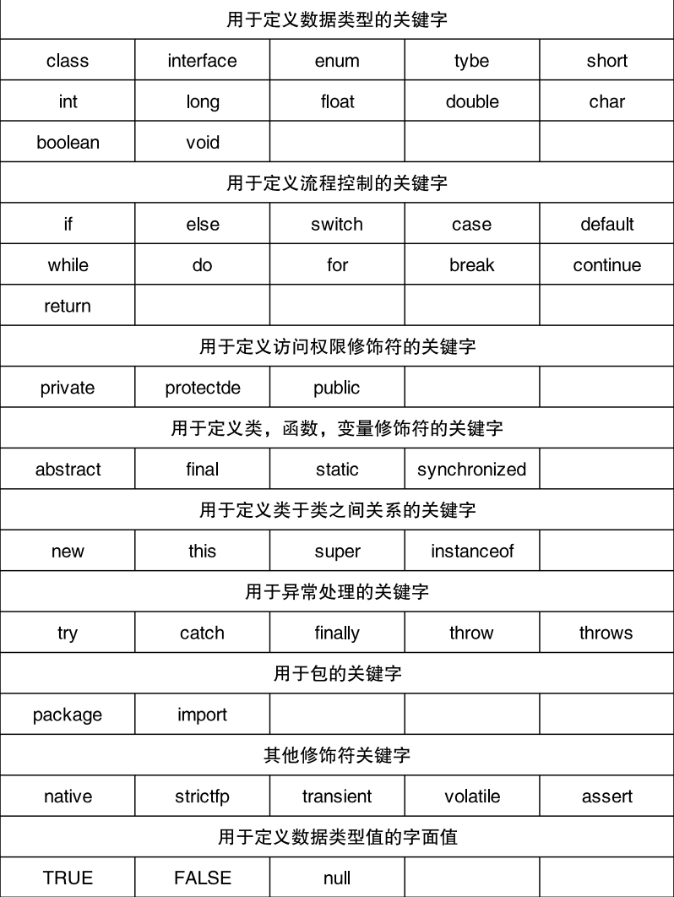
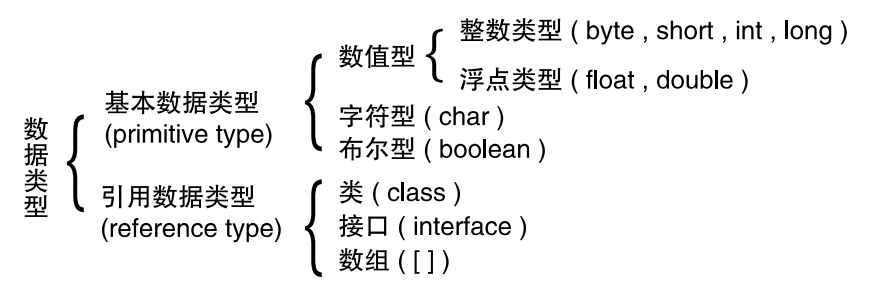
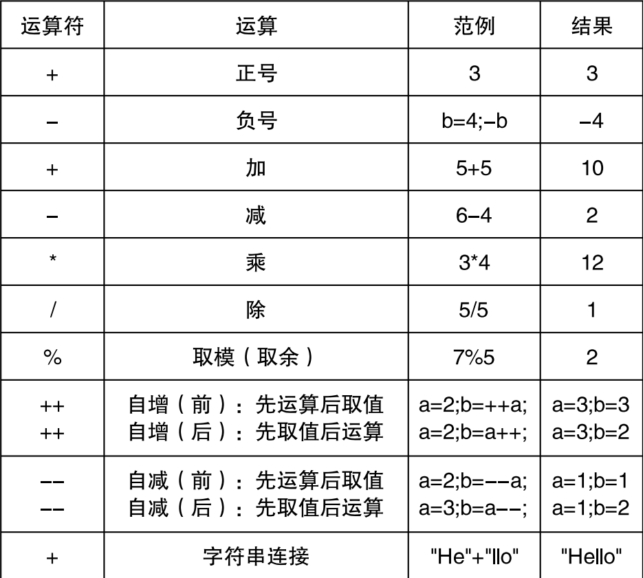
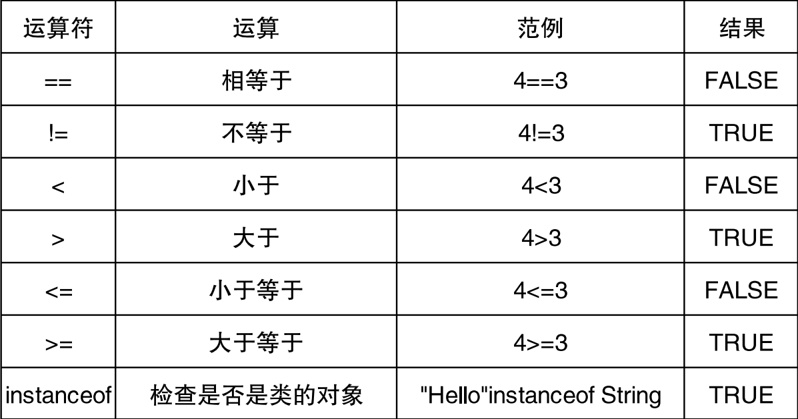
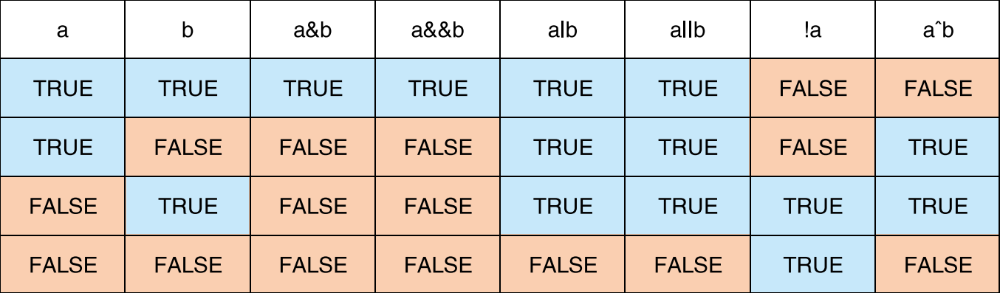
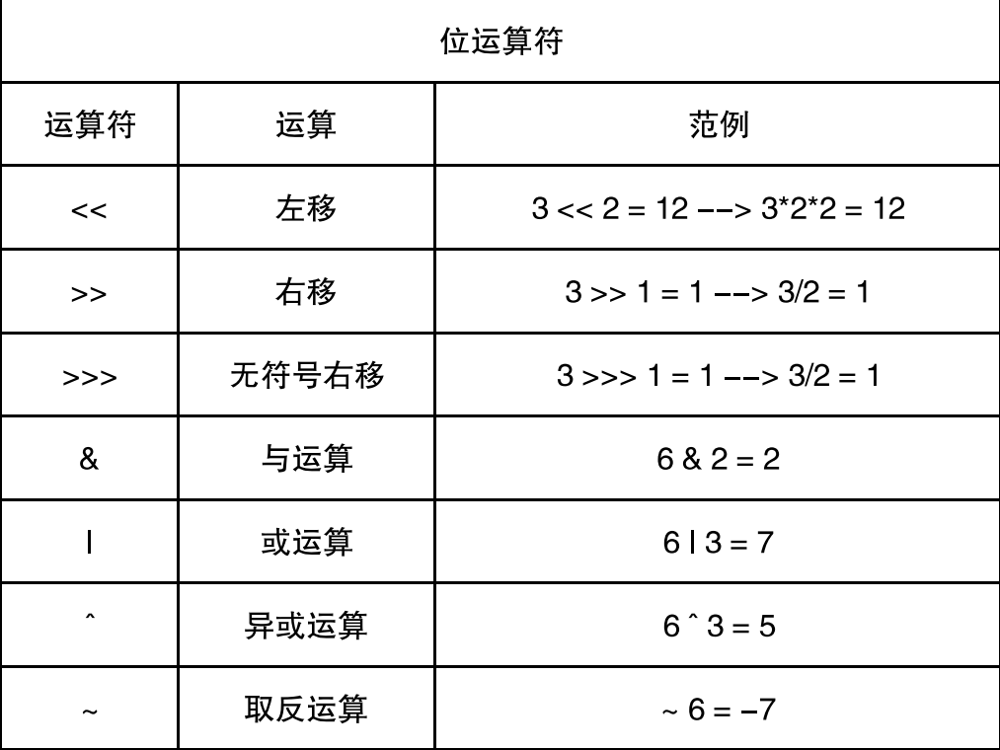
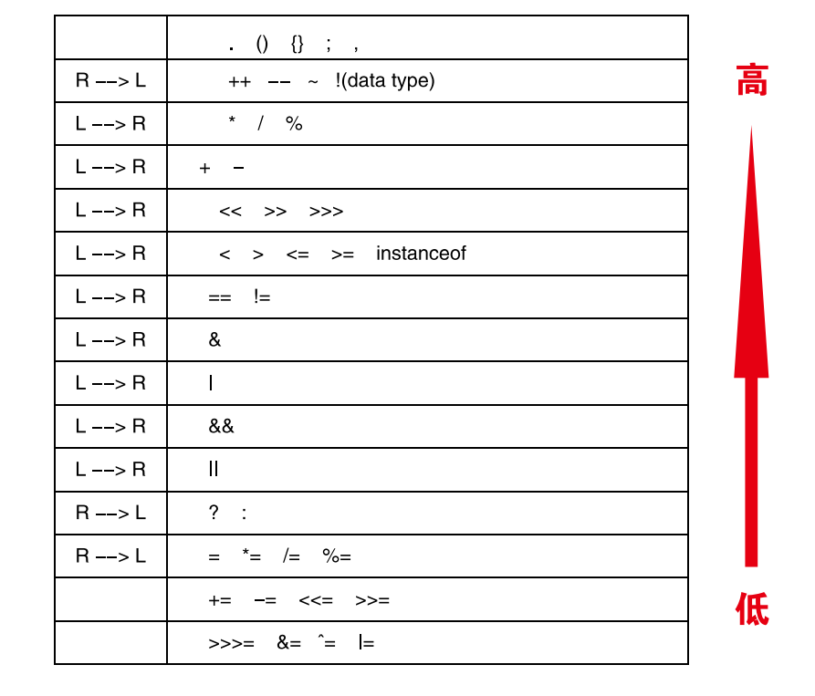

# Java基础语法

## Java语法规范

[阿里巴巴编码规范（Java）证明(上）-阿里云开发者社区 (aliyun.com)](https://developer.aliyun.com/article/903630?spm=5176.21213303.J_6704733920.11.71df53c9Lw1gyz&scm=20140722.S_community%40%40%E6%96%87%E7%AB%A0%40%40903630._.ID_community%40%40%E6%96%87%E7%AB%A0%40%40903630-RL_java%20alibaba%20%E7%BC%96%E7%A0%81%E8%A7%84%E8%8C%83-LOC_main-OR_ser-V_2-P0_2)

[阿里巴巴编码规范（Java）证明(下)  -阿里云开发者社区 (aliyun.com)](https://developer.aliyun.com/article/903659?spm=5176.21213303.J_6704733920.14.71df53c9Lw1gyz&scm=20140722.S_community%40%40%E6%96%87%E7%AB%A0%40%40903659._.ID_community%40%40%E6%96%87%E7%AB%A0%40%40903659-RL_java%20alibaba%20%E7%BC%96%E7%A0%81%E8%A7%84%E8%8C%83-LOC_main-OR_ser-V_2-P0_3)

### 变量

## Java 语言概述

[Java_百度百科 (baidu.com)](https://baike.baidu.com/item/java?fromModule=search-result_lemma&fromtitle=Java%E8%AF%AD%E8%A8%80&fromid=4148931#reference-%5B15%5D-12654100-wrap)

[应用软件开发_百度百科 (baidu.com)](https://baike.baidu.com/item/%E5%BA%94%E7%94%A8%E8%BD%AF%E4%BB%B6%E5%BC%80%E5%8F%91/7100301?fromModule=search-result_lemma)

[计算机程序语言_百度百科 (baidu.com)](https://baike.baidu.com/item/%E8%AE%A1%E7%AE%97%E6%9C%BA%E7%A8%8B%E5%BA%8F%E8%AF%AD%E8%A8%80/1250581?fromModule=search-result_lemma)

[java虚拟机_百度百科 (baidu.com)](https://baike.baidu.com/item/java%E8%99%9A%E6%8B%9F%E6%9C%BA/6810577?fromModule=search-result_lemma)

### 注释 (comment)

单行注释：

```java
// int a = 10;
```

多行注释：

```java
/*
    int a = 10;
    a = 20;
    a = 30;
*/
```

文档注释：

```java
/**
 * 类注释
 *
 * @author 指定 java 程序的作者 **
 * @version 指定源文件的版本 **
 */
```

待做标记：

```java
// TODO 待做标记
```

> 注释是一个程序员必须要具有的良好编程习惯。 将自己的思想通过注释先整理出来，再用代码去体现。

## Java基础语法（面向过程）

在学习面向对象之前，我们需要了解面向过程的编程思维，如果你学习过C语言和Python就会很轻松！

## 变量和关键字 (keyword)

1、什么是标识符（Identifier）

Java 对各种变量、方法和类等要素命名时使用的字符序列称为标识符 技巧：凡是自己可以起名字的地方都叫标识符。

2、定义合法标识符规则【重要】

1. 由 26 个英文字母大小写，0-9，_ 或 $ 组成
2. 数字不可以开头。
3. 标识符不能有空格、@、#、+、-、/ 等符号
4. 不可以使用关键字和保留字，但能包含关键字和保留字。
5. Java 中严格区分大小写，长度无限制。
6. 不可以是 true 和 false

**变量的概念：**

内存中的一个存储区域；

该区域的数据可以在同一类型范围内不断变化；

变量是程序中最基本的存储单元。包含变量类型、变量名和存储的值。

**变量的作用：**

用于在内存中保存数据。

**声明变量：**

```java
// <数据类型> <变量名称>
int var;
```

**变量的赋值：**

```java
<变量名称> = <值>
var = 10;
```

**声明和赋值变量：**

```java
<数据类型> <变量名> = <初始化值>
int a = 10;
```

**变量的分类 - 按声明的位置的不同：**

1. 在方法体外，类体内声明的变量称为成员变量。
2. 在方法体内部声明的变量称为局部变量。

**二者在初始化值方面的异同 :**

1. 同：都有生命周期
2. 异：局部变量除形参外，需显式初始化。

我们能够随意更改它的值，也就是说它的值是随时可变的，我们称为变量。变量可以是类的变量，也可以是方法内部的局部变量（我们现阶段主要用局部变量，类变量在面向对象再讲解）

变量和C语言中的变量不同，Java中的变量是存放在JVM管理的内存中，C语言的变量存放在内存（某些情况下需要手动释放内存，而Java会自动帮助我们清理变量占据的内存）Java和C++很类似，但是没有指针！Java也叫C++--

Java是强类型语言，只有明确定义了变量之后，你才能使用！一旦被指定某个数据类型，那么它将始终被认为是对应的类型（和JS不一样！）

**定义一个变量的格式如下：**

```java
[类型] [标识符(名字)] = [初始值(可选)]
int a = 10;
```

### 关键字



包括基本数据类型、流程控制语句等，了解就行，不用去记，后面我们会一点一点带大家认识！

### 常量

常量就是无法修改值的变量，常量的值，只能定义一次：

```java
final int a = 10;
a = 10;  //报错！
```

常量前面必须添加final关键字（C语言里面是const，虽然Java也有，但是不能使用！）

这只是final关键字的第一个用法，后面还会有更多的用法。

## 基本数据类型



Java中的数据类型分为基本数据类型和引用类型两大类，引用类型我们在面向对象时再提，基本数据类型是重点中的重点！

### 计算机中的二进制表示

在计算机中，所有的内容都是二进制形式表示。

- 二进制则是满2进位（因为我们的计算机是电子的，电平信号只有高位和低位，你也可以暂且理解为通电和不通电，高电平代表1，低电平代表0，由于只有0和1，

因此只能使用2进制表示我们的数字！） 比如 `1+1=10=2^1+0`。

- 十进制 (decimal)：0-9 ，满 10 进 1 如`9 + 1 = 10;`
- 八进制 (octal)：0-7 ，满 8 进 1. 以数字 0 开头表示。
- 十六进制(hex)：0-9及A-F，满16进1. 以0x或0X开头表示。此处的A-F 不区分大小写。如：0x21AF +1= 0X21B0。

一个位也叫一个bit，8个bit称为1字节，16个bit称为一个字，32个bit称为一个双字，64个bit称为一个四字，我们一般采用字节来描述数据大小。

十进制的7 -> 在二进制中为 111 = 2^2 + 2^1 + 2^0

**现在有4个bit位，最大能够表示多大的数字呢？**

* 最小：0000 => 0
* 最大：1111 => 2^3+2^2+2^1+2^0 => 8 + 4 + 2 + 1 = 15

在Java中，无论是小数还是整数，他们都要带有符号（和C语言不同，C语言有无符号数）所以，首位就作为我们的符号位，还是以4个bit为例，首位现在作为符号位（1代表负数，0代表正数）：

* 最小：1111 => -(2^2+2^1+2^0) => -7
* 最大：0111 => +(2^2+2^1+2^0) => +7 => 7

现在，我们4bit能够表示的范围变为了-7~+7，这样的表示方式称为原码。

### 计算机中的加减法

#### 原码

虽然原码表示简单，但是原码在做加减法的时候，很麻烦！以4bit位为例：

1+(-1) = 0001 + 1001 = 怎么让计算机去计算？（虽然我们知道该去怎么算，但是计算机不知道！）

我们得创造一种更好的表示方式！于是我们引入了反码：

#### 反码

- 正数的反码是其本身
- 负数的反码是在其原码的基础上, 符号位不变，其余各个位取反

经过上面的定义，我们再来进行加减法：

1+(-1) = 0001 + 1110 = 1111 => -0 （直接相加，这样就简单多了！）

思考：1111代表-0，0000代表+0，在我们实数的范围内，0有正负之分吗？

* 0既不是正数也不是负数，那么显然这样的表示依然不够合理！

#### 补码

根据上面的问题，我们引入了最终的解决方案，那就是补码，定义如下：

- 正数的补码就是其本身 （不变！）
- 负数的补码是在其原码的基础上, 符号位不变, 其余各位取反, 最后+1. (即在反码的基础上+1)

其实现在就已经能够想通了，-0其实已经被消除了！我们再来看上面的运算：

1+(-1) = 0001 + 1111 = (1)0000 => +0 （现在无论你怎么算，也不会有-0了！）

所以现在，4bit位能够表示的范围是：-8~+7（Java使用的就是补码！）

`以上内容是重点， 是一定要掌握的知识，这些知识是你在面试中的最终防线！有了这些理论基础，无论面试题如何变换，都能够通过理论知识来破解`

**进制间转化**

- 二进制转成十进制乘以 2 的幂数。
- 十进制转成二进制除以 2 取余数。

---

### 整数类型

整数类型是最容易理解的类型！既然我们知道了计算机中的二进制数字是如何表示的，那么我们就可以很轻松的以二进制的形式来表达我们十进制的内容了。

**在Java中，整数类型包括以下几个：**

* byte 字节型 （8个bit，也就是1个字节）范围：-128~+127
* short 短整形（16个bit，也就是2个字节）范围：-32768~+32767
* int 整形（32个bit，也就是4个字节）最常用的类型！
* long 长整形（64个bit，也就是8个字节）最后需要添加l或L

long都装不下怎么办？`BigInteger`！

数字已经达到byte的最大值了，还能加吗？为了便于理解，以4bit为例：

0111 + 0001 = 1000 =>  -8（你没看错，就是这样！）

整数还能使用8进制、16进制表示：

* 十进制为15 = 八进制表示为017 = 十六进制表示为 0xF = 二进制表示 1111 (代码里面不能使用二进制！)

### 字符类型和字符串

在Java中，存在字符类型，它能够代表一个字符：

* char 字符型（16个bit，也就是2字节，它不带符号！）范围是0 ~ 65535
* 使用Unicode表示就是：\u0000 ~ \uffff

字符要用单引号扩起来！比如 `char c = '淦';`

字符其实本质也是数字，但是这些数字通过编码表进行映射，代表了不同的字符，比如字符`'A'`的ASCII码就是数字`65`，所以，char类型其实可以转换为上面的整数类型。

Java的char采用Unicode编码表（不是ASCII编码！），Unicode编码表包含ASCII的所有内容，同时还包括了全世界的语言，ASCII只有1字节，而Unicode编码是2字节，能够代表65536种文字，足以包含全世界的文字了！（我们编译出来的字节码文件也是使用Unicode编码的，所以利用这种特性，其实Java支持中文变量名称、方法名称甚至是类名）

既然char只能代表一个字符，那怎么才能包含一句话呢？（关于数组，我们这里先不了解，数组我们放在面向对象章节讲解）

String就是Java中的字符串类型（注意，它是一个类，创建出来的字符串本质是一个对象，不是我们的基本类型）字符串就像它的名字一样，代表一串字符，也就是一句完整的话。

字符串用双引号括起来！比如：`String str = "一日三餐没烦恼";`

### 小数类型

小数类型比较难理解（比较难理解指的是原理，不是使用）首先来看看Java中的小数类型包含哪些：

* float 单精度浮点型 （32bit，4字节）
* double 双精度浮点型（64bit，8字节）

根据国际标准 IEEE 754，任意一个二进制浮点数 V 可以表示成下面的形式：
V = (-1)^S × M × 2^E
（1）(-1)^S 表示符号位，当 S=0，V 为正数；当 S=1，V 为负数。
（2）M 表示有效数字，大于等于 1，小于 2，但整数部分的 1 不变，因此可以省略。（例如尾数为1111010，那么M实际上就是1.111010，尾数首位必须是1，1后面紧跟小数点，如果出现0001111这样的情况，去掉前面的0，移动1到首位；题外话：随着时间的发展，IEEE 754标准默认第一位为1，故为了能够存放更多数据，就舍去了第一位，比如保存1.0101 的时候， 只保存 0101，这样能够多存储一位数据）
（3）2^E 表示指数位。（用于移动小数点）

比如： 对于十进制的 5.25 对应的二进制为：101.01，相当于：1.0101*2^2。所以，S 为 0，M 为 1.0101，E 为 2。所以，对于浮点类型，最大值和最小值不仅取决于符号和尾数，还有它的阶码。我们在这里就不去计算了，想了解的可以去搜索相关资料。

思考：就算double有64bit位数，但是依然存在精度限制，如果我要进行高精度的计算，怎么办？BigDecimal！

### 布尔类型

布尔类型（boolean）只有`true`和`false`两种值，也就是要么为真，要么为假，布尔类型的变量通常用作流程控制判断语句。（C语言一般使用0表示false，除0以外的所有数都表示true）布尔类型占据的空间大小并未明确定义，而是根据不同的JVM会有不同的实现。

```java
// 布尔型：boolean
//  1. 只能取两个值之一：true 、false
//  2. 常常在条件判断、循环结构中使用
boolean bb1 = true;
System.out.println(bb1);
boolean isMarried = true;
if(isMarried){
    System.out.println(" 禁止入内！ ");
}else{
    System.out.println(" 可以参观！ ");
}
// 输出 true
//  禁止入内！ 
```

---

## 基本数据类型转换

### 隐式类型转换

隐式类型转换支持字节数小的类型自动转换为字节数大的类型，整数类型自动转换为小数类型，转换规则如下：

* byte → short(char) → int → long → float → double

问题：为什么long比float大，还能转换为float呢？小数的存储规则让float的最大值比long还大，只是可能会丢失某些位上的精度！

所以，如下的代码就能够正常运行：

```java
byte b = 9;
short s = b;
int i = s;
long l = i;
float f = l;
double d = f;
System.out.println(d);

//输出 9.0
```

### 显示类型转换

显示类型转换也叫做强制类型转换，也就是说，违反隐式转换的规则，牺牲精度强行进行类型转换。

```java
int i = 128;
byte b = (byte)i;
System.out.println(b);

//输出 -128
```

为什么结果是-128？精度丢失了！

* int 类型的128表示：00000000 00000000 00000000 10000000
* byte类型转换后表示：xxxxxxxx xxxxxxxx xxxxxxxx 10000000 => -128

### 数据类型自动提升

在参与运算时（也可以位于表达式中时，自增自减除外），所有的byte型、short型和char的值将被提升到int型：

```java
byte b = 105;
b = b + 1;   //报错！
System.out.println(b);
```

这个特性是由 **Java虚拟机规范** 定义的，也是为了提高运行的效率。其他的特性还有：

* 如果一个操作数是long型，计算结果就是long型
* 如果一个操作数是float型，计算结果就是float型
* 如果一个操作数是double型，计算结果就是double型

---

## 运算符

### 赋值和算术运算符



赋值运算符`=`是最常用的运算符，其实就是将我们等号右边的结果，传递给等号左边的变量，例如：

```java
int a = 10;
int b = 1 + 8;
int c = 5 * 5;
```

算术运算符也就是我们在小学阶段学习的`+` `-` `*` `/` `%`，分别代表加减乘除还有取余，例如：

```java
int a = 2;
int b = 3;
int c = a * b;
//结果为6
```

需要注意的是，`+`还可以用作字符串连接符使用：

```java
System.out.println("lbw" + "nb");  //lbwnb
```

当然，字符串可以直接连接其他类型，但是会全部当做字符串处理：

```java
int a = 7, b = 15;
System.out.println("lbw" + a + b); //lbw715
```

算术运算符还包括`++`和`--`也就是自增和自减，以自增为例：

```java
int a = 10;
a++;
System.out.println(a); //输出为11
```

自增自减运算符放在变量的前后的返回值是有区别的：

```java
int a = 10;
System.out.println(a++);  //10 （先返回值，再自增）
System.out.println(a);   //11
```

```java
int a = 10;
System.out.println(++a);  //11 （先自增，再返回值）
System.out.println(a);  //11
```

```java
int a = 10;
int b = 2;
System.out.println(b+++a++);  //猜猜看结果是多少
```

为了使得代码更简洁，你还可以使用扩展的赋值运算符，包括`+=`、`-=`、`/=`、`*=`、`%=`，和自增自减类似，先执行运算，再返回结果，同时自身改变：

```java
int a = 10;
System.out.println(a += 2);  //等价于 a = a + 2
```

### 关系运算符



关系运算符一般只用于基本类型的比较，运算结果只能是boolean：

```java
int a = 10;
int b = 2;
boolean x = a > b;
System.out.println(x);
// 结果为 true
```

### 逻辑运算符

逻辑运算符两边只能是boolean类型或是关系/逻辑运算表达式，返回值只能是boolean类型！逻辑运算符包括：

```java
&& 	// —短路与 与运算，要求两边同时为true才能返回true
||	// —短路或 或运算，要求两边至少要有一个为true才能返回true
!  	// —逻辑非 非运算，一般放在表达式最前面，表达式用括号扩起来，表示对表达式的结果进行反转 
& 	// —逻辑与
| 	// —逻辑或
^  	// —逻辑异或
```



逻辑运算符用于连接布尔型表达式，在 Java 中不可以写成 33 & x<6 。

**“&amp;”和“&amp;&amp;”的区别：**

- 单 & 时，左边无论真假，右边都进行运算；
- 双 & 时，如果左边为真，右边参与运算，如果左边为假，那么右边不 参与运算

“|”和“||”的区别同理，|| 表示：当左边为真，右边不参与运算。

异或 (^) 与或 ( | ) 的不同之处是：当左右都为 true 时，结果为 false。理 解：异或，追求的是“异”!

实际案例来看看：

```java
int a = 10;
int b = 2;
boolean x = a > b && a < b;  //怎么可能同时满足呢
System.out.println(x);   //false
```

```java
int a = 10;
int b = 2;
boolean x = a > b || a <= b;  //一定有一个满足！
System.out.println(x);   //true
```

```java
int a = 10;
int b = 2;
boolean x = !(a > b); //对结果进行反转，本来应该是true
System.out.println(x); //false
```

### 位运算符

位运算是直接对整数的二进制进行的运算



1. 位运算符操作的都是整型的数据变量 。
2. << : 在一定范围内，每向左移一位，相当于 * 2 >> : 在一定范围内， 每向右移一位，相当于 / 2。

```java
& //按位与，注意，返回的是运算后的同类型值，不是boolean！
| //按位或
^ //按位异或 0 ^ 0 = 0
~ //按位非
```

按位运算实际上是根据值的二进制编码来计算结果，例如按位与，以4bit为例：

0101 & 0100 = 0100 （只有同时为1对应位才得1）

```java
int a = 7, b = 15;
System.out.println(a & b); //结果为7
```

### 三目运算符

三目运算符其实是为了简化代码而生，可以根据条件是否满足来决定返回值，格式如下：

```java
int a = 7, b = 15;
String str = a > b ? "行" : "不行";  // 判断条件(只能是boolean,或返回boolean的表达式) ? 满足的返回值 : 不满足的返回值 
System.out.println("汉堡做的行不行？"+str);  //汉堡做的行不行？不行
```

理解三目运算符，就很容易理解后面的if-else语句了。

### 运算符优先级

运算符有不同的优先级，所谓优先级就是表达式运算中的运算顺序。 如右表，上一行运算符总优先于下一行。

只有单目运算符、三元运算符、赋值运算符是从右向左运算的。



---

## 流程控制

我们的程序都是从上往下依次运行的，但是，仅仅是这样还不够，我们需要更加高级的控制语句来帮我进行更灵活的控制。比如，判断用户输入的数字，大于1则输出ok，小于1则输出no，这时我们就需要用到选择结构来帮助我们完成条件的判断和程序的分支走向。学习过C语言就很轻松！

### 顺序结构

程序从上到下逐行地执行，中间没有任何判断和跳转。

### 选择结构

选择结构包含if和switch类型，选择结构能够帮助我们根据条件判断，再执行哪一块代码。

#### if语句

就像上面所说，判断用户输入的数字，大于1则输出ok，小于1则输出no，要实现这种效果，我们首先可以采用if语句：

```java
if(判断条件){
  //判断成功执行的内容
}else{
  //判断失败执行的内容
}
//if的内容执行完成后，后面的内容正常执行
```

其中，`else`语句不是必须的。

现在，又来了一个新的需求，用户输入的是1打印ok，输入2，打印yes，其他打印no，那么这样就需要我们进行多种条件的判断了，当然if能进行多分支判断：

```java
if(判断条件1){
  //判断成功执行的内容
}else if(判断条件2){
  //再次判断，如果判断成功执行的内容
}else{
  //上面的都没成功，只能走这里
}
```

同样，`else`语句不是必须的。

现在，又来了一个新的需求，用户输入1之后，在判断用户下一次输入的是什么，如果是1，打印yes，不是就打印no，这样就可以用嵌套if了：

```java
if(判断条件1){
  //前提是判断条件1要成功才能进来！
  if(判断条件2){
    //判断成功执行的内容
  }else{
    //判断失败执行的内容
  }
}
```

#### switch语句

我们不难发现，虽然`else-if`能解决多分支判断的问题，但是效率实在是太低了，多分支if采用的是逐级向下判断，显然费时费力，那么有没有一直更专业的解决多分支判断问题的东西呢？

```java
switch(判断主体){
  case 值1:
    //运行xxx
    break;  //break用于跳出switch语句，不添加会导致程序继续向下运行！
  case 值2:
    //运行xxx
    break;
  case 值3:
    //运行xxx
    break;
}
```

在上述语句中，只有判断主体等于case后面的值时，才会执行case中的语句，同时需要使用break来跳出switch语句，否则会继续向下运行！

为什么switch效率更高呢，因为switch采用二分思想进行查找（这也是为什么switch只能判断值相等的原因），能够更快地找到我们想要的结果！

### 循环结构

小明想向小红表白，于是他在屏幕上打印了520个 "我爱你"，我们用Java该如何实现呢？

#### for语句

for语句是比较灵活的循环控制语句，一个for语句的定义如下：

```java
for(初始条件;循环条件;更新){
  //循环执行的内容
}
//循环结束后，继续执行
```

* 初始条件：循环开始时的条件，一般用于定义控制循环的变量。
* 循环条件：每轮循环开始之前，进行一次判断，如果满足则继续，不满足则结束，要求为boolean变量或是boolean表达式。
* 更新：每轮循环结束后都会执行的内容，一般写增量表达式。

初始条件、循环条件、更新条件不是缺一不可，甚至可以都缺！

```java
for(int i = 0;i < 520;i++){
  System.out.println("我爱你");
}
```

```java
for(;;){
  //这里的内容将会永远地进行下去！
}
```

增强for循环在数组时再讲解！

#### while循环

while循环和for循环类似，但是它更加的简单，只需要添加维持循环的判断条件即可！

```java
while(循环条件){
  //循环执行的内容
}
```

和for一样，每次循环开始，当循环条件不满足时，自动退出！那么有时候我们希望先执行了我们的代码再去判断怎么办呢，我们可以使用do-while语句：

```java
do{
  //执行内容
}while(循环条件);
```

一定会先执行do里面的内容，再做判断！

思考：

```java
for(;;){
  
}

while(true){
  
}

//它们的性能谁更高？
```

**break、continue 的使用**

```java
{
	...... 
    break; // break 语句用于终止某个语句块的执行
    ...... 
}
-------------------------------------------------------------------------------------------------------------------
label1: {
    ...... 
    label2: { 
        ...... 
        label3: {
            ......
            break label2; // break 语句出现在多层嵌套的语句块中时，可以通过标签指明要终止的是哪一层语句块
            ...... 
        }
    } 
}
```

continue 语句：

> continue 只能使用在循环结构中。
>
> continue 语句用于跳过其所在循环语句块的一次执行，继续下一次 循环。
>
> continue 语句出现在多层嵌套的循环语句体中时，可以通过标签指 明要跳过的是哪一层循环。

break 只能用于 switch 语句和循环语句中。

continue 只能用于循环语句中。 二者功能类似，但 continue 是终止本次循环，break 是终止本层循环。

break、continue 之后不能有其他的语句，因为程序永远不会执行其后 的语句。

标号语句必须紧接在循环的头部。标号语句不能用在非循环语句的前 面。

很多语言都有 goto 语句，goto 语句可以随意将控制转移到程序中的 任意一条语句上，然后执行它。但使程序容易出错。Java 中的 break 和 continue 是不同于 goto 的。

---

不对啊，别的教程都讲了数组、方法，怎么我们还没讲就进入面向对象了呢？

* 数组在Java中，并非基本类型，数组是编程不可见的对象类型，学习了面向对象再来理解，会更加容易！
* 方法在Java中是类具有的属性，所以，在了解了对象类型之后，再来了解方法，就更加简单了！

## 参考文档：

[青空の霞光的个人空间_哔哩哔哩_bilibili](https://space.bilibili.com/37737161)

[尚硅谷的个人空间_哔哩哔哩_bilibili](https://space.bilibili.com/302417610)
