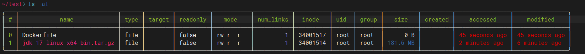
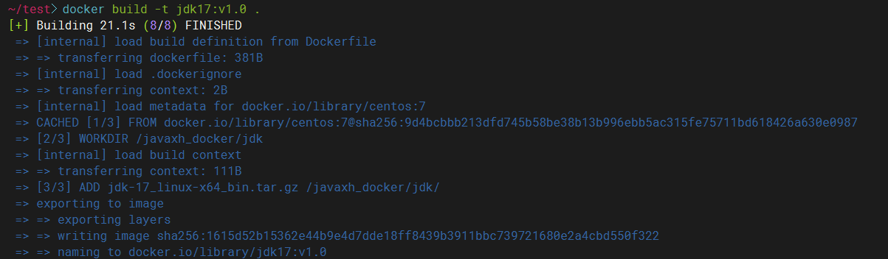

# jdk-17.0.6镜像

参考文档：

[jdk17.0.4.1镜像 - _ideal - 博客园 (cnblogs.com)](https://www.cnblogs.com/gkmin/p/16620528.html)

[Docker之dockerfile制作jdk镜像 - 沦陷 - 博客园 (cnblogs.com)](https://www.cnblogs.com/huangting/p/11966450.html)

---

**((20230307193521-hke61kh 'JDK 官网下载'))**

​​

**编写 Dockerfile**

```shell
FROM centos:7
MAINTAINER xxx "xxx@qq.com"
WORKDIR /javaxh_docker/jdk
ADD jdk-17_linux-x64_bin.tar.gz /javaxh_docker/jdk/
ENV JAVA_HOME=/javaxh_docker/jdk/jdk-17.0.6
ENV CLASSPATH=.:$JAVA_HOME/lib/dt.jar:$JAVA_HOME/lib/tools.jar
ENV PATH=$JAVA_HOME/bin:$PATH
CMD ["java","-version"]
```

**构建镜像**

```shell

docker build -t jdk17:v1.0 .  
```

​​​​​​

**运行容器**

```shell
docker run -it jdk17:v1.0 /bin/bash
```

‍
