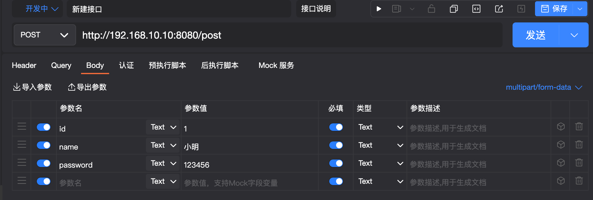
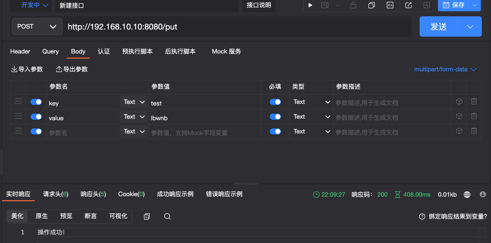

# 单机容器编排

最后我们来讲解一下Docker-Compose，它能够对我们的容器进行编排。比如现在我们要在一台主机上部署很多种类型的服务，包括数据库、消息队列、SpringBoot应用程序若干，或是想要搭建一个MySQL集群，这时我们就需要创建多个容器来完成来，但是我们希望能够实现一键部署，这时该怎么办呢？我们就要用到容器编排了，让多个容器按照我们自己的编排进行部署。

**官方文档：**​[https://docs.docker.com/get-started/08_using_compose/](https://docs.docker.com/get-started/08_using_compose/)，视频教程肯定不可能把所有的配置全部介绍完，所以如果各位小伙伴想要了解更多的配置，有更多需求的话，可以直接查阅官方文档。

### 快速开始

在Linux环境下我们需要先安装一下插件：

```sh
sudo apt install docker-compose-plugin
```

接着输入`docker compose version`​来验证一下是否安装成功。

​​​​

这里我们就以部署SpringBoot项目为例，我们继续使用之前打包好的SpringBoot项目，现在我们希望部署这个SpringBoot项目的同时，部署一个MySQL服务器，一个Redis服务器，这时我们SpringBoot项目要运行的整个完整环境，先获取到对应的镜像：

```sh
docker pull mysql/mysql-server
docker pull redis
```

接着，我们需要在自己的本地安装一下DockerCompose，下载地址：[https://github.com/docker/compose/releases](https://github.com/docker/compose/releases)，下载自己电脑对应的版本，然后在IDEA中配置：

​​​​

下载完成后，将Docker Compose可执行文件路径修改为你存放刚刚下载的可执行文件的路径，Windows直接设置路径就行，MacOS下载之后需要进行下面的操作：

```sh
mv 下载的文件名称 docker-compose
sudo chmod 777 docker-compose
sudo mv docker-compose /usr/local/bin
```

配置完成后就可以正常使用了，否则会无法运行，接着我们就可以开始在IDEA中编写docker-compose.yml文件了。

​​​​

这里点击右上角的“与服务工具窗口同步”按钮，这样一会就可以在下面查看情况了。

我们现在就从头开始配置这个文件，现在我们要创建三个服务，一个是MySQL服务器，一个是Redis服务器，还有一个是SpringBoot服务器，需要三个容器来分别运行，首先我们先写上这三个服务：

```yaml
version: "3.9"  #首先是版本号，别乱写，这个是和Docker版本有对应的
services:   #services里面就是我们所有需要进行编排的服务了
  spring:   #服务名称，随便起
    container_name: app_springboot  #一会要创建的容器名称
  mysql:
    container_name: app_mysql
  redis:
    container_name: app_redis
```

这样我们就配置好了一会要创建的三个服务和对应的容器名称，接着我们需要指定一下这些容器对应的镜像了，首先是我们的SpringBoot应用程序，可能我们后续还会对应用程序进行更新和修改，所以这里我们部署需要先由Dockerfile构建出镜像后，再进行部署：

```yaml
spring:
  container_name: app_springboot
  build: .  #build表示使用构建的镜像，.表示使用当前目录下的Dockerfile进行构建
```

我们这里修改一下Dockerfile，将基础镜像修改为已经打包好JDK环境的镜像：

```dockerfile
FROM adoptopenjdk/openjdk8
COPY target/DockerTest-0.0.1-SNAPSHOT.jar app.jar
CMD java -jar app.jar
```

接着是另外两个服务，另外两个服务需要使用对应的镜像来启动容器：

```yml
mysql:
  container_name: app_mysql
  image: mysql/mysql-server:latest  #image表示使用对应的镜像，这里会自动从仓库下载，然后启动容器
redis:
  container_name: app_redis
  image: redis:latest
```

还没有结束，我们还需要将SpringBoot项目的端口进行映射，最后一个简单的docker-compose配置文件就编写完成了：

```yaml
version: "3.9"  #首先是版本号，别乱写，这个是和Docker版本有对应的
services:   #services里面就是我们所有需要进行编排的服务了
  spring:   #服务名称，随便起
    container_name: app_springboot  #一会要创建的容器名称
    build: .
    ports:
    - "8080:8080"
  mysql:
    container_name: app_mysql
    image: mysql/mysql-server:latest
  redis:
    container_name: app_redis
    image: redis:latest
```

现在我们就可以直接一键部署了，我们点击下方部署按钮：

​​​​

​​​​

看到 Running 4/4 就表示已经部署成功了，我们现在到服务器这边来看看情况：

​​​​

可以看到，这里确实是按照我们的配置，创建了3个容器，并且都是处于运行中，可以正常访问：

​​​​

如果想要结束的话，我们只需要点击停止就行了：

​​​​

当然如果我们不再需要这套环境的话，可以直接点击下方的按钮，将整套编排给down掉，这样的话相对应的容器也会被清理的：

​​​​

​​​​

注意在使用docker-compose部署时，会自动创建一个新的自定义网络，并且所有的容器都是连接到这个自定义的网络里面：

​​​​

这个网络默认也是使用bridge作为驱动：

​​​​

这样，我们就完成了一个简单的配置，去部署我们的整套环境。

### 部署完整项目

前面我们学习了使用`docker-compose`​进行简单部署，但是仅仅只是简单启动了服务，我们现在来将这些服务给连起来。首先是SpringBoot项目，我们先引入依赖：

```xml
<dependency>
   <groupId>org.springframework.boot</groupId>
   <artifactId>spring-boot-starter-jdbc</artifactId>
</dependency>

<dependency>
   <groupId>mysql</groupId>
   <artifactId>mysql-connector-java</artifactId>
</dependency>
```

接着配置一下数据源，等等，我们怎么知道数据库的默认密码是多少呢？所以我们先配置一下MySQL服务：

```yaml
mysql:
  container_name: app_mysql
  image: mysql/mysql-server:latest
  environment:   #这里我们通过环境变量配置MySQL的root账号和密码
    MYSQL_ROOT_HOST: '%'   #登陆的主机，这里直接配置为'%'
    MYSQL_ROOT_PASSWORD: '123456.root'    #MySQL root账号的密码，别设定得太简单了
    MYSQL_DATABASE: 'study'    #在启动时自动创建的数据库
    TZ: 'Asia/Shanghai'    #时区
  ports:
  - "3306:3306"    #把端口暴露出来，当然也可以不暴露，因为默认所有容器使用的是同一个网络
```

有关MySQL的详细配置请查阅：[https://registry.hub.docker.com/_/mysql](https://registry.hub.docker.com/_/mysql)

接着我们将数据源配置完成：

```yaml
spring:
  datasource:
    driver-class-name: com.mysql.cj.jdbc.Driver
    url: jdbc:mysql://app_mysql:3306/study   #地址直接输入容器名称，会自动进行解析，前面已经讲过了
    username: root
    password: 123456.root
```

然后我们来写点测试的代码吧，这里我们使用JPA进行交互：

```xml
<dependency>
   <groupId>org.springframework.boot</groupId>
   <artifactId>spring-boot-starter-data-jpa</artifactId>
</dependency>

<dependency>
   <groupId>org.projectlombok</groupId>
   <artifactId>lombok</artifactId>
</dependency>
```

```java
@Data
@AllArgsConstructor
@NoArgsConstructor
@Entity
@Table(name = "db_account")
public class Account {

    @Column(name = "id")
    @Id
    long id;

    @Column(name = "name")
    String name;

    @Column(name = "password")
    String password;
}
```

```java
@Repository
public interface AccountRepository extends JpaRepository<Account, Long> {

}
```

```java
@RestController
public class MainController {

    @Resource
    AccountRepository repository;

    @RequestMapping("/")
    public String hello(){
        return "Hello World!";
    }

    @GetMapping("/get")
    public Account get(@RequestParam("id") long id){
        return repository.findById(id).orElse(null);
    }

    @PostMapping("/post")
    public Account get(@RequestParam("id") long id,
                       @RequestParam("name") String name,
                       @RequestParam("password") String password){
        return repository.save(new Account(id, name, password));
    }
}
```

接着我们来修改一下配置文件：

```yaml
spring:
  datasource:
    driver-class-name: com.mysql.cj.jdbc.Driver
    url: jdbc:mysql://app_mysql:3306/study
    username: root
    password: 123456.root
  jpa:
    database: mysql
    show-sql: true
    hibernate:
      ddl-auto: update   #这里自动执行DDL创建表，全程自动化，尽可能做到开箱即用
```

现在代码编写完成后，我们可以将项目打包了，注意执行我们下面的打包命令，不要进行测试，因为连不上数据库：

```sh
mvn package -DskipTests
```

重新生成jar包后，我们修改一下docker-compose配置，因为MySQL的启动速度比较慢，我们要一点时间等待其启动完成，如果连接不上数据库导致SpringBoot项目启动失败，我们就重启：

```yaml
spring:   #服务名称，随便起
  container_name: app_springboot  #一会要创建的容器名称
  build: .
  ports:
  - "8080:8080"
  depends_on:  #这里设置一下依赖，需要等待mysql启动后才运行，但是没啥用，这个并不是等到启动完成后，而是进程建立就停止等待
  - mysql
  restart: always  #这里配置容器停止后自动重启
```

然后我们将之前自动构建的镜像删除，等待重新构建：

​​​​

现在我们重新部署docker-compos吧：

​​​​

当三个服务全部为蓝色时，就表示已经正常运行了，现在我们来测试一下吧：

​​​​

接着我们来试试看向数据库传入数据：

​​​​

​​​​

可以看到响应成功，接着我们来请求一下：

​​​​

这样，我们的项目和MySQL基本就是自动部署了。

接着我们来配置一下Redis：

```xml
<dependency>
   <groupId>org.springframework.boot</groupId>
   <artifactId>spring-boot-starter-data-redis</artifactId>
</dependency>
```

接着配置连接信息：

```yaml
spring:
  datasource:
    driver-class-name: com.mysql.cj.jdbc.Driver
    url: jdbc:mysql://app_mysql:3306/study
    username: root
    password: 123456.root
  jpa:
    database: mysql
    show-sql: true
    hibernate:
      ddl-auto: update
  redis:
    host: app_redis
```

```java
//再加两个Redis操作进来
@Resource
StringRedisTemplate template;

@GetMapping("/take")
public String take(@RequestParam("key") String key){
    return template.opsForValue().get(key);
}

@PostMapping("/put")
public String  put(@RequestParam("key") String key,
                   @RequestParam("value") String value){
    template.opsForValue().set(key, value);
    return "操作成功！";
}
```

最后我们来配置一下docker-compose的配置文件：

```yaml
redis:
  container_name: app_redis
  image: redis:latest
  ports:
  - "6379:6379"
```

OK，按照之前的方式，我们重新再部署一下，然后测试：

​​​​

​​​​

这样我们就完成整套环境+应用程序的配置了，我们在部署整个项目时，只需要使用docker-compose配置文件进行启动即可，这样就大大方便了我们的操作，实现开箱即用。甚至我们还可以专门使用一个平台来同时对多个主机进行一次性配置，大规模快速部署，而这些就留到以后的课程中再说吧。

‍
