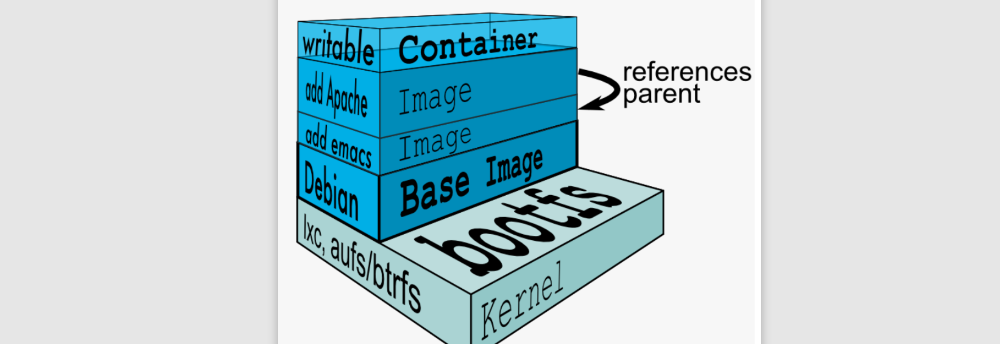
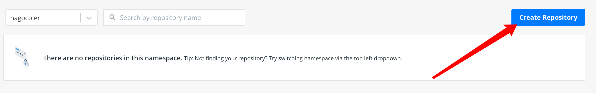
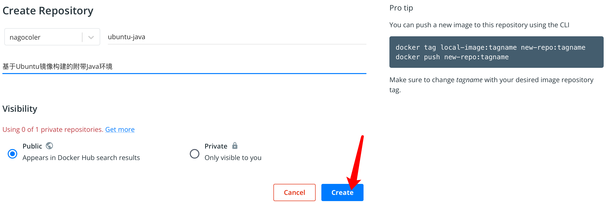
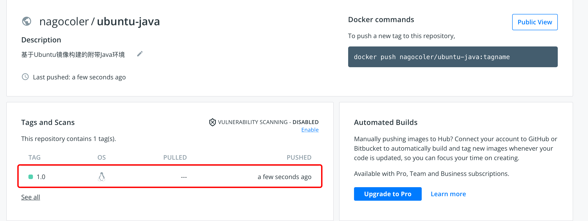

# 容器与镜像

要启动容器最关键的就是镜像，我们来看看镜像相关的介绍。

### 初识容器镜像

首先我们来了解一下镜像的相关操作，比如现在我们希望把某个镜像从仓库下载到本地，这里使用官方的hello-world镜像：

```sh
docker pull hello-world
```

只需要输入`pull`​命令，就可以直接下载到指定的镜像了：

‍

可以看到对上面一行有一句Using default tag，实际上一个镜像的名称是由两部分组成的，一个是`repository`​，还有一个是`tag`​，一般情况下约定`repository`​就是镜像名称，`tag`​作为版本，默认为latest，表示最新版本。所以指定版本运行的话：

```sh
docker pull 名称:版本
```

之后为了教学方便，我们就直接使用默认的tag，不去指定版本了。

镜像下载之后会存放在本地，要启动这个镜像的容器，实际上就像我们之前那样，输入`run`​命令就可以了：

```sh
docker run hello-world
```

当然如果仅仅是只想创建而不想马上运行的话，可以使用`create`​命令：

```sh
docker create hello-world
```

可以看到成功启动了：

启动之后，会使用当前镜像自动创建一个容器，我们可以输入`ps`​命令来查看当前容器的容器列表：

```
docker ps -a
```

注意后面要加一个`-a`​表示查看所有容器（其他选项可以使用-h查看），如果不加的话，只会显示当前正在运行的容器，而HelloWorld是一次性的不是Nginx那样的常驻程序，所以容器启动打印了上面的内容之后，容器就停止运行了：

可以看到容器列表中有我们刚刚创建的hello-world以及我们之前创建的nginx（注意同一个镜像可以创建多个容器），每个容器都有一个随机生成的容器ID写在最前面，后面是容器的创建时间以及当前的运行状态，最后一列是容器的名称，在创建容器时，名称可以由我们指定也可以自动生成，这里就是自动生成的。

我们可以手动指定名称启动，在使用`run`​命令时，添加`--name`​参数即可：

```sh
docker run --name=lbwnb hello-world
```

‍

我们可以手动开启处于停止状态的容器：

```sh
 docker start <容器名称/容器ID>
```

注意启动的对象我们要填写容器的ID或是容器的名称才可以，容器ID比较长，可以不写全只写一半，但是你要保证你输入的不完全容器ID是唯一的。

‍

如果想要停止容器直接输入`stop`​命令就可以了：

```sh
 docker stop <容器名称/容器ID>
```

或是重启：

```sh
 docker restart <容器名称/容器ID>
```

‍

如果我们不需要使用容器了，那么可以将容器删除，但是注意只有容器处于非运行状态时才可以删除：

```sh
docker rm <容器名称/容器ID>
```

当然如果我们希望容器在停止后自动删除，我们可以在运行时添加`--rm`​参数：

```sh
docker run --rm 镜像名称
```

‍

删除后，容器将不复存在，当没有任何关于nginx的容器之后，我们可以删除nginx的本地镜像：

‍

我们可以使用`images`​命令来检查一下当前本地有那些镜像：

```sh
docker images
```

至此，我们已经了解了Docker的简单使用，在后面的学习中，我们还会继续认识更多的玩法。

### 镜像结构介绍

前面我们了解了Docker的相关基本操作，实际上容器的基石就是镜像，有了镜像才能创建对应的容器实例，那么我们就先从镜像的基本结构开始说起，我们来看看镜像到底是个什么样的存在。

我们在打包项目时，实际上往往需要一个基本的操作系统环境，这样我们才可以在这个操作系统上安装各种依赖软件，比如数据库、缓存等，像这种基本的系统镜像，我们称为base镜像，我们的项目之后都会基于base镜像进行打包，当然也可以不需要base镜像，仅仅是基于当前操作系统去执行简单的命令，比如我们之前使用的hello-world就是。

一般base镜像就是各个Linux操作系统的发行版，比如我们正在使用的Ubuntu，还有CentOS、Kali等等。这里我们就下载一下CentOS的base镜像：

```sh
docker pull centos
```

可以看到，CentOS的base镜像就已经下载完成，不像我们使用完整系统一样，base镜像的CentOS省去了内核，所以大小只有272M，这里需要解释一下base镜像的机制：

Linux操作体系由内核空间和用户空间组成，其中内核空间就是整个Linux系统的核心，Linux启动后首先会加`bootfs`​文件系统，加载完成后会自动卸载掉，之后会加载用户空间的文件系统，这一层是我们自己可以进行操作的部分：

* bootfs包含了BootLoader和Linux内核，用户是不能对这层作任何修改的，在内核启动之后，bootfs会自动卸载。
* rootfs则包含了系统上的常见的目录结构，包括`/dev`​、`​ /proc`​、 `/bin`​等等以及一些基本的文件和命令，也就是我们进入系统之后能够操作的整个文件系统，包括我们在Ubuntu下使用的apt和CentOS下使用的yum，都是用户空间上的。

base镜像底层会直接使用宿主主机的内核，也就是说你的Ubuntu内核版本是多少，那么base镜像中的CentOS内核版本就是多少，而rootfs则可以在不同的容器中运行多种不同的版本。所以，base镜像实际上只有CentOS的rootfs，因此只有300M大小左右，当然，CentOS里面包含多种基础的软件，还是比较臃肿的，而某些操作系统的base镜像甚至都不到10M。

使用`uname`​命令可以查看当前内核版本：

‍

因此，Docker能够同时模拟多种Linux操作系统环境，就不足为奇了，我们可以尝试启动一下刚刚下载的base镜像：

```sh
docker run -it centos
```

注意这里需要添加`-it`​参数进行启动，其中`-i`​表示在容器上打开一个标准的输入接口，`-t`​表示分配一个伪tty设备，可以支持终端登录，一般这两个是一起使用，否则base容器启动后就自动停止了。

可以看到使用ls命令能够查看所有根目录下的文件，不过很多命令都没有，连clear都没有，我们来看看内核版本：

可以看到内核版本是一样的（这也是缺点所在，如果软件对内核版本有要求的话，那么此时使用Docker就直接寄了），我们输入`exit`​就可以退出容器终端了，可以看到退出后容器也停止了：

‍

当然我们也可以再次启动，注意启动的时候要加上`-i`​才能进入到容器进行交互，否则会在后台运行：

```java
docker start -i b733
```

‍

基于base镜像，我们就可以在这基础上安装各种各样的软件的了，几乎所有的镜像都是通过在base镜像的基础上安装和配置需要的软件构建出来的：

​​

每安装一个软件，就在base镜像上一层层叠加上去，采用的是一种分层的结构，这样多个容器都可以将这些不同的层次自由拼装，比如现在好几个容器都需要使用CentOS的base镜像，而上面运行的软件不同，此时分层结构就很爽了，我们只需要在本地保存一份base镜像，就可以给多个不同的容器拼装使用，是不是感觉很灵活？

我们看到除了这些软件之外，最上层还有一个可写容器层，这个是干嘛的呢，为什么要放在最上面？

我们知道，所有的镜像会叠起来组成一个统一的文件系统，如果不同层中存在相同位置的文件，那么上层的会覆盖掉下层的文件，最终我们看到的是一个叠加之后的文件系统。当我们需要修改容器中的文件时，实际上并不会对镜像进行直接修改，而是在最顶上的容器层（最上面一般称为容器层，下面都是镜像层）进行修改，不会影响到下面的镜像，否则镜像就很难实现多个容器共享了。所以各个操作如下：

* 文件读取：要读取一个文件，Docker会最上层往下依次寻找，找到后则打开文件。
* 文件创建和修改：创建新文件会直接添加到容器层中，修改文件会从上往下依次寻找各个镜像中的文件，如果找到，则将其复制到容器层，再进行修改。
* 删除文件：删除文件也会从上往下依次寻找各个镜像中的文件，一旦找到，并不会直接删除镜像中的文件，而是在容器层标记这个删除操作。

也就是说，我们对整个容器内的文件进行的操作，几乎都是在最上面的容器层进行的，我们是无法干涉到下面所有的镜像层文件的，这样就很好地保护了镜像的完整性，才能实现多个容器共享使用。

### 构建镜像

前面我们已经了解了Docker镜像的结构，实际上所有常用的应用程序都有对应的镜像，我们只需要下载这些镜像然后就可以使用了，而不需要自己去手动安装，顶多需要进行一些特别的配置。当然要是遇到某些冷门的应用，可能没有提供镜像，这时就要我们手动去安装，接着我们就来看看如何构建我们自己的Docker镜像。构建镜像有两种方式，一种是使用`commit`​命令来完成，还有一种是使用Dockerfile来完成，我们先来看第一种。

这里我们就做一个简单的例子，比如我们现在想要在Ubuntu的base镜像中安装Java环境，并将其打包为新的镜像（这个新的镜像就是一个包含Java环境的Ubuntu系统镜像）

咱们先启动Ubuntu镜像，然后使用`yum`​命令（跟apt比较类似）来安装Java环境，首先是`run`​命令：

```sh
docker pull ubuntu
```

‍

接着启动：

```java
docker run -it ubuntu
```

‍

直接使用apt命令来安装Java环境，在这之前先更新一下，因为是最小安装所以本地没有任何软件包：

```java
apt update
```

‍

接着输入：

```sh
apt install openjdk-8-jdk
```

等待安装完成：

​`java -version`​

这样，我们就完成了对Java环境的安装了，接着我们就可以退出这个镜像然后将其构建为新的镜像：

​`docker ps -a`​

使用`commit`​命令可以将容器保存为新的镜像：

```sh
docker commit 容器名称/ID 新的镜像名称
```

可以看到安装了软件之后的镜像大小比我们原有的大小大得多，这样我们就可以通过这个镜像来直接启动一个带Java环境的Ubuntu操作系统容器了。不过这种方式虽然自定义度很高，但是Docker官方并不推荐，这样的话使用者并不知道镜像是如何构建出来的，是否里面带了后门都不知道，并且这样去构建效率太低了，如果要同时构建多种操作系统的镜像岂不是要一个一个去敲？我们作为普通用户实际上采用Dokcerfile的方式会更好一些。

我们来看看如何使用Dockerfile的形式创建一个带Java环境的Ubuntu系统镜像。首先直接新建一个名为`Dockerfile`​的文件：

```sh
touch Dockerfile
```

接着我们来进行编辑，`Dockerfile`​内部需要我们编写多种指令来告诉Docker我们的镜像的相关信息：

```dockerfile
FROM <基础镜像>
```

首先我们需要使用FROM指令来选择当前镜像的基础镜像（必须以这个指令开始），这里我们直接使用`ubuntu`​作为基础镜像即可，当然如果不需要任何基础镜像的话，直接使用`scratch`​表示从零开始构建，这里就不演示了。

基础镜像设定完成之后，我们就需要在容器中运行命令来安装Java环境了，这里需要使用`RUN`​指令：

```dockerfile
RUN apt update
RUN apt install -y openjdk-8-jdk
```

每条指令执行之后，都会生成一个新的镜像层。

OK，现在我们的Dockerfile就编写完成了，只需要完成一次构建即可：

```sh
docker build -t <镜像名称> <构建目录>
```

执行后，Docker会在构建目录中寻找Dockerfile文件，然后开始依次执行Dockerfile中的指令：

构建过程的每一步都非常清晰地列出来了，一共三条指令对应三步依次进行，我们稍微等待一段时间进行安装，安装过程中所以的日志信息会直接打印到控制台（注意Docker镜像构建有缓存机制，就算你现在中途退出了，然后重新进行构建，也会直接将之前已经构建好的每一层镜像，直接拿来用，除非修改了Dockerfile文件重新构建，只要某一层发生变化其上层的构建缓存都会失效，当然包括`pull`​时也会有类似的机制）

最后成功安装，会出现在本地：

可以看到安装出来的大小跟我们之前的是一样的，因为做的事情是一模一样的。我们可以使用`history`​命令来查看构建历史：

​`docker history ubuntu-java-file:latest`​

可以看到最上面两层是我们通过使用apt命令生成的内容，就直接作为当前镜像中的两层镜像，每层镜像都有一个自己的ID，不同的镜像大小也不一样。而我们手动通过`commit`​命令来生成的镜像没有这个记录：

​`docker history ubuntu-java`​

如果遇到镜像ID为missing的一般是从Docker Hub中下载的镜像会有这个问题，但是问题不大。用我们自己构建的镜像来创建容器就可以直接体验带Java环境的容器了：

​`docker run -it ubuntu-java-file`​

有关Dockerfile的其他命令，我们还会在后续的学习中逐步认识。

### 发布镜像到远程仓库

前面我们学习了如何构建一个Docker镜像，我们可以将自己的镜像发布到Docker Hub中，就像Git远程仓库一样，我们可以将自己的镜像上传到这里：[https://hub.docker.com/repositories](https://hub.docker.com/repositories)，没有账号的先去进行注册。

​​

点击右上角的创建仓库，然后填写信息：

​​

创建完成后，我们就有了一个公共的镜像仓库，我们可以将本地的镜像上传了，上传之前我们需要将镜像名称修改得规范一点，这里使用`tag`​命令来重新打标签：

```sh
docker tag ubuntu-java-file:latest 用户名/仓库名称:版本
```

这里我们将版本改成1.0版本吧，不用默认的latest了。

修改完成后，会创建一个新的本地镜像，名称就是我们自己定义的了。接着我们需在本地登录一下：

​`docker login -u nagocoler`​

登录成功后我们就可以上传了：

```sh
docker push nagocoler/ubuntu-java:1.0
```

‍

哈哈，500M的东西传上去，还是有点压力的，如果实在太慢各位可以重新做一个简单点的镜像。上传完成后，打开仓库，可以看到已经有一个1.0版本了：

​​

​​

注意公共仓库是可以被搜索和下载的，所以我们这里把本地的镜像全部删掉，去下载我们刚刚上传好的镜像。这里我们先搜索一下，搜索使用`search`​命令即可：

```sh
docker search nagocoler/ubuntu-java
```

我们可以使用pull命令将其下载下来：

```sh
docker pull nagocoler/ubuntu-java:1.0
```

上传之后的镜像是被压缩过的，所以下载的内容就比较少一些。

当然各位也可以让自己的同学或是在其他机器上尝试下载自己的镜像，看看是不是都可以正常运行。

Docker Hub也可以自行搭建私服，但是这里就不多做介绍了，至此，有关容器和镜像的一些基本操作就讲解得差不多了。

‍

‍
