# 容器存储管理

前面我们介绍了容器的网络管理，我们现在已经了解了如何配置容器的网络，以及相关的一些原理。还有一个比较重要的部分就是容器的存储，在这一小节我们将深入了解容器的存储管理。

### 容器持久化存储

我们知道，容器在创建之后，实际上我们在容器中创建和修改的文件，实际上是被容器的分层机制保存在最顶层的容器层进行操作的，为了保护下面每一层的镜像不被修改，所以才有了这样的CopyOnWrite特性。但是这样也会导致容器在销毁时数据的丢失，当我们销毁容器重新创建一个新的容器时，所有的数据全部丢失，直接回到梦开始的地方。

在某些情况下，我们可能希望对容器内的某些文件进行持久化存储，而不是一次性的，这里就要用到数据卷（Data Volume）了。

在开始之前我们先准备一下实验要用到的镜像：

```sh
docker run -it ubuntu
apt update && apt install -y vim
```

然后打包为我们一会要使用的镜像：

```
docker commit 
```

我们可以让容器将文件保存到宿主主机上，这样就算容器销毁，文件也会在宿主主机上保留，下次创建容器时，依然可以从宿主主机上读取到对应的文件。如何做到呢？只需要在容器启动时指定即可：

```sh
mkdir test
```

我们现在用户目录下创建一个新的`test`​目录，然后在里面随便创建一个文件，再写点内容：

```sh
vim test/hello.txt
```

接着我们就可以将宿主主机上的目录或文件挂载到容器的某个目录上：

```sh
docker run -it -v ~/test:/root/test ubuntu-volume
```

这里用到了一个新的参数`-v`​，用于指定文件挂载，这里是将我们刚刚创建好的test目录挂在到容器的/root/test路径上。

​​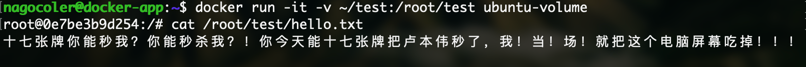​​

这样我们就可以直接在容器中访问宿主主机上的文件了，当然如果我们对挂载目录中的文件进行编辑，那么相当于编辑的是宿主主机的数据：

```sh
vim /root/test/test.txt  
```

​​​​

在宿主主机的对应目录下，可以直接访问到我们刚刚创建好的文件。

接着我们来将容器销毁，看看当容器不复存在时，挂载的数据时候还能保留：

​​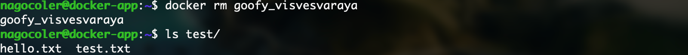​​

可以看到，即使我们销毁了容器，在宿主主机上的文件依然存在，并不会受到影响，这样的话，当我们下次创建新的镜像时，依然可以使用这些保存在外面的文件。

比如我们现在想要部署一个Nginx服务器来代理我们的前端，就可以直接将前端页面保存到宿主主机上，然后通过挂载的形式让容器中的Nginx访问，这样就算之后Nginx镜像有升级，需要重新创建，也不会影响到我们的前端页面。这里我们来测试一下，我们先将前端模板上传到服务器：

```sh
scp Downloads/moban5676.zip 192.168.10.10:~/
```

然后在服务器上解压一下：

```sh
unzip moban5676.zip
```

接着我们就可以启动容器了：

```sh
docker run -it -v ~/moban5676:/usr/share/nginx/html/ -p 80:80 -d nginx
```

这里我们将解压出来的目录，挂载到容器中Nginx的默认站点目录`/usr/share/nginx/html/`​（由于挂在后位于顶层，会替代镜像层原有的文件），这样Nginx就直接代理了我们存放在宿主主机上的前端页面，当然别忘了把端口映射到宿主主机上，这里我们使用的镜像是官方的nginx镜像。

现在我们进入容器将Nginx服务启动：

```sh
systemctl start nginx
```

然后通过浏览器访问看看是否代理成功：

​​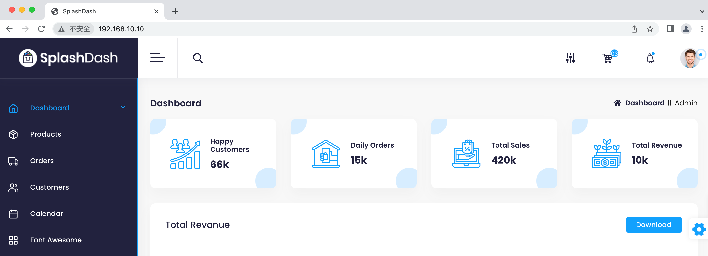​​

可以看到我们的前端页面直接被代理了，当然如果我们要编写自定义的配置，也是使用同样的方法操作即可。

注意如果我们在使用`-v`​参数时不指定宿主主机上的目录进行挂载的话，那么就由Docker来自动创建一个目录，并且会将容器中对应路径下的内容拷贝到这个自动创建的目录中，最后挂在到容器中，这种就是由Docker管理的数据卷了（docker managed volume）我们来试试看：

```sh
docker run -it -v /root/abc ubuntu-volume
```

注意这里我们仅仅指定了挂载路径，没有指定宿主主机的对应目录，继续创建：

​​​​

创建后可以看到`root`​目录下有一个新的`abc`​目录，那么它具体是在宿主主机的哪个位置呢？这里我们依然可以使用`inspect`​命令：

```sh
docker inspect bold_banzai 
```

​​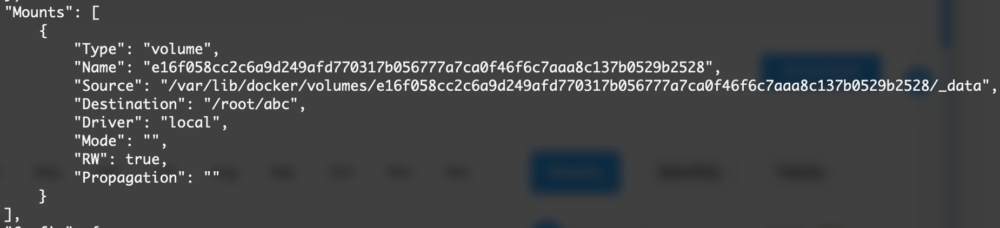​​

可以看到Sorce指向的是`/var/lib`​中的某个目录，我们可以进入这个目录来创建一个新的文件，进入之前记得提升一下权限，权限低了还进不去：

​​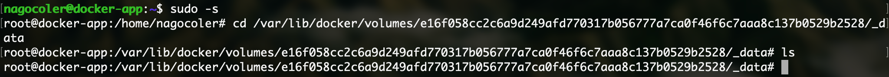​​

我们来创一个新的文本文档：

​​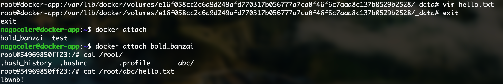​​

实际上和我们之前是一样的，也是可以在容器中看到的，当然删除容器之后，数据依然是保留的。当我们不需要使用数据卷时，可以进行删除：

​​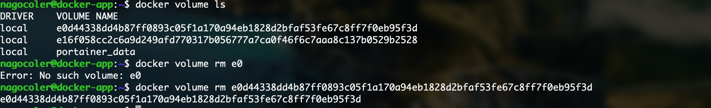​​

当然有时候为了方便，可能并不需要直接挂载一个目录上去，仅仅是从宿主主机传递一些文件到容器中，这里我们可以使用`cp`​命令来完成：

​​​​

这个命令支持从宿主主机复制文件到容器，或是从容器复制文件到宿主主机，使用方式类似于Linux自带的`cp`​命令。

### 容器数据共享

前面我们通过挂载的形式，将宿主主机上的文件直接挂载到容器中，这样容器就可以直接访问到宿主主机上的文件了，并且在容器删除时也不会清理宿主主机上的文件。

我们接着来看看如何实现容器与容器之间的数据共享，实际上按照我们之前的思路，我们可以在宿主主机创建一个公共的目录，让这些需要实现共享的容器，都挂载这个公共目录：

```sh
docker run -it -v ~/test:/root/test ubuntu-volume
```

​​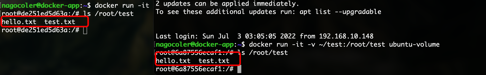​​

由于挂载的是宿主主机上的同一块区域，所以内容可以直接在两个容器中都能访问。当然我们也可以将另一个容器挂载的目录，直接在启动容器时指定使用此容器挂载的目录：

```sh
docker run -it -v ~/test:/root/test --name=data_test ubuntu-volume
docker run -it --volumes-from data_test ubuntu-volume
```

这里使用`--volumes-from`​指定另一个容器（这种用于给其他容器提供数据卷的容器，我们一般称为数据卷容器）

​​​​

可以看到，数据卷容器中挂载的内容，在当前容器中也是存在的，当然就算此时数据卷容器被删除，那么也不会影响到这边，因为这边相当于是继承了数据卷容器提供的数据卷，所以本质上还是让两个容器挂载了同样的目录实现数据共享。

虽然通过上面的方式，可以在容器之间实现数据传递，但是这样并不方便，可能某些时候我们仅仅是希望容器之间共享，而不希望有宿主主机这个角色直接参与到共享之中，此时我们就需要寻找一种更好的办法了。其实我们可以将数据完全放入到容器中，通过构建一个容器，来直接将容器中打包好的数据分享给其他容器，当然本质上依然是一个Docker管理的数据卷，虽然还是没有完全脱离主机，但是移植性就高得多了。

我们来编写一个Dockerfile：

```dockerfile
FROM ubuntu
ADD moban5676.tar.gz /usr/share/nginx/html/
VOLUME /usr/share/nginx/html/
```

这里我们使用了一个新的指令ADD，它跟COPY命令类似，也可以复制文件到容器中，但是它可以自动对压缩文件进行解压，这里只需要将压缩好的文件填入即可，后面的VOLUME指令就像我们使用`-v`​参数一样，会创建一个挂载点在容器中：

```sh
cd test
tar -zcvf moban5676.tar.gz *
mv moban5676.tar.gz ..
cd ..
```

接着我们直接构建：

```sh
docker build -t data .
```

​​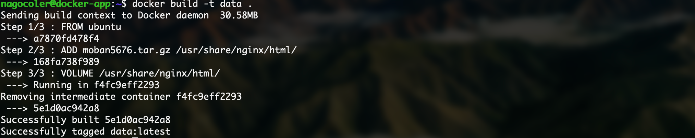​​

现在我们运行一个容器看看：

​​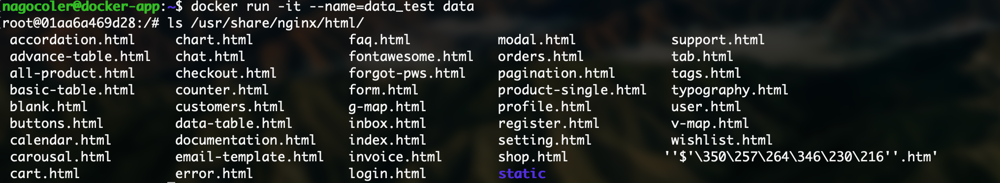​​

可以看到所有的文件都自动解压出来了（除了中文文件名称乱码了之外，不过无关紧要）我们退出容器，可以看到数据卷列表中新增了我们这个容器需要使用的：

​​​​

​​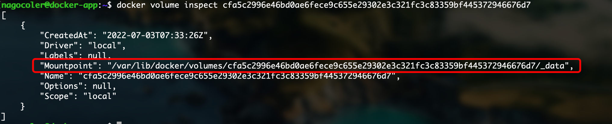​​

这个位置实际上就是数据存放在当前主机上的位置了，不过是由Docker进行管理而不是我们自定义的。现在我们就可以创建一个新的容器直接继承了：

```sh
docker run -p 80:80 --volumes-from=data_test -d nginx
```

访问一下Nginx服务器，可以看到成功代理：

​​​​

这样我们就实现了将数据放在容器中进行共享，我们不需要刻意去指定宿主主机的挂载点，而是Docker自行管理，这样就算迁移主机依然可以快速部署。

---

‍
