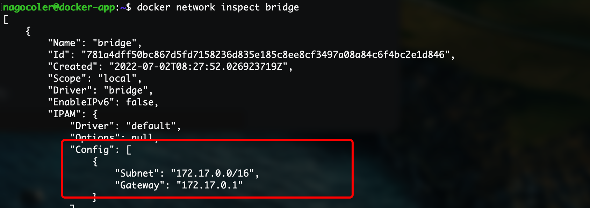
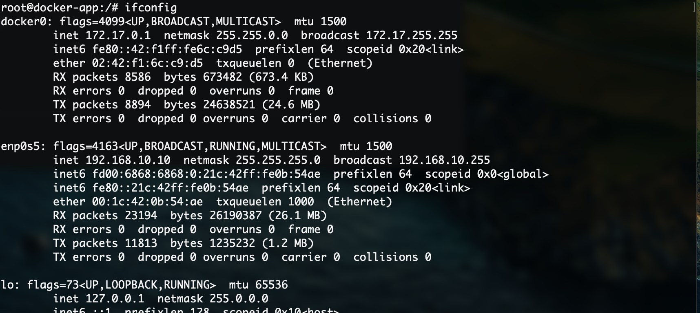
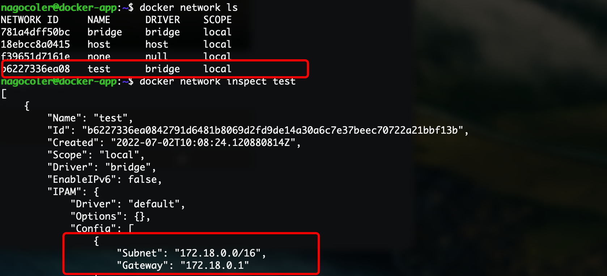
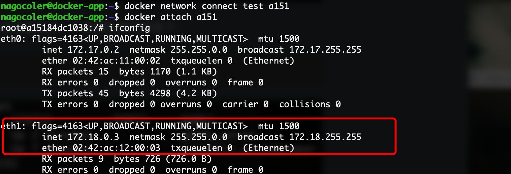
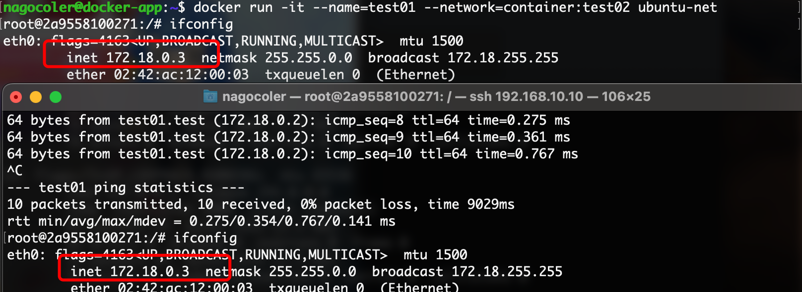

# 容器网络管理

**注意：**本小节学习需要掌握部分《计算机网络》课程中的知识。

前面我们学习了容器和镜像的一些基本操作，了解了如何通过镜像创建容器、然后自己构建容器，以及远程仓库推送等，这一部分我们接着来讨论容器的网络管理。

### 容器网络类型

Docker在安装后，会在我们的主机上创建三个网络，使用`network ls`​命令来查看：

```sh
docker network ls
```

可以看到默认情况下有`bridge`​、`host`​、`none`​这三种网络类型（其实有点像虚拟机的网络配置，也是分桥接、共享网络之类的），我们先来依次介绍一下，在开始之前我们先构建一个镜像，默认的ubuntu镜像由于啥软件都没有，所以我们把一会网络要用到的先提前装好：

```sh
docker run -it ubuntu
```

```sh
apt update
apt install net-tools iputils-ping curl
```

这样就安装好了，我们直接退出然后将其构建为新的镜像：

```sh
docker commit lucid_sammet ubuntu-net
```

‍

OK，一会我们就可以使用了。

* **none网络：**这个网络除了有一个本地环回网络之外，就没有其他的网络了，我们可以在创建容器时指定这个网络。

  这里使用`--network`​参数来指定网络：

  ```sh
  docker run -it --network=none ubuntu-net
  ```

  进入之后，我们可以直接查看一下当前的网络：

  ```sh
  ifconfig
  ```

  可以看到只有一个本地环回`lo`​网络设备：

  ‍

  所以这个容器是无法连接到互联网的：`ping www.baidu.com`​

  ‍

  “真”单机运行，可以说是绝对的安全，没人能访问进去，存点密码这些还是不错的。
* **bridge网络：**容器默认使用的网络类型，这是桥接网络，也是应用最广泛的网络类型：

  实际上我们在宿主主机上查看网络信息，会发现有一个名为docker0的网络设备：

  这个网络设备是Docker安装时自动创建的虚拟设备，它有什么用呢？我们可以来看一下默认创建的容器内部的情况：

  ```sh
  docker run -it ubuntu-net
  ```

  可以看到容器的网络接口地址为172.17.0.2，实际上这是Docker创建的虚拟网络，就像容器单独插了一根虚拟的网线，连接到Docker创建的虚拟网络上，而docker0网络实际上作为一个桥接的角色，一头是自己的虚拟子网，另一头是宿主主机的网络。

  网络拓扑类似于下面这样：

  ​​​​

  通过添加这样的网桥，我们就可以对容器的网络进行管理和控制，我们可以使用`network inspect`​命令来查看docker0网桥的配置信息：

  ```sh
  docker network inspect bridge
  ```

  ​​​​

  这里的配置的子网是172.17.0.0，子网掩码是255.255.0.0，网关是172.17.0.1，也就是docker0这个虚拟网络设备，所以我们上面创建的容器就是这个子网内分配的地址172.17.0.2了。

  之后我们还会讲解如何管理和控制容器网络。
* **host网络：**当容器连接到此网络后，会共享宿主主机的网络，网络配置也是完全一样的：

  ```sh
  docker run -it --network=host ubuntu-net
  ```

  可以看到网络列表和宿主主机的列表是一样的，不知道各位有没有注意到，连hostname都是和外面一模一样的：

  ​​​​

  只要宿主主机能连接到互联网，容器内部也是可以直接使用的：

  ​​​​

  这样的话，直接使用宿主的网络，传输性能基本没有什么折损，而且我们可以直接开放端口等，不需要进行任何的桥接：

  ```sh
   apt install -y systemctl nginx
   systemctl start nginx
  ```

  安装Nginx之后直接就可以访问了，不需要开放什么端口：

  ​​​​

  相比桥接网络就方便得多了。

我们可以根据实际情况，来合理地选择这三种网络使用。

### 用户自定义网络

除了前面我们介绍的三种网络之外，我们也可以自定义自己的网络，让容器连接到这个网络。

Docker默认提供三种网络驱动：`bridge`​、`overlay`​、`macvlan`​，不同的驱动对应着不同的网络设备驱动，实现的功能也不一样，比如bridge类型的，其实就和我们前面介绍的桥接网络是一样的。

我们可以使用`network create`​来试试看：

```sh
docker network create --driver bridge test
```

这里我们创建了一个桥接网络，名称为test：

​​​​

可以看到新增了一个网络设备，这个就是一会负责我们容器网络的网关了，和之前的docker0是一样的：

```sh
docker network inspect test
```

​​​​

这里我们创建一个新的容器，使用此网络：

```sh
 docker run -it --network=test ubuntu-net
```

​​​​

成功得到分配的IP地址，是在这个网络内的，注意不同的网络之间是隔离的，我们可以再创建一个容器试试看：

​​​​

可以看到不同的网络是相互隔离的，无法进行通信，当然我们也为此容器连接到另一个容器所属的网络下：

```sh
docker network connect test 容器ID/名称
```

​​​​

这样就连接了一个新的网络：

​​​​

可以看到容器中新增了一个网络设备连接到我们自己定义的网络中，现在这两个容器在同一个网络下，就可以相互ping了：  
​​​​

这里就不介绍另外两种类型的网络了，他们是用于多主机通信的，目前我们只学习单机使用。

### 容器间网络

我们首先来看看容器和容器之间的网络通信，实际上我们之前已经演示过ping的情况了，现在我们创建两个ubuntu容器：

```sh
docker run -it ubuntu-net
```

先获取其中一个容器的网络信息：

​​​​

我们可以直接在另一个容器中ping这个容器：

可以看到能够直接ping通，因为这两个容器都是使用的bridge网络，在同一个子网中，所以可以互相访问。

我们可以直接通过容器的IP地址在容器间进行通信，只要保证两个容器处于同一个网络下即可，虽然这样比较方便，但是大部分情况下，容器部署之后的IP地址是自动分配的（当然也可以使用`--ip`​来手动指定，但是还是不方便），我们无法提前得知IP地址，那么有没有一直方法能够更灵活一些呢？

我们可以借助Docker提供的DNS服务器，它就像是一个真的DNS服务器一样，能够对域名进行解析，使用很简单，我们只需要在容器启动时给个名字就行了，我们可以直接访问这个名称，最后会被解析为对应容器的IP地址，但是注意只会在我们用户自定义的网络下生效，默认的网络是不行的：

```sh
docker run -it --name=test01 --network=test ubuntu-net
docker run -it --name=test02 --network=test ubuntu-net
```

接着直接ping对方的名字就可以了：

​​​​

可以看到名称会自动解析为对应的IP地址，这样的话就不用担心IP不确定的问题了。

当然我们也可以让两个容器同时共享同一个网络，注意这里的共享是直接共享同一个网络设备，两个容器共同使用一个IP地址，只需要在创建时指定：

```sh
docker run -it --name=test01 --network=container:test02 ubuntu-net
```

这里将网络指定为一个容器的网络，这样两个容器使用的就是同一个网络了：

​​​​

可以看到两个容器的IP地址和网卡的Mac地址是完全一样的，它们的网络现在是共享状态，此时在容器中访问，localhost，既是自己也是别人。

我们可以在容器1中，安装Nginx，然后再容器2中访问：

```sh
 apt install -y systemctl nginx
 systemctl start nginx
```

​​​​

成功访问到另一个容器中的Nginx服务器。

### 容器外部网络

前面我们介绍了容器之间的网络通信，我们接着来看容器与外部网络的通信。

首先我们来看容器是如何访问到互联网的，在默认的三种的网络下，只有共享模式和桥接模式可以连接到外网，共享模式实际上就是直接使用宿主主机的网络设备连接到互联网，这里我们主要来看一下桥接模式。

通过前面的学习，我们了解到桥接模式实际上就是创建一个单独的虚拟网络，让容器在这个虚拟网络中，然后通过桥接器来与外界相连，那么数据包是如何从容器内部的网络到达宿主主机再发送到互联网的呢？实际上整个过程中最关键的就是依靠NAT（Network Address Translation）将地址进行转换，再利用宿主主机的IP地址发送数据包出去。

这里我们就来补充一下《计算机网络》课程中学习的NAT：

实际上NAT在我们生活中也是经常见到的，比如我们要访问互联网上的某个资源，要和服务器进行通信，那么就需要将数据包发送出去，同时服务器也要将数据包发送回来，我们可以知道服务器的IP地址，也可以直接去连接，因为服务器的IP地址是暴露在互联网上的，但是我们的局域网就不一样了，它仅仅局限在我们的家里，比如我们连接了家里的路由器，可以得到一个IP地址，但是你会发现，这个IP公网是无法直接访问到我们的，因为这个IP地址仅仅是一个局域网的IP地址，俗称内网IP，既然公网无法访问到我们，那服务器是如何将数据包发送给我们的呢？

​​​​

实际上这里就借助了NAT在帮助我们与互联网上的服务器进行通信，通过NAT，可以实现将局域网的IP地址，映射为对应的公网IP地址，而NAT设备一端连接外网，另一端连接内网的所有设备，当我们想要与外网进行通信时，就可以将数据包发送给NAT设备，由它来将数据包的源地址映射为它在外网上的地址，这样服务器就能够发现它了，能够直接与它建立通信。当服务器发送数据回来时，也是直接交给NAT设备，然后再根据地址映射，转发给对应的内网设备（当然由于公网IP地址有限，所以一般采用IP+端口结合使用的形式ANPT）

所以你打开百度直接搜IP，会发现这个IP地址并不是你本地的，而是NAT设备的公网地址：

​​​​

实际上我们家里的路由器一般都带有NAT功能，默认开启NAT模式，包括我们的小区也是有一个NAT设备在进行转换的，这样你的电脑才能在互联网的世界中遨游。当然NAT也可以保护内网的设备不会直接暴露在公网，这样也会更加的安全，只有当我们主动发起连接时，别人才能知道我们。

当然，我们的Docker也是这样的，实际上内网的数据包想要发送到互联网上去，那么就需要经过这样的一套流程：

​​​​

这样，Docker容器使用的内网就可以和外网进行通信了。

但是这样有一个问题，单纯依靠NAT的话，只有我们主动与外界联系时，外界才能知道我们，但是现在我们的容器中可能会部署一些服务，需要外界来主动连接我们，此时该怎么办呢？

我们可以直接在容器时配置端口映射，还记得我们在第一节课部署Nginx服务器吗？

```sh
docker run -d -p 80:80 nginx
```

这里的`-p`​参数实际上是进行端口映射配置，端口映射可以将容器需要对外提供服务的端口映射到宿主主机的端口上，这样，当外部访问到宿主主机的对应端口时，就会直接转发给容器内映射的端口了。规则为`宿主端口:容器端口`​，这里配置的是将容器的80端口映射到宿主主机的80端口上。

​​​​

一旦监听到宿主主机的80端口收到了数据包，那么会直接转发给对应的容器。所以配置了端口映射之后，我们才可以从外部正常访问到容器内的服务：

​​​​

我们也可以直接输入`docker ps`​查看端口映射情况：

​​​​

至此，有关容器的网络部分，就到此为止，当然这仅仅是单机下的容器网络操作，在以后的课程中，我们还会进一步学习多主机下的网络配置。
