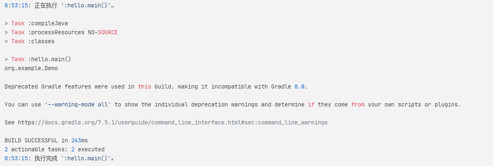
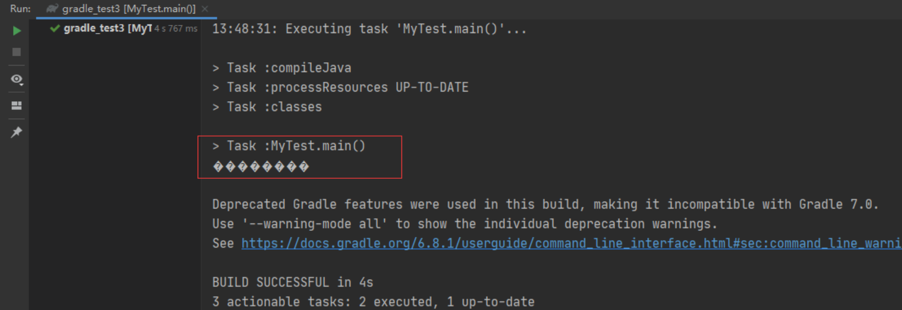
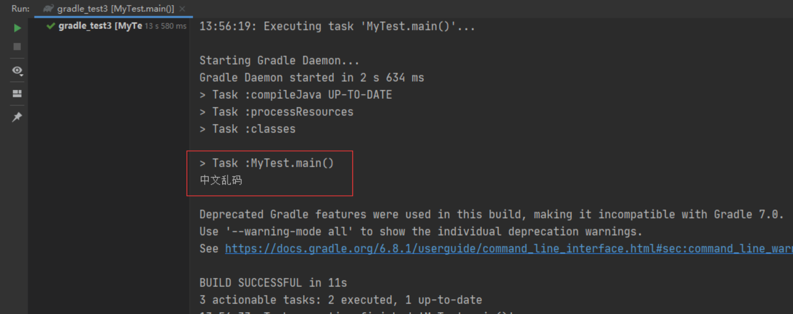

# Gradle 编译运行 Java 项目乱码

参考文档：

[(23 条消息) Windows 下 gradle 编译控制台中文乱码_Amouzy 的博客-CSDN 博客_gradle 编译乱码](https://blog.csdn.net/weixin_44471080/article/details/125205592?ops_request_misc=%7B%22request%5Fid%22%3A%22167322645416800213059238%22%2C%22scm%22%3A%2220140713.130102334..%22%7D&request_id=167322645416800213059238&biz_id=0&utm_medium=distribute.pc_search_result.none-task-blog-2~all~sobaiduend~default-1-125205592-null-null.142%5Ev70%5Econtrol,201%5Ev4%5Eadd_ask&utm_term=gradle%E9%A1%B9%E7%9B%AE%E6%8E%A7%E5%88%B6%E5%8F%B0%E4%B8%AD%E6%96%87%E4%B9%B1%E7%A0%81&spm=1018.2226.3001.4187)

[(35条消息) Gradle中文乱码解决_很酷一只卷儿的博客-CSDN博客](https://blog.csdn.net/weixin_44943981/article/details/113935542)

---

* 构建项目乱码加载注解乱码

  ‍

  ```gradle
  8:48:17: 正在执行 ':hello.main()'…


  > Task :compileJava

  > Task :processResources NO-SOURCE
  > Task :classes
  D:\.github\.dome\java-����\untitled\src\main\java\org\example\Demo.java:4: ����: ���� GBK �IJ���ӳ���ַ� (0x80)
   * 通过�?个对象获得完整的包名和类�?
         ^
  D:\.github\.dome\java-����\untitled\src\main\java\org\example\Demo.java:4: ����: ���� GBK �IJ���ӳ���ַ� (0x8D)
   * 通过�?个对象获得完整的包名和类�?
                             ^

  > Task :hello.main()
  org.example.Demo

  Deprecated Gradle features were used in this build, making it incompatible with Gradle 8.0.

  You can use '--warning-mode all' to show the individual deprecation warnings and determine if they come from your own scripts or plugins.

  See https://docs.gradle.org/7.5.1/userguide/command_line_interface.html#sec:command_line_warnings

  BUILD SUCCESSFUL in 1s
  2 actionable tasks: 2 executed
  8:48:19: 执行完成 ':hello.main()'。

  ```

  ​`build.gradle`​ 文件添加以下内容

  ```gradle
  tasks.withType(JavaCompile).configureEach {
      options.encoding = "utf-8"
  }
  tasks.withType(Javadoc).configureEach {
      options.encoding = "utf-8"
  }
  ```

  最后效果

  ​​

* idea 设置文件编码
* 设置idea编码

  效果图：

  ​​

  ​​

  ‍

‍
