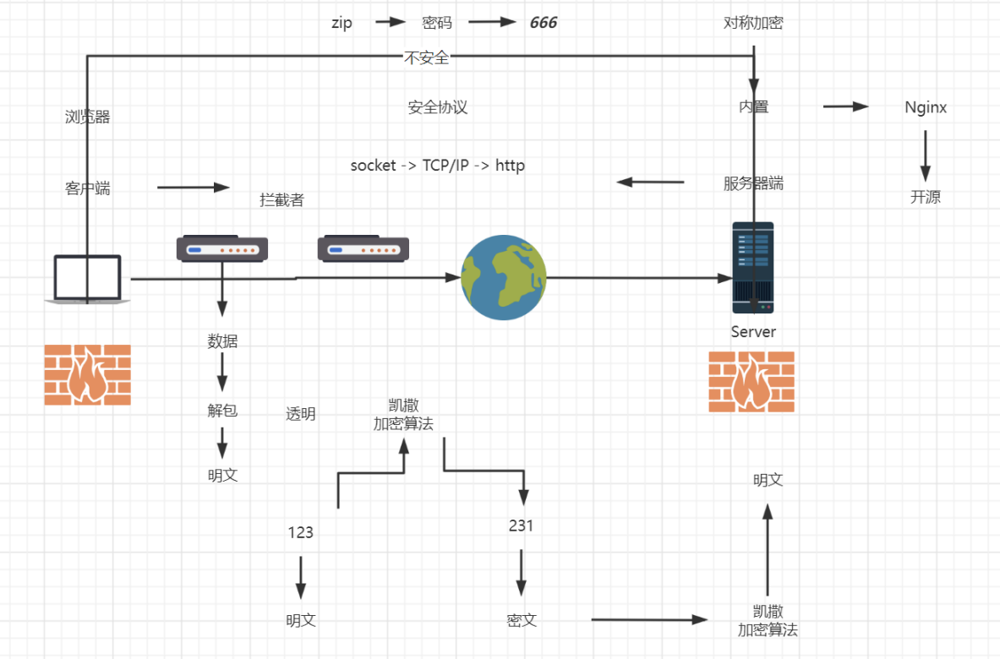

# Https证书配置

### 不安全的http协议

​​

### openssl

openssl包含：SSL协议库、应用程序以及密码算法库

### 自签名

#### OpenSSL

系统内置

#### 图形化工具 XCA

[Download (hohnstaedt.de)](https://www.hohnstaedt.de/xca/index.php/download)

### CA 签名
