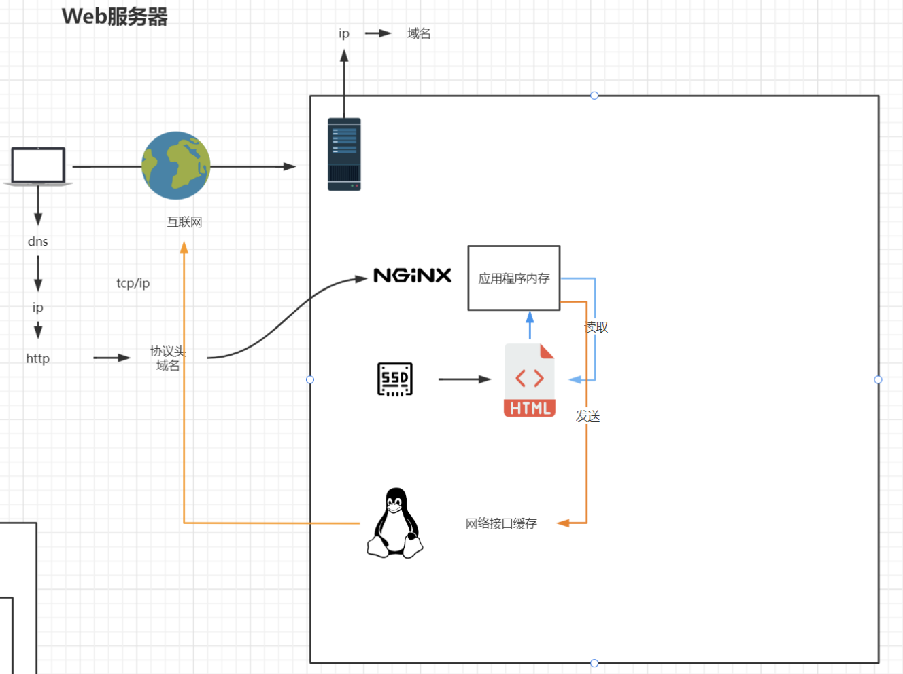
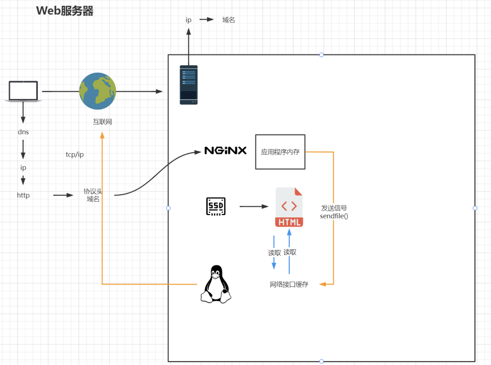

# Nginx配置参数

### 最小配置

* worker_processes

  worker_processes 1; 默认为1，表示开启一个业务进程

‍

* worker_connections

  worker_connections 1024; 单个业务进程可接受连接数

‍

* include mime.types;

  include mime.types; 引入http mime类型

‍

* default_type application/octet-stream;

  default_type application/octet-stream; 如果mime类型没匹配上，默认使用二进制流的方式传输。

‍

* sendfile on;

  sendfile on; 使用linux的 sendfile(socket, file, len) 高效网络传输，也就是数据0拷贝。

  未开启sendfile

  ​​

  开启后sendfile

  ​​

  ‍

‍

* keepalive_timeout 65;

  keepalive_timeout 65;

‍

* server

  ​​

  虚拟主机配置

  ```shell
  server {
  	listen 80; 				# 监听端口号
  	server_name localhost; 			# 主机名
  	location / { 				# 匹配路径
  	    root html; 				# 文件根目录
  	    index index.html index.htm; 	# 默认页名称
  	}
  	error_page 500 502 503 504 /50x.html; 	# 报错编码对应页面
  	location = /50x.html {
  	    root html;
  	}
  }
  ```

‍

‍

### 虚拟主机

原本一台服务器只能对应一个站点，通过虚拟主机技术可以虚拟化成多个站点同时对外提供服务

‍

* servername匹配规则

  我们需要注意的是servername匹配分先后顺序，写在前面的匹配上就不会继续往下匹配了。

‍

* 完整匹配

  我们可以在同一servername中匹配多个域名

  ```shell
  server_name vod.mmban.com www1.mmban.com;
  ```

‍

* 通配符匹配

  ```shell
  server_name *.mmban.com
  ```

‍

* 通配符结束匹配

  ```shell
  server_name vod.*;
  ```

‍

* 正则匹配

  ```shell
  server_name ~^[0-9]+\.mmban\.com$;
  ```

‍

### 反向代理

‍

* proxy_pass http://baidu.com;

  ```shell
  	location / {
  	    proxy_pass http://atguigu.com/;
  	}
  ```

‍

‍
