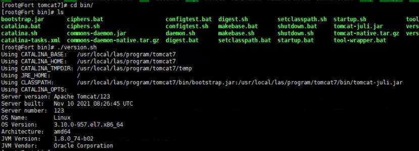
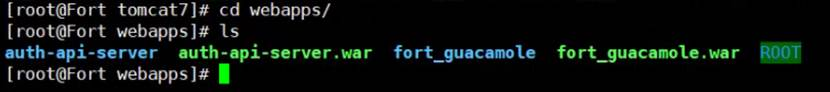

# Linux 服务器实时查看 Tomcat 运行日志

web服务日志存储位置：/usr/local/tomcat6/logs/,主要输出日志为catalina.out文件

​`tail -f /usr/local/las/program/tomcat7/logs/catalina.out`​

[https://blog.csdn.net/shuzishij/article/details/83037926](https://blog.csdn.net/shuzishij/article/details/83037926)

### 检查tomcat 版本！！！

​​

### 清理 Tomcat old war 包

​`/etc/init.d/tomcat stop`​	停止 Tomcat 服务，清理 tomcat 留两个war 包

​​

清理 work 文件

​​

​`/etc/init.d/tomcat restart`​

‍
