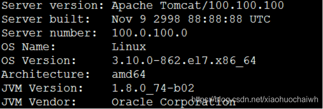
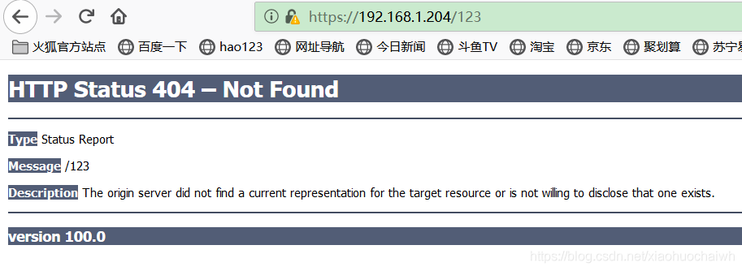
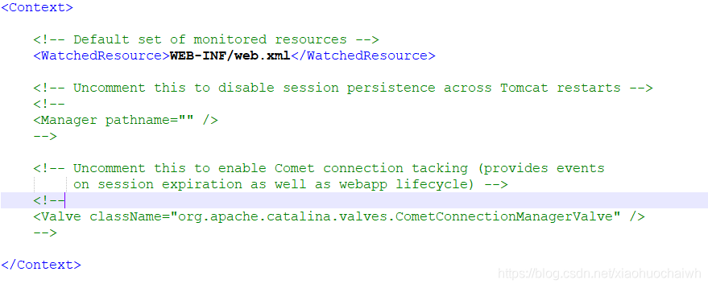
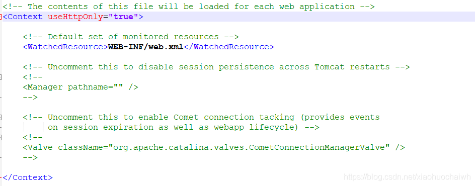
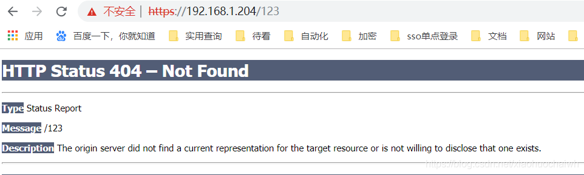

# Tomcat 版本升级

参考文档：

[https://blog.csdn.net/xiaohuochaiwh/article/details/88578965](https://blog.csdn.net/xiaohuochaiwh/article/details/88578965)

[https://blog.csdn.net/a403071690/article/details/50442786](https://blog.csdn.net/a403071690/article/details/50442786)

[https://blog.csdn.net/xiaohuochaiwh/article/details/88579567](https://blog.csdn.net/xiaohuochaiwh/article/details/88579567)

---

1. Tomcat7 和 Tomcat8 的 websocket 实现不同，更换 Tomcat8 及以上版本需要重构 websocket 接口
2. Tomcat7 中屏蔽了版本号，真实版本7.0.92
3. Tomcat7 进行错误页重定向：`ROOT/WEB-INF/web.xml`​​
4. Tomcat7 中所有日志进行了重定向：`/usr/local/las/log/tomcat7/`​​
5. Tomcat7 中 cookie 设置 HttpOnly 属性为 true
6. ​`jre/lib/security/`​​ 下的 `local_policy.jar`​​ 和 `US_export_policy.jar`​​ 替换为官方网站提供了JCE无限制权限策略文件

### 修改Tomcat版本号：

修改文件位置：tomcat/lib/catalina.jar

   用压缩工具打开找到 catalina.jar/org/apache/catalina/util/ServerInfo.properties

   修改以下参数值：

      server.info=Apache Tomcat/7.0.92

      server.number=7.0.92.0

      server.built=Nov 9 2018 11:07:44 UTC

      修改完成之后重新压缩保存，替换原有的文件

查看新的版本号：tomcat/bin/version.sh

  
​​

​​

### Tomcat中设置Cookie的HttpOly属性

为了减少XSS跨站脚本攻击，防止读取修改cookie的内容，可以在tomcat中为cookie设置HttpOnly属性。

修改文件:tomcat/conf/context.xml

在<Context>标签中增加属性 useHttpOnly="true"

修改前：

​​

修改后：

​​​

### 如何处理tomcat默认错误页面

当Tomcat出现404界面之后跳转到默认页

​​

可以将此页重新定位到其他指定界面：

1、创建新的错误页

      编写新的界面error.html,将此界面放到 tomcat6/webapps/ROOT 目录下

2、创建编写web.xml

       修改Tomcat\webapps\ROOT\WEB-INF\web.xml文件内容，指定错误状态码对应的界面  

```xml
<?xml version="1.0" encoding="utf-8"?>
 
<web-app xmlns="http://java.sun.com/xml/ns/javaee" xmlns:xsi="http://www.w3.org/2001/XMLSchema-instance" xsi:schemaLocation="http://java.sun.com/xml/ns/javaee                       http://java.sun.com/xml/ns/javaee/web-app_3_0.xsd" version="3.0" metadata-complete="true">  
  <display-name>Welcome to Tomcat</display-name>  
  <description>Welcome to Tomcat</description>  
  <error-page> 
    <error-code>404</error-code>  
    <location>/error.html</location> 
  </error-page>  
  <error-page> 
    <error-code>400</error-code>  
    <location>/error.html</location> 
  </error-page>  
  <error-page> 
    <error-code>500</error-code>  
    <location>/error.html</location> 
  </error-page> 
</web-app>
```

‍
