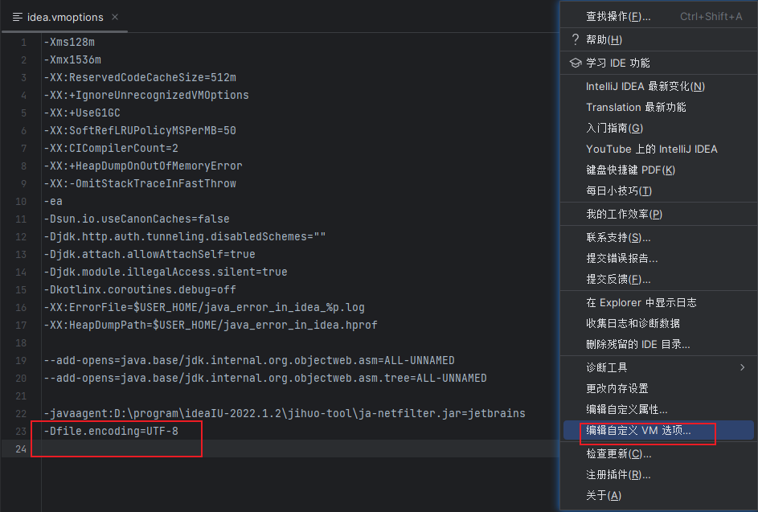
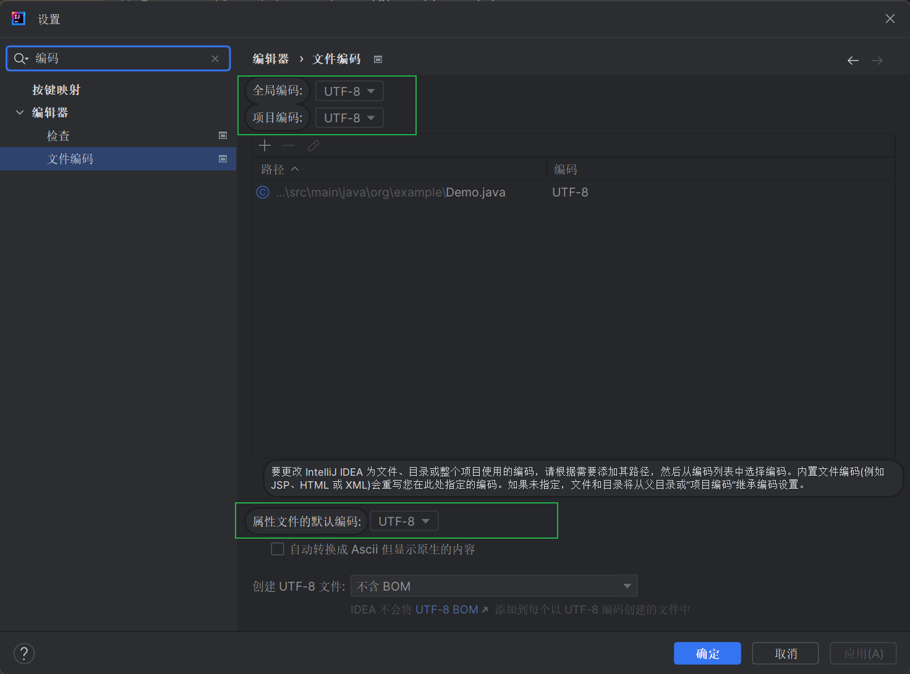
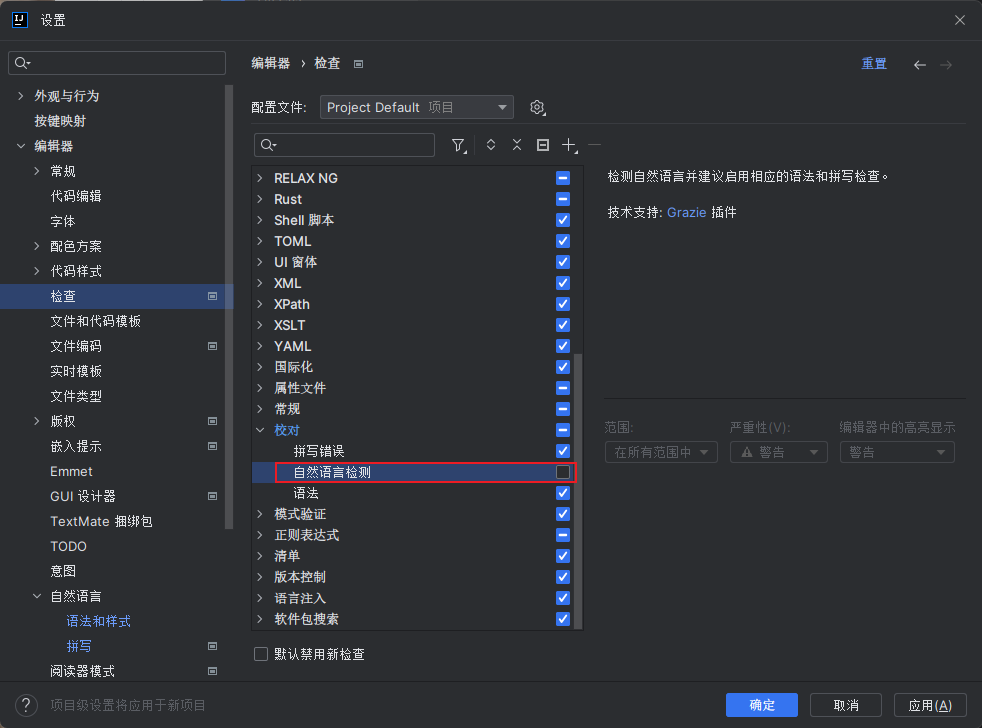
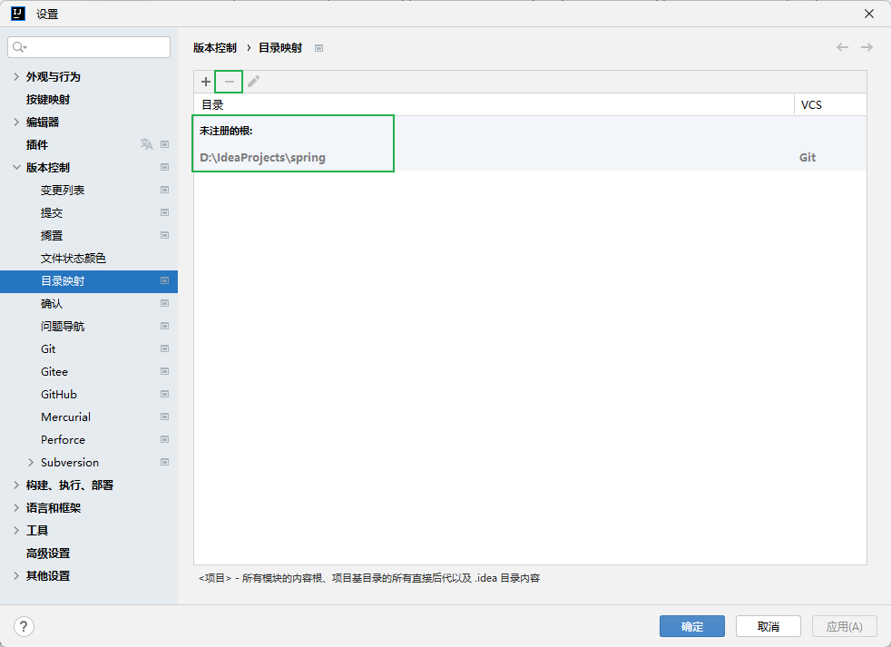
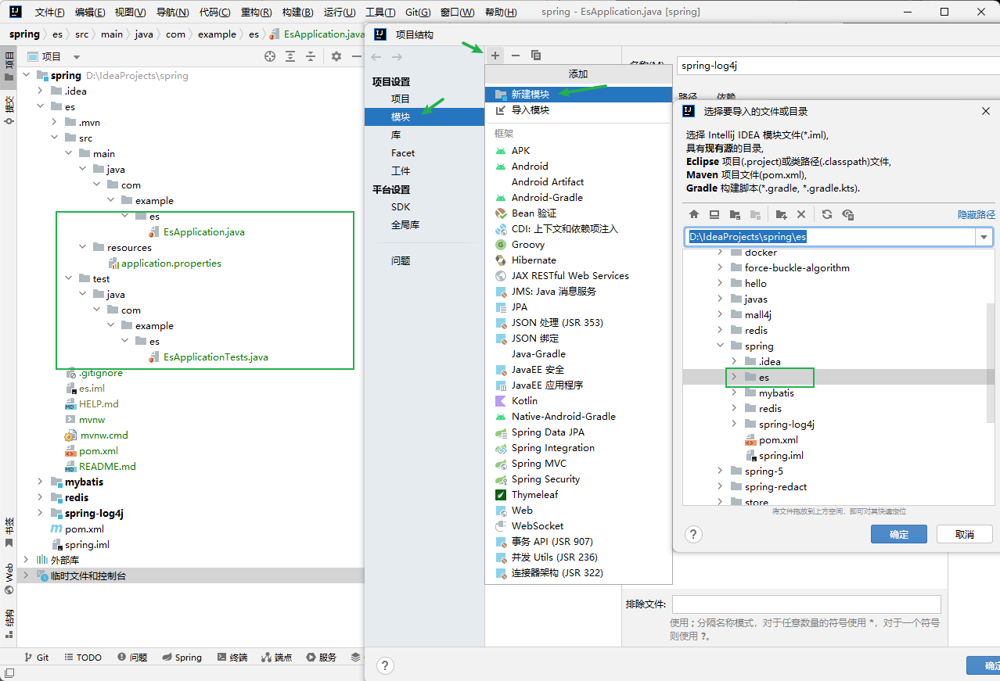
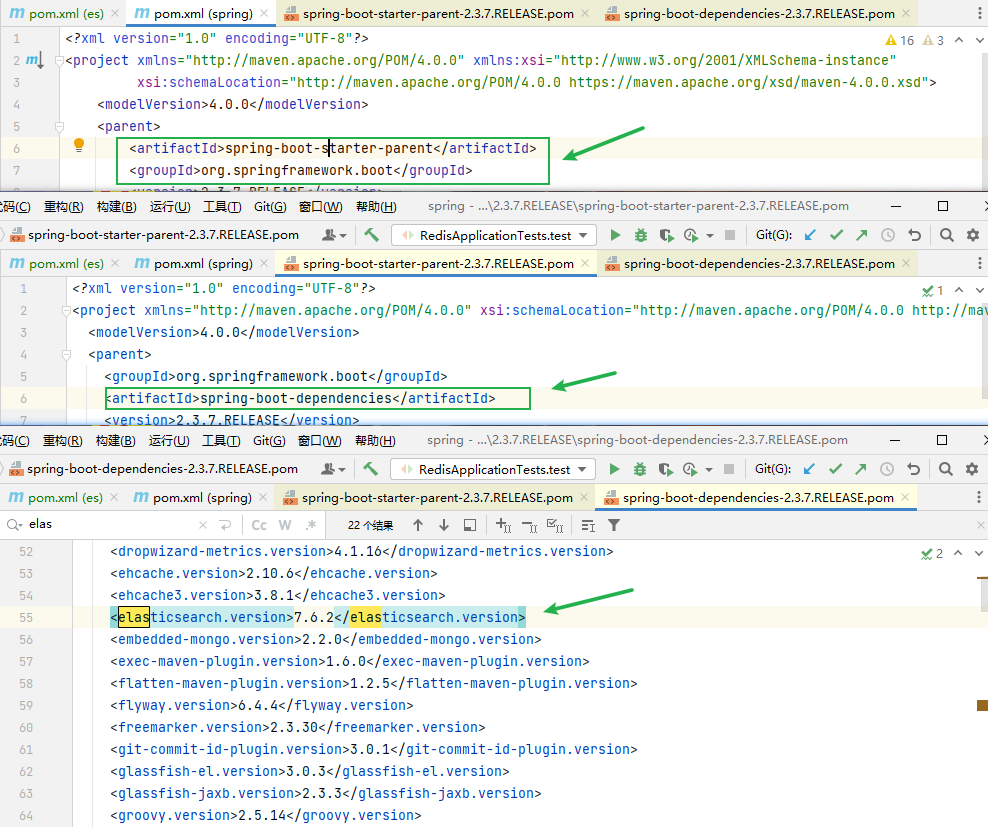

### 设置idea编码

​

```shell
-Dfile.encoding=UTF-8
```

**重启IDEA即可**

‍

### idea 设置文件编码

​

‍

### idea 关闭单词拼写错误检查

​​

‍


### IDEA强制清除Maven缓存

Idea打包存在漏包：https://blog.csdn.net/weixin_45109720/article/details/111912633

‍

### 切换 Spring 初始化 URL

1. 官网：[https://start.spring.io/](https://start.spring.io/)
2. 阿里：[https://start.aliyun.com/](https://start.aliyun.com/)


### 清除项目 git 的 版本控制映射目录（重新gitee库）

​


### 项目未导入

​


### 查看导入相关依赖版本



‍

### idea 推荐插件

`Alibaba Java Coding Guidelines(XenoAmess TPM)` Java编码指南

`Chinese (Simplified) Language Pack / 中文语言包` IDEA 中文语言包

`Easy Javadoc` 快速生成类、方法、属性等中文javadoc

`MyBatisX` 增强idea对mybatis支持的插件

`JRebel and XRebel` 热部署插件

`Show Comment` 项目窗口外部注释显示

`PlantUML Integration` 类图

`PlantUML Parser`

`.ignore`

`Batch Scripts Support`

`Foldable ProjectView`

`Protocol Buffers`

`Python Community Edition`

`SequenceDiagram`

`Translation`

‍
