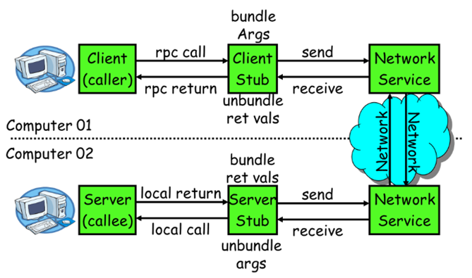
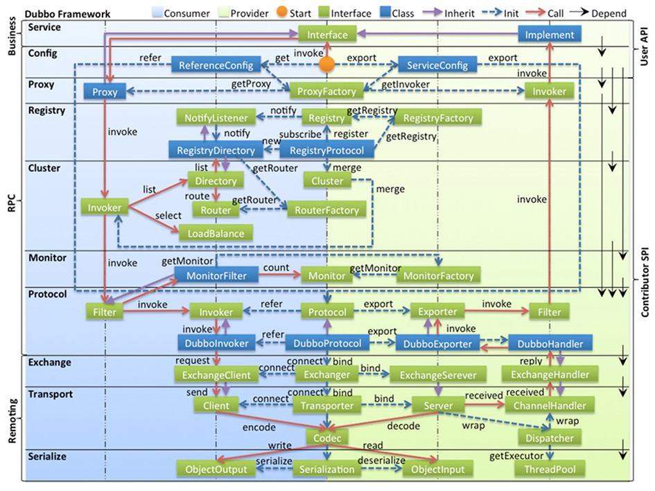
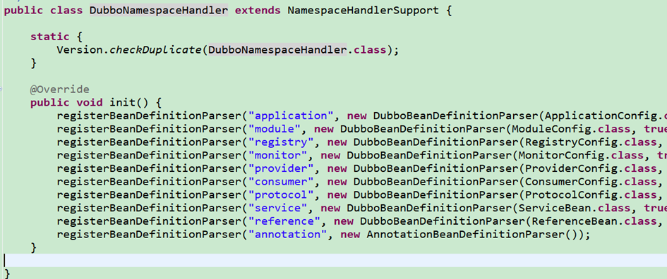
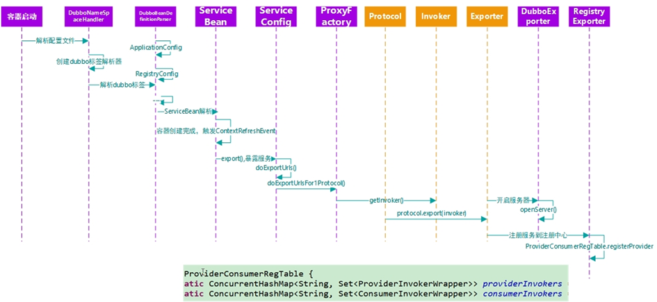
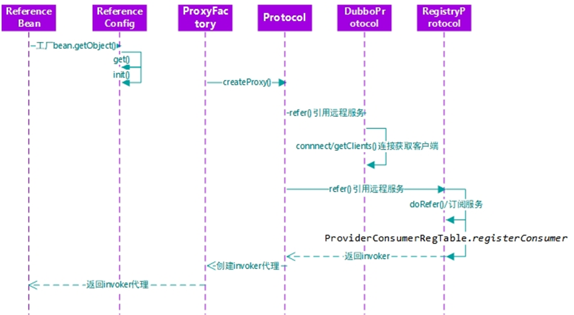
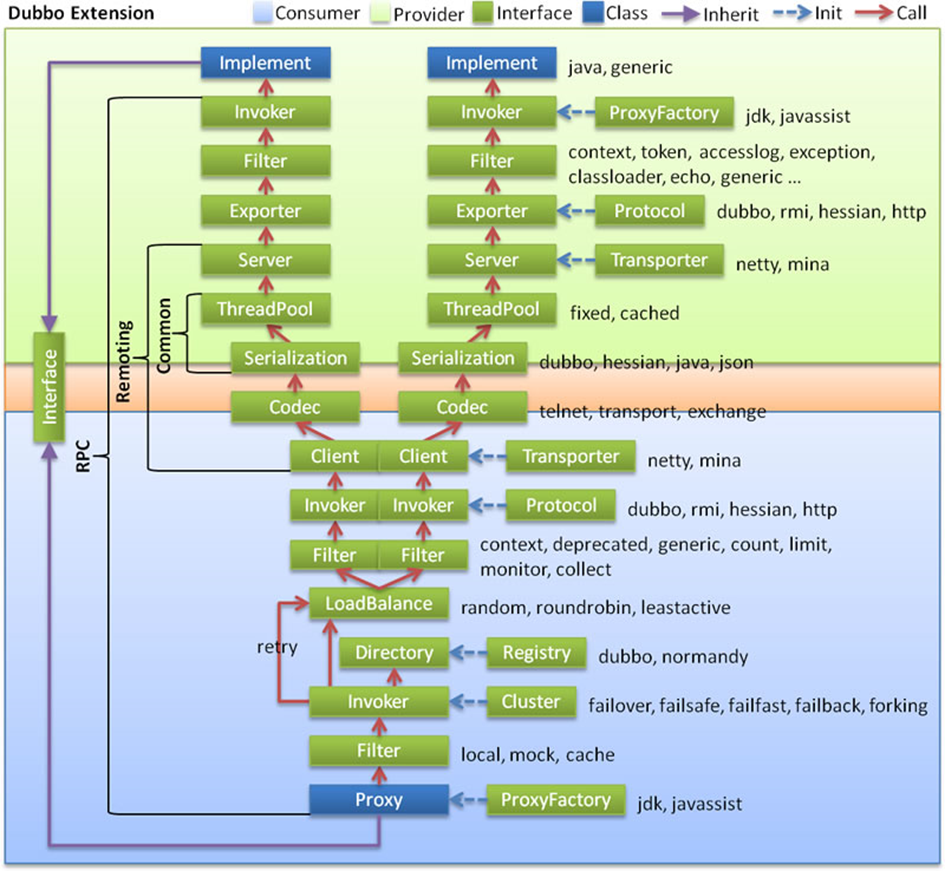

# Dubbo 原理

Apache Dubbo官网地址：https://cn.dubbo.apache.org/zh-cn/

---

分布式基础理论

Dubbo 简介：Apache Dubbo 是一款 RPC 服务开发框架，用于解决微服务架构下的服务治理与通信问题，官方提供了 Java、Golang 等多语言 SDK 实现。使用 Dubbo 开发的微服务原生具备相互之间的远程地址发现与通信能力， 利用 Dubbo 提供的丰富服务治理特性，可以实现诸如服务发现、负载均衡、流量调度等服务治理诉求。Dubbo 被设计为高度可扩展，用户可以方便的实现流量拦截、选址的各种定制逻辑。

## RPC原理

​

一次完整的RPC调用流程（同步调用，异步另说）如下：

**1）服务消费方（client**）调用以本地调用方式调用服务；

2）client stub接收到调用后负责将方法、参数等组装成能够进行网络传输的消息体；

3）client stub找到服务地址，并将消息发送到服务端；

4）server stub收到消息后进行解码；

5）server stub根据解码结果调用本地的服务；

6）本地服务执行并将结果返回给server stub；

7）server stub将返回结果打包成消息并发送至消费方；

8）client stub接收到消息，并进行解码；

**9）服务消费方得到最终结果。**

RPC框架的目标就是要2~8这些步骤都封装起来，这些细节对用户来说是透明的，不可见的。

## netty通信原理

Netty是一个异步事件驱动的网络应用程序框架，用于快速开发可维护的高性能协议服务器和客户端。它极大地简化并简化了TCP和UDP套接字服务器等网络编程。

## dubbo原理

* dubbo原理     -框架设计

  ​

  ‍

  * config 配置层：对外配置接口，以 ServiceConfig, ReferenceConfig 为中心，可以直接初始化配置类，也可以通过 spring 解析配置生成配置类

  * proxy 服务代理层：服务接口透明代理，生成服务的客户端 Stub 和服务器端 Skeleton, 以 ServiceProxy 为中心，扩展接口为 ProxyFactory

  * registry 注册中心层：封装服务地址的注册与发现，以服务 URL 为中心，扩展接口为 RegistryFactory, Registry, RegistryService

  * cluster 路由层：封装多个提供者的路由及负载均衡，并桥接注册中心，以 Invoker 为中心，扩展接口为 Cluster, Directory, Router, LoadBalance

  * monitor 监控层：RPC 调用次数和调用时间监控，以 Statistics 为中心，扩展接口为 MonitorFactory, Monitor, MonitorService

  * protocol 远程调用层：封装 RPC 调用，以 Invocation, Result 为中心，扩展接口为 Protocol, Invoker, Exporter

  * exchange 信息交换层：封装请求响应模式，同步转异步，以 Request, Response 为中心，扩展接口为 Exchanger, ExchangeChannel, ExchangeClient, ExchangeServer

  * transport 网络传输层：抽象 mina 和 netty 为统一接口，以 Message 为中心，扩展接口为 Channel, Transporter, Client, Server, Codec

  * serialize 数据序列化层：可复用的一些工具，扩展接口为 Serialization, ObjectInput, ObjectOutput, ThreadPool
* dubbo原理  -启动解析、加载配置信息

  ​
* dubbo原理     -服务暴露

  ​
* dubbo原理  -服务引用

  ​
* dubbo原理  -服务调用

  ​

‍
