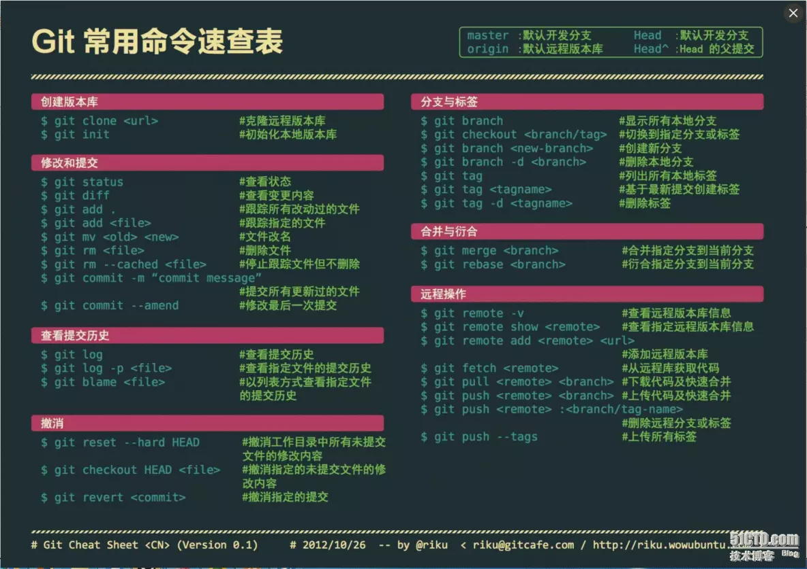
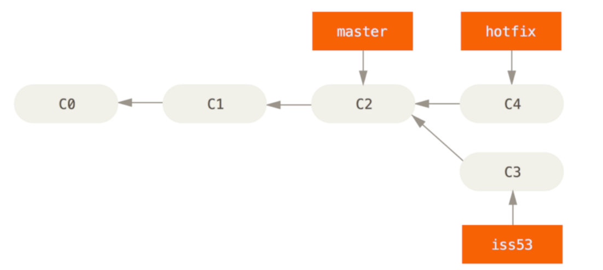
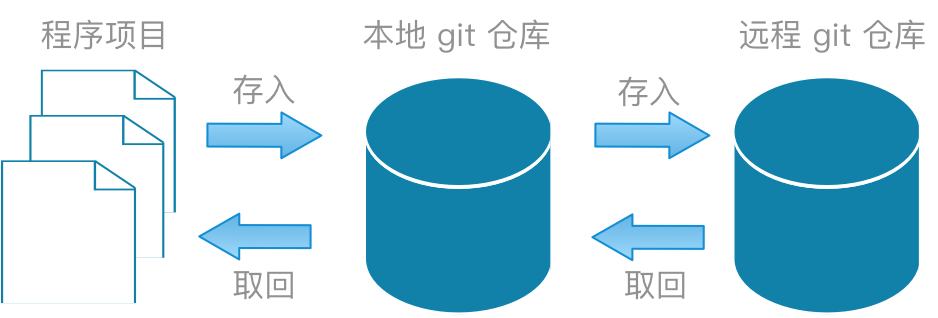
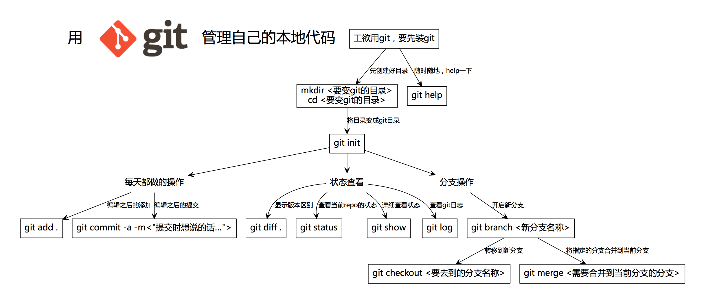

#### 简易的命令行入门教程:

Git 全局设置:

```shell
git config --global user.name "liuzonglin" # 设置用户签名
git config --global user.email "lzlysfxx@163.com" # 设置用户邮箱
```

创建 git 仓库:

```shell
mkdir <仓库名>
cd <仓库名>
git init # 初始化本地库
touch README.md
git add README.md
git commit -m "first commit"
git remote add origin <远程地址>
git push -u origin "master"
```

已有仓库?

```shell
cd existing_git_repo
git remote add origin <远程地址>
git push -u origin "master"
```


#### Git 常用指令

​


##### 设置用户签名

```shell
$ git config --global user.name "liuzonglin"
$ git config --global user.email "lzlysfxx@163.com"
```

> 说明：
>
> 签名的作用是区分不同操作者身份。
>
> 用户的签名信息在每一个版本的提交信息中能够看 到，以此确认本次提交是谁做的。
>
> Git 首次安装必须设置一下用户签名，否则无法提交代码。
>
> 注意：

> 这里设置用户签名和将来登录 GitHub（或其他代码托管中心）的账号没有任 何关系。

```shell
$ cat ~/.gitconfig
[user]
        name = liuzonglin
        email = lzlysfxx@163.com
[credential "https://gitee.com"]
        provider = generic
```


##### 初始化本地库

```shell
$ git init
Initialized empty Git repository in D:/.github/.dome/df/.git/

liuzonglin@LAPTOP-CGO0UV3J MINGW64 /d/.github/.dome/df (master) # 全局范围的签名设置
$ ls -al
total 4
drwxr-xr-x 1 liuzonglin 197121 0 Jan  6 13:35 ./
drwxr-xr-x 1 liuzonglin 197121 0 Jan  6 13:35 ../
drwxr-xr-x 1 liuzonglin 197121 0 Jan  6 13:35 .git/ # 生成了 `.git`
$ cat .git/config # 每个git库都会有一个配置信息文件
[core]
        repositoryformatversion = 0
        filemode = false
        bare = false
        logallrefupdates = true
        symlinks = false
        ignorecase = true
[remote "origin"]
        url = https://gitee.com/liuzonglin1/df.git
        fetch = +refs/heads/*:refs/remotes/origin/*
[branch "master"]
        remote = origin
        merge = refs/heads/master
```


##### 查看本地库状态

```shell
$ > liuzonglin.txt

liuzonglin@LAPTOP-CGO0UV3J MINGW64 /d/.github/.dome/df (master)
$ git status
On branch master
Your branch is up to date with 'origin/master'.

Untracked files:
  (use "git add <file>..." to include in what will be committed) # 检测到未追踪的文件 liuzonglin.txt
        liuzonglin.txt

nothing added to commit but untracked files present (use "git add" to track)

liuzonglin@LAPTOP-CGO0UV3J MINGW64 /d/.github/.dome/df (master)
```


##### 添加到暂存区

```shell
$ git add <文件名>

liuzonglin@LAPTOP-CGO0UV3J MINGW64 /d/.github/.dome/df (master)
$ git status
On branch master
Your branch is up to date with 'origin/master'.

Changes to be committed:
  (use "git restore --staged <file>..." to unstage) # 检测到暂存区有新文件
        new file:   liuzonglin.txt

```


##### 提交到本地库

```shell
git commit -m "日志信息" <文件名> # 将暂存区的文件提交到本地库
```


##### 查看历史记录

```shell
$ git reflog
5e476cb (HEAD -> master) HEAD@{0}: commit: 2
c674444 (origin/master) HEAD@{1}: reset: moving to c674444
c674444 (origin/master) HEAD@{2}: commit: 修改README.md
0999e1f HEAD@{3}: commit (initial): 第一次提交
```


##### 版本穿梭

```shell
git reset --hard <版本号>
```


#### Git 分支操作

​


##### 创建分支

```shell
$ git branch <分支名>

liuzonglin@LAPTOP-CGO0UV3J MINGW64 /d/.github/.dome/df (master)
$ git branch -v
  lzl    5e476cb 2 # 刚创建的新的分支，并将主分支 master 的内容复制了一份
* master 5e476cb [ahead 1] 2

```


##### 查看分支

```shell
$ git branch -v
* master 5e476cb [ahead 1] 2 # * 代表当前所在的分区

```


##### 切换分支

```shell
$ git checkout <分支名> 
Switched to branch '<分支名>'

```


##### 把指定的分支合并到当前分支上

```shell
git merge <分支名> 

$ git merge lzl
Auto-merging liuzonglin.txt
CONFLICT (content): Merge conflict in liuzonglin.txt
Automatic merge failed; fix conflicts and then commit the result.

liuzonglin@LAPTOP-CGO0UV3J MINGW64 /d/.github/.dome/df (master|MERGING) # 冲突产生的表现：后面状态为 MERGING
$ git status
On branch master
Your branch is ahead of 'origin/master' by 2 commits. # 查看状态（检测到有文件有两处修改）
  (use "git push" to publish your local commits)

You have unmerged paths.
  (fix conflicts and run "git commit")
  (use "git merge --abort" to abort the merge)

Unmerged paths:
  (use "git add <file>..." to mark resolution)
        both modified:   liuzonglin.txt

no changes added to commit (use "git add" and/or "git commit -a")
$ cat liuzonglin.txt # 查看冲突文件
<<<<<<< HEAD # 特殊符号
111111111111111111111111111111111111111111111111111111111111111111111111
======= # 当前分支的代码
123456
>>>>>>> lzl # 合并过来的代码
$ vim liuzonglin.txt # 编辑有冲突的文件，删除特殊符号，决定要使用的内容

liuzonglin@LAPTOP-CGO0UV3J MINGW64 /d/.github/.dome/df (master|MERGING)
$ cat liuzonglin.txt
111111111111111111111111111111111111111111111111111111111111111111111111
123456

liuzonglin@LAPTOP-CGO0UV3J MINGW64 /d/.github/.dome/df (master|MERGING)
$ git add liuzonglin.txt # 添加到暂存区

liuzonglin@LAPTOP-CGO0UV3J MINGW64 /d/.github/.dome/df (master|MERGING)
$ git commit -m "解决冲突" # 执行提交（注意：此时使用 git commit 命令时不能带文件名）
[master 3eaeba5] 解决冲突

liuzonglin@LAPTOP-CGO0UV3J MINGW64 /d/.github/.dome/df (master) # MERGING 消失，变为正常

```

> 冲突产生的原因：
>
> 合并分支时，两个分支在同一个文件的同一个位置有两套完全不同的修改。Git 无法替 我们决定使用哪一个。必须人为决定新代码内容。


#### Git 远程仓库操作

​


##### 查看当前所有远程地址别名

```shell
$ git remote -v
origin  https://gitee.com/liuzonglin1/df.git (fetch)
origin  https://gitee.com/liuzonglin1/df.git (push)

```


##### 起别名

```shell
$ git remote add <别名> <远程地址>

liuzonglin@LAPTOP-CGO0UV3J MINGW64 /d/.github/.dome/df (master)
$ git remote -v
lzl     https://gitee.com/liuzonglin1/df.git (fetch)
lzl     https://gitee.com/liuzonglin1/df.git (push)

```


##### 推送本地分支上的内容到远程仓库

```shell
$ git push <别名> <分支>
Enumerating objects: 7, done.
Counting objects: 100% (7/7), done.
Delta compression using up to 12 threads
Compressing objects: 100% (4/4), done.
Writing objects: 100% (6/6), 546 bytes | 546.00 KiB/s, done.
Total 6 (delta 0), reused 0 (delta 0), pack-reused 0
remote: Powered by GITEE.COM [GNK-6.4]
remote: Create a pull request for 'lzl' on Gitee by visiting:
remote:     https://gitee.com/liuzonglin1/df/pull/new/liuzonglin1:lzl...liuzonglin1:master
To https://gitee.com/liuzonglin1/df.git
 * [new branch]      lzl -> lzl


# 执行案例
$ git status
On branch master
Your branch is up to date with 'origin/master'.

Changes not staged for commit:
  (use "git add <file>..." to update what will be committed)
  (use "git restore <file>..." to discard changes in working directory)
        modified:   Git/Git.md

no changes added to commit (use "git add" and/or "git commit -a")

liuzonglin@LAPTOP-CGO0UV3J MINGW64 /d/.github/.doc (master)
$ git add Git/Git.md

liuzonglin@LAPTOP-CGO0UV3J MINGW64 /d/.github/.doc (master)
$ git remote -v
origin  https://gitee.com/liuzonglin1/file.git (fetch)
origin  https://gitee.com/liuzonglin1/file.git (push)

liuzonglin@LAPTOP-CGO0UV3J MINGW64 /d/.github/.doc (master)
$ git commit -m "修改参考文档位置"
[master 1c8ca01] 修改参考文档位置
 1 file changed, 30 insertions(+), 25 deletions(-)

liuzonglin@LAPTOP-CGO0UV3J MINGW64 /d/.github/.doc (master)
$ git push origin master
Enumerating objects: 7, done.
Counting objects: 100% (7/7), done.
Delta compression using up to 12 threads
Compressing objects: 100% (4/4), done.
Writing objects: 100% (4/4), 441 bytes | 441.00 KiB/s, done.
Total 4 (delta 2), reused 0 (delta 0), pack-reused 0
remote: Powered by GITEE.COM [GNK-6.4]
To https://gitee.com/liuzonglin1/file.git
   b53eea4..1c8ca01  master -> master

liuzonglin@LAPTOP-CGO0UV3J MINGW64 /d/.github/.doc (master)

```


##### 将远程仓库的内容克隆到本地

```shell
git clone <远程地址>
```

> 小结：clone 会做如下操作。1、拉取代码。2、初始化本地仓库。3、创建别名


##### 将远程仓库对于分支最新内容拉下来后与 当前本地分支直接合并

```shell
$ git pull <远程库地址别名> <远程分支名> 
From https://gitee.com/liuzonglin1/df
 * branch            master     -> FETCH_HEAD
Already up to date.
```


##### 强制覆盖本地文件

git pull 强制覆盖本地的代码方式，下面是正确的方法：

```sh
git fetch --all
```


然后，你有两个选择：

```sh
git reset --hard origin/master
```

或者如果你在其他分支上：

```sh
git reset --hard origin/<branch_name>
```

说明：

`git fetch` 从远程下载最新的，而不尝试合并或 `rebase` 任何东西。

然后 `git reset` 将主分支重置为您刚刚获取的内容。 `--hard` 选项更改工作树中的所有文件以匹配`origin/master`中的文件。


### 修改文件名案例

```shell
$ git status
On branch master
Your branch is up to date with 'origin/master'.

Changes not staged for commit:
  (use "git add/rm <file>..." to update what will be committed)
  (use "git restore <file>..." to discard changes in working directory)
        deleted:    Windows Git 乱码.md

Untracked files:
  (use "git add <file>..." to include in what will be committed)
        Git 乱码.md

no changes added to commit (use "git add" and/or "git commit -a")

liuzonglin@LAPTOP-CGO0UV3J MINGW64 /d/.github/.doc/Git (master)
$ git add Git\ 乱码.md

liuzonglin@LAPTOP-CGO0UV3J MINGW64 /d/.github/.doc/Git (master)
$ git status
On branch master
Your branch is up to date with 'origin/master'.

Changes to be committed:
  (use "git restore --staged <file>..." to unstage)
        new file:   Git 乱码.md

Changes not staged for commit:
  (use "git add/rm <file>..." to update what will be committed)
  (use "git restore <file>..." to discard changes in working directory)
        deleted:    Windows Git 乱码.md

liuzonglin@LAPTOP-CGO0UV3J MINGW64 /d/.github/.doc/Git (master)
$ git rm Windows\ Git\ 乱码.md
rm 'Git/Windows Git 乱码.md'

liuzonglin@LAPTOP-CGO0UV3J MINGW64 /d/.github/.doc/Git (master)
$ git status
On branch master
Your branch is up to date with 'origin/master'.

Changes to be committed:
  (use "git restore --staged <file>..." to unstage)
        new file:   Git 乱码.md
        deleted:    Windows Git 乱码.md


liuzonglin@LAPTOP-CGO0UV3J MINGW64 /d/.github/.doc/Git (master)
$ git commit -m "修改文件名"
[master 310e588] 修改文件名
 2 files changed, 62 insertions(+), 9 deletions(-)
 create mode 100644 Git/Git 乱码.md
 delete mode 100644 Git/Windows Git 乱码.md

liuzonglin@LAPTOP-CGO0UV3J MINGW64 /d/.github/.doc/Git (master)
$ git push origin master
Enumerating objects: 6, done.
Counting objects: 100% (6/6), done.
Delta compression using up to 12 threads
Compressing objects: 100% (4/4), done.
Writing objects: 100% (4/4), 1.07 KiB | 1.07 MiB/s, done.
Total 4 (delta 1), reused 0 (delta 0), pack-reused 0
remote: Powered by GITEE.COM [GNK-6.4]
To https://gitee.com/liuzonglin1/file.git
   1619138..310e588  master -> master

liuzonglin@LAPTOP-CGO0UV3J MINGW64 /d/.github/.doc/Git (master)
$ git status
On branch master
Your branch is up to date with 'origin/master'.

nothing to commit, working tree clean

liuzonglin@LAPTOP-CGO0UV3J MINGW64 /d/.github/.doc/Git (master)
$

```

‍

### 参考文档：

[(22条消息) cat .git/config查看远端服务器信息（git的配置信息：远端服务器连接信息）_longshenlmj的博客-CSDN博客](https://blog.csdn.net/longshenlmj/article/details/19829389)****

[(22条消息) Git知识总结_lili要努力的博客-CSDN博客](https://blog.csdn.net/m0_52781902/article/details/126621630)

[git命令总结_奔跑在路上的技术博客_51CTO博客](https://blog.51cto.com/qiangsh/1769754)

[Git_03分支 (copyfuture.com)](https://copyfuture.com/blogs-details/202112111616213495)

[(22条消息) 用git进行本地代码版本管理“流程图”_Solomon-Lang的博客-CSDN博客_代码版本控制图](https://blog.csdn.net/solomonlangrui/article/details/47052679)

[(22条消息) Git的下载安装和初始设置_Lum0s！的博客-CSDN博客_git默认安装地址](https://blog.csdn.net/m0_59751822/article/details/125940620)

​

‍

Git 官网：[Git (git-scm.com)](https://git-scm.com/)

Windows 安装 Git：[Git 详细安装教程（详解 Git 安装过程的每一个步骤）](https://blog.csdn.net/mukes/article/details/115693833)
