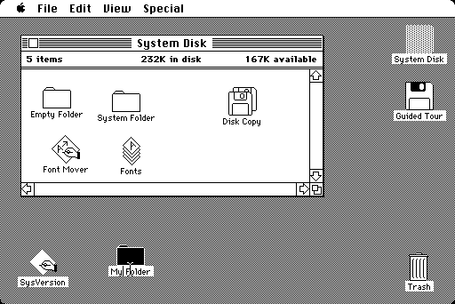

## Linux操作系统与项目部署

**注意：**本版块会涉及到`操作系统`相关知识。

现在，几乎所有智能设备都有一个自己的操作系统，比如我们的家用个人电脑，基本都是预装Windows操作系统，我们的手机也有Android和iOS操作系统，还有程序员比较青睐的MacBook，预装MacOS操作系统，甚至连Macbook的Touchbar都有一个自己的小型操作系统。

> 操作系统是管理计算机硬件与软件资源的计算机程序，操作系统可以对计算机系统的各项资源板块开展调度工作，运用计算机操作系统可以减少人工资源分配的工作强度。

在我们的电脑没有操作系统的情况下，它就是一堆电子元器件组合而成的机器，就像我们有了一具完整的身体，但是现在缺少的是一个大脑，来控制我们的身体做出各种动作和行为，而安装了操作系统，就像为电脑注入了灵魂，操作系统会帮助我们对所有的硬件进行调度和管理。

比如我们现在最常用的Windows操作系统，我们可以在系统中做各种各样的事情，包括游戏、看片、学习、编程等，而所有的程序正是基于操作系统之上运行的，操作系统帮助我们与底层硬件进行交互，而在程序中我们只需要告诉操作系统我们需要做什么就可以了，操作系统知道该如何使用和调度底层的硬件，来完成我们程序中指定的任务。

（如果你在自己电脑上安装过Windows操作系统，甚至自己打过驱动程序，或是使用安装过Linux任意发行版本，那么本章学习起来会比较轻松）


## 发展简史

这是整个SpringBoot阶段的最后部分了，为了不让学习那么枯燥，我们先来讲点小故事。

在1965年，当时还处于批处理操作系统的时代，但是它只能同时供一个用户使用，而当时人们正希望能够开发一种交互式的、具有多道程序处理能力的分时操作系统。于是，贝尔实验室、美国麻省理工学院和通用电气公司联合发起了一项名为 Multics 的工程计划，而目的也是希望能够开发出这样的一个操作系统，但是最终由于各种原因以失败告终。

以肯•汤普森为首的贝尔实验室研究人员吸取了 Multics 工程计划失败的经验教训，于 1969 年实现了分时操作系统的雏形，在1970 年该操作系统正式取名为**UNIX**，它是一个强大的多用户、多任务操作系统，支持多种处理器架构，1973 年，也就是C语言问世不久后，UNIX操作系统的绝大部分源代码都用C语言进行了重写。

从这之后，大量的UNIX发行版本涌现（基于Unix进行完善的系统）比如 FreeBSD 就是美国加利福尼亚大学伯克利分校开发的 UNIX 版本，它由来自世界各地的志愿者开发和维护，为不同架构的计算机系统提供了不同程度的支持。

而后来1984年苹果公司发布的的MacOS（在Macintosh电脑上搭载）操作系统，正是在 FreeBSD 基础之上开发的全新操作系统，这是首次计算机正式跨进图形化时代，具有里程碑的意义。



同年，乔布斯非常高兴地将自家的图形化MacOS界面展示给微软创始人比尔盖茨，并且希望微软可以为MacOS开发一些软件。比尔盖茨一看，woc，这玩意牛逼啊，咱们自己也给安排一个。于是，在1985年，微软仿造MacOS并基于MS-DOS操作系统，开发出了名为Windows的操作系统：


Windows操作系统的问世，无疑是对MacOS的一次打击，因为MacOS只能搭载在Mac上，但是售价实在太贵，并且软件生态也不尽人意，同时代的Windows却能够安装到各种各样的DIY电脑上，称其为PC，尤其是后来的Windows95，几乎是封神的存在，各种各样基于Windows的软件、游戏层出不穷，以至于到今天为止，MacOS的市场占有率依然远低于Windows，不过Apple这十几年一直在注重自家软件生态的发展，总体来说在办公领域体验感其实和Windows差不多，甚至可能还更好，但是打游戏，别想了。

说了这么多，Linux呢，怎么一句都没提它呢？最牛逼的当然放最后说（不是Unix虽然强大但是有着昂贵的授权费用，并且不开放源代码，于是有人发起了GNU运动（GNU IS NOT UNIX，带有那么一丝嘲讽），模仿 Unix 的界面和使用方式，从头做一个开源的版本。在1987年荷兰有个大学教授安德鲁写了一个Minix，类似于Unix，专用于教学。当Minix流传开来之后，世界各地的黑客们纷纷开始使用并改进，希望把改进的东西合并到Minix中，但是安德鲁觉得他的系统是用于教学的，不能破坏纯净性，于是拒绝了。

在1991年，林纳斯.托瓦兹（Linus Torvalds）认为Minix不够开放，自己又写了一个全新的开源操作系统，它希望这个系统由全世界的爱好者一同参与开发，并且不收费，于是Linux内核就被公开发布到互联网上。一经发布，便引起了社会强烈的反响，在大家的努力下，于1994年Linux的1.0版本正式发布。结合当时的GNU运动，最终合在一起称为了GNU/Linux，以一只企鹅Tux作为吉祥物。


没错，Git也是林纳斯.托瓦兹只花了2周时间开发的。不过林纳斯非常讨厌C++，他认为C++只会让一个项目变得混乱。

从此以后，各式各样的基于Linux发行版就开始出现：


这些发行版都是在Linux内核的基础之上，添加了大量的额外功能，包括开发环境、图形化桌面、包管理等。包括我们的安卓系统，也是基于Linux之上的，而我们要重点介绍的就是基于Debian之上的Ubuntu操作系统。

最后，2022年了，我们再来看一下各大操作系统的市场占有率：

* Windows11/10/7：80%
* MacOS：11%
* Linux：5%
* 其他：4%

Windows无疑是现在最广泛的操作系统，尤其是Windows XP，是多少00后的青春，很多游戏都是基于Windows平台。当然，如果你已经厌倦了游戏，一心只读圣贤书的话，那么还是建议直接使用任意Linux桌面版或是Mac，因为它们能够为你提供极致和纯粹的开发体验（貌似之前华为也出过Linux笔记本？）


## 环境安装和项目部署

在学习完了Linux操作系统的一些基本操作之后，我们接着来看如何进行项目的环境安装和部署，包括安装JDK、Nginx服务器，以及上传我们的SpringBoot项目并运行。

我们可以直接使用apt进行软件的安装，它是一个高级的安装包管理工具，我们可以直接寻找对应的软件进行安装，无需再去官网进行下载，非常方便，软件仓库中默认已经帮助我们存放了大量实用软件的安装包，只需要一个安装命令就可以进行安装了。

实际上Ubuntu系统已经为我们自带了一些环境了，比如Python3：

```
test@ubuntu-server:~$ python3
Python 3.8.10 (default, Nov 26 2021, 20:14:08) 
[GCC 9.3.0] on linux
Type "help", "copyright", "credits" or "license" for more information.
>>> print("HelloWorld！")
HelloWorld！
>>> exit()
```

C语言的编译工具GCC可以通过APT进行安装：

```sh
sudo apt install gcc
```

安装后，可以编写一个简单的C语言程序并且编译为可执行文件：

```c
#include<stdio.h>

int main(){
        printf("Hello World!\n");
}  
```

```sh
test@ubuntu-server:~$ vim hello.c
test@ubuntu-server:~$ gcc hello.c -o hello
test@ubuntu-server:~$ ./hello 
Hello World!
```

而JDK实际上安装也非常简单，通过APT即可：

```sh
test@ubuntu-server:~$ sudo apt install openjdk-8-j
openjdk-8-jdk           openjdk-8-jre           openjdk-8-jre-zero      
openjdk-8-jdk-headless  openjdk-8-jre-headless  
test@ubuntu-server:~$ sudo apt install openjdk-8-jdk
```

接着我们来测试一下编译和运行，首先编写一个Java程序：

```
test@ubuntu-server:~$ vim Main.java
```

```
public class Main{
        public static void main(String[] args){
                System.out.println("Hello World！");
        }
}
```

```
test@ubuntu-server:~$ javac Main.java 
test@ubuntu-server:~$ ls
Main.class  Main.java
test@ubuntu-server:~$ java Main 
Hello World！
```

接着我们来部署一下Redis服务器：

```
test@ubuntu-server:~$ sudo apt install redis
```

安装完成后，可以直接使用`redis-cli`命令打开Redis客户端连接本地的服务器：

```
test@ubuntu-server:~$ redis-cli
127.0.0.1:6379> keys *
(empty list or set)
```

使用和之前Windows下没有区别。

接着我们安装一下MySQL服务器，同样的，直接使用apt即可：

```
sudo apt install mysql-server-8.0 
```

我们直接直接登录MySQL服务器，注意要在root权限下使用，这样就不用输入密码了：

```
sudo mysql -u root -p
Enter password: 
Welcome to the MySQL monitor.  Commands end with ; or \g.
Your MySQL connection id is 11
Server version: 8.0.27-0ubuntu0.20.04.1 (Ubuntu)

Copyright (c) 2000, 2021, Oracle and/or its affiliates.

Oracle is a registered trademark of Oracle Corporation and/or its
affiliates. Other names may be trademarks of their respective
owners.

Type 'help;' or '\h' for help. Type '\c' to clear the current input statement.

mysql> exit
```

可以发现实际上就是我们之前在Windows的CMD中使用的样子，接着我们就创建一个生产环境下使用的数据库：

```
mysql> create database book_manage;
mysql> show databases;
+--------------------+
| Database           |
+--------------------+
| book_manage        |
| information_schema |
| mysql              |
| performance_schema |
| sys                |
+--------------------+
5 rows in set (0.01 sec)
```

接着我们创建一个用户来使用这个数据，一会我们就可以将SpringBoot配置文件进行修改并直接放到此服务器上进行部署。

```
mysql> create user test identified by '123456';
Query OK, 0 rows affected (0.01 sec)

mysql> grant all on book_manage.* to test;
Query OK, 0 rows affected (0.00 sec)
```

如果觉得这样很麻烦不是可视化的，可以使用Navicat连接进行操作，注意开启一下MySQL的外网访问。

```
test@ubuntu-server:~$ mysql -u test -p
Enter password: 
Welcome to the MySQL monitor.  Commands end with ; or \g.
Your MySQL connection id is 13
Server version: 8.0.27-0ubuntu0.20.04.1 (Ubuntu)

Copyright (c) 2000, 2021, Oracle and/or its affiliates.

Oracle is a registered trademark of Oracle Corporation and/or its
affiliates. Other names may be trademarks of their respective
owners.

Type 'help;' or '\h' for help. Type '\c' to clear the current input statement.

mysql> show databases;
+--------------------+
| Database           |
+--------------------+
| book_manage        |
| information_schema |
+--------------------+
2 rows in set (0.01 sec)
```

使用test用户登录之后，查看数据库列表，有book_manage就OK了。

最后我们修改一下SpringBoot项目的生产环境配置即可：

```yaml
spring:
  mail:
    host: smtp.163.com
    username: javastudy111@163.com
    password: TKPGLAPDSWKGJOWK
  datasource:
    url: jdbc:mysql://localhost:3306/book_manage
    driver-class-name: com.mysql.cj.jdbc.Driver
    username: test
    password: 123456
  jpa:
    show-sql: false
    hibernate:
      ddl-auto: update
springfox:
  documentation:
    enabled: false
```

然后启动我们的项目：

```sh
test@ubuntu-server:~$ java -jar springboot-project-0.0.1-SNAPSHOT.jar 
```

现在我们将前端页面的API访问地址修改为我们的SpringBoot服务器地址，即可正常使用了。

我们也可以将我们的静态资源使用Nginx服务器进行代理：

> Nginx("engine x")是一款是由俄罗斯的程序设计师Igor Sysoev所开发高性能的 Web和 反向代理 服务器，也是一个 IMAP/POP3/SMTP 代理服务器。 在高连接并发的情况下，Nginx是Apache服务器不错的替代品。

Nginx非常强大，它能够通提供非常方便的反向代理服务，并且支持负载均衡，不过我们这里用一下反向代理就可以了，实际上就是代理我们的前端页面，然后我们访问Nginx服务器即可访问到静态资源，这样我们前后端都放在了服务器上（你也可以搞两台服务器，一台挂静态资源一台挂SpringBoot服务器，实现真正意义上的分离，有条件的还能上个域名和证书啥的）。

安装如下：

```
test@ubuntu-server:~$ sudo apt install nginx
```

安装完成后，我们可以直接访问：[http://192.168.10.4/](http://192.168.10.4/)，能够出现Nginx页面表示安装成功！

接着我们将静态资源上传到Linux服务器中，然后对Nginx进行反向代理配置：

```
test@ubuntu-server:~$ cd /etc/nginx/
test@ubuntu-server:/etc/nginx$ ls
conf.d		koi-utf     modules-available  proxy_params	sites-enabled  win-utf
fastcgi.conf	koi-win     modules-enabled    scgi_params	snippets
fastcgi_params	mime.types  nginx.conf	       sites-available	uwsgi_params
test@ubuntu-server:/etc/nginx$ sudo vim nginx.conf
```

```
server {
                listen       80;
                server_name  192.168.10.4;
                add_header Access-Control-Allow-Origin *;
                location / {
                        root /home/test/static;
                        charset utf-8;
                        add_header 'Access-Control-Allow-Origin' '*';
                        add_header 'Access-Control-Allow-Credentials' 'true';
                        add_header 'Access-Control-Allow-Methods' '*';
                        add_header 'Access-Control-Allow-Headers' 'Content-Type,*';
                }
        }
```

然后就可以直接访问到我们的前端页面了，这时再开启SpringBoot服务器即可，可以在最后添加&符号表示后台启动。
