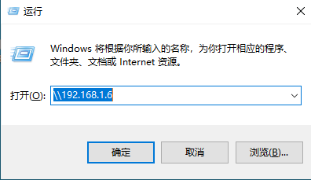
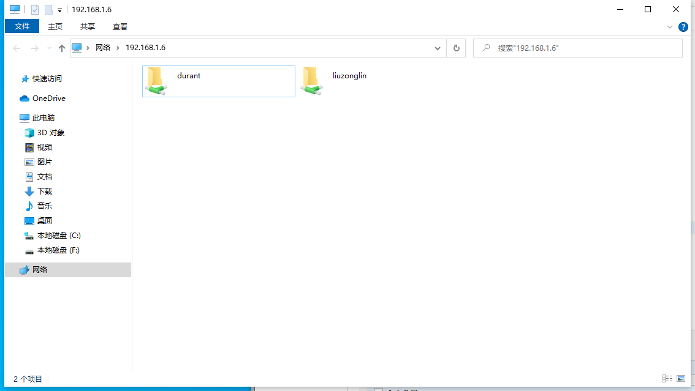

linux自动启动samba,deepin 安装Samba并设置为开机启动：https://blog.csdn.net/weixin_28713299/article/details/116825515


## 安装 samba

```sh
[root@root ~]# cat /etc/redhat-release  # 检查系统版本
[root@root ~]# rpm -qa | grep samba
[root@root ~]# yum install -y samba        # 安装samba
[root@root ~]# rpm -qi samba            # 检测是否安装好
```


## 关闭selinux和防火墙

```sh
[root@root ~]# setenforce 0
[root@root ~]# sed -i 's/SELINUX=enforcing/SELINUX=disabled/' /etc/selinux/config
[root@root ~]# systemctl stop firewalld
[root@root ~]# systemctl disable firewalld
```


## 直接添加samba用户

```sh
[root@root ~]# useradd willy       # 新建共享文件夹的用户willy
[root@root ~]# passwd willy        # 对用户添加密码
```


## 添加liuzonglin账户--》用户是系统已有用户

```sh
[root@root ~]# useradd -d /home/liuzonglin -s /sbin/nologin liuzonglin  # 添加用户
```


## 将liuzonglin添加为samba用户

```sh
[root@root ~]# pdbedit -a -u durant
[root@root ~]# chown -Rf durant:durant /home/durant	# 接着修改samba用户的家目录权限
[root@root ~]# mkdir /home/willy/myshare   # 在用户willy文件夹下新建“myshare”共享文件夹
[root@root ~]# chmod -R 777 /home/willy/myshare/         # 对文件夹设置权限
```


## 配置samba配置文件smb.conf

```sh
# 共享文件夹设置
# 共享文件描述
# 共享路径
# 是否可查看
# 是否可写入
[liuzonglin]    
        comment = Public Stuff    
        path = /usr/local/liuzonglin/   
        browseable = yes   
        writable = yes    


```


## 启动

```sh
[root@root ~]# testparm -s /etc/samba/smb.conf
[root@root ~]# systemctl status smb
```


## windows 连接用户

`Win + R` -> `\\ip`



输入设置的samba账户密码，登录



```sh
[root@root ~]# yum install samba -y
[root@root ~]# systemctl restart smb
[root@root ~]# groupadd -g 888 admin
[root@root ~]# useradd -d /home/admin -g admin admin
[root@root ~]# pdbedit -a admin
[root@root ~]# cp /etc/samba/smb.conf /etc/samba/smb.conf.bak
[root@root ~]# vim /etc/samba/smb.conf
[root@root ~]# mkdir -p /home/share
[root@root ~]# chmod 777 /home/share
[root@root ~]# /usr/sbin/setsebool -P samba_export_all_rw on
[root@root ~]# systemctl restart smb
```


开机自启
`chkconfig --level 3 smb on`

## 参考文档

[https://blog.csdn.net/wc1695040842/article/details/91866500](https://blog.csdn.net/wc1695040842/article/details/91866500)
[https://www.jianshu.com/p/e78c01bbde28](https://www.jianshu.com/p/e78c01bbde28)
[https://jingyan.baidu.com/article/f3ad7d0f2ea14409c2345b69.html](https://jingyan.baidu.com/article/f3ad7d0f2ea14409c2345b69.html)
[https://blog.csdn.net/qianglei6077/article/details/86575224](https://blog.csdn.net/qianglei6077/article/details/86575224)
[https://blog.csdn.net/liuyunshengsir/article/details/89518042](https://blog.csdn.net/liuyunshengsir/article/details/89518042)
[https://blog.csdn.net/doadao/article/details/378900](https://blog.csdn.net/doadao/article/details/378900)
