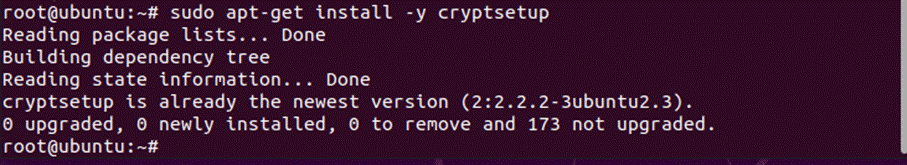

# Ubuntu 制作加密U盘

注：加密后U盘只能在 Linux 系统上使用！

## 加密U盘之前需做的准备

1. 一个普通的空U盘
2. 在 Windows 上安装 VMware

阿里云盘：

「VMware-workstation-full-16.1.2-17966106」永久有效下载链接：[https://www.aliyundrive.com/s/KUN9Ei65fmE](https://www.aliyundrive.com/s/KUN9Ei65fmE)

官网下载地址：

[https://www.vmware.com/cn/products/workstation-pro/workstation-pro-evaluation.html](https://www.vmware.com/cn/products/workstation-pro/workstation-pro-evaluation.html)

下载注意版本号，不然后面无法激活！！！

3. 需要安装 ubuntu 操作系统镜像包

ubuntu-20.04.3-desktop-amd64.iso （*其他版本也可以！！！）

官网下载地址：

https://ubuntu.com/download/desktop

__大概需要15分钟

### 一、安装 VMware

‍

### 二、安装 ubuntu 操作系统

#### 设置中文

### 三、安装

对着桌面鼠标右击

​

sudo su -  按 Enter

​

输入 root 密码 按 Enter

​

切换到 root 用户

sudo apt-get install -y cryptsetup

​

​

安装完成！！！

插入U盘

​

​

​

​

Next ：下一步

​

​

等待一会

​

开锁！

​

​

其他机器使用，只能支持 linux 系统 拔掉U盘插入会需要输入密码。。输入密码可以永久保存密码，也可以零时设置临时密码。这个看个人使用！！！
