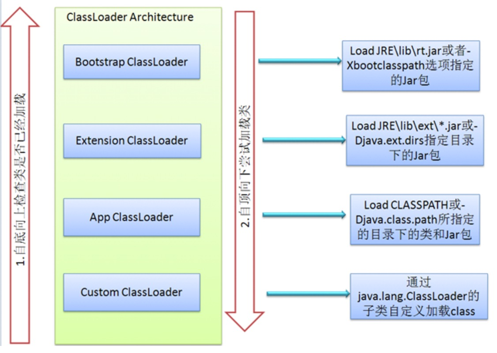

# Class Loader（类加载子系统）

[JVM简介 - 《JVM必知必会》 - 书栈网 · BookStack](https://www.bookstack.cn/read/chinageek-jvm/JVM_jian_jie.md)

# ClassLoader（类加载子系统）如何实现

JVM的类加载是通过ClassLoader及其子类来完成的，类的层次关系和加载顺序可以由下图来描述：

​​

1. Bootstrap ClassLoader负责加载$JAVA_HOME/jre/lib里所有的类库到内存，Bootstrap ClassLoader是JVM级别的，由C++实现，不是ClassLoader的子类，开发者也无法直接获取到启动类加载器的引用，所以不允许直接通过引用进行操作。
2. Extension ClassLoader负责加载java平台中扩展功能的一些jar包，主要是由 sun.misc.Launcher$ExtClassLoader实现的，是一个java类，继承自URLClassLoader超类。它将负责%JRE_HOME/lib/ext目录下的jar和class加载到内存，开发者可以直接使用该加载器。
3. App ClassLoader负责加载环境变量classpath中指定的jar包及目录中class到内存中，开发者也可以直接使用系统类加载器。
4. Custom ClassLoader属于应用程序根据自身需要自定义的ClassLoader(一般为java.lang.ClassLoader的子类)在程序运行期间，通过java.lang.ClassLoader的子类动态加载class文件，体现java动态实时类装入特性，如tomcat、jboss都会根据j2ee规范自行实现ClassLoader。自定义ClassLoader在某些应用场景还是比较适用，特别是需要灵活地动态加载class的时候。

# JVM有哪些类加载器

* 启动类加载器（Bootstrap ClassLoader）：这个类加载器负责将存放在`<JAVA_HOME>\lib`​目录中的，或者被`-Xbootclasspath`​参数所指定的路径中的，并且是虚拟机识别的（仅按照文件名识别，如rt.jar，名字不符合的类库即使放在lib目录中也不会被加载）类库加载到虚拟机内存中。

* 扩展类加载器（Extension ClassLoader）：这个加载器由sun.misc.Launcher$ExtClassLoader实现，它负责加载<JAVA_HOME>\lib\ext目录中的，或者被java.ext.dirs系统变量所指定的路径中的所有类库，开发者可以直接使用扩展类加载器。

* 应用程序类加载器（Application ClassLoader）：这个类加载器由sun.misc.Launcher$AppClassLoader实现。由于这个类加载器是ClassLoader中的getSystemClassLoader()方法的返回值，所以一般也称它为系统类加载器。它负责加载用户类路径（ClassPath）上所指定的类库，开发者可以直接使用这个类加载器，如果应用程序中没有自定义过自己的类加载器，一般情况下这个就是程序中默认的类加载器。

* 自定义类加载器：

# 类装载的执行过程？

类装载分为以下 5 个步骤：

加载：根据查找路径找到相应的 class 文件然后导入；  
检查：检查加载的 class 文件的正确性；  
准备：给类中的静态变量分配内存空间；  
解析：虚拟机将常量池中的符号引用替换成直接引用的过程。符号引用就理解为一个标示，而在直接引用直接指向内存中的地址；  
初始化：对静态变量和静态代码块执行初始化工作。

‍

# 类加载的过程

类加载的过程包括：加载、验证、准备、解析、初始化，其中验证、准备、解析统称为连接。

加载：通过一个类的全限定名来获取定义此类的二进制字节流，在内存中生成一个代表这个类的java.lang.Class对象。

验证：确保Class文件的字节流中包含的信息符合当前虚拟机的要求，并且不会危害虚拟机自身的安全。

准备：为静态变量分配内存并设置静态变量初始值，这里所说的初始值“通常情况”下是数据类型的零值。

解析：将常量池内的符号引用替换为直接引用。

初始化：到了初始化阶段，才真正开始执行类中定义的 Java 初始化程序代码。主要是静态变量赋值动作和静态语句块（static{}）中的语句。

‍

‍
