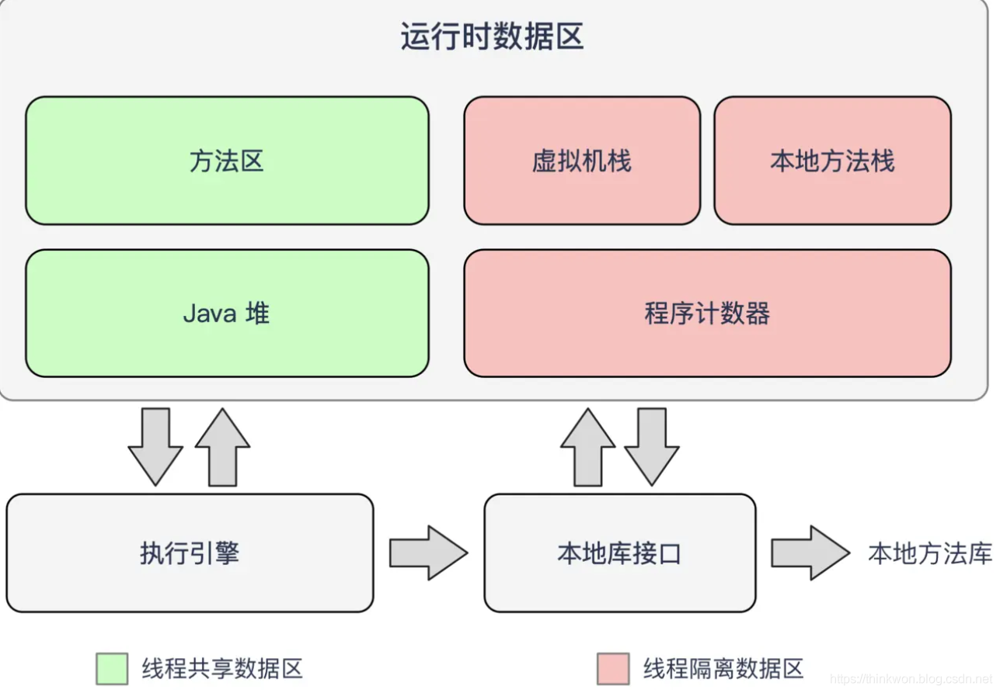

# Runtime data area（运行时数据区）

‍

​

‍

**Java 堆（Java Heap）：**​<u>此内存区域的唯一目的就是</u>​**<u>存放对象实例</u>**​<u>，几乎所有的对象实例都在这里分配内存。</u>这一点在Java虚拟机规范中的描述是：所有的对象实例以及数组都要在堆上分配。

**Java 虚拟机栈（Java Virtual Machine Stacks）：**​<u>是指</u>​**<u>虚拟机栈是用来执行程序的</u>**​<u>。虚拟机栈用于储局部变量表、操作数栈、动态链接、方法出口等信息</u>。局部变量表存放着各种基本数据类型对象引用。方法执行完，自动释放。

**方法区（MethodArea）：**与Java堆一样，是各个线程共享的内存区域，它<u>用于存储已被虚拟机加载的类信息（构造方法、接口定义）、常量、静态变量、线程池、即时编译器编译后的代码（字节码）等数据</u>。方法区是JVM规范中定义的一个概念，具体放在哪里，不同的实现可以放在不同的地方。

**程序计数器（Program Counter Register）：**​<u>当前线程所执行的字节码的行号指示器</u>，字节码解析器的工作是通过改变这个计数器的值，来选取下一条需要执行的字节码指令，分支、循环、跳转、异常处理、线程恢复等基础功能，都需要依赖这个计数器来完成；

**本地方法栈（Native Method Stack）：**与虚拟机栈的作用是一样的，只不过虚拟机栈是服务 Java 方法的，而<u>本地方法栈是为虚拟机调用 Native 方法服务</u>的；

组件的作用：首先<u>通过类加载器（ClassLoader）会把 Java 代码转换成字节码，运行时数据区（Runtime Data Area）再把字节码加载到内存中，而字节码文件只是 JVM 的一套指令集规范，并不能直接交给底层操作系统去执行，因此需要特定的命令解析器执行引擎（Execution Engine），将字节码翻译成底层系统指令，再交由 CPU 去执行，而这个过程中需要调用其他语言的本地库接口（Native Interface）来实现整个程序的功能</u>

`String str = new String("hello");`​  
上面的语句中变量 str 放在栈上，用 new 创建出来的字符串对象放在堆上，而"hello"这个字面量是放在堆中。  

# 深拷贝和浅拷贝

浅拷贝（shallowCopy）只是增加了一个指针指向已存在的内存地址，

深拷贝（deepCopy）是增加了一个指针并且申请了一个新的内存，使这个增加的指针指向这个新的内存，

使用深拷贝的情况下，释放内存的时候不会因为出现浅拷贝时释放同一个内存的错误。

浅复制：仅仅是指向被复制的内存地址，如果原地址发生改变，那么浅复制出来的对象也会相应的改变。

深复制：在计算机中开辟一块**新的内存地址**用于存放复制的对象。

‍
