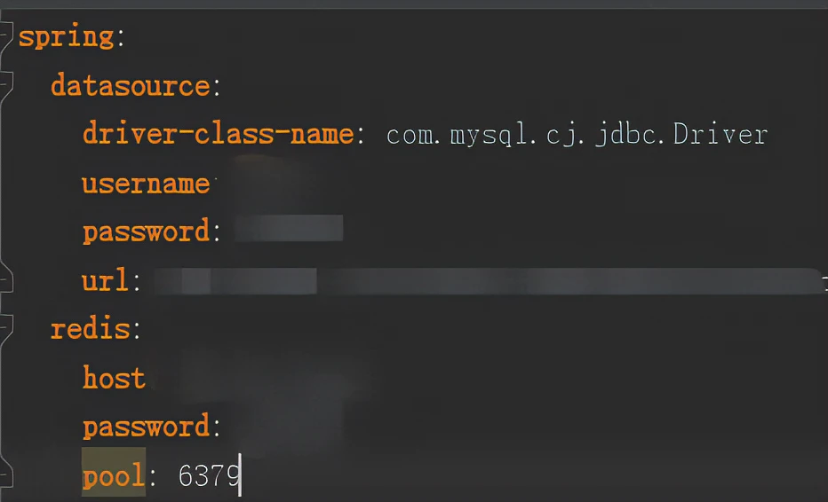
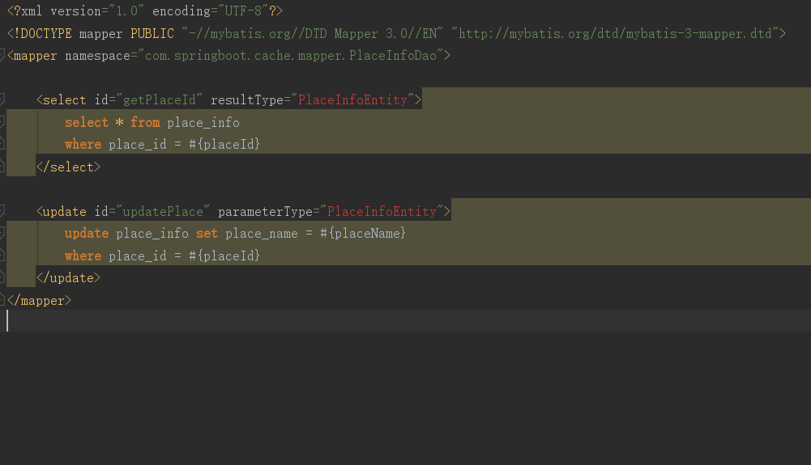
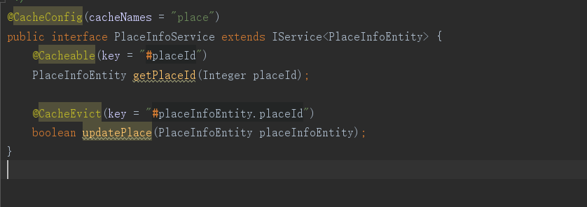
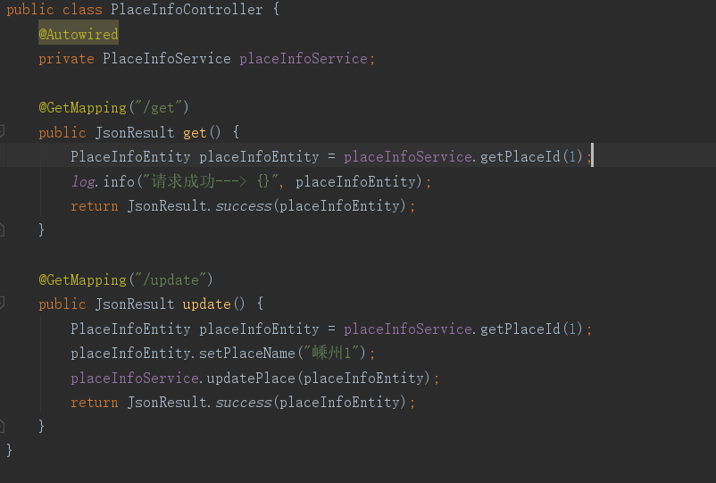
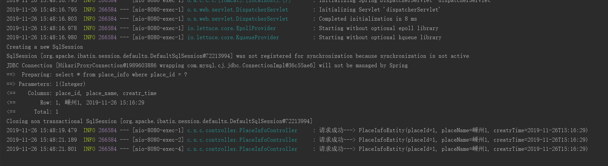
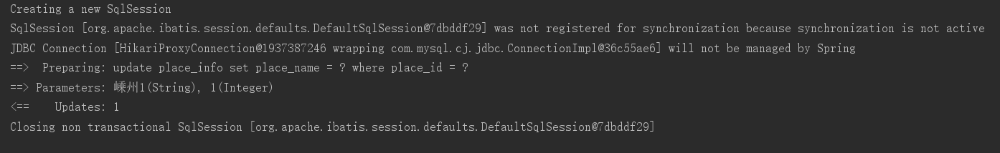

# MybatisPlus Redis

1.简介  
Redis 是完全开源免费的，遵守BSD协议，是一个高性能的key-value数据库。

Redis 与其他 key - value 缓存产品有以下三个特点：

 Redis支持数据的持久化，可以将内存中的数据保存在磁盘中，重启的时候可以再次加载进行使用。  
 Redis不仅仅支持简单的key-value类型的数据，同时还提供list，set，zset，hash等数据结构的存储。  
 Redis支持数据的备份，即master-slave模式的数据备份。

2.优势  
性能极高 – Redis能读的速度是110000次/s,写的速度是81000次/s 。  
丰富的数据类型 – Redis支持二进制案例的 Strings, Lists, Hashes, Sets 及 Ordered Sets 数据类型操作。  
原子 – Redis的所有操作都是原子性的，意思就是要么成功执行要么失败完全不执行。单个操作是原子性的。多个操作也支持事务，即原子性，通过MULTI和EXEC指令包起来。  
丰富的特性 – Redis还支持 publish/subscribe, 通知, key 过期等等特性。  

‍

```shell
<dependency>
	<groupId>org.springframework.boot</groupId>
	<artifactId>spring-boot-starter-data-redis</artifactId>
</dependency>

```

​​

2.在启动类上添加注解：@EnableCaching

3.添加RedisConfig

```shell
package com.springboot.cache.config;

import com.fasterxml.jackson.annotation.JsonAutoDetect;
import com.fasterxml.jackson.annotation.PropertyAccessor;
import com.fasterxml.jackson.databind.ObjectMapper;
import org.springframework.cache.CacheManager;
import org.springframework.cache.annotation.CachingConfigurerSupport;
import org.springframework.cache.annotation.EnableCaching;
import org.springframework.context.annotation.Bean;
import org.springframework.context.annotation.Configuration;
import org.springframework.data.redis.cache.RedisCacheConfiguration;
import org.springframework.data.redis.cache.RedisCacheManager;
import org.springframework.data.redis.connection.RedisConnectionFactory;
import org.springframework.data.redis.core.RedisTemplate;
import org.springframework.data.redis.serializer.Jackson2JsonRedisSerializer;
import org.springframework.data.redis.serializer.StringRedisSerializer;

import java.time.Duration;
import java.util.HashMap;
import java.util.HashSet;
import java.util.Map;
import java.util.Set;

/**
 * @author Csea
 * @title
 * @date 2019/11/26 14:51
 */
@EnableCaching
@Configuration
public class RedisConfig extends CachingConfigurerSupport {
    @Bean
    public RedisTemplate<Object, Object> redisTemplate(RedisConnectionFactory redisConnectionFactory) {
        RedisTemplate<Object, Object> redisTemplate = new RedisTemplate<>();
        redisTemplate.setConnectionFactory(redisConnectionFactory);

        // 使用Jackson2JsonRedisSerialize 替换默认序列化
        @SuppressWarnings("rawtypes")
        Jackson2JsonRedisSerializer jackson2JsonRedisSerializer = new Jackson2JsonRedisSerializer(Object.class);

        ObjectMapper objectMapper = new ObjectMapper();
        objectMapper.setVisibility(PropertyAccessor.ALL, JsonAutoDetect.Visibility.ANY);
        objectMapper.enableDefaultTyping(ObjectMapper.DefaultTyping.NON_FINAL);

        jackson2JsonRedisSerializer.setObjectMapper(objectMapper);

        // 设置value的序列化规则和 key的序列化规则
        redisTemplate.setValueSerializer(jackson2JsonRedisSerializer);
        redisTemplate.setKeySerializer(new StringRedisSerializer());
        redisTemplate.afterPropertiesSet();
        return redisTemplate;
    }

    //缓存管理器
    @Bean
    public CacheManager cacheManager(RedisConnectionFactory lettuceConnectionFactory) {
        RedisCacheConfiguration defaultCacheConfig = RedisCacheConfiguration.defaultCacheConfig();
        // 设置缓存管理器管理的缓存的默认过期时间
        defaultCacheConfig = defaultCacheConfig.entryTtl(Duration.ofMinutes(60))
                // 不缓存空值
                .disableCachingNullValues();

        Set<String> cacheNames = new HashSet<>();
        cacheNames.add("my-redis-cache1");

        // 对每个缓存空间应用不同的配置
        Map<String, RedisCacheConfiguration> configMap = new HashMap<>();
        configMap.put("my-redis-cache1", defaultCacheConfig.entryTtl(Duration.ofMinutes(50)));

        RedisCacheManager cacheManager = RedisCacheManager.builder(lettuceConnectionFactory)
                .cacheDefaults(defaultCacheConfig)
                .initialCacheNames(cacheNames)
                .withInitialCacheConfigurations(configMap)
                .build();
        return cacheManager;
    }
}

```

3.Mapper.xml添加执行Sql

​​

4.在service层配置Cache

​​

5.controller调试

​​

第一次请求时候，因为redis一开始没有数据，所以会从数据库中获取数据并写入到redis中，之后就一直会从缓存中获取数据

​​

当执行了更新操作之后就会去清空redis对应key的数据

​​

在此执行获取数据时，就会再去数据库中获取数据并存入到redis中

4.补充：  
缓存注解：

 @Cacheable、@CacheEvict、@CachePut、@Caching、@CacheConfig

 allEntries属性：boolean类型，表示是否需要清除缓存中的所有元素，默认false，当为true时，Spring Cache将忽略指定的key，这样就可以清除所有的元素缓存。

 beforeInvocation属性：boolean类型，默认false，当为true时，Spring会在调用该方法之前清除缓存中的指定元素。表示的是 是否在方法执行之前就清空缓存，在默认情况下，如果方法执行会抛出异常，就不会清空缓存。

 condition属性：参数的条件，根据设置的条件返回true、false，true时才会去缓存数据。

 unless属性：结果条件，根据结果预先设置的条件判断true、false，true时才存入缓存。

 ①key的策略：

 key属性是用来指定Spring缓存方法的返回结果时对应的key的。该属性支持SpringEL表达式。当我们没有指定该属性时，Spring将使用默认策略生成key。

 自定义策略是指我们可以通过Spring的EL表达式来指定我们的key。这里的EL表达式可以使用方法参数及它们对应的属性。使用方法参数时我们可以直接使用“#参数名”或者“#​p参数index”。  

```shell
@Cacheable(value="Place",key="#placeId")
PlaceInfoEntity getPlaceId(Integer placeId);

@Cacheable(value="Place",key="#p0")
PlaceInfoEntity getPlaceId(Integer placeId);

@Cacheable(value="Place",key="#p0", condition = "#placeId >0",unless = "#result.placeName!=nullValidator")
PlaceInfoEntity getPlaceId(Integer placeId);

@CacheEvict(value="Place",key = "#placeInfoEntity.placeId")
boolean updatePlace(PlaceInfoEntity placeInfoEntity);

@CacheEvict(value="Place",key = "#p0.placeId")
boolean updatePlace(PlaceInfoEntity placeInfoEntity);

@CacheEvict(value="Place",key = "#p0.placeId" condition = "#placeInfoEntity.placeId > 0", unless = "#result.code != 0")
boolean updatePlace(PlaceInfoEntity placeInfoEntity);

```

②root对象的使用：

|属性名称|描述|示例|
| -------------| -----------------------------| ----------------------|
|methodName|当前方法名|#root.methodName|
|method|当前方法|#root.method.name|
|target|当前被调用的对象|#root.target|
|targetClass|当前被调用的对象的Class|#root.targetClass|
|args|当前方法参数组成的数组|#root.args[0]|
|caches|当前被调用的方法使用的Cache|#root.caches[0].name|

‍
