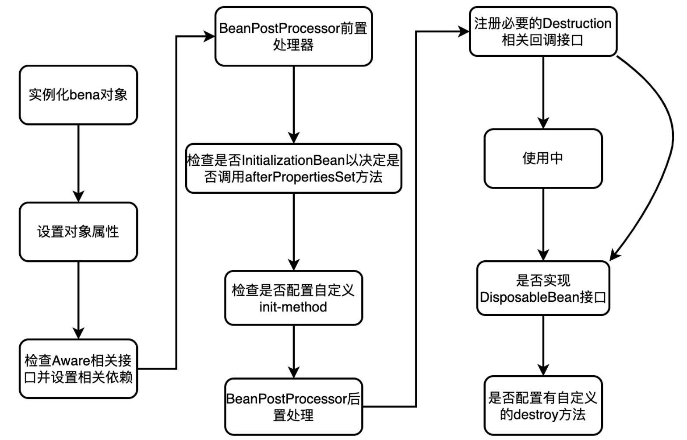

# 说说 Bean 的生命周期

[(29条消息) Spring中bean的生命周期_kykangyuky的博客-CSDN博客](https://blog.csdn.net/kykangyuky/article/details/123114227)

‍

解题思路

得分点 Spring Bean 生命周期的四大部分以及详细步骤

‍

标准回答 

Bean的生命周期主要包括：Bean定义，Bean初始化，Bean生存期，Bean销毁。 

‍

​​

‍

具体步骤如下 

1. Spring 启动，需要查找并加载，Spring 管理的 Bean，进行 Bean 的实例化。

2. Bean实例化后，进行Bean的属性依赖注入。

3.  如果 Bean 实现了 BeanNameAware 接口的话，Spring 将 Bean 的 Id 传递给 setBeanName() 方法去执行

    ```java
    package org.springframework.beans.factory;

    public interface BeanNameAware extends Aware {

    	void setBeanName(String name);

    }

    ```

4. 如果 Bean 实现了 BeanFactoryAware 接口的话，Spring 将调用 setBeanFactory() 方法，将 BeanFactory 的 ioc容器实例传入

    ```java
    package org.springframework.beans.factory;

    import org.springframework.beans.BeansException;
    import org.springframework.beans.factory.BeanFactory;
    import org.springframework.beans.factory.BeanFactoryAware;
    import org.springframework.beans.factory.SmartInitializingSingleton;
    import org.springframework.beans.factory.config.ConfigurableListableBeanFactory;

    @Configuration
    public class CanalGlueAutoConfiguration implements SmartInitializingSingleton, BeanFactoryAware {

        private ConfigurableListableBeanFactory configurableListableBeanFactory;


        @Override
        public void setBeanFactory(BeanFactory beanFactory) throws BeansException {
            this.configurableListableBeanFactory = (ConfigurableListableBeanFactory) beanFactory;
        }

    }

    ```

5. 如果 Bean 实现了ApplicationContextAware 接口的话，Spring 将调用 Bean 的 setApplicationContext() 方法，将 bean 所在应用上下文引用传入进来。

    ```java
    package com.mall4j.cloud.common.util;

    import org.springframework.beans.BeansException;
    import org.springframework.context.ApplicationContext;
    import org.springframework.context.ApplicationContextAware;
    import org.springframework.stereotype.Component;


    @Component
    public class SpringContextUtils implements ApplicationContextAware {

    	public static ApplicationContext applicationContext;

    	@SuppressWarnings("NullableProblems")
    	@Override
    	public void setApplicationContext(ApplicationContext applicationContext) throws BeansException {
    		SpringContextUtils.applicationContext = applicationContext;
    	}

    }

    ```

6. 如果Bean实现了 BeanPostProcessor 接口，Spring 就将调用他们的 postProcessBeforeInitialization() 方法。

    ```java
    package org.springframework.beans.factory.config;

    import org.springframework.beans.BeansException;
    import org.springframework.lang.Nullable;


    public interface BeanPostProcessor {

    	@Nullable
    	default Object postProcessBeforeInitialization(Object bean, String beanName) throws BeansException {
    		return bean;
    	}

    	@Nullable
    	default Object postProcessAfterInitialization(Object bean, String beanName) throws BeansException {
    		return bean;
    	}

    }

    ```

7. 如果 Bean 实现了 InitializingBean 接口,Spring将调用他们的afterPropertiesSet()方法。类似的,如果bean使用init-method声明了初始化方法,该方法也会被调用

    ```java
    package com.mall4j.cloud.biz.config;

    import org.springframework.beans.factory.InitializingBean;
    import org.springframework.beans.factory.annotation.Autowired;
    import org.springframework.stereotype.Component;


    @Component
    public class MinioTemplate implements InitializingBean {

        @Autowired
        private OssConfig ossConfig;

        private MinioClient minioClient;

        static  final Logger logger = LoggerFactory.getLogger(MinioTemplate.class);

        @Override
        public void afterPropertiesSet() throws Exception {
            this.minioClient =  MinioClient.builder().endpoint(ossConfig.getEndpoint())
                    .credentials(ossConfig.getAccessKeyId(), ossConfig.getAccessKeySecret())
                    .build();
        }

    }

    ```

8. 如果 Bean 实现了BeanPostProcessor接口,Spring就将调用他们的postProcessAfterInitialization()方法。

    ```java
    package org.springframework.beans.factory.config;

    import org.springframework.beans.BeansException;
    import org.springframework.lang.Nullable;


    public interface BeanPostProcessor {

    	@Nullable
    	default Object postProcessBeforeInitialization(Object bean, String beanName) throws BeansException {
    		return bean;
    	}

    	@Nullable
    	default Object postProcessAfterInitialization(Object bean, String beanName) throws BeansException {
    		return bean;
    	}

    }

    ```

9. 此时，Bean已经准备就绪,可以被应用程序使用了。他们将一直驻留在应用上下文中,直到应用上下文被销毁。

10. 如果 Bean 实现了 DisposableBean 接口，Spring 将调用它的destory()接口方法,同样,如果bean使用了destory() 声明销毁方法,该方法也会被调用。

     ```java
     package org.springframework.beans.factory;

     public interface DisposableBean {

     	void destroy() throws Exception;

     }

     ```

‍

加分回答 

这个过程是由Spring容器自动管理的,其中有两个环节我们可以进行干预。 

1. 我们可以自定义初始化方法,并在该方法前增加@PostConstruct注解,届时Spring容器将在调用SetBeanFactory方法之后调用该方法。 

2. 我们可以自定义销毁方法,并在该方法前增加@PreDestroy注解,届时Spring容器将在自身销毁前,调用这个方法。

‍

‍

具体流程如下：

1，spring启动，查找并加载所需的Bean，然后初始化。

2，进行Bean的属性依赖注入。

3，如果Bean实现了BeanNameAware接口（@Resource，@Qualifier），spring会将Bean的Id传入SetBeanName方法去执行。

4，如果Bean实现了BeanFactoryAware接口，spring会调用Bean的setBeanFactory方法将BeanFactory的ioc容器传入。

5，如果Bean实现的时ApplicationContextAware接口的话，Spring会调用Bean的setApplicationContext将Bean应用的上下文传入进来。

6，还一些其他的设定例如使用@PostContruct来定义Bean在初始化时执行的方法，或者使用@PreDestory来定义Ioc容器被销毁时执行的方法等。

‍
