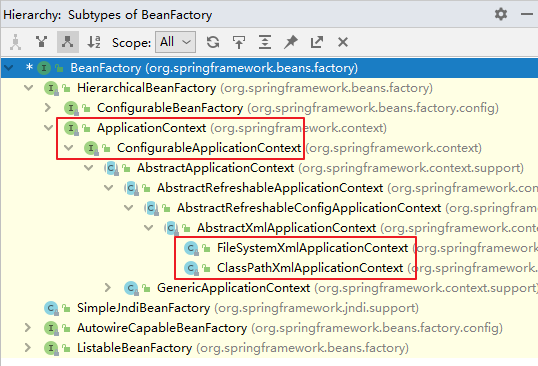

# IoC

---

**IoC简介：**IoC 是 <u>*Inversion of Control*</u> 的简写，译为“控制反转”，它不是一门技术，而是一种设计思想，是一个重要的面向对象编程法则，能够指导我们如何设计出松耦合、更优良的程序。Spring 通过 IoC 容器来管理所有 Java 对象的实例化和初始化，控制对象与对象之间的依赖关系。我们将由 IoC 容器管理的 Java 对象称为 Spring Bean，它与使用关键字 new 创建的 Java 对象没有任何区别。IoC 容器是 Spring 框架中最重要的核心组件之一，它贯穿了 Spring 从诞生到成长的整个过程。

**IOC概念：**「控制反转」和「注入依赖」，将对象的创建、初始化、销毁等一系列的生命周期过程交给 spring 容器来管理 protyle-html @Component、@Service、@RepositorySpring IOC 解决的是「对象管理」和「对象依赖」的问题；本来是我们自己手动new出来的对象，现在则把对象交给Spring的IOC容器管理；IOC容器可以理解为一个对象工厂，我们都把该对象交给工厂，工厂管理这些对象的创建以及依赖关系；对象无需自行创建或者管理它的依赖关系，依赖关系将被「自动注入」到需要它们的对象当中去

**Spring IOC有什么好处：**主要的好处在于「将对象集中统一管理」并且「降低耦合度」比如说：我用Spring IOC 可以方便 单元测试、对象创建复杂、对象依赖复杂、单例等等的，什么都可以交给Spring IOC理论上自己new出来的都可以解决上面的问题，Spring在各种场景组合下有可能不是最优解但new出来的你要自己管理，可能你得自己写工厂，得实现一大套的东西才能满足需求写着写着有可能还是Spring的那一套。

​

**控制反转：（IoC）**把原有自己掌控的事交给别人去处理，它更多的是一种思想或者可以理解为设计模式；比如：本来由我们自己new出来的对象，现在交由IOC容器，把对象的控制权交给它方了。

* 控制反转是一种思想。
* 控制反转是为了降低程序耦合度，提高程序扩展力。
* 控制反转，反转的是什么？

  * 将对象的创建权利交出去，交给第三方容器负责。

  * 将对象和对象之间关系的维护权交出去，交给第三方容器负责。
* 控制反转这种思想如何实现呢？

  * DI 是 <u>*Dependency Injection*</u> 的简写：依赖注入

**依赖注入：**​<u>*Dependency Injection*</u> 的简写：依赖注入，依赖注入实现了控制反转的思想。指Spring创建对象的过程中，将对象依赖属性通过配置进行注入。

**依赖注入实现方式：**

* set注入
* 构造注入

**所以结论是：**IOC 就是一种控制反转的思想， 而 DI 是对IoC的一种具体实现。

**IoC容器在Spring的实现：**Spring 的 IoC 容器就是 IoC思想的一个落地的产品实现。IoC容器中管理的组件也叫做 bean。在创建 bean 之前，首先需要创建IoC 容器。Spring 提供了IoC 容器的两种实现方式：

1. **BeanFactory：**这是 IoC 容器的基本实现，是 Spring 内部使用的接口。面向 Spring 本身，不提供给开发人员使用。

2. **ApplicationContext：**BeanFactory 的子接口，提供了更多高级特性。面向 Spring 的使用者，几乎所有场合都使用 ApplicationContext 而不是底层的 BeanFactory。

3. **ApplicationContext的主要实现类**

    ​

|类型名|简介|
| ---------------------------------| -------------------------------------------------------------------------------------------------------------------------------|
|ClassPathXmlApplicationContext|通过读取类路径下的 XML 格式的配置文件创建 IOC 容器对象|
|FileSystemXmlApplicationContext|通过文件系统路径读取 XML 格式的配置文件创建 IOC 容器对象|
|ConfigurableApplicationContext|ApplicationContext 的子接口，包含一些扩展方法 refresh() 和 close() ，让 ApplicationContext 具有启动、关闭和刷新上下文的能力。|
|WebApplicationContext|专门为 Web 应用准备，基于 Web 环境创建 IOC 容器对象，并将对象引入存入 ServletContext 域中。|

**bean的作用域**

**概念：**在Spring中，bean可以被定义为两种模式：prototype（多例）和singleton（单例）

singleton（单例）：只有一个共享的实例存在，所有对这个bean的请求都会返回这个唯一的实例。  
prototype（多例）：对这个bean的每次请求都会创建一个新的bean实例，类似于new。

Spring bean默认是单例模式。

在Spring中可以通过配置bean标签的scope属性来指定bean的作用域范围，各取值含义参加下表：

|取值|含义|创建对象的时机|
| :------------------| :----------------------------------------| :----------------|
|singleton（默认）|在IOC容器中，这个bean的对象始终为单实例|IOC容器初始化时|
|prototype|这个bean在IOC容器中有多个实例|获取bean时|

如果是在WebApplicationContext环境下还会有另外几个作用域（但不常用）：

|取值|含义|
| ---------| ----------------------|
|request|在一个请求范围内有效|
|session|在一个会话范围内有效|

‍

**bean生命周期：具体的生命周期过程**

* bean对象创建（调用无参构造器）
* 给bean对象设置属性
* bean的后置处理器（初始化之前）
* bean对象初始化（需在配置bean时指定初始化方法）
* bean的后置处理器（初始化之后）
* bean对象就绪可以使用
* bean对象销毁（需在配置bean时指定销毁方法）
* IOC容器关闭

**管理Bean方式：**

‍
