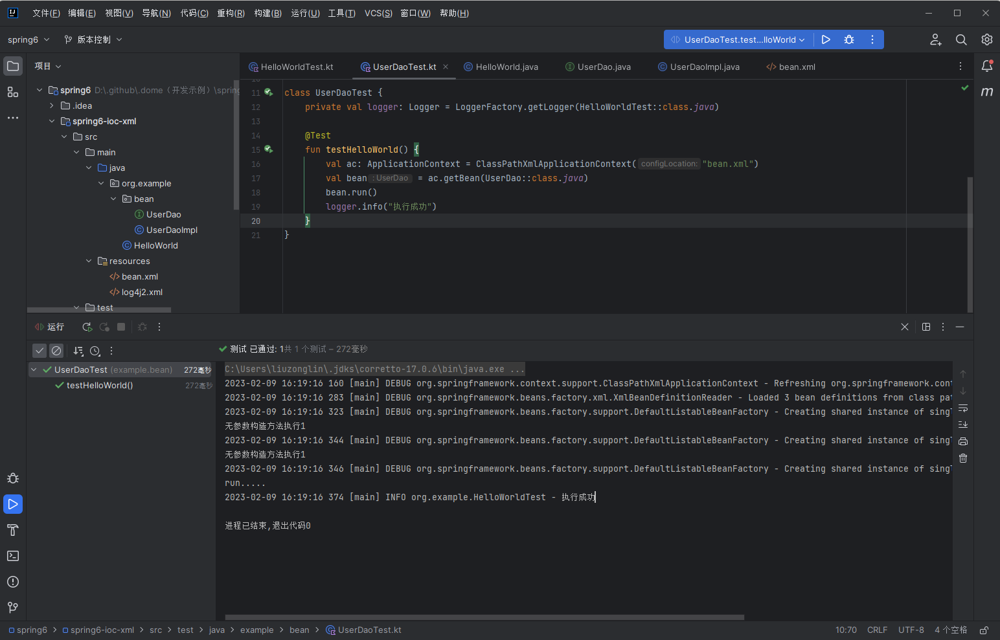
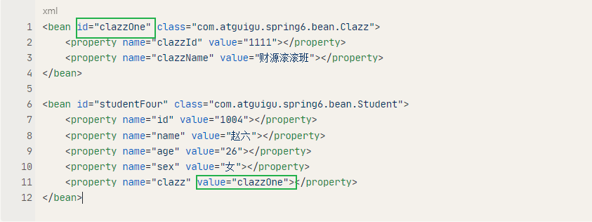
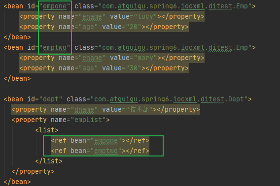

# 基于XML管理Bean

‍

#### 搭建子模块spring6-ioc-xml

1. **搭建模块**

    搭建方式如：spring-first

2. **引入配置文件**

    引入spring-first模块配置文件：beans.xml、log4j2.xml

3. **添加依赖**

    ```xml
    <dependencies>
        <!--spring context依赖-->
        <!--当你引入Spring Context依赖之后，表示将Spring的基础依赖引入了-->
        <dependency>
            <groupId>org.springframework</groupId>
            <artifactId>spring-context</artifactId>
            <version>6.0.3</version>
        </dependency>

        <!--junit5测试-->
        <dependency>
            <groupId>org.junit.jupiter</groupId>
            <artifactId>junit-jupiter-api</artifactId>
            <version>5.3.1</version>
        </dependency>

        <!--log4j2的依赖-->
        <dependency>
            <groupId>org.apache.logging.log4j</groupId>
            <artifactId>log4j-core</artifactId>
            <version>2.19.0</version>
        </dependency>
        <dependency>
            <groupId>org.apache.logging.log4j</groupId>
            <artifactId>log4j-slf4j2-impl</artifactId>
            <version>2.19.0</version>
        </dependency>
    </dependencies>
    ```

4. **引入java类**

    引入spring-first模块java及test目录下实体类

    ```java
    package com.atguigu.spring6.bean;

    public class HelloWorld {

        public HelloWorld() {
            System.out.println("无参数构造方法执行");
        }

        public void sayHello(){
            System.out.println("helloworld");
        }
    }

    ```

    ```java
    package com.atguigu.spring6.bean;

    import org.junit.jupiter.api.Test;
    import org.slf4j.Logger;
    import org.slf4j.LoggerFactory;
    import org.springframework.context.ApplicationContext;
    import org.springframework.context.support.ClassPathXmlApplicationContext;

    public class HelloWorldTest {

        private Logger logger = LoggerFactory.getLogger(HelloWorldTest.class);

        @Test
        public void testHelloWorld(){

        }
    }
    ```

    ‍

#### 实验一：获取bean

##### 方式一：根据id获取

由于 id 属性指定了 bean 的唯一标识，所以根据 bean 标签的 id 属性可以精确获取到一个组件对象。上个实验中我们使用的就是这种方式。

##### 方式二：根据类型获取

```java
@Test
public void testHelloWorld1(){
    ApplicationContext ac = new ClassPathXmlApplicationContext("beans.xml");
    HelloWorld bean = ac.getBean(HelloWorld.class);
    bean.sayHello();
}
```

##### 方式三：根据id和类型

java

```java
@Test
public void testHelloWorld2(){
    ApplicationContext ac = new ClassPathXmlApplicationContext("beans.xml");
    HelloWorld bean = ac.getBean("helloworld", HelloWorld.class);
    bean.sayHello();
}
```

Kotlin

```kotlin
package org.example

import org.junit.jupiter.api.Test
import org.slf4j.Logger
import org.slf4j.LoggerFactory
import org.springframework.context.ApplicationContext
import org.springframework.context.support.ClassPathXmlApplicationContext


class HelloWorldTest {

    private val logger: Logger = LoggerFactory.getLogger(HelloWorldTest::class.java)

    @Test
    fun testHelloWorld() {
        val ac: ApplicationContext = ClassPathXmlApplicationContext("bean.xml")
        val bean = ac.getBean("helloWorld", HelloWorld::class.java)
        bean.sayHello()
        logger.info("执行成功")
    }
}

```

##### 注意的地方

当根据类型获取bean时，要求IOC容器中指定类型的bean有且只能有一个

当IOC容器中一共配置了两个：

```xml
    <bean id="helloWorld" class="org.example.HelloWorld"/>
    <bean id="helloWorld1" class="org.example.HelloWorld"/>
```

根据类型获取时会抛出异常：

```cmd
org.springframework.beans.factory.NoUniqueBeanDefinitionException: No qualifying bean of type 'org.example.HelloWorld' available: expected single matching bean but found 2: helloWorld,helloWorld1
```

##### 扩展知识

如果组件类实现了接口，根据接口类型可以获取 bean 吗？

* 实现案例

  定义接口

  ```java
  public interface UserDao {
      public void run();
  }
  ```

  实现类

  ```java
  public class UserDaoImpl implements UserDao{
      @Override
      public void run() {
          System.out.println("run.....");
      }
  }
  ```

  bean.xml

  ```xml
      <bean id="userDaoImpl" class="org.example.bean.UserDaoImpl"/>
  ```

  测试

  ```kotlin
  package example.bean

  import org.example.HelloWorldTest
  import org.example.bean.UserDao
  import org.junit.jupiter.api.Test
  import org.slf4j.Logger
  import org.slf4j.LoggerFactory
  import org.springframework.context.ApplicationContext
  import org.springframework.context.support.ClassPathXmlApplicationContext

  class UserDaoTest {
      private val logger: Logger = LoggerFactory.getLogger(HelloWorldTest::class.java)

      @Test
      fun testHelloWorld() {
          val ac: ApplicationContext = ClassPathXmlApplicationContext("bean.xml")
  	// 通过接口获取
          val bean = ac.getBean(UserDao::class.java)
          bean.run()
          logger.info("执行成功")
      }
  }
  ```

  执行结果

  ​​

> 可以，前提是bean唯一

<u>如果一个接口有多个实现类，这些实现类都配置了 bean，根据接口类型可以获取 bean 吗？</u>

> 不行，因为bean不唯一

**结论**

根据类型来获取bean时，在满足bean唯一性的前提下，其实只是看：『对象 **instanceof** 指定的类型』的返回结果，只要返回的是true就可以认定为和类型匹配，能够获取到。

java中，instanceof运算符用于判断前面的对象是否是后面的类，或其子类、实现类的实例。如果是返回true，否则返回false。也就是说：用instanceof关键字做判断时， instanceof 操作符的左右操作必须有继承或实现关系

‍

‍

#### 实验二：依赖注入之setter注入

**①创建学生类Student**

```java
package com.atguigu.spring6.bean;

public class Student {

    private Integer id;

    private String name;

    private Integer age;

    private String sex;

    public Student() {
    }

    public Integer getId() {
        return id;
    }

    public void setId(Integer id) {
        this.id = id;
    }

    public String getName() {
        return name;
    }

    public void setName(String name) {
        this.name = name;
    }

    public Integer getAge() {
        return age;
    }

    public void setAge(Integer age) {
        this.age = age;
    }

    public String getSex() {
        return sex;
    }

    public void setSex(String sex) {
        this.sex = sex;
    }

    @Override
    public String toString() {
        return "Student{" +
                "id=" + id +
                ", name='" + name + '\'' +
                ", age=" + age +
                ", sex='" + sex + '\'' +
                '}';
    }

}
```

原生注入方式：

```kotlin
    @Test
    fun testHelloWorld() {

        // set方法注入
        val book = Book()
        book.bname = "java"
        book.author = "尚硅谷"

        // 通过构造器注入
        val book1 = Book("c++", "尚硅谷")
    }
```

‍

**②配置bean时为属性赋值**

spring-di.xml

```xml
<bean id="studentOne" class="com.atguigu.spring6.bean.Student">
    <!-- property标签：通过组件类的 set?()方法 给组件对象设置属性 -->
    <!-- name属性：指定属性名（这个属性名是 get?()、set?()方法 定义的，和成员变量无关） -->
    <!-- value属性：指定属性 注入值 -->
    <property name="id" value="1001"></property>
    <property name="name" value="张三"></property>
    <property name="age" value="23"></property>
    <property name="sex" value="男"></property>
</bean>
```

**③测试**

```java
@Test
public void testDIBySet(){
    ApplicationContext ac = new ClassPathXmlApplicationContext("spring-di.xml");
    Student studentOne = ac.getBean("studentOne", Student.class);
    System.out.println(studentOne);
}
```

```kotlin
    @Test
    fun test1() {
        val ac: ApplicationContext = ClassPathXmlApplicationContext("bean-di.xml")
        val bean = ac.getBean("book", Book::class.java)
        println(bean)
        logger.info("注入成功")
    }
```

#### 实验三：依赖注入之构造器注入

**①在Student类中**​**`添加有参构造`**​

```java
    public Book(String bname, String author) {
        System.out.println("有参数构造执行了...");
        this.bname = bname;
        this.author = author;
    }
```

**②配置bean**

spring-di.xml

```xml
    <bean id="book" class="org.example.di.Student">
        <constructor-arg name="bname" value="1002"></constructor-arg>
        <constructor-arg index="1" value="李四"></constructor-arg>
    </bean>
```

注意：

​`<constructor-arg>`​ 标签还有两个属性可以进一步描述构造器参数：

* index属性：**指定参数所在位置的索引（从0开始）**​`Book(String bname, String author)`​ 0， 1
* name属性：指定参数名

‍

**③测试**

```java
@Test
public void testDIByConstructor(){
    ApplicationContext ac = new ClassPathXmlApplicationContext("spring-di.xml");
    Student studentOne = ac.getBean("studentTwo", Student.class);
    System.out.println(studentOne);
}
```

#### 实验四：特殊值处理

##### 字面量赋值

* 什么是字面量？

  int a = 10;

  声明一个变量a，初始化为10，此时a就不代表字母a了，而是作为一个变量的名字。当我们引用a的时候，我们实际上拿到的值是10。

  而如果a是带引号的：'a'，那么它现在不是一个变量，它就是代表a这个字母本身，这就是字面量。所以字面量没有引申含义，就是我们看到的这个数据本身。

  ```xml
  <!-- 使用value属性给bean的属性赋值时，Spring会把value属性的值看做字面量 -->
  <property name="name" value="张三"/>
  ```

##### null值

```xml
<property name="name">
    <null />
</property>
```

* 注意：错误写法

  ```xml
  <property name="name" value="null"></property>
  ```

  以上写法，为 name 所赋的值是字符串 null

##### xml实体

```xml
<!-- 小于号在XML文档中用来定义标签的开始，不能随便使用 -->
<!-- 解决方案一：使用XML实体来代替 -->
<property name="expression" value="a &lt; b"/>
```

##### CDATA节

```xml
<property name="expression">
    <!-- 解决方案二：使用CDATA节 -->
    <!-- CDATA中的C代表Character，是文本、字符的含义，CDATA就表示纯文本数据 -->
    <!-- XML解析器看到CDATA节就知道这里是纯文本，就不会当作XML标签或属性来解析 -->
    <!-- 所以CDATA节中写什么符号都随意 -->
    <value><![CDATA[a < b]]></value>
</property>
```

#### 实验五：为对象类型属性赋值

* **前期工作**

  **创建类 Dept**

  ```java
  package org.example.ditest;

  import java.util.List;

  //部门类
  public class Dept {

      //一个部门有很多员工
      private List<Emp> empList;

      private String dname;

      public String getDname() {
          return dname;
      }
      public void setDname(String dname) {
          this.dname = dname;
      }

      public List<Emp> getEmpList() {
          return empList;
      }

      public void setEmpList(List<Emp> empList) {
          this.empList = empList;
      }

      public void info() {
          System.out.println("部门名称："+dname);
          for (Emp emp:empList) {
              System.out.println(emp.getEname());
          }
      }
  }
  ```

  **在 Emp 类中添加以下代码：**

  ```java
  package org.example.ditest;

  import java.util.Arrays;

  //员工类
  public class Emp {

      //对象类型属性：员工属于某个部门
      private Dept dept;
      //员工名称
      private String ename;
      //员工年龄
      private Integer age;

      //爱好
      private String[] loves;

      public void work() {
          System.out.println(ename+"emp work....."+age);
          dept.info();
          System.out.println(Arrays.toString(loves));
      }

      public String[] getLoves() {
          return loves;
      }
      public void setLoves(String[] loves) {
          this.loves = loves;
      }
      public Dept getDept() {
          return dept;
      }
      public void setDept(Dept dept) {
          this.dept = dept;
      }
      public String getEname() {
          return ename;
      }
      public void setEname(String ename) {
          this.ename = ename;
      }
      public Integer getAge() {
          return age;
      }
      public void setAge(Integer age) {
          this.age = age;
      }
  }
  ```

  ‍

##### 方式一：引用外部bean

配置Clazz类型的bean：bean-ditest.xml

```xml
    <!--
    第一种方式：引入外部bean
        1 创建两个类对象：dept 和 emp
        2 在emp的bean标签里面，使用property引入dept的bean
    -->
    <bean id="dept1" class="org.example.ditest.Dept">
        <property name="dname" value="安保部"></property>
    </bean>

    <bean id="emp" class="org.example.ditest.Emp">
        <!--注入对象类型属性
            private Dept dept;
        -->
        <property name="dept" ref="dept1"></property>
        <!--普通属性注入-->
        <property name="ename" value="lucy"></property>
        <property name="age" value="50"></property>
    </bean>
```

测试

```kotlin
    @Test
    fun testHelloWorld() {
        val ac: ApplicationContext = ClassPathXmlApplicationContext("bean-ditest.xml")
        val bean = ac.getBean("emp", Emp::class.java)
        println(bean)
        logger.info("执行成功")
    }
```

* 错误演示：

  ​​

  如果错把ref属性写成了value属性，会抛出异常：

  ​`Caused by: java.lang.IllegalStateException: Cannot convert value of type 'java.lang.String' to required type 'com.atguigu.spring6.bean.Clazz' for property 'clazz': no matching editors or conversion strategy found`​

  意思是不能把 String 类型转换成我们要的Clazz类型，说明我们使用value属性时，Spring只把这个属性看做一个普通的字符串，不会认为这是一个bean的id，更不会根据它去找到bean来赋值

##### 方式二：内部bean

```xml
    <!--第二种方式 内部bean注入-->
    <bean id="emp2" class="org.example.ditest.Emp">
        <!--普通属性注入-->
        <property name="ename" value="mary"></property>
        <property name="age" value="20"></property>
        <!--内部bean-->
        <property name="dept">
            <bean id="dept2" class="org.example.ditest.Dept">
                <property name="dname" value="财务部"></property>
            </bean>
        </property>
    </bean>
```

测试：

```kotlin
    @Test
    fun testHelloWorld() {
        val ac: ApplicationContext = ClassPathXmlApplicationContext("bean-ditest.xml")
        val bean = ac.getBean("emp2", Emp::class.java)
        println(bean)
    }
```

* **bean 标签 class 路径报错**

​`org.springframework.beans.factory.CannotLoadBeanClassException: Cannot find class [com.atguigu.spring6.iocxml.ditest.Emp] for bean with name 'emp2' defined in class path resource [bean-ditest.xml]`​

##### 方式三：级联属性赋值

```xml
    <!--第三种方式 级联赋值-->
    <bean id="dept3" class="org.example.ditest.Dept">
        <property name="dname" value="技术研发部"></property>
    </bean>

    <bean id="emp3" class="org.example.ditest.Emp">
        <property name="ename" value="tom"></property>
        <property name="age" value="30"></property>
        <property name="dept" ref="dept3"></property>
        <property name="dept.dname" value="测试部"></property>
    </bean>
```

测试：

```kotlin
    @Test
    fun testHelloWorld() {
        val ac: ApplicationContext = ClassPathXmlApplicationContext("bean-ditest.xml")
        val bean = ac.getBean("emp3", Emp::class.java)
        println(bean)
    }
```

#### 实验六：为数组类型属性赋值

**②配置bean**

```xml
    <!--数组类型属性-->
    <bean id="dept" class="org.example.ditest.Dept">
        <property name="dname" value="技术部"></property>
    </bean>
    <bean id="emp" class="org.example.ditest.Emp">
        <!--普通属性-->
        <property name="ename" value="lucy"></property>
        <property name="age" value="20"></property>
        <!--对象类型属性-->
        <property name="dept" ref="dept"></property>
        <!--数组类型属性-->
        <property name="loves">
            <array>
                <value>吃饭</value>
                <value>睡觉</value>
                <value>敲代码</value>
            </array>
        </property>
    </bean>
```

#### 实验七：为集合类型属性赋值

##### 为List集合类型属性赋值

在Clazz类中添加以下代码：

```java
private List<Student> students;

public List<Student> getStudents() {
    return students;
}

public void setStudents(List<Student> students) {
    this.students = students;
}
```

配置bean：

```xml
<bean id="clazzTwo" class="com.atguigu.spring6.bean.Clazz">
    <property name="clazzId" value="4444"></property>
    <property name="clazzName" value="Javaee0222"></property>
    <property name="students">
        <list>
            <ref bean="studentOne"></ref>
            <ref bean="studentTwo"></ref>
            <ref bean="studentThree"></ref>
        </list>
    </property>
</bean>
```

若为Set集合类型属性赋值，只需要将其中的list标签改为set标签即可

​`<ref>`​ 引入其他 bean

##### 为Map集合类型属性赋值

创建教师类Teacher：

```java
package com.atguigu.spring6.bean;
public class Teacher {

    private Integer teacherId;

    private String teacherName;

    public Integer getTeacherId() {
        return teacherId;
    }

    public void setTeacherId(Integer teacherId) {
        this.teacherId = teacherId;
    }

    public String getTeacherName() {
        return teacherName;
    }

    public void setTeacherName(String teacherName) {
        this.teacherName = teacherName;
    }

    public Teacher(Integer teacherId, String teacherName) {
        this.teacherId = teacherId;
        this.teacherName = teacherName;
    }

    public Teacher() {

    }
  
    @Override
    public String toString() {
        return "Teacher{" +
                "teacherId=" + teacherId +
                ", teacherName='" + teacherName + '\'' +
                '}';
    }
}
```

在Student类中添加以下代码：

```java
private Map<String, Teacher> teacherMap;

public Map<String, Teacher> getTeacherMap() {
    return teacherMap;
}

public void setTeacherMap(Map<String, Teacher> teacherMap) {
    this.teacherMap = teacherMap;
}
```

配置bean：

```xml
<bean id="teacherOne" class="com.atguigu.spring6.bean.Teacher">
    <property name="teacherId" value="10010"></property>
    <property name="teacherName" value="大宝"></property>
</bean>

<bean id="teacherTwo" class="com.atguigu.spring6.bean.Teacher">
    <property name="teacherId" value="10086"></property>
    <property name="teacherName" value="二宝"></property>
</bean>

<bean id="studentFour" class="com.atguigu.spring6.bean.Student">
    <property name="id" value="1004"></property>
    <property name="name" value="赵六"></property>
    <property name="age" value="26"></property>
    <property name="sex" value="女"></property>
    <!-- ref属性：引用IOC容器中某个bean的id，将所对应的bean为属性赋值 -->
    <property name="clazz" ref="clazzOne"></property>
    <property name="hobbies">
        <array>
            <value>抽烟</value>
            <value>喝酒</value>
            <value>烫头</value>
        </array>
    </property>
    <property name="teacherMap">
        <map>
            <entry>
                <key>
                    <value>10010</value>
                </key>
                <ref bean="teacherOne"></ref>
            </entry>
            <entry>
                <key>
                    <value>10086</value>
                </key>
                <ref bean="teacherTwo"></ref>
            </entry>
        </map>
    </property>
</bean>
```

##### 引用集合类型的bean

```xml
<!--list集合类型的bean-->
<util:list id="students">
    <ref bean="studentOne"></ref>
    <ref bean="studentTwo"></ref>
    <ref bean="studentThree"></ref>
</util:list>
<!--map集合类型的bean-->
<util:map id="teacherMap">
    <entry>
        <key>
            <value>10010</value>
        </key>
        <ref bean="teacherOne"></ref>
    </entry>
    <entry>
        <key>
            <value>10086</value>
        </key>
        <ref bean="teacherTwo"></ref>
    </entry>
</util:map>
<bean id="clazzTwo" class="com.atguigu.spring6.bean.Clazz">
    <property name="clazzId" value="4444"></property>
    <property name="clazzName" value="Javaee0222"></property>
    <property name="students" ref="students"></property>
</bean>
<bean id="studentFour" class="com.atguigu.spring6.bean.Student">
    <property name="id" value="1004"></property>
    <property name="name" value="赵六"></property>
    <property name="age" value="26"></property>
    <property name="sex" value="女"></property>
    <!-- ref属性：引用IOC容器中某个bean的id，将所对应的bean为属性赋值 -->
    <property name="clazz" ref="clazzOne"></property>
    <property name="hobbies">
        <array>
            <value>抽烟</value>
            <value>喝酒</value>
            <value>烫头</value>
        </array>
    </property>
    <property name="teacherMap" ref="teacherMap"></property>
</bean>
```

> 使用util:list、util:map标签必须引入相应的命名空间
>
> ```xml
> <?xml version="1.0" encoding="UTF-8"?>
> <beans xmlns="http://www.springframework.org/schema/beans"
>        xmlns:xsi="http://www.w3.org/2001/XMLSchema-instance"
>        xmlns:util="http://www.springframework.org/schema/util"
>        xsi:schemaLocation="http://www.springframework.org/schema/util
>        http://www.springframework.org/schema/util/spring-util.xsd
>        http://www.springframework.org/schema/beans
>        http://www.springframework.org/schema/beans/spring-beans.xsd">
> ```

#### 实验八：p命名空间

引入p命名空间

```xml
<?xml version="1.0" encoding="UTF-8"?>
<beans xmlns="http://www.springframework.org/schema/beans"
       xmlns:xsi="http://www.w3.org/2001/XMLSchema-instance"
       xmlns:util="http://www.springframework.org/schema/util"
       xmlns:p="http://www.springframework.org/schema/p"
       xsi:schemaLocation="http://www.springframework.org/schema/util
       http://www.springframework.org/schema/util/spring-util.xsd
       http://www.springframework.org/schema/beans
       http://www.springframework.org/schema/beans/spring-beans.xsd">
```

引入p命名空间后，可以通过以下方式为bean的各个属性赋值

```xml
<bean id="studentSix" class="com.atguigu.spring6.bean.Student"
    p:id="1006" p:name="小明" p:clazz-ref="clazzOne" p:teacherMap-ref="teacherMap">
</bean>
```

#### 实验九：引入外部属性文件

**①加入依赖**

```xml
 <!-- MySQL驱动 -->
<dependency>
    <groupId>mysql</groupId>
    <artifactId>mysql-connector-java</artifactId>
    <version>8.0.30</version>
</dependency>

<!-- 数据源 -->
<dependency>
    <groupId>com.alibaba</groupId>
    <artifactId>druid</artifactId>
    <version>1.2.15</version>
</dependency>
```

**②创建外部属性文件**​**`jdbc.properties`**​

​​

```properties
jdbc.user=root
jdbc.password=atguigu
jdbc.url=jdbc:mysql://localhost:3306/ssm?serverTimezone=UTC
jdbc.driver=com.mysql.cj.jdbc.Driver
```

**③引入属性文件**

引入context 名称空间

```xml
<?xml version="1.0" encoding="UTF-8"?>
<beans xmlns="http://www.springframework.org/schema/beans"
       xmlns:xsi="http://www.w3.org/2001/XMLSchema-instance"
       xmlns:context="http://www.springframework.org/schema/context"
       xsi:schemaLocation="http://www.springframework.org/schema/beans
       http://www.springframework.org/schema/beans/spring-beans.xsd
       http://www.springframework.org/schema/context
       http://www.springframework.org/schema/context/spring-context.xsd">

</beans>
```

```xml
<!-- 引入外部属性文件 -->
<context:property-placeholder location="classpath:jdbc.properties"/>
```

注意：在使用 [context:property-placeholder](context:property-placeholder) 元素加载外包配置文件功能前，首先需要在 XML 配置的一级标签 protyle-html 中添加 context 相关的约束。

**④配置bean**

```xml
<bean id="druidDataSource" class="com.alibaba.druid.pool.DruidDataSource">
    <property name="url" value="${jdbc.url}"/>
    <property name="driverClassName" value="${jdbc.driver}"/>
    <property name="username" value="${jdbc.user}"/>
    <property name="password" value="${jdbc.password}"/>
</bean>
```

**⑤测试**

```java
@Test
public void testDataSource() throws SQLException {
    ApplicationContext ac = new ClassPathXmlApplicationContext("spring-datasource.xml");
    DataSource dataSource = ac.getBean(DataSource.class);
    Connection connection = dataSource.getConnection();
    System.out.println(connection);
}
```

#### 实验十：bean的作用域

**①概念**

在Spring中，bean可以被定义为两种模式：prototype（多例）和singleton（单例）

singleton（单例）：只有一个共享的实例存在，所有对这个bean的请求都会返回这个唯一的实例。  
prototype（多例）：对这个bean的每次请求都会创建一个新的bean实例，类似于new。

Spring bean默认是单例模式。

在Spring中可以通过配置bean标签的scope属性来指定bean的作用域范围，各取值含义参加下表：

|取值|含义|创建对象的时机|
| :-----------------: | :---------------------------------------: | :---------------: |
|singleton（默认）|在IOC容器中，这个bean的对象始终为单实例|IOC容器初始化时|
|prototype|这个bean在IOC容器中有多个实例|获取bean时|

如果是在WebApplicationContext环境下还会有另外几个作用域（但不常用）：

|取值|含义|
| ---------| ----------------------|
|request|在一个请求范围内有效|
|session|在一个会话范围内有效|

‍

**②创建类User**

```java
package com.atguigu.spring6.bean;


public class User {

    private Integer id;

    private String username;

    private String password;

    private Integer age;

    public User() {
    }

    public User(Integer id, String username, String password, Integer age) {
        this.id = id;
        this.username = username;
        this.password = password;
        this.age = age;
    }

    public Integer getId() {
        return id;
    }

    public void setId(Integer id) {
        this.id = id;
    }

    public String getUsername() {
        return username;
    }

    public void setUsername(String username) {
        this.username = username;
    }

    public String getPassword() {
        return password;
    }

    public void setPassword(String password) {
        this.password = password;
    }

    public Integer getAge() {
        return age;
    }

    public void setAge(Integer age) {
        this.age = age;
    }

    @Override
    public String toString() {
        return "User{" +
                "id=" + id +
                ", username='" + username + '\'' +
                ", password='" + password + '\'' +
                ", age=" + age +
                '}';
    }
}
```

**③配置bean**

```xml
<!-- scope属性：取值singleton（默认值），bean在IOC容器中只有一个实例，IOC容器初始化时创建对象 -->
<!-- scope属性：取值prototype，bean在IOC容器中可以有多个实例，getBean()时创建对象 -->
<bean class="com.atguigu.spring6.bean.User" scope="prototype"></bean>
```

**④测试**

```java
    @Test
    fun testBeanScope() {
        val ac: ApplicationContext = ClassPathXmlApplicationContext("bean.xml")
        val user1 = ac.getBean(User::class.java)
        val user2 = ac.getBean(User::class.java)
        println(user1.hashCode())
        println(user2.hashCode())
        println(user1.equals(user2))
    }
```

#### 实验十一：bean生命周期

**①具体的生命周期过程**

* bean对象创建（调用无参构造器）
* 给bean对象设置属性
* bean的后置处理器（初始化之前）
* bean对象初始化（需在配置bean时指定初始化方法）
* bean的后置处理器（初始化之后）
* bean对象就绪可以使用
* bean对象销毁（需在配置bean时指定销毁方法）
* IOC容器关闭

**②修改类User**

```java
public class User {

    private Integer id;

    private String username;

    private String password;

    private Integer age;

    public User() {
        System.out.println("生命周期：1、创建对象");
    }

    public User(Integer id, String username, String password, Integer age) {
        this.id = id;
        this.username = username;
        this.password = password;
        this.age = age;
    }

    public Integer getId() {
        return id;
    }

    public void setId(Integer id) {
        System.out.println("生命周期：2、依赖注入");
        this.id = id;
    }

    public String getUsername() {
        return username;
    }

    public void setUsername(String username) {
        this.username = username;
    }

    public String getPassword() {
        return password;
    }

    public void setPassword(String password) {
        this.password = password;
    }

    public Integer getAge() {
        return age;
    }

    public void setAge(Integer age) {
        this.age = age;
    }

    public void initMethod(){
        System.out.println("生命周期：3、初始化");
    }

    public void destroyMethod(){
        System.out.println("生命周期：5、销毁");
    }

    @Override
    public String toString() {
        return "User{" +
                "id=" + id +
                ", username='" + username + '\'' +
                ", password='" + password + '\'' +
                ", age=" + age +
                '}';
    }
}
```

注意其中的 `initMethod()`​ 和 `destroyMethod()`​ ，可以通过配置 bean 指定为初始化和销毁的方法

**③配置bean**

```xml
<!-- 使用init-method属性指定初始化方法 -->
<!-- 使用destroy-method属性指定销毁方法 -->
<bean class="com.atguigu.spring6.bean.User" scope="prototype" init-method="initMethod" destroy-method="destroyMethod">
    <property name="id" value="1001"></property>
    <property name="username" value="admin"></property>
    <property name="password" value="123456"></property>
    <property name="age" value="23"></property>
</bean>
```

**④测试**

```java
@Test
public void testLife(){
    ClassPathXmlApplicationContext ac = new ClassPathXmlApplicationContext("spring-lifecycle.xml");
    User bean = ac.getBean(User.class);
    System.out.println("生命周期：4、通过IOC容器获取bean并使用");
    ac.close();
}
```

**⑤bean的后置处理器**

bean 的后置处理器会在生命周期的初始化前后添加额外的操作，需要实现 `BeanPostProcessor`​ 接口，且配置到 IoC 容器中，需要注意的是，bean 后置处理器不是单独针对某一个 bean 生效，而是针对 IoC 容器中所有 bean 都会执行

创建 bean 的后置处理器：

```java
package com.atguigu.spring6.process;
  
import org.springframework.beans.BeansException;
import org.springframework.beans.factory.config.BeanPostProcessor;

public class MyBeanProcessor implements BeanPostProcessor {
  
    @Override
    public Object postProcessBeforeInitialization(Object bean, String beanName) throws BeansException {
        System.out.println("☆☆☆" + beanName + " = " + bean);
        return bean;
    }
  
    @Override
    public Object postProcessAfterInitialization(Object bean, String beanName) throws BeansException {
        System.out.println("★★★" + beanName + " = " + bean);
        return bean;
    }
}
```

在IOC容器中配置后置处理器：

```xml
<!-- bean的后置处理器要放入IOC容器才能生效 -->
<bean id="myBeanProcessor" class="com.atguigu.spring6.process.MyBeanProcessor"/>
```

#### 实验十二：FactoryBean

**①简介**

FactoryBean 是 Spring 提供的一种整合第三方框架的常用机制。和普通的 bean 不同，配置一个 FactoryBean 类型的 bean，在获取bean的时候得到的并不是class属性中配置的这个类的对象，而是 `getObject()`​ 方法的返回值。通过这种机制，Spring 可以帮我们把复杂组件创建的详细过程和繁琐细节都屏蔽起来，只把最简洁的使用界面展示给我们。

将来我们整合Mybatis时，Spring就是通过 FactoryBean 机制来帮我们创建 SqlSessionFactory 对象的。

```java
package org.springframework.beans.factory;

import org.springframework.lang.Nullable;


public interface FactoryBean<T> {

    String OBJECT_TYPE_ATTRIBUTE = "factoryBeanObjectType";

    @Nullable
    T getObject() throws Exception;

    @Nullable
    Class<?> getObjectType();

    default boolean isSingleton() {
        return true;
    }
}
```

**②创建类UserFactoryBean**

```java
package com.atguigu.spring6.bean;
public class UserFactoryBean implements FactoryBean<User> {
    @Override
    public User getObject() throws Exception {
        return new User();
    }

    @Override
    public Class<?> getObjectType() {
        return User.class;
    }
}
```

**③配置bean**

```xml
<bean id="user" class="com.atguigu.spring6.bean.UserFactoryBean"></bean>
```

**④测试**

```java
@Test
public void testUserFactoryBean(){
    // 获取IOC容器
    ApplicationContext ac = new ClassPathXmlApplicationContext("spring-factorybean.xml");
    User user = (User) ac.getBean("user");	// 返回对象是由 FactoryBean<User> 决定的
    System.out.println(user);
}
```

#### 实验十三：基于xml自动装配

> 自动装配：
>
> 根据指定的策略，在 IoC 容器中匹配某一个 bean，自动为指定的 bean 中所依赖的类类型或接口类型属性赋值

**①场景模拟**

创建类 UserController

```java
package com.atguigu.spring6.autowire.controller
public class UserController {

    private UserService userService;

    public void setUserService(UserService userService) {
        this.userService = userService;
    }

    public void saveUser(){
        userService.saveUser();
    }

}
```

创建接口UserService

```java
package com.atguigu.spring6.autowire.service
public interface UserService {

    void saveUser();

}
```

创建类UserServiceImpl实现接口UserService

```java
package com.atguigu.spring6.autowire.service.impl
public class UserServiceImpl implements UserService {

    private UserDao userDao;

    public void setUserDao(UserDao userDao) {
        this.userDao = userDao;
    }

    @Override
    public void saveUser() {
        userDao.saveUser();
    }

}
```

创建接口UserDao

```java
package com.atguigu.spring6.autowire.dao
public interface UserDao {

    void saveUser();

}
```

创建类UserDaoImpl实现接口UserDao

```java
package com.atguigu.spring6.autowire.dao.impl
public class UserDaoImpl implements UserDao {

    @Override
    public void saveUser() {
        System.out.println("保存成功");
    }

}
```

**②配置bean**

使用 bean 标签的 `autowire`​ 属性设置自动装配效果

* 根据类型自动装配：`byType`​

  byType：根据类型匹配 IoC 容器中的某个兼容类型的 bean，为属性自动赋值

  <u>若在 IoC 中，没有任何一个兼容类型的 bean 能够为属性赋值，则该属性不装配，即值为默认值 null</u>

  <u>若在 IoC 中，有多个兼容类型的 bean 能够为属性赋值，则抛出异常 ​</u>​<u>`NoUniqueBeanDefinitionException`</u>​

  ```xml
  <bean id="userController" class="com.atguigu.spring6.autowire.controller.UserController" autowire="byType"></bean>

  <bean id="userService" class="com.atguigu.spring6.autowire.service.impl.UserServiceImpl" autowire="byType"></bean>

  <bean id="userDao" class="com.atguigu.spring6.autowire.dao.impl.UserDaoImpl"></bean>
  ```

* 根据名称自动装配：`byName`​

  byName：将自动装配的属性的属性名，作为 bean 的 id 在 IoC 容器中匹配相对应的 bean 进行赋值

  ```xml
  <bean id="userController" class="com.atguigu.spring6.autowire.controller.UserController" autowire="byName"></bean>

  <bean id="userService" class="com.atguigu.spring6.autowire.service.impl.UserServiceImpl" autowire="byName"></bean>
  <bean id="userServiceImpl" class="com.atguigu.spring6.autowire.service.impl.UserServiceImpl" autowire="byName"></bean>

  <bean id="userDao" class="com.atguigu.spring6.autowire.dao.impl.UserDaoImpl"></bean>
  <bean id="userDaoImpl" class="com.atguigu.spring6.autowire.dao.impl.UserDaoImpl"></bean>
  ```

**③测试**

```java
@Test
public void testAutoWireByXML(){
    ApplicationContext ac = new ClassPathXmlApplicationContext("autowire-xml.xml");
    UserController userController = ac.getBean(UserController.class);
    userController.saveUser();
}
```
