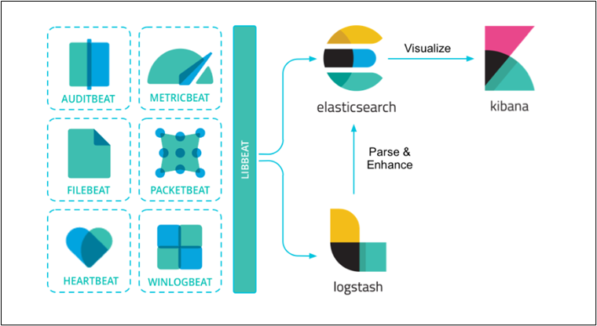
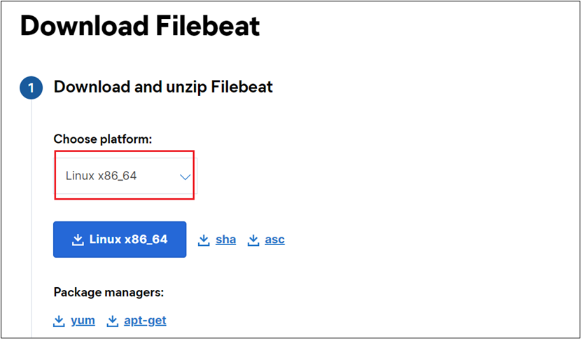
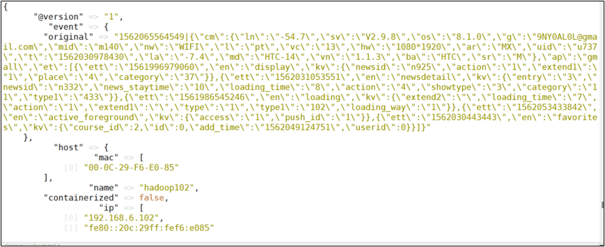
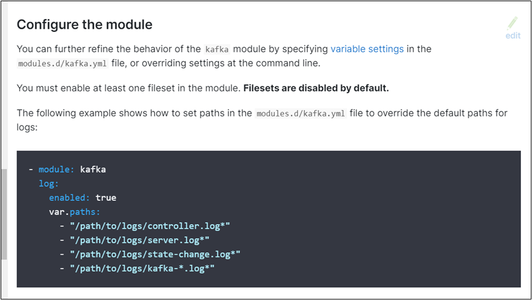
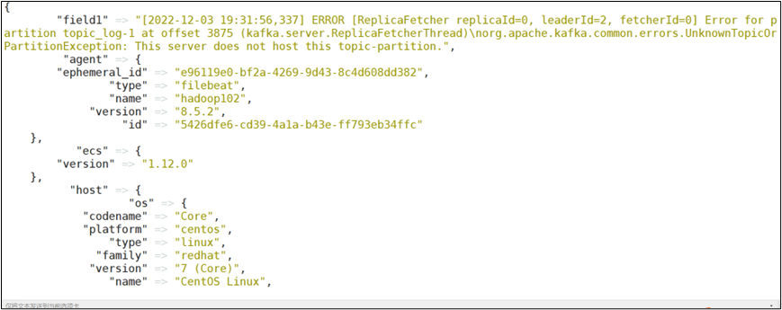
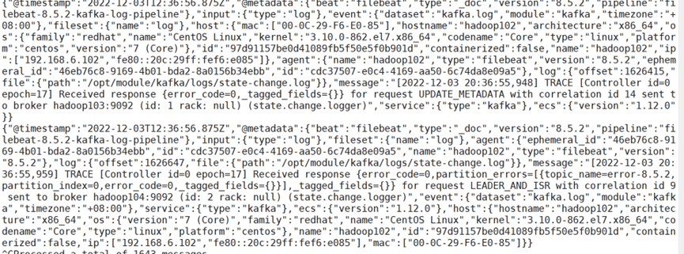

# Filebeat

# 第1章 Filebeat 基本概念

## 1.1 简介

Filebeat是一种轻量型日志采集器，内置有多种模块（auditd、Apache、NGINX、System、MySQL 等等），可针对常见格式的日志大大简化收集、解析和可视化过程，只需一条命令即可。之所以能实现这一点，是因为它将自动默认路径（因操作系统而异）与 Elasticsearch 采集节点管道的定义和 Kibana 仪表板组合在一起。不仅如此，数个 Filebeat 模块还包括预配置的 Machine Learning 任务。另一点需要声明的是：根据采集的数据形式不同，形成了由多个模块组成的Beats。Beats是开源数据传输程序集，可以将其作为代理安装在服务器上，将操作数据发送给Elasticsearch，或者通过Logstash，在Kibana中可视化数据之前，在Logstash中进一步处理和增强数据。

Beats组成模块如下：

|**日志格式**|**采集所需组件框架**|
| --| -------------------------------|
|**Audit data**|[Auditbeat](https://www.elastic.co/products/beats/auditbeat)(轻量型审计日志采集器)|
|**Log files**|[Filebeat](https://www.elastic.co/products/beats/filebeat)（轻量型日志采集器）|
|**Availability**|[Heartbeat](https://www.elastic.co/products/beats/heartbeat)(轻量型运行时间监控采集器)|
|**Metrics**|[Metricbeat](https://www.elastic.co/products/beats/metricbeat)(轻量型指标采集器)|
|**Network traffic**|[Packetbeat](https://www.elastic.co/products/beats/packetbeat)(轻量型网络数据采集器)|
|**Windows event logs**|[Winlogbeat](https://www.elastic.co/products/beats/winlogbeat)(轻量型Windows事件日志采集器)|

Beat日志采集流程图：

​​

## 1.2 Filebeat特点

（1）轻量型日志采集器，占用资源更少，对机器配置要求极低。

（2）操作简便，可将采集到的日志信息直接发送到 ES 集群、Logstash、Kafka 集群等消息队列中。

（3）异常中断重启后会继续上次停止的位置。（通过 `${filebeat_home}\data\registry`​ 文件来记录日志的偏移量）。

（4）使用压力敏感协议（backpressure-sensitive）来传输数据，在 logstash 忙的时候，Filebeat 会减慢读取-传输速度，一旦 logstash 恢复，则 Filebeat 恢复原来的速度。

（5）Filebeat带有内部模块（auditd，Apache，Nginx，System和MySQL），可通过一个指定命令来简化通用日志格式的收集，解析和可视化。

​`bin/logstash -e 'input { stdin{} } output { stdout{} }'`​

‍

## 1.3 Filebeat与Logstash对比

（1）Filebeat 是轻量级数据托运者，您可以在服务器上将其作为代理安装，以将特定类型的操作数据发送到 Elasticsearch。与 Logstash 相比，其占用空间小，使用的系统资源更少。

（2）Logstash 具有更大的占用空间，但提供了大量的输入，过滤和输出插件，用于收集，丰富和转换来自各种来源的数据。

（3）Logstash 是使用 Java 编写，插件是使用 jruby 编写，对机器的资源要求会比较高。在采集日志方面，对 CPU、内存上都要比 Filebeat 高很多。

‍

‍

# 第2章Filebeat安装

Filebeat本身对机器性能要求不高，所以对机器性能无需过多关注。加之，其采集数据后采用的Http请求发送的数据，所以对运行环境也无过多要求，因此在部署Filebeat时，我们应过多的关注其它组件的部署问题。

## 2.1 安装地址

（1）Filebeat官网地址

[https://www.elastic.co/cn/products/beats/filebeat](https://www.elastic.co/cn/products/beats/filebeat)

（2）安装包下载地址

[https://www.elastic.co/cn/downloads/beats/filebeat](https://www.elastic.co/cn/downloads/beats/filebeat)

​​

## 2.2 Filebeat部署安装

（1）基于Linux系统解压filebeat-8.5.2-linux-x86_64.tar.gz到linux的/opt/software目录下

‍

```shell
[atguigu@hadoop102 software]$ tar -zxvf filebeat-8.5.2-linux-x86_64.tar.gz -C /opt/module/
[atguigu@hadoop102 module]$ mv filebeat-8.5.2-linux-x86_64/ filebeat
```

（2）进入filebeat，指定监控日志的输入输出路径。

‍

```shell
[atguigu@hadoop102 filebeat]$ vim filebeat.yml

# filestream is an input for collecting log messages from files.
- type: filestream

  # Unique ID among all inputs, an ID is required.
  id: my-filestream-id

  # Change to true to enable this input configuration.
  enabled: true

  # Paths that should be crawled and fetched. Glob based paths.
  paths:
    - /opt/module/log/*.log 

```

## 2.3 Logstash部署安装

‍

（1）[基于]()Linux系统解压logstash-8.5.2-linux-x86_64.tar.gz到linux的/opt/software目录下

```shell
[atguigu@hadoop102 software]$ tar -zxvf logstash-8.5.2-linux-x86_64.tar.gz -C /opt/module
[atguigu@hadoop102 module]$ mv logstash-8.5.2/ logstash
```

注意：logstash在使用的时候单独配置运行文件。

# 第3章Filebeat实战

## 3.1 对接Logstash

（1）创建文件夹加job编写数据采集文件：filebeat_to_logstash.conf文件

```shell
[atguigu@hadoop102 logstash]$ mkdir job
[atguigu@hadoop102 job]$  vim filebeat_to_logstash.conf

#本次采用的数据为数仓项目中的模拟数据
#1562065564549|{"cm":{"ln":"-54.7","sv":"V2.9.8","os":"8.1.0","g":"9NY0AL0L@gmail.com","mid":"m140","nw":"WIFI","l":"pt","vc":"13","hw":"1080*1920","ar":"MX","uid":"u737","t":"1562030978430","la":"-7.4","md":"HTC-14","vn":"1.1.3","ba":"HTC","sr":"M"},"ap":"gmall","et":[{"ett":"1561996979060","en":"display","kv":{"newsid":"n925","action":"1","extend1":"1","place":"4","category":"37"}},{"ett":"1562031053551","en":"newsdetail","kv":{"entry":"3","newsid":"n332","news_staytime":"10","loading_time":"8","action":"4","showtype":"3","category":"11","type1":"433"}},{"ett":"1561986545246","en":"loading","kv":{"extend2":"","loading_time":"7","action":"1","extend1":"","type":"1","type1":"102","loading_way":"1"}},{"ett":"1562053433842","en":"active_foreground","kv":{"access":"1","push_id":"1"}},{"ett":"1562030443443","en":"favorites","kv":{"course_id":2,"id":0,"add_time":"1562049124751","userid":0}}]}
input {
  beats {
    port=>5044
    codec=>plain{
        charset=>"GBK"
    }
  }
}
filter {
        mutate{
        split=>["message","|"]
                add_field => {
                        "field1" => "%{[message][0]}"
                }
                add_field => {
                        "field2" => "%{[message][1]}"
                }
                remove_field => ["message"]
        }
        json{
                source => "field2"
                target => "field2"
        }
}
#输出数据到控制台
output{
       stdout{
               codec=>rubydebug
      }
}

```

（2）对配置文件进行测试，打印数据到控制台（测试需要多个窗口，最好不要后台执行）。

```shell
[atguigu@hadoop102 filebeat]$ ./filebeat
[atguigu@hadoop102 logstash]$ bin/logstash -f job/filebeat_to_logstash.conf

```

​​

## 3.2 Filebeat模块使用

（1）官方提供了封装完整的框架日志监控

拿kafka为例，使用对应的module可以直接实现对kafka日志的监控

​​

（2）修改Filebeat配置文件filebeat.yml

```shell
[atguigu@hadoop102 filebeat]$ vim filebeat.yml

# ==================== Filebeat modules ======================

filebeat.config.modules:
  # Glob pattern for configuration loading
  path: /opt/module/filebeat/modules.d/*.yml

  # Set to true to enable config reloading
  reload.enabled: true

  # Period on which files under path should be checked for changes
  #reload.period: 10s

```

（3）修改kafka对应的module配置文件

```shell
[atguigu@hadoop102 filebeat]$ cd modules.d/
[atguigu@hadoop102 modules.d]$ mv kafka.yml.disabled kafka.yml
[atguigu@hadoop102 modules.d]$ vim kafka.yml

- module: kafka
  # All logs
  log:
    enabled: true

    # Set custom paths for Kafka. If left empty,
    # Filebeat will look under /opt.
    #var.kafka_home:

    # Set custom paths for the log files. If left empty,
    # Filebeat will choose the paths depending on your OS.
    var.paths:
     - "/opt/module/kafka/logs/controller.log*"
     - "/opt/module/kafka/logs/server.log*"
     - "/opt/module/kafka/logs/state-change.log*"
     - "/opt/module/kafka/logs/kafka-*.log*"
```

（4）重启Filebeat和logstash

```shell
[atguigu@hadoop102 filebeat]$ ./filebeat -e
[atguigu@hadoop102 logstash]$ bin/logstash -f job/filebeat_to_logstash.conf

```

​​

## 3.3 对接ES

ElasticSearch 的安装使用参考以下文档和尚硅谷对应课程：

（1）修改Filebeat配置文件

```shell
output.elasticsearch:
  # Array of hosts to connect to.
  hosts: ["hadoop102:9200"]

  # Protocol - either `http` (default) or `https`.
  #protocol: "https"

  # Authentication credentials - either API key or username/password.
  #api_key: "id:api_key"
  #username: "elastic"
  #password: "changeme"
  #通过判断数据中包含的字符串 可以分流数据
  #通过语法%{}可以调用元数据信息和特殊信息
#error-8.5.2-2022-12-02
  indices:
    - index: "warning"
      when.contains:
        message: "WARN"
    - index: "error-%{[agent.version]}-%{+yyyy.MM.dd}"
      when.contains:
        message: "ERR"
    - index: "info"
      when.contains:
        message: "INFO"

```

（2）启动ES

```shell
[atguigu@hadoop102 elasticsearch]$ bin/elasticsearch
```

（3）重启kafka发送数据

```shell
[atguigu@hadoop102 elasticsearch]$ kf.sh stop
[atguigu@hadoop102 elasticsearch]$ kf.sh start

```

（4）查询发送的数据

```shell
[atguigu@hadoop102 elasticsearch]$ curl http://hadoop102:9200/info
```

​​

## 3.4 对接kafka

Filebeat也可以直接将数据发送到Kafka：

（1）修改Filebeat配置文件

```shell
output.kafka:
  hosts: ["hadoop102:9092"]
  topic: "logs"
  topics:
    - topic: "critical-%{[agent.version]}"
      when.contains:
        message: "CRITICAL"
    - topic: "error-%{[agent.version]}"
      when.contains:
        message: "ERR"
    - topic: "info"
      when.contains:
        message: "INFO"

```

（2）启动kafka消费者接收数据

```shell
[atguigu@hadoop102 kafka]$ kafka-console-consumer.sh --bootstrap-server hadoop102:9092 --topic logs
```

（3）重启filebeat

```shell
[atguigu@hadoop102 filebeat]$ ./filebeat -e
```

（4）观察kafka接收到的数据

​​

‍
