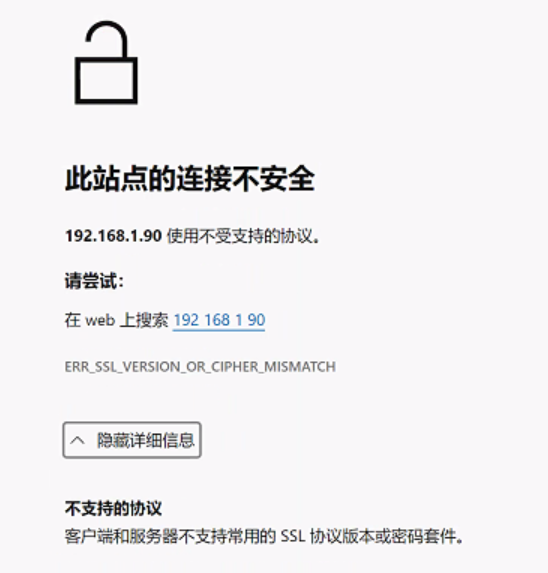

# 客户端和服务器不支持常用的 SSL 协议版本或密码套件

### 问题

现在最新版的谷歌，Edge浏览器不支持1.2以下



### 项目部署 tomcat 修改问题修改方法

```
    <!-- Define a SSL HTTP/1.1 Connector on port 8443
         This connector uses the BIO implementation that requires the JSSE
         style configuration. When using the APR/native implementation, the
         OpenSSL style configuration is required as described in the APR/native
         documentation -->
    
	<Connector port="4443" protocol="org.apache.coyote.http11.Http11NioProtocol"
               maxThreads="150"
               scheme="https" secure="true" SSLEnabled="true"
               clientAuth="false" sslProtocol="TLS"
               keystoreFile="${catalina.home}/conf/server.keystore"
               keystorePass="changeit" 
			   URIEncoding="UTF-8"
			   sslEnabledProtocols="TLSv1.3,TLSv1.2"	# 支持协议ssl版本 sslEnabledProtocols="TLSv1.3,TLSv1.2"
			      />

    <!-- Define an AJP 1.3 Connector on port 8009 -->
	<!--
    <Connector port="8009" protocol="AJP/1.3" redirectPort="8443" />-->
```
