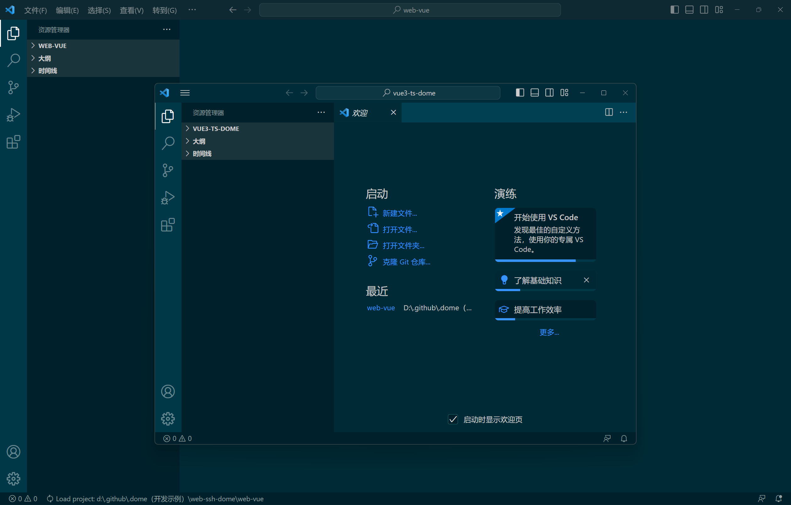

# vscode

[你被vscode的这个小特性困扰过吗？_哔哩哔哩_bilibili](https://www.bilibili.com/video/BV1uG4y1S7Uf/?spm_id_from=333.999.0.0&vd_source=9bfc54d2ed901f1eab04708cc346c2f5)

打开一个项目

文件 -> 打开最近的文件 -> `Ctrl + 鼠标左键`​ 即可打开新窗口

​​

‍
