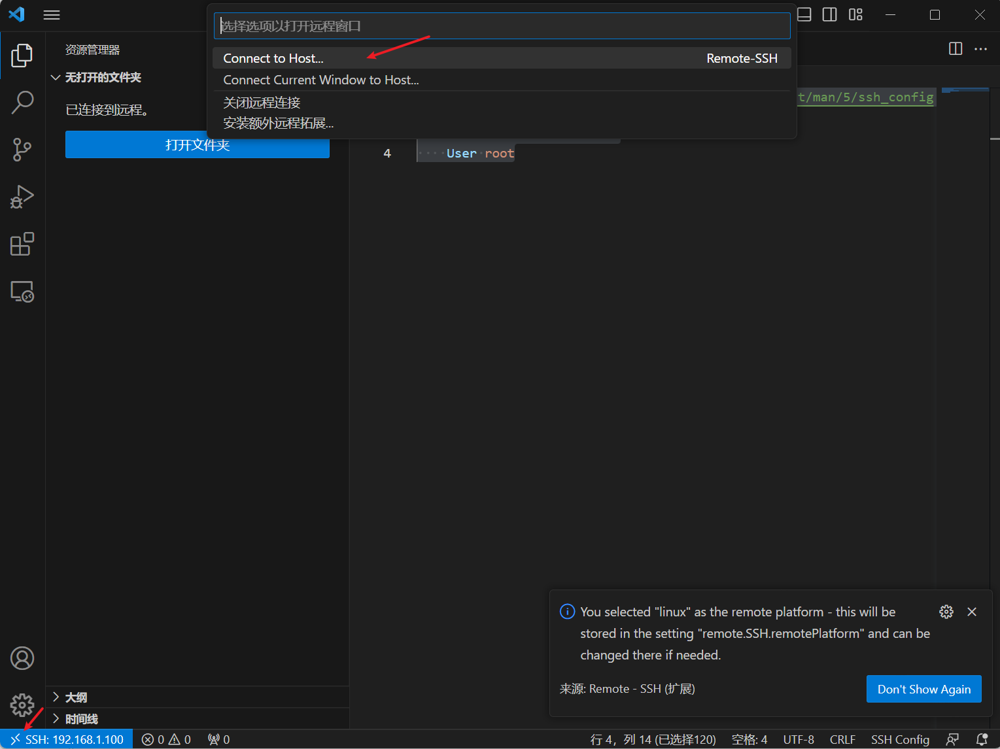
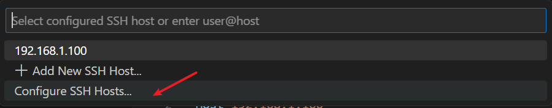
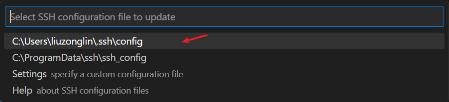

# VSCode连接远程Linux开发

安装 vscode

安装插件 `Remote - SSH`

配置本地 `C:\Users\liuzonglin\.ssh\config`

```config
# 阅读更多关于SSH配置文件的信息：https://linux.die.net/man/5/ssh_config

# 服务地址
Host 192.168.1.100
	
	# 服务名
    HostName 192.168.1.100 
    
    # 服务器用户
    User root
```








https://www.zhihu.com/tardis/zm/art/199187317?source_id=1005