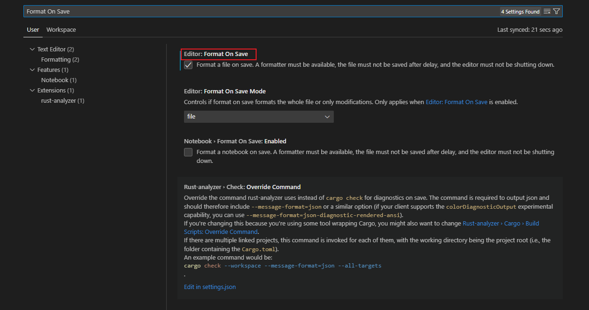
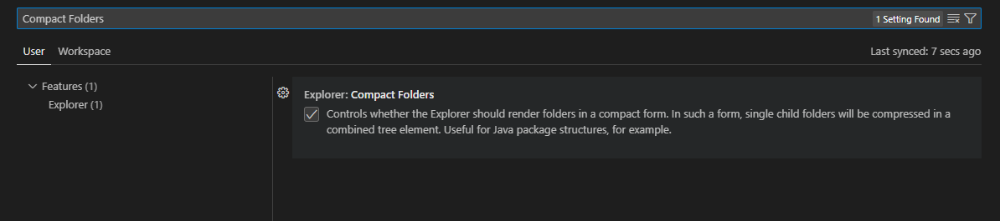

### 设置自动保存时自动格式化代码

使用 `Ctrl + ,` 打开设置




### 设置连字字体

下载最新的发布文件 https://github.com/tonsky/FiraCode/

在 `Visual Studio Code` 中启用连字字体需要用到两个选项：

```json
"editor.fontFamily": "Fira Code Light, Consolas, Microsoft YaHei",
"editor.fontLigatures": true,

```


### 文件夹里只有一个文件折叠问题，文件折叠问题解决



### 设置扩展

`Error Lens` 改进错误、警告和其他语言诊断的高亮显示，编辑页显示。

`IntelliJ IDEA Keybindings` IntelliJ IDEA 键绑定的快捷键

`Material Icon Theme` Visual Studio 代码的材质设计图标

`rust-analyzer` Rust 语言支持 Visual Studio Code