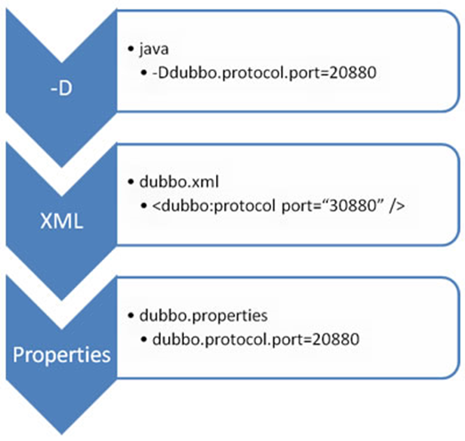
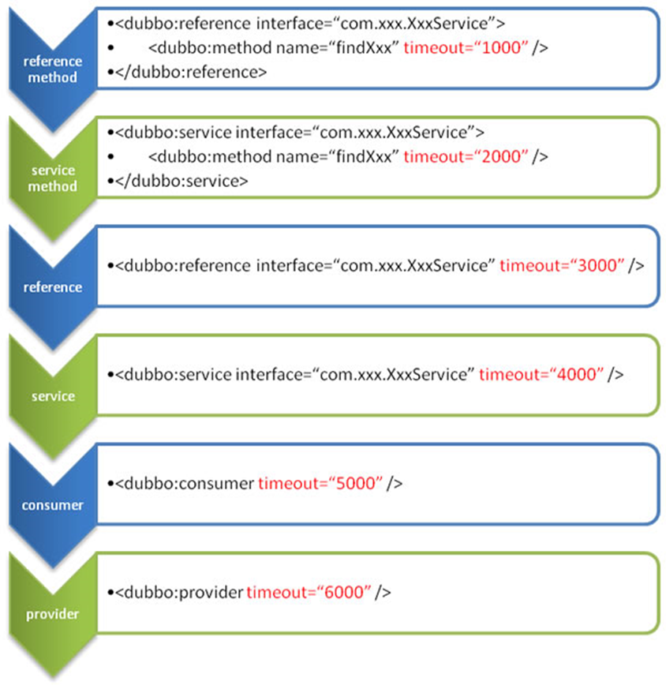

# Dubbo配置

## **配置原则：**

​​

* JVM 启动 -D 参数优先，这样可以使用户在部署和启动时进行参数重写，比如在启动时需改变协议的端口。

* XML 次之，如果在 XML 中有配置，则 dubbo.properties 中的相应配置项无效。

* Properties 最后，相当于缺省值，只有 XML 没有配置时，dubbo.properties 的相应配置项才会生效，通常用于共享公共配置，比如应用名。

## **重试次数**

失败自动切换，当出现失败，重试其它服务器，但重试会带来更长延迟。可通过 retries="2" 来设置重试次数(不含第一次)。

```shell
重试次数配置如下：
<dubbo:service retries="2" />
或
<dubbo:reference retries="2" />
或
<dubbo:reference>
    <dubbo:method name="findFoo" retries="2" />
</dubbo:reference>
```

‍

## **超时时间**

由于网络或服务端不可靠，会导致调用出现一种不确定的中间状态（超时）。为了避免超时导致客户端资源（线程）挂起耗尽，必须设置超时时间。

1. Dubbo消费端

    ```shell
    全局超时配置
    <dubbo:consumer timeout="5000" />

    指定接口以及特定方法超时配置
    <dubbo:reference interface="com.foo.BarService" timeout="2000">
        <dubbo:method name="sayHello" timeout="3000" />
    </dubbo:reference>
    ```
2. Dubbo服务端

    ```shell
    全局超时配置
    <dubbo:provider timeout="5000" />

    指定接口以及特定方法超时配置
    <dubbo:provider interface="com.foo.BarService" timeout="2000">
        <dubbo:method name="sayHello" timeout="3000" />
    </dubbo:provider>
    ```
3. 配置原则

    dubbo推荐在Provider上尽量多配置Consumer端属性：

    * 作服务的提供者，比服务使用方更清楚服务性能参数，如调用的超时时间，合理的重试次数，等等

    * 在Provider配置后，Consumer不配置则会使用Provider的配置值，即Provider配置可以作为Consumer的缺省值。否则，Consumer会使用Consumer端的全局设置，这对于Provider不可控的，并且往往是不合理的

    配置的覆盖规则：

    1. 方法级配置别优于接口级别，即小Scope优先
    2. Consumer端配置优于 Provider配置优于全局配置，
    3. 最后是Dubbo Hard Code的配置值（见配置文档）

    ​​

‍

## **版本号**

当一个接口实现，出现不兼容升级时，可以用版本号过渡，版本号不同的服务相互间不引用。

**可以按照以下的步骤进行版本迁移：**在低压力时间段，先升级一半提供者为新版本；再将所有消费者升级为新版本；然后将剩下的一半提供者升级为新版本。

```shell
# 老版本服务提供者配置：
<dubbo:service interface="com.foo.BarService" version="1.0.0" />

# 新版本服务提供者配置：
<dubbo:service interface="com.foo.BarService" version="2.0.0" />

# 老版本服务消费者配置：
<dubbo:reference id="barService" interface="com.foo.BarService" version="1.0.0" />

# 新版本服务消费者配置：
<dubbo:reference id="barService" interface="com.foo.BarService" version="2.0.0" />

# 如果不需要区分版本，可以按照以下的方式配置：
<dubbo:reference id="barService" interface="com.foo.BarService" version="*" />
```

‍
