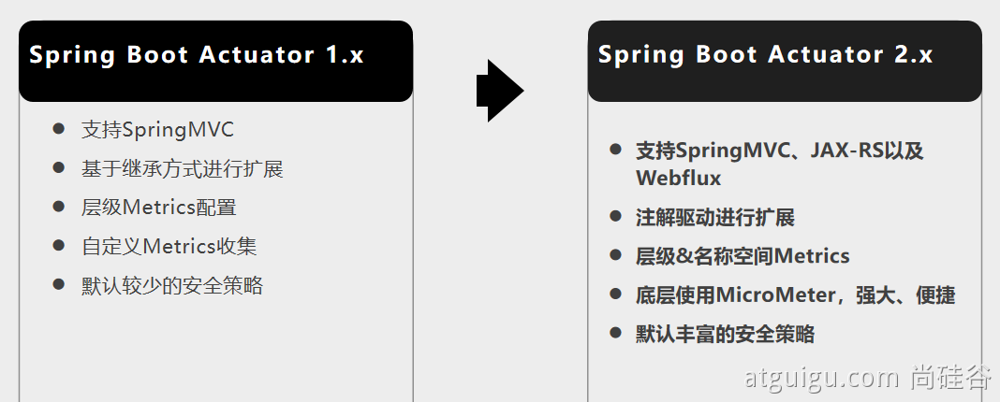

# 08、指标监控

# 1、SpringBoot Actuator

## 1、简介

**未来每一个微服务在云上部署以后，我们都需要对其进行监控、追踪、审计、控制等。SpringBoot就抽取了**Actuator场景，使得我们每个微服务快速引用即可获得生产级别的应用监控、审计等功能。

```java
        <dependency>
            <groupId>org.springframework.boot</groupId>
            <artifactId>spring-boot-starter-actuator</artifactId>
        </dependency>
```

​​

## 2、1.x与2.x的不同

​​

## 3、如何使用

* **引入场景**
* **访问 **http://localhost:8080/actuator/**
* **暴露所有监控信息为HTTP**

```java
management:
  endpoints:
    enabled-by-default: true #暴露所有端点信息
    web:
      exposure:
        include: '*'  #以web方式暴露
```

* **测试**

[http://localhost:8080/actuator/beans](http://localhost:8080/actuator/beans)

[http://localhost:8080/actuator/configprops](http://localhost:8080/actuator/configprops)

[http://localhost:8080/actuator/metrics](http://localhost:8080/actuator/metrics)

[http://localhost:8080/actuator/metrics/jvm.gc.pause](http://localhost:8080/actuator/metrics/jvm.gc.pause)

[http://localhost:8080/actuator/](http://localhost:8080/actuator/metrics)endpointName/detailPath  
。。。。。。

## 4、可视化

[https://github.com/codecentric/spring-boot-admin](https://github.com/codecentric/spring-boot-admin)

# 2、**Actuator Endpoint**

## 1、最常使用的端点

|**ID**|**描述**|
| ------| ----------------------------------------------|
|​`<span class="ne-text">auditevents</span>`​|**暴露当前应用程序的审核事件信息。需要一个**​`<span class="ne-text">AuditEventRepository组件</span>`​。|
|​`<span class="ne-text">beans</span>`​|**显示应用程序中所有Spring Bean的完整列表。**|
|​`<span class="ne-text">caches</span>`​|**暴露可用的缓存。**|
|​`<span class="ne-text">conditions</span>`​|**显示自动配置的所有条件信息，包括匹配或不匹配的原因。**|
|​`<span class="ne-text">configprops</span>`​|**显示所有**​`<span class="ne-text">@ConfigurationProperties</span>`​。|
|​`<span class="ne-text">env</span>`​|**暴露Spring的属性**​`<span class="ne-text">ConfigurableEnvironment</span>`​|
|​`<span class="ne-text">flyway</span>`​|**显示已应用的所有Flyway数据库迁移。**<br />需要一个或多个`<span class="ne-text">Flyway</span>`​组件。|
|​`<span class="ne-text">health</span>`​|**显示应用程序运行状况信息。**|
|​`<span class="ne-text">httptrace</span>`​|**显示HTTP跟踪信息（默认情况下，最近100个HTTP请求-响应）。需要一个**​`<span class="ne-text">HttpTraceRepository</span>`​组件。|
|​`<span class="ne-text">info</span>`​|**显示应用程序信息。**|
|​`<span class="ne-text">integrationgraph</span>`​|**显示Spring**​`<span class="ne-text">integrationgraph</span>`​。需要依赖`<span class="ne-text">spring-integration-core</span>`​。|
|​`<span class="ne-text">loggers</span>`​|**显示和修改应用程序中日志的配置。**|
|​`<span class="ne-text">liquibase</span>`​|**显示已应用的所有Liquibase数据库迁移。需要一个或多个**​`<span class="ne-text">Liquibase</span>`​组件。|
|​`<span class="ne-text">metrics</span>`​|**显示当前应用程序的“指标”信息。**|
|​`<span class="ne-text">mappings</span>`​|**显示所有**​`<span class="ne-text">@RequestMapping</span>`​路径列表。|
|​`<span class="ne-text">scheduledtasks</span>`​|**显示应用程序中的计划任务。**|
|​`<span class="ne-text">sessions</span>`​|**允许从Spring Session支持的会话存储中检索和删除用户会话。需要使用Spring Session的基于Servlet的Web应用程序。**|
|​`<span class="ne-text">shutdown</span>`​|**使应用程序正常关闭。默认禁用。**|
|​`<span class="ne-text">startup</span>`​|**显示由**​`<span class="ne-text">ApplicationStartup</span>`​收集的启动步骤数据。需要使用`<span class="ne-text">SpringApplication</span>`​进行配置`<span class="ne-text">BufferingApplicationStartup</span>`​。|
|​`<span class="ne-text">threaddump</span>`​|**执行线程转储。**|

**如果您的应用程序是Web应用程序（Spring MVC，Spring WebFlux或Jersey），则可以使用以下附加端点：**

|**ID**|**描述**|
| ------| ------------------------------------------------------------|
|​`<span class="ne-text">heapdump</span>`​|**返回**​`<span class="ne-text">hprof</span>`​堆转储文件。|
|​`<span class="ne-text">jolokia</span>`​|**通过HTTP暴露JMX bean（需要引入Jolokia，不适用于WebFlux）。需要引入依赖**​`<span class="ne-text">jolokia-core</span>`​。|
|​`<span class="ne-text">logfile</span>`​|**返回日志文件的内容（如果已设置**​`<span class="ne-text">logging.file.name</span>`​或`<span class="ne-text">logging.file.path</span>`​属性）。支持使用HTTP`<span class="ne-text">Range</span>`​标头来检索部分日志文件的内容。|
|​`<span class="ne-text">prometheus</span>`​|**以Prometheus服务器可以抓取的格式公开指标。需要依赖**​`<span class="ne-text">micrometer-registry-prometheus</span>`​。|

**最常用的Endpoint**

* **Health：监控状况**
* **Metrics：运行时指标**
* **Loggers：日志记录**

## 2、Health Endpoint

**健康检查端点，我们一般用于在云平台，平台会定时的检查应用的健康状况，我们就需要Health Endpoint可以为平台返回当前应用的一系列组件健康状况的集合。**

**重要的几点：**

* **health endpoint返回的结果，应该是一系列健康检查后的一个汇总报告**
* **很多的健康检查默认已经自动配置好了，比如：数据库、redis等**
* **可以很容易的添加自定义的健康检查机制**

​​

## 3、**Metrics Endpoint**

**提供详细的、层级的、空间指标信息，这些信息可以被pull（主动推送）或者push（被动获取）方式得到；**

* **通过Metrics对接多种监控系统**
* **简化核心Metrics开发**
* **添加自定义Metrics或者扩展已有Metrics**

​​

## 4、管理**Endpoints**

### 1、开启与禁用Endpoints

* **默认所有的Endpoint除过shutdown都是开启的。**
* **需要开启或者禁用某个Endpoint。配置模式为  management.endpoint.&lt;endpointName&gt;.enabled = true**

```java
management:
  endpoint:
    beans:
      enabled: true
```

* **或者禁用所有的Endpoint然后手动开启指定的Endpoint**

```java
management:
  endpoints:
    enabled-by-default: false
  endpoint:
    beans:
      enabled: true
    health:
      enabled: true
```

### 2、暴露Endpoints

**支持的暴露方式**

* **HTTP：默认只暴露****health**和**info** **Endpoint**
* **JMX：默认暴露所有Endpoint**
* **除过health和info，剩下的Endpoint都应该进行保护访问。如果引入SpringSecurity，则会默认配置安全访问规则**

|**ID**|**JMX**|**Web**|
| ------| --| --|
|​`<span class="ne-text">auditevents</span>`​|**Yes**|**No**|
|​`<span class="ne-text">beans</span>`​|**Yes**|**No**|
|​`<span class="ne-text">caches</span>`​|**Yes**|**No**|
|​`<span class="ne-text">conditions</span>`​|**Yes**|**No**|
|​`<span class="ne-text">configprops</span>`​|**Yes**|**No**|
|​`<span class="ne-text">env</span>`​|**Yes**|**No**|
|​`<span class="ne-text">flyway</span>`​|**Yes**|**No**|
|​`<span class="ne-text">health</span>`​|**Yes**|**Yes**|
|​`<span class="ne-text">heapdump</span>`​|**N/A**|**No**|
|​`<span class="ne-text">httptrace</span>`​|**Yes**|**No**|
|​`<span class="ne-text">info</span>`​|**Yes**|**Yes**|
|​`<span class="ne-text">integrationgraph</span>`​|**Yes**|**No**|
|​`<span class="ne-text">jolokia</span>`​|**N/A**|**No**|
|​`<span class="ne-text">logfile</span>`​|**N/A**|**No**|
|​`<span class="ne-text">loggers</span>`​|**Yes**|**No**|
|​`<span class="ne-text">liquibase</span>`​|**Yes**|**No**|
|​`<span class="ne-text">metrics</span>`​|**Yes**|**No**|
|​`<span class="ne-text">mappings</span>`​|**Yes**|**No**|
|​`<span class="ne-text">prometheus</span>`​|**N/A**|**No**|
|​`<span class="ne-text">scheduledtasks</span>`​|**Yes**|**No**|
|​`<span class="ne-text">sessions</span>`​|**Yes**|**No**|
|​`<span class="ne-text">shutdown</span>`​|**Yes**|**No**|
|​`<span class="ne-text">startup</span>`​|**Yes**|**No**|
|​`<span class="ne-text">threaddump</span>`​|**Yes**|**No**|

# 3、定制 Endpoint

## 1、定制 Health 信息

```java
import org.springframework.boot.actuate.health.Health;
import org.springframework.boot.actuate.health.HealthIndicator;
import org.springframework.stereotype.Component;

@Component
public class MyHealthIndicator implements HealthIndicator {

    @Override
    public Health health() {
        int errorCode = check(); // perform some specific health check
        if (errorCode != 0) {
            return Health.down().withDetail("Error Code", errorCode).build();
        }
        return Health.up().build();
    }

}

构建Health
Health build = Health.down()
                .withDetail("msg", "error service")
                .withDetail("code", "500")
                .withException(new RuntimeException())
                .build();
```

```java
management:
    health:
      enabled: true
      show-details: always #总是显示详细信息。可显示每个模块的状态信息
```

```java
·@Component
public class MyComHealthIndicator extends AbstractHealthIndicator {

    /**
     * 真实的检查方法
     * @param builder
     * @throws Exception
     */
    @Override
    protected void doHealthCheck(Health.Builder builder) throws Exception {
        //mongodb。  获取连接进行测试
        Map<String,Object> map = new HashMap<>();
        // 检查完成
        if(1 == 2){
//            builder.up(); //健康
            builder.status(Status.UP);
            map.put("count",1);
            map.put("ms",100);
        }else {
//            builder.down();
            builder.status(Status.OUT_OF_SERVICE);
            map.put("err","连接超时");
            map.put("ms",3000);
        }


        builder.withDetail("code",100)
                .withDetails(map);

    }
}
```

··

2、定制info信息  
常用两种方式

1、编写配置文件

```java
info:
  appName: boot-admin
  version: 2.0.1
  mavenProjectName: @project.artifactId@  #使用@@可以获取maven的pom文件值
  mavenProjectVersion: @project.version@
```

#### 2、编写InfoContributor

```java
import java.util.Collections;

import org.springframework.boot.actuate.info.Info;
import org.springframework.boot.actuate.info.InfoContributor;
import org.springframework.stereotype.Component;

@Component
public class ExampleInfoContributor implements InfoContributor {

    @Override
    public void contribute(Info.Builder builder) {
        builder.withDetail("example",
                Collections.singletonMap("key", "value"));
    }

}
```

[http://localhost:8080/actuator/info](http://localhost:8080/actuator/info) 会输出以上方式返回的所有info信息

## 3、定制Metrics信息

#### 1、SpringBoot支持自动适配的Metrics

* **JVM metrics, report utilization of:**

  * **Various memory and buffer pools**
  * **Statistics related to garbage collection**
  * **Threads utilization**
  * **Number of classes loaded/unloaded**
* **CPU metrics**
* **File descriptor metrics**
* **Kafka consumer and producer metrics**
* **Log4j2 metrics: record the number of events logged to Log4j2 at each level**
* **Logback metrics: record the number of events logged to Logback at each level**
* **Uptime metrics: report a gauge for uptime and a fixed gauge representing the application’s absolute start time**
* **Tomcat metrics (**​`<span class="ne-text">server.tomcat.mbeanregistry.enabled</span>`​ must be set to `<span class="ne-text">true</span>`​ for all Tomcat metrics to be registered)
* [Spring Integration](https://docs.spring.io/spring-integration/docs/5.4.1/reference/html/system-management.html#micrometer-integration) metrics

#### 2、增加定制Metrics

```java
class MyService{
    Counter counter;
    public MyService(MeterRegistry meterRegistry){
         counter = meterRegistry.counter("myservice.method.running.counter");
    }

    public void hello() {
        counter.increment();
    }
}


//也可以使用下面的方式
@Bean
MeterBinder queueSize(Queue queue) {
    return (registry) -> Gauge.builder("queueSize", queue::size).register(registry);
}
```

## 4、定制Endpoint

```java
@Component
@Endpoint(id = "container")
public class DockerEndpoint {


    @ReadOperation
    public Map getDockerInfo(){
        return Collections.singletonMap("info","docker started...");
    }

    @WriteOperation
    private void restartDocker(){
        System.out.println("docker restarted....");
    }

}
```

**场景：开发****ReadinessEndpoint**来管理程序是否就绪，或者**LivenessEndpoint**来管理程序是否存活；

**当然，这个也可以直接使用 **[https://docs.spring.io/spring-boot/docs/current/reference/html/production-ready-features.html#production-ready-kubernetes-probes](https://docs.spring.io/spring-boot/docs/current/reference/html/production-ready-features.html#production-ready-kubernetes-probes)
