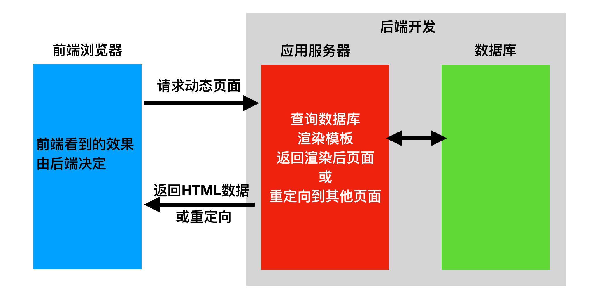
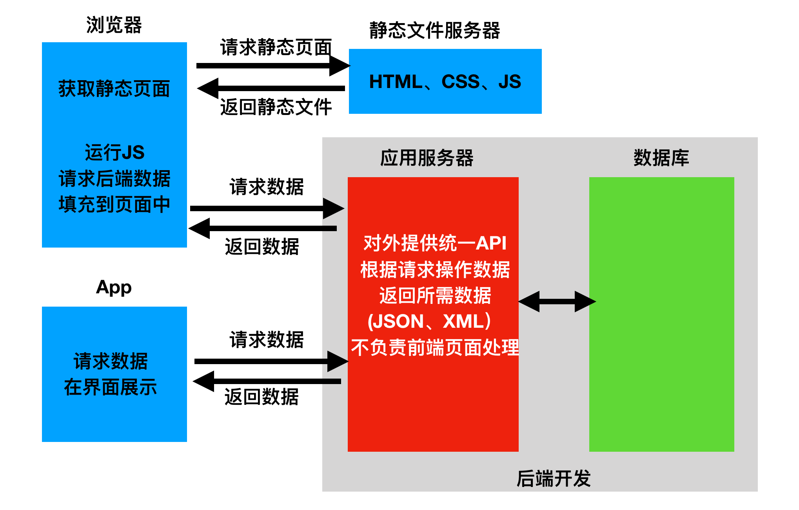

# Extra. 前后端分离跨域处理

我们的项目已经处于前后端分离状态了，那么前后端分离状态和我们之前的状态有什么区别的呢？

* **不分离：**前端页面看到的都是由后端控制，由后端渲染页面或重定向，后端需要控制前端的展示，前端与后端的耦合度很高。比如我们之前都是使用后端来执行重定向操作或是使用Thymeleaf来填充数据，而最终返回的是整个渲染好的页。

​​​​

* **分离：**后端仅返回前端所需的数据，不再渲染HTML页面，不再控制前端的效果。至于前端用户看到什么效果，从后端请求的数据如何加载到前端中，都由前端通过JS等进行动态数据填充和渲染。这样后端只返回JSON数据，前端处理JSON数据并展示，这样前后端的职责就非常明确了。

​​​​

实现前后端分离有两种方案，一种是直接放入SpringBoot的资源文件夹下，但是这样实际上还是在依靠SpringBoot内嵌的Tomcat服务器进行页面和静态资源的发送，我们现在就是这种方案。

另一种方案就是直接将所有的页面和静态资源单独放到代理服务器上（如Nginx），这样我们后端服务器就不必再处理静态资源和页面了，专心返回数据即可，而前端页面就需要访问另一个服务器来获取，虽然逻辑和明确，但是这样会出现跨域问题，实际上就是我们之前所说的跨站请求伪造，为了防止这种不安全的行为发生，所以对异步请求会进行一定的限制。

这里，我们将前端页面和后端页面直接分离进行测试，在登陆时得到如下错误：

```
Access to XMLHttpRequest at 'http://localhost:8080/api/auth/login' from origin 'http://localhost:63342' has been blocked by CORS policy: No 'Access-Control-Allow-Origin' header is present on the requested resource.
```

可以很清楚地看到，在Ajax发送异步请求时，我们的请求被阻止，原因是在响应头中没有包含`Access-Control-Allow-Origin`​，也就表示，如果服务端允许跨域请求，那么会在响应头中添加一个`Access-Control-Allow-Origin`​字段，如果不允许跨域，就像现在这样。那么，什么才算是跨域呢：

1. 请求协议`如http、https`​不同
2. 请求的地址/域名不同
3. 端口不同

因为我们现在相当于前端页面访问的是静态资源服务器，而后端数据是由我们的SpringBoot项目提供，它们是两个不同的服务器，所以在垮服务器请求资源时，会被判断为存在安全风险。

但是现在，由于我们前后端是分离状态，我们希望的是能够实现跨域请求，这时我们就需要添加一个过滤器来处理跨域问题：

```java
@Bean
public CorsFilter corsFilter() {
    //创建CorsConfiguration对象后添加配置
    CorsConfiguration config = new CorsConfiguration();
    //设置放行哪些原始域，这里直接设置为所有
    config.addAllowedOriginPattern("*");
  	//你可以单独设置放行哪些原始域 config.addAllowedOrigin("http://localhost:2222");
    //放行哪些原始请求头部信息
    config.addAllowedHeader("*");
    //放行哪些请求方式，*代表所有
    config.addAllowedMethod("*");
    //是否允许发送Cookie，必须要开启，因为我们的JSESSIONID需要在Cookie中携带
    config.setAllowCredentials(true);
    //映射路径
    UrlBasedCorsConfigurationSource corsConfigurationSource = new UrlBasedCorsConfigurationSource();
    corsConfigurationSource.registerCorsConfiguration("/**", config);
    //返回CorsFilter
    return new CorsFilter(corsConfigurationSource);
}
```

这样，我们的SpringBoot项目就支持跨域访问了，接着我们再来尝试进行登陆，可以发现已经能够正常访问了，并且响应头中包含了以下信息：

```
Vary: Access-Control-Request-Method
Vary: Access-Control-Request-Headers
Access-Control-Allow-Origin: http://localhost:63342
Access-Control-Expose-Headers: *
Access-Control-Allow-Credentials: true
```

可以看到我们当前访问的原始域已经被放行了。

但是还有一个问题，我们的Ajax请求中没有携带Cookie信息（这个按理说属于前端知识了）这里我们稍微改一下，不然我们的请求无法确认身份：

```js
function get(url, success){
    $.ajax({
        type: "get",
        url: url,
        async: true,
        dataType: 'json',
        xhrFields: {
            withCredentials: true
        },
        success: success
    });
}

function post(url, data, success){
    $.ajax({
        type: "post",
        url: url,
        async: true,
        data: data,
        dataType: 'json',
        xhrFields: {
            withCredentials: true
        },
        success: success
    });
}
```

添加两个封装好的方法，并且将`withCredentials`​开启，这样在发送异步请求时，就会携带Cookie信息了。

在学习完成Linux之后，我们会讲解如何在Linux服务器上部署Nginx反向代理服务器。
