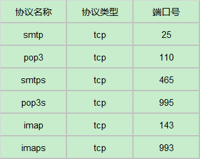
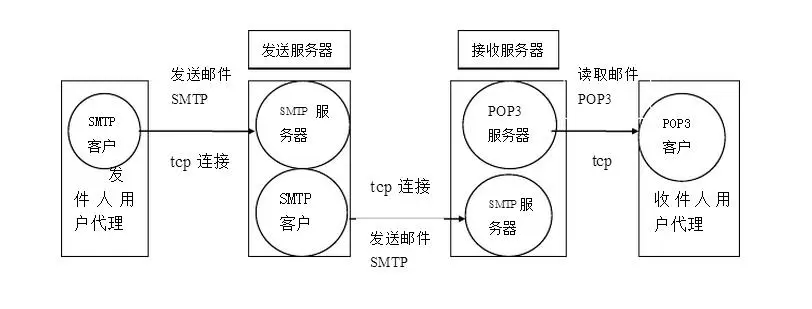

# 邮件发送：Mail

通过了解其他的SpringBoot框架，我们就可以在我们自己的Web服务器上实现更多更高级的功能。

我们在注册很多的网站时，都会遇到邮件或是手机号验证，也就是通过你的邮箱或是手机短信去接受网站发给你的注册验证信息，填写验证码之后，就可以完成注册了，同时，网站也会绑定你的手机号或是邮箱。

那么，像这样的功能，我们如何实现呢？SpringBoot已经给我们提供了封装好的邮件模块使用：

```xml
<dependency>
    <groupId>org.springframework.boot</groupId>
    <artifactId>spring-boot-starter-mail</artifactId>
</dependency>
```

### 邮件发送

在学习邮件发送之前，我们需要先了解一下什么是电子邮件。

电子邮件也是一种通信方式，是互联网应用最广的服务。通过网络的电子邮件系统，用户可以以非常低廉的价格（不管发送到哪里，都只需负担网费，实际上就是把信息发送到对方服务器而已）、非常快速的方式，与世界上任何一个地方的电子邮箱用户联系。

虽说方便倒是方便，虽然是曾经的霸主，不过现在这个时代，QQ微信横行，手机短信和电子邮箱貌似就只剩收验证码这一个功能了。

要在Internet上提供电子邮件功能，必须有专门的电子邮件服务器。例如现在Internet很多提供邮件服务的厂商：新浪、搜狐、163、QQ邮箱等，他们都有自己的邮件服务器。这些服务器类似于现实生活中的邮局，它主要负责接收用户投递过来的邮件，并把邮件投递到邮件接收者的电子邮箱中。

所有的用户都可以在电子邮件服务器上申请一个账号用于邮件发送和接收，那么邮件是以什么样的格式发送的呢？实际上和Http一样，邮件发送也有自己的协议，也就是约定邮件数据长啥样以及如何通信。

​​

比较常用的协议有两种：

1. SMTP协议（主要用于发送邮件 Simple Mail Transfer Protocol）
2. POP3协议（主要用于接收邮件 Post Office Protocol 3）

整个发送/接收流程大致如下：

​​

实际上每个邮箱服务器都有一个smtp发送服务器和pop3接收服务器，比如要从QQ邮箱发送邮件到163邮箱，那么我们只需要通过QQ邮箱客户端告知QQ邮箱的smtp服务器我们需要发送邮件，以及邮件的相关信息，然后QQ邮箱的smtp服务器就会帮助我们发送到163邮箱的pop3服务器上，163邮箱会通过163邮箱客户端告知对应用户收到一封新邮件。

而我们如果想要实现给别人发送邮件，那么就需要连接到对应电子邮箱的smtp服务器上，并告知其我们要发送邮件。而SpringBoot已经帮助我们将最基本的底层通信全部实现了，我们只需要关心smtp服务器的地址以及我们要发送的邮件长啥样即可。

这里以163邮箱 [https://mail.163.com](https://mail.163.com) 为例，我们需要在配置文件中告诉SpringBootMail我们的smtp服务器的地址以及你的邮箱账号和密码，首先我们要去设置中开启smtp/pop3服务才可以，开启后会得到一个随机生成的密钥，这个就是我们的密码。

```yaml
spring:
  mail:
  	# 163邮箱的地址为smtp.163.com，直接填写即可
    host: smtp.163.com
    # 你申请的163邮箱
    username: javastudy111@163.com
    # 注意密码是在开启smtp/pop3时自动生成的，记得保存一下，不然就找不到了
    password: AZJTOAWZESLMHTNI
```

配置完成后，接着我们来进行一下测试：

```java
@SpringBootTest
class SpringBootTestApplicationTests {

  	//JavaMailSender是专门用于发送邮件的对象，自动配置类已经提供了Bean
    @Autowired
    JavaMailSender sender;

    @Test
    void contextLoads() {
      	//SimpleMailMessage是一个比较简易的邮件封装，支持设置一些比较简单内容
        SimpleMailMessage message = new SimpleMailMessage();
      	//设置邮件标题
        message.setSubject("【电子科技大学教务处】关于近期学校对您的处分决定");
      	//设置邮件内容
        message.setText("XXX同学您好，经监控和教务巡查发现，您近期存在旷课、迟到、早退、上课刷抖音行为，" +
                "现已通知相关辅导员，请手写5000字书面检讨，并在2022年4月1日17点前交到辅导员办公室。");
      	//设置邮件发送给谁，可以多个，这里就发给你的QQ邮箱
        message.setTo("你的QQ号@qq.com");
      	//邮件发送者，这里要与配置文件中的保持一致
        message.setFrom("javastudy111@163.com");
      	//OK，万事俱备只欠发送
        sender.send(message);
    }

}
```

如果需要添加附件等更多功能，可以使用MimeMessageHelper来帮助我们完成：

```java
@Test
void contextLoads() throws MessagingException {
  	//创建一个MimeMessage
    MimeMessage message = sender.createMimeMessage();
  	//使用MimeMessageHelper来帮我们修改MimeMessage中的信息
    MimeMessageHelper helper = new MimeMessageHelper(message, true);
    helper.setSubject("Test");
    helper.setText("lbwnb");
    helper.setTo("你的QQ号@qq.com");
    helper.setFrom("javastudy111@163.com");
  	//发送修改好的MimeMessage
    sender.send(message);
}
```

### 邮件注册

既然我们已经了解了邮件发送，那么我们接着来看如何在我们的项目中实现邮件验证。

首先明确验证流程：请求验证码 -> 生成验证码（临时有效，注意设定过期时间） -> 用户输入验证码并填写注册信息 -> 验证通过注册成功！

‍
