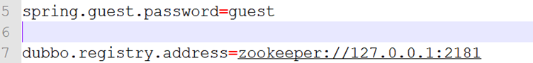

# CentOS7 安装dubbo-admin

‍

**下载dubbo-admin：**​[https://github.com/apache/incubator-dubbo-ops](https://github.com/apache/incubator-dubbo-ops)

**进入目录，修改dubbo-admin配置**

修改src\main\resources\application.properties 指定zookeeper地址

​​

运行dubbo-admin

```shell
java -jar dubbo-admin-0.0.1-SNAPSHOT.jar
```

默认使用root/root 登陆

​​

‍
