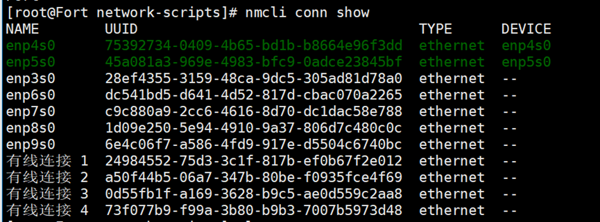
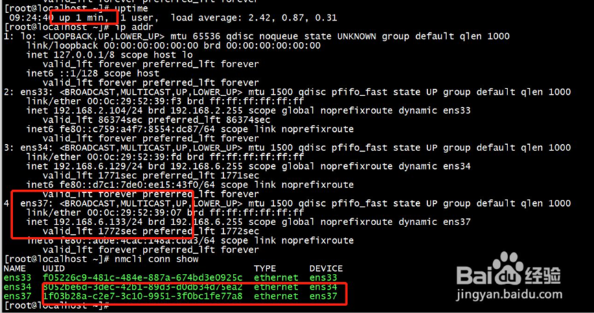

# CentOS7 修改网卡名

参考资料：

[Centos7更改网卡名称Eth0并配置静态IP](https://www.cnblogs.com/hanshanxiaoheshang/p/9433504.html)

---

```bash
cd /etc/sysconfig/network-scripts/	# 配置网络路径
cp ifcfg-enp4s0 ifcfg-enp5s0

[root@Fort network-scripts]# cat ifcfg-GE0-0
TYPE=Ethernet
PROXY_METHOD=none
BROWSER_ONLY=no
BOOTPROTO=static
DEFROUTE=yes
IPV4_FAILURE_FATAL=no
IPV6INIT=yes
IPV6_AUTOCONF=yes
IPV6_DEFROUTE=yes
IPV6_FAILURE_FATAL=no
IPV6_ADDR_GEN_MODE=stable-privacy
NAME=GE0-0
DEVICE=GE0-0
HWADDR=8c:1c:da:43:11:97
ONBOOT=yes
IPADDR=192.168.0.91
NETWORK=255.255.255.0
NETMASK=255.255.192.0
GATEWAY=192.168.1.1
DNS1=114.114.114.114
DNS2=
[root@Fort network-scripts]#

编辑 enp5s0 配置文件
NAME= enp5s0
UUID=
DEVICE= enp5s0

reboot		#重启


systemctl status NetworkManager	# 查看NetworkManager服务
cat /etc/resolv.conf				#
cat /etc/hostname					# 主机名称 
uuidgen eth1						# 生成uuid

```

​​

‍

查看到ens37对应的UUID信息nmcli conn show

​​

改名策略：

现阶段一共三块网卡

{GE0-0, GE0-1, GE0-2, GE0-3, GE0-4, GE0-5}

{GE1-0, GE1-1, GE1-2, GE1-3, GE1-4, GE1-5}

{GE2-0, GE2-1, GE2-2, GE2-3, GE2-4, GE2-5}

…………

​​

systemctl restart network.service

systemctl status network.service

修改网卡名称

注意事项：

单机模式下相同网段是可以配置多个网卡；避免问题多个网卡最号不要配置相同网段

‍
