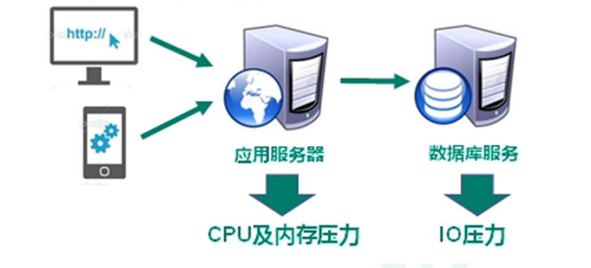
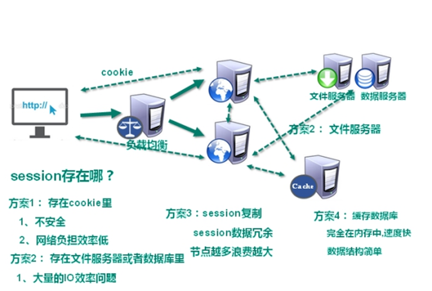
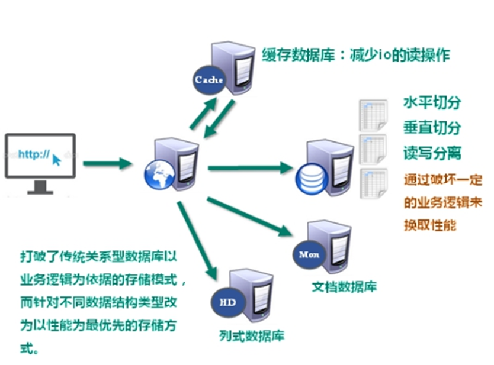
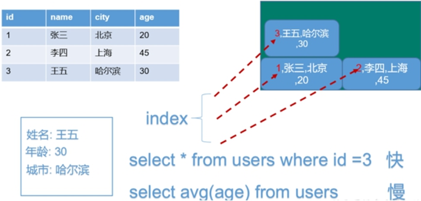
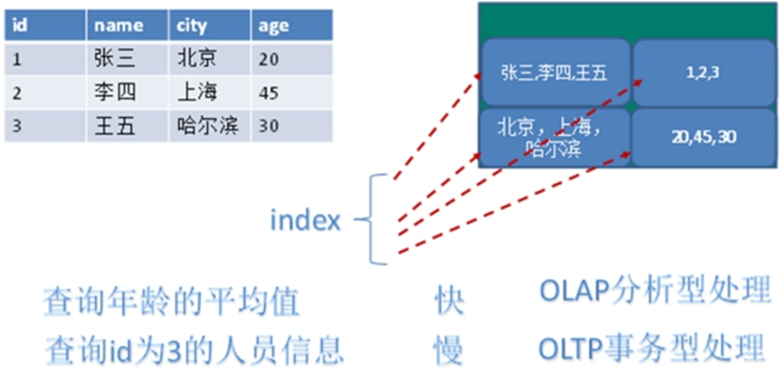
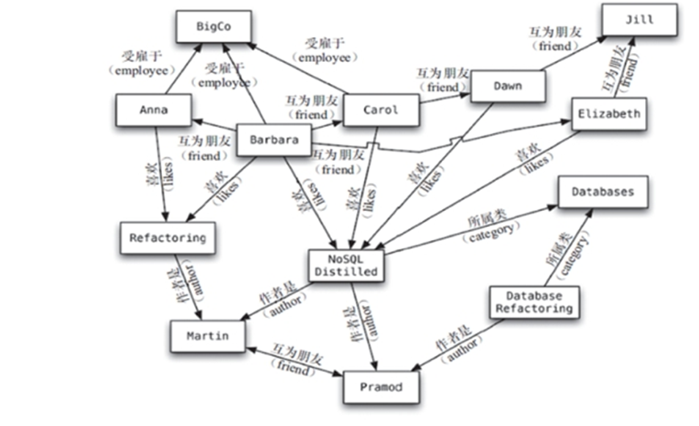
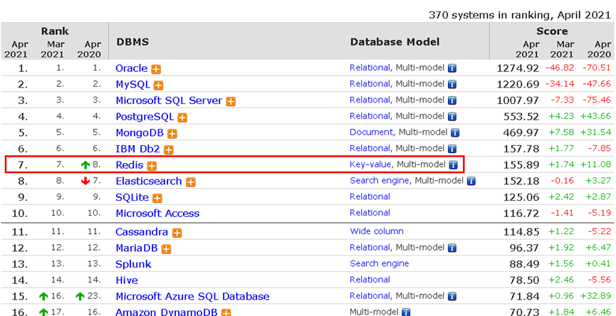

# NoSQL

‍

## NoSQL简介

‍

NoSQL全称是Not Only SQL（不仅仅是SQL）它是一种非关系型数据库，相比传统SQL关系型数据库，它：

* 不保证关系数据的ACID特性
* 并不遵循SQL标准
* 消除数据之间关联性

乍一看，这玩意不比MySQL垃圾？我们再来看看它的优势：

* 远超传统关系型数据库的性能
* 非常易于扩展
* 数据模型更加灵活
* 高可用

这样，NoSQL的优势一下就出来了，这不就是我们正要寻找的高并发海量数据的解决方案吗！

NoSQL数据库分为以下几种：

* **键值存储数据库：**所有的数据都是以键值方式存储的，类似于我们之前学过的HashMap，使用起来非常简单方便，性能也非常高。
* **列存储数据库：**这部分数据库通常是用来应对分布式存储的海量数据。键仍然存在，但是它们的特点是指向了多个列。
* **文档型数据库：**它是以一种特定的文档格式存储数据，比如JSON格式，在处理网页等复杂数据时，文档型数据库比传统键值数据库的查询效率更高。
* **图形数据库：**利用类似于图的数据结构存储数据，结合图相关算法实现高速访问。

其中我们要学习的Redis数据库，就是一个开源的**键值存储数据库**，所有的数据全部存放在内存中，它的性能大大高于磁盘IO，并且它也可以支持数据持久化，他还支持横向扩展、主从复制等。

实际生产中，我们一般会配合使用Redis和MySQL以发挥它们各自的优势，取长补短。

‍

## 技术发展

技术的分类

1. 解决功能性的问题：Java、Jsp、RDBMS、Tomcat、HTML、Linux、JDBC、SVN
2. 解决扩展性的问题：Struts、Spring、SpringMVC、Hibernate、Mybatis
3. 解决性能的问题：NoSQL、Java线程、Hadoop、Nginx、MQ、ElasticSearch

#### Web1.0 时代

Web1.0的时代，数据访问量很有限，用一夫当关的高性能的单点服务器可以解决大部分问题。

#### Web2.0 时代

随着Web2.0的时代的到来，用户访问量大幅度提升，同时产生了大量的用户数据。加上后来的智能移动设备的普及，所有的互联网平台都面临了巨大的性能挑战。

#### 解决CPU及内存压力

#### 解决 IO 压力

‍

‍

## NoSQL 数据库

#### NoSQL 数据库描述

NoSQL(NoSQL = **Not Only SQL** )，意即“不仅仅是SQL”，泛指**非关系型的数据库**。

NoSQL 不依赖业务逻辑方式存储，而以简单的key-value模式存储。因此大大的增加了数据库的扩展能力。

- 不遵循SQL标准。
- 不支持ACID。
- 远超于SQL的性能。

#### NoSQL 适用场景

- 对数据高并发的 IO (读写)
- 海量数据的读写
- 对数据高可扩展性的

#### NoSQL不适用场景

* 需要事务支持
* 基于sql的结构化查询存储，处理复杂的关系,需要即席查询。
* 用不着sql的和用了sql也不行的情况，请考虑用NoSql

‍

## NoSQL 数据库介绍

‍

#### Memcache

很早出现的NoSql数据库

数据都在内存中，一般不持久化 

支持简单的key-value模式，支持类型单

一般是作为缓存数据库辅助持久化的数据库

‍

#### Redis

几乎覆盖了Memcached（内存缓存）的绝大部分功能

数据都在内存中，支持持久化，主要用作备份恢复

除了支持简单的key-value模式，还支持多种数据结构的存储，比如 list、set、hash、zset等

一般是作为缓存数据库辅助持久化的数据库

‍

#### MongoDB

高性能、开源、模式自由(schema free)的文档型数据库

数据都在内存中， 如果内存不足，把不常用的数据保存到硬盘

虽然是key-value模式，但是对value（尤其是**json**）提供了丰富的查询功能

支持二进制数据及大型对象

可以根据数据的特点**替代RDBMS** ，成为独立的数据库。或者配合RDBMS，存储特定的数据。

‍

‍

## 行式存储数据库（大数据时代）

#### 行式数据库

#### 列式数据库

##### Hbase

HBase是**Hadoop**项目中的数据库。它用于需要对大量的数据进行随机、实时的读写操作的场景中。

HBase的目标就是处理数据量**非常庞大**的表，可以用**普通的计算机**处理超过**10**亿行数据**，还可处理有数百万**列元素的数据表。

##### Cassandra

Apache Cassandra是一款免费的开源NoSQL数据库，其设计目的在于管理由大量商用服务器构建起来的庞大集群上的**海量数据集(数据量通常达到PB级别)**。在众多显著特性当中，Cassandra最为卓越的长处是对写入及读取操作进行规模调整，而且其不强调主集群的设计思路能够以相对直观的方式简化各集群的创建与扩展流程。

计算机存储单位 计算机存储单位一般用B，KB，MB，GB，TB，EB，ZB，YB，BB来表示，它们之间的关系是：

位 bit (比特)(Binary Digits)：存放一位二进制数，即 0 或 1，最小的存储单位。

字节 byte：8个二进制位为一个字节(B)，最常用的单位。

1KB (Kilobyte 千字节)=1024B，

1MB (Megabyte 兆字节 简称“兆”)=1024KB，

1GB (Gigabyte 吉字节 又称“千兆”)=1024MB，

1TB (Trillionbyte 万亿字节 太字节)=1024GB，其中1024=2^10 ( 2 的10次方)，

1PB（Petabyte 千万亿字节 拍字节）=1024TB，

1EB（Exabyte 百亿亿字节 艾字节）=1024PB，

1ZB (Zettabyte 十万亿亿字节 泽字节)= 1024 EB,

1YB (Jottabyte 一亿亿亿字节 尧字节)= 1024 ZB,

1BB (Brontobyte 一千亿亿亿字节)= 1024 YB.

注：“兆”为百万级数量单位。

## 图关系型数据库

主要应用：社会关系，公共交通网络，地图及网络拓谱(n*(n-1)/2)

## DB-Engines数据库排名

[DB-Engines Ranking - popularity ranking of database management systems](https://db-engines.com/en/ranking)

‍
