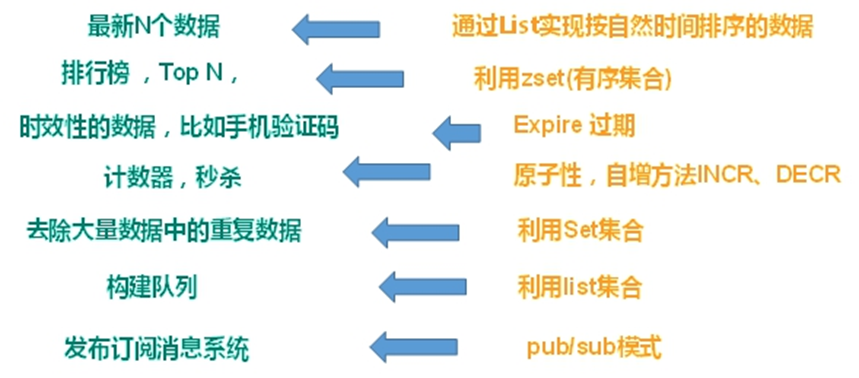

# Redis概述

[面试 Redis 没底？这 40 道面试题让你不再慌（附答案）-阿里云开发者社区 (aliyun.com)](https://developer.aliyun.com/article/852976#:~:text=%E8%BF%99%2040%20%E9%81%93%E9%9D%A2%E8%AF%95%E9%A2%98%E8%AE%A9%E4%BD%A0%E4%B8%8D%E5%86%8D%E6%85%8C%EF%BC%88%E9%99%84%E7%AD%94%E6%A1%88%EF%BC%89%201%201%E3%80%81%E4%BB%80%E4%B9%88%E6%98%AF%20Redis%EF%BC%9F%202%202%E3%80%81Redis,%E6%98%AF%E5%8D%95%E8%BF%9B%E7%A8%8B%E5%8D%95%E7%BA%BF%E7%A8%8B%E7%9A%84%EF%BC%9F%207%207%E3%80%81%E4%B8%80%E4%B8%AA%E5%AD%97%E7%AC%A6%E4%B8%B2%E7%B1%BB%E5%9E%8B%E7%9A%84%E6%99%BA%E8%83%BD%E5%AD%98%E5%82%A8%E6%9C%80%E5%A4%A7%E5%AE%B9%E9%87%8F%E6%98%AF%E5%A4%9A%E5%B0%91%EF%BC%9F%208%208%E3%80%81Redis%20%E7%9A%84%E6%8C%81%E4%B9%85%E5%8C%96%E6%9C%BA%E5%88%B6%E6%98%AF%E4%BB%80%E4%B9%88%EF%BC%9F%20%E5%90%84%E8%87%AA%E7%9A%84%E4%BC%98%E7%BC%BA%E7%82%B9%EF%BC%9F%20%E6%9B%B4%E5%A4%9A%E9%A1%B9%E7%9B%AE)

‍

‍

## 2、Redis概述

Redis 是完全开源免费的，遵守 BSD 协议，是一个高性能的 key-value 数据库。

Redis 与其他 key - value 缓存产品相比有以下三个特点：

* Redis 支持数据的持久化，可以将内存中的数据保存在磁盘中，重启的时候可以再次加载进行使用。
* Redis 不仅仅支持简单的 key-value 类型的数据，同时还提供 list，set，zset，hash 等数据结构的存储。
* Redis 支持数据的备份，即 master-slave 模式的数据备份。

Redis 优势：

* 性能极高：Redis 能读的速度是 110000 次/s，写的速度是 81000 次/s。
* 丰富的数据类型：Redis 支持二进制案例的 Strings，Lists，Hashes，Sets 及 Ordered Sets 数据类型操作。
* 原子：Redis 的所有操作都是原子性的，意思就是要么成功执行要么失败完全不执行。单个操作是原子性的。多个操作也支持事务，即原子性，通过 MULTI 和 EXEC 指令包起来。
* 丰富的特性：Redis 还支持 publish/subscribe，通知，key 过期等等特性。

Redis 与其他 key-value 存储有什么不同？

Redis 有着更为复杂的数据结构并且提供对他们的原子性操作，这是一个不同于其他数据库的进化路径。Redis 的数据类型都是基于基本数据结构的同时对程序员透明，无需进行额外的抽象。

Redis 运行在内存中但是可以持久化到磁盘，所以在对不同数据集进行高速读写时需要权衡内存，因为数据量不能大于硬件内存。在内存数据库方面的另一个优点是，相比在磁盘上相同的复杂的数据结构，在内存中操作起来非常简单，这样 Redis 可以做很多内部复杂性很强的事情。同时，在磁盘格式方面他们是紧凑的以追加的方式产生的，因为他们并不需要进行随机访问

‍

‍

## **3、使用 Redis 有哪些好处？**

* 速度快，因为数据存在内存中，类似于 HashMap，HashMap 的优势就是查找和操作的时间复杂度都是 O1)
* 支持丰富数据类型，支持 string，list，set，Zset，hash 等
* 支持事务，操作都是原子性，所谓的原子性就是对数据的更改要么全部执行，要么全部不执行
* 丰富的特性，可用于缓存，消息，按 key 设置过期时间，过期后将会自动删除

## **6、Redis 是单进程单线程的？**

Redis 是单进程单线程的，Redis 利用队列技术将并发访问变为串行访问，消除了传统数据库串行控制的开销。

‍

​​

‍

## 多样的数据结构存储持久化数据

​​

‍

‍

## Redis 介绍相关知识

端口6379

默认16个数据库，类似数组下标从0开始，初始默认使用0号库

Redis是单线程+多路IO复用技术

多路复用是指使用一个线程来检查多个文件描述符（Socket）的就绪状态，比如调用select和poll函数，传入多个文件描述符，如果有一个文件描述符就绪，则返回，否则阻塞直到超时。得到就绪状态后进行真正的操作可以在同一个线程里执行，也可以启动线程执行（比如使用线程池）

串行  vs  多线程+锁（memcached） vs  单线程+多路IO复用(Redis)（与Memcache三点不同: 支持多数据类型，支持持久化，单线程+多路IO复用）

​​

‍
