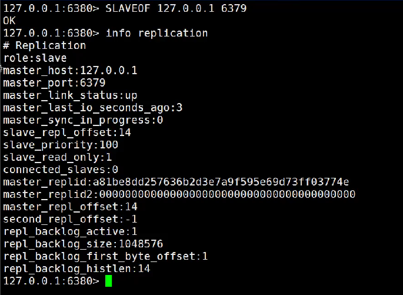
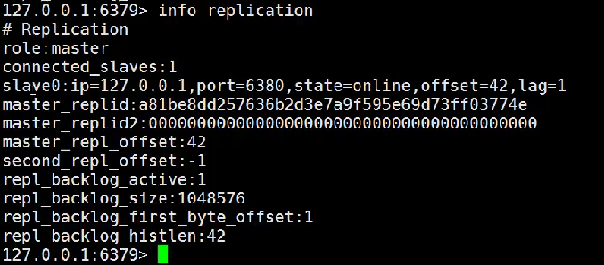
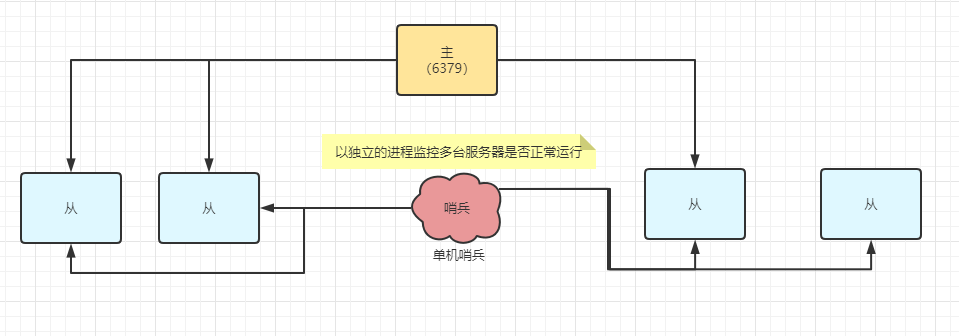
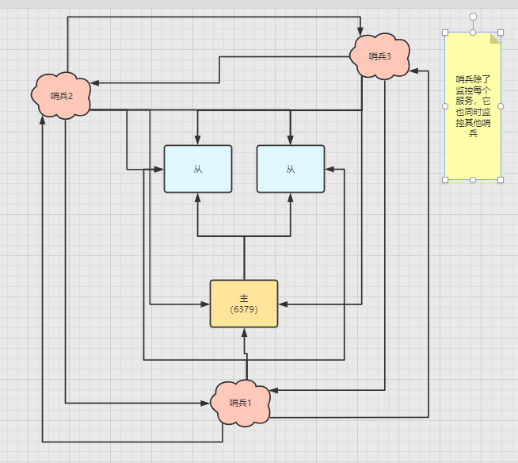
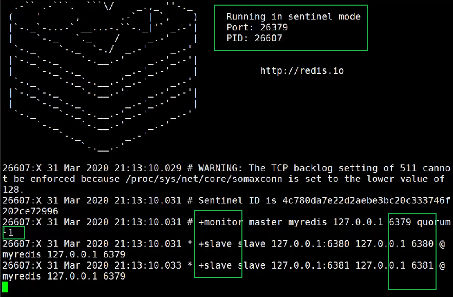
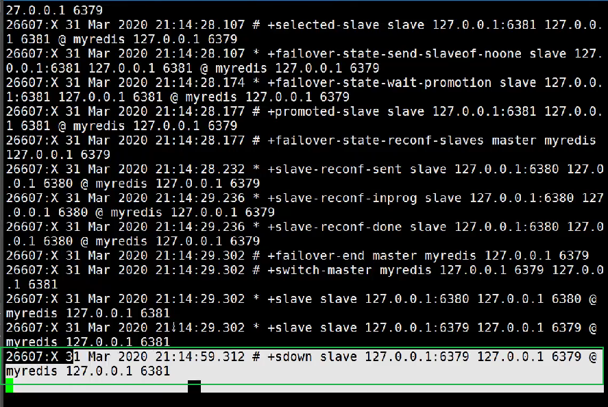

# redis Cluster（主从集群）

​

## Redis的主从同步机制

得分点 psync,全量复制、部分复制 标准回答 Redis主从同步是指任意数量的从节点（slave node）都可以从主节点上（master node）同步数据。而除了多个 slave 可以连接到同一个 master 之外,slave 还可以接受其他 slave 的连接,这就形成一个树形结构,使得Redis可执行单层树复制。 从2.8版本开始,当启动一个 slave node 的时候,它会发送一个 `PSYNC`​ 命令给 master node。如果slave node 是第一次连接到 master node,那么会触发一次全量复制。此时 master 会启动一个后台线程,开始生成一份 `RDB`​ 快照文件,同时还会将从客户端 client 新收到的所有写命令缓存在内存中。`RDB`​ 文件生成完毕后, master 会将这个 `RDB`​ 发送给 slave,slave 会先写入本地磁盘,然后再从本地磁盘加载到内存中,接着 master 会将内存中缓存的写命令发送到 slave,slave 也会同步这些数据。slave node 如果跟 master node 有网络故障,断开了连接,会自动重连,连接之后 master node 仅会复制给 slave 部分缺少的数据。

‍

`redis 默认本身是主库`​​

### 1、查看当前库的信息

```sh
> info replication # 查看当前库的信息
```


### 2、 编辑 redis.conf ...

```bash
# 配置第一个库
port 6379
daemonize yes
pidfile /var/run/redis_6379.pid
logfile "6379.log"
dbfilename dump6379.rdb

# 配置第二个库
port 6380
daemonize yes
pidfile /var/run/redis_6380.pid
logfile "6380.log"
dbfilename dump6380.rdb
......
```

### 3、 重启各服务


### 4、 命令配置从机 6380 7381（redis 默认本身是主库）

> 配置从机 `slaveof 127.0.0.1 6379`



> 查看主机是否配置成功



### 5、 文件配置

```bash
# replicaof <masterip> <masterport>
# 主机ip：192.168.31.1
# 主机端口：6379

# 配置 6380
replicaof 192.168.31.1 6379
# 如果主机存在密码配置主机密码
# masterauth <master-password>

# 配置 6381
replicaof 192.168.31.1 6379
...
```

### 6、主机断了 `slaveo no one`​ 从换主


### 7、高可用之 Sentinel(哨兵模式)

参考文档：

[Redis系列4：高可用之Sentinel（哨兵模式） (baidu.com)](https://baijiahao.baidu.com/s?id=1739594894093857836&wfr=spider&for=pc)

‍

‍

‍

‍

‍

单哨兵



> 多哨兵



> 配置哨兵模式

```bash
# 文件名相同
vim sentinel.conf

# 文件内容
# sentinel monitor 监控名称 端口 1
sentinel monitor myredis 127.0.0.1 6379 1
```

> 启动哨兵

```bash
redis-sentinel /usr/local/config/sentinel.conf
```






> 完整的哨兵模式配置文件 sentinel.conf

```bash
# Example sentinel.conf
 
# 哨兵sentinel实例运行的端口 默认26379
port 26379
 
# 哨兵sentinel的工作目录
dir /tmp
 
# 哨兵sentinel监控的redis主节点的 ip port 
# master-name  可以自己命名的主节点名字 只能由字母A-z、数字0-9 、这三个字符".-_"组成。
# quorum 当这些quorum个数sentinel哨兵认为master主节点失联 那么这时 客观上认为主节点失联了
# sentinel monitor <master-name> <ip> <redis-port> <quorum>
sentinel monitor mymaster 127.0.0.1 6379 1
 
# 当在Redis实例中开启了requirepass foobared 授权密码 这样所有连接Redis实例的客户端都要提供密码
# 设置哨兵sentinel 连接主从的密码 注意必须为主从设置一样的验证密码
# sentinel auth-pass <master-name> <password>
sentinel auth-pass mymaster MySUPER--secret-0123passw0rd
 
 
# 指定多少毫秒之后 主节点没有应答哨兵sentinel 此时 哨兵主观上认为主节点下线 默认30秒
# sentinel down-after-milliseconds <master-name> <milliseconds>
sentinel down-after-milliseconds mymaster 30000
 
# 这个配置项指定了在发生failover主备切换时最多可以有多少个slave同时对新的master进行 同步，
这个数字越小，完成failover所需的时间就越长，
但是如果这个数字越大，就意味着越 多的slave因为replication而不可用。
可以通过将这个值设为 1 来保证每次只有一个slave 处于不能处理命令请求的状态。
# sentinel parallel-syncs <master-name> <numslaves>
sentinel parallel-syncs mymaster 1
 
 
 
# 故障转移的超时时间 failover-timeout 可以用在以下这些方面： 
#1. 同一个sentinel对同一个master两次failover之间的间隔时间。
#2. 当一个slave从一个错误的master那里同步数据开始计算时间。直到slave被纠正为向正确的master那里同步数据时。
#3.当想要取消一个正在进行的failover所需要的时间。  
#4.当进行failover时，配置所有slaves指向新的master所需的最大时间。不过，即使过了这个超时，slaves依然会被正确配置为指向master，但是就不按parallel-syncs所配置的规则来了
# 默认三分钟
# sentinel failover-timeout <master-name> <milliseconds>
sentinel failover-timeout mymaster 180000
 
# SCRIPTS EXECUTION
 
#配置当某一事件发生时所需要执行的脚本，可以通过脚本来通知管理员，例如当系统运行不正常时发邮件通知相关人员。
#对于脚本的运行结果有以下规则：
#若脚本执行后返回1，那么该脚本稍后将会被再次执行，重复次数目前默认为10
#若脚本执行后返回2，或者比2更高的一个返回值，脚本将不会重复执行。
#如果脚本在执行过程中由于收到系统中断信号被终止了，则同返回值为1时的行为相同。
#一个脚本的最大执行时间为60s，如果超过这个时间，脚本将会被一个SIGKILL信号终止，之后重新执行。
 
#通知型脚本:当sentinel有任何警告级别的事件发生时（比如说redis实例的主观失效和客观失效等等），将会去调用这个脚本，
#这时这个脚本应该通过邮件，SMS等方式去通知系统管理员关于系统不正常运行的信息。调用该脚本时，将传给脚本两个参数，
#一个是事件的类型，
#一个是事件的描述。
#如果sentinel.conf配置文件中配置了这个脚本路径，那么必须保证这个脚本存在于这个路径，并且是可执行的，否则sentinel无法正常启动成功。
#通知脚本
# sentinel notification-script <master-name> <script-path>
  sentinel notification-script mymaster /var/redis/notify.sh
 
# 客户端重新配置主节点参数脚本
# 当一个master由于failover而发生改变时，这个脚本将会被调用，通知相关的客户端关于master地址已经发生改变的信息。
# 以下参数将会在调用脚本时传给脚本:
# <master-name> <role> <state> <from-ip> <from-port> <to-ip> <to-port>
# 目前<state>总是“failover”,
# <role>是“leader”或者“observer”中的一个。 
# 参数 from-ip, from-port, to-ip, to-port是用来和旧的master和新的master(即旧的slave)通信的
# 这个脚本应该是通用的，能被多次调用，不是针对性的。
# sentinel client-reconfig-script <master-name> <script-path>
sentinel client-reconfig-script mymaster /var/redis/reconfig.sh
```

‍
