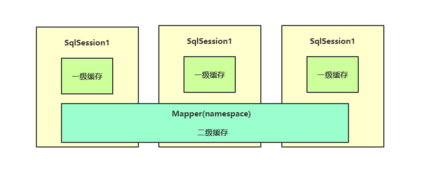

# 事务和锁机制

‍

## **事务**

和MySQL一样，在Redis中也有事务机制，当我们需要保证多条命令一次性完整执行而中途不受到其他命令干扰时，就可以使用事务机制。

我们可以使用命令来直接开启事务：

```sql
multi
```

当我们输入完所有要执行的命令时，可以使用命令来立即执行事务：

```sql
exec
```

我们也可以中途取消事务：

```sql
discard
```

实际上整个事务是创建了一个命令队列，它不像MySQL那种在事务中也能单独得到结果，而是我们提前将所有的命令装在队列中，但是并不会执行，而是等我们提交事务的时候再统一执行。

‍

‍

## 锁

又提到锁了，实际上这个概念对我们来说已经不算是陌生了。实际上在Redis中也会出现多个命令同时竞争同一个数据的情况，比如现在有两条命令同时执行，他们都要去修改a的值，那么这个时候就只能动用锁机制来保证同一时间只能有一个命令操作。

虽然Redis中也有锁机制，但是它是一种乐观锁，不同于MySQL，我们在MySQL中认识的锁是悲观锁，那么什么是乐观锁什么是悲观锁呢？

* 悲观锁：时刻认为别人会来抢占资源，禁止一切外来访问，直到释放锁，具有强烈的排他性质。
* 乐观锁：并不认为会有人来抢占资源，所以会直接对数据进行操作，在操作时再去验证是否有其他人抢占资源。

Redis中可以使用watch来监视一个目标，如果执行事务之前被监视目标发生了修改，则取消本次事务：

```sql
watch
```

我们可以开两个客户端进行测试。

取消监视可以使用：

```sql
unwatch
```

至此，Redis的基础内容就讲解完毕了，在之后的SpringCloud阶段，我们还会去讲解集群相关的知识，包括主从复制、哨兵模式等。

---

‍

‍

## Mybatis二级缓存

还记得我们在学习Mybatis讲解的缓存机制吗，我们当时介绍了二级缓存，它是Mapper级别的缓存，能够作用与所有会话。但是当时我们提出了一个问题，由于Mybatis的默认二级缓存只能是单机的，如果存在多台服务器访问同一个数据库，实际上二级缓存只会在各自的服务器上生效，但是我们希望的是多台服务器都能使用同一个二级缓存，这样就不会造成过多的资源浪费。

​​

我们可以将Redis作为Mybatis的二级缓存，这样就能实现多台服务器使用同一个二级缓存，因为它们只需要连接同一个Redis服务器即可，所有的缓存数据全部存储在Redis服务器上。我们需要手动实现Mybatis提供的Cache接口，这里我们简单编写一下：

```java
//实现Mybatis的Cache接口
public class RedisMybatisCache implements Cache {

    private final String id;
    private static RedisTemplate<Object, Object> template;

   	//注意构造方法必须带一个String类型的参数接收id
    public RedisMybatisCache(String id){
        this.id = id;
    }

  	//初始化时通过配置类将RedisTemplate给过来
    public static void setTemplate(RedisTemplate<Object, Object> template) {
        RedisMybatisCache.template = template;
    }

    @Override
    public String getId() {
        return id;
    }

    @Override
    public void putObject(Object o, Object o1) {
      	//这里直接向Redis数据库中丢数据即可，o就是Key，o1就是Value，60秒为过期时间
        template.opsForValue().set(o, o1, 60, TimeUnit.SECONDS);
    }

    @Override
    public Object getObject(Object o) {
      	//这里根据Key直接从Redis数据库中获取值即可
        return template.opsForValue().get(o);
    }

    @Override
    public Object removeObject(Object o) {
      	//根据Key删除
        return template.delete(o);
    }

    @Override
    public void clear() {
      	//由于template中没封装清除操作，只能通过connection来执行
				template.execute((RedisCallback<Void>) connection -> {
          	//通过connection对象执行清空操作
            connection.flushDb();
            return null;
        });
    }

    @Override
    public int getSize() {
      	//这里也是使用connection对象来获取当前的Key数量
        return template.execute(RedisServerCommands::dbSize).intValue();
    }
}
```

缓存类编写完成后，我们接着来编写配置类：

```java
@Configuration
public class MainConfiguration {
    @Resource
    RedisTemplate<Object, Object> template;

    @PostConstruct
    public void init(){
      	//把RedisTemplate给到RedisMybatisCache
        RedisMybatisCache.setTemplate(template);
    }
}
```

最后我们在Mapper上启用此缓存即可：

```java
//只需要修改缓存实现类implementation为我们的RedisMybatisCache即可
@CacheNamespace(implementation = RedisMybatisCache.class)
@Mapper
public interface MainMapper {

    @Select("select name from student where sid = 1")
    String getSid();
}
```

最后我们提供一个测试用例来查看当前的二级缓存是否生效：

```java
@SpringBootTest
class SpringBootTestApplicationTests {


    @Resource
    MainMapper mapper;

    @Test
    void contextLoads() {
        System.out.println(mapper.getSid());
        System.out.println(mapper.getSid());
        System.out.println(mapper.getSid());
    }

}
```

手动使用客户端查看Redis数据库，可以看到已经有一条Mybatis生成的缓存数据了。

## Token持久化存储

我们之前使用SpringSecurity时，remember-me的Token是支持持久化存储的，而我们当时是存储在数据库中，那么Token信息能否存储在缓存中呢，当然也是可以的，我们可以手动实现一个：

```java
//实现PersistentTokenRepository接口
@Component
public class RedisTokenRepository implements PersistentTokenRepository {
  	//Key名称前缀，用于区分
    private final static String REMEMBER_ME_KEY = "spring:security:rememberMe:";
    @Resource
    RedisTemplate<Object, Object> template;

    @Override
    public void createNewToken(PersistentRememberMeToken token) {
      	//这里要放两个，一个存seriesId->Token，一个存username->seriesId，因为删除时是通过username删除
        template.opsForValue().set(REMEMBER_ME_KEY+"username:"+token.getUsername(), token.getSeries());
        template.expire(REMEMBER_ME_KEY+"username:"+token.getUsername(), 1, TimeUnit.DAYS);
        this.setToken(token);
    }

  	//先获取，然后修改创建一个新的，再放入
    @Override
    public void updateToken(String series, String tokenValue, Date lastUsed) {
        PersistentRememberMeToken token = this.getToken(series);
        if(token != null)
           this.setToken(new PersistentRememberMeToken(token.getUsername(), series, tokenValue, lastUsed));
    }

    @Override
    public PersistentRememberMeToken getTokenForSeries(String seriesId) {
        return this.getToken(seriesId);
    }

  	//通过username找seriesId直接删除这两个
    @Override
    public void removeUserTokens(String username) {
        String series = (String) template.opsForValue().get(REMEMBER_ME_KEY+"username:"+username);
        template.delete(REMEMBER_ME_KEY+series);
        template.delete(REMEMBER_ME_KEY+"username:"+username);
    }

  
  	//由于PersistentRememberMeToken没实现序列化接口，这里只能用Hash来存储了，所以单独编写一个set和get操作
    private PersistentRememberMeToken getToken(String series){
        Map<Object, Object> map = template.opsForHash().entries(REMEMBER_ME_KEY+series);
        if(map.isEmpty()) return null;
        return new PersistentRememberMeToken(
                (String) map.get("username"),
                (String) map.get("series"),
                (String) map.get("tokenValue"),
                new Date(Long.parseLong((String) map.get("date"))));
    }

    private void setToken(PersistentRememberMeToken token){
        Map<String, String> map = new HashMap<>();
        map.put("username", token.getUsername());
        map.put("series", token.getSeries());
        map.put("tokenValue", token.getTokenValue());
        map.put("date", ""+token.getDate().getTime());
        template.opsForHash().putAll(REMEMBER_ME_KEY+token.getSeries(), map);
        template.expire(REMEMBER_ME_KEY+token.getSeries(), 1, TimeUnit.DAYS);
    }
}
```

接着把验证Service实现了：

```java
@Service
public class AuthService implements UserDetailsService {

    @Resource
    UserMapper mapper;

    @Override
    public UserDetails loadUserByUsername(String username) throws UsernameNotFoundException {
        Account account = mapper.getAccountByUsername(username);
        if(account == null) throw new UsernameNotFoundException("");
        return User
                .withUsername(username)
                .password(account.getPassword())
                .roles(account.getRole())
                .build();
    }
}
```

Mapper也安排上：

```java
@Data
public class Account implements Serializable {
    int id;
    String username;
    String password;
    String role;
}
```

```java
@CacheNamespace(implementation = MybatisRedisCache.class)
@Mapper
public interface UserMapper {

    @Select("select * from users where username = #{username}")
    Account getAccountByUsername(String username);
}
```

最后配置文件配一波：

```java
@Override
protected void configure(HttpSecurity http) throws Exception {
    http
            .authorizeRequests()
            .anyRequest().authenticated()
            .and()
            .formLogin()
            .and()
            .rememberMe()
            .tokenRepository(repository);
}

@Override
protected void configure(AuthenticationManagerBuilder auth) throws Exception {
    auth
            .userDetailsService(service)
            .passwordEncoder(new BCryptPasswordEncoder());
}
```

OK，启动服务器验证一下吧。

---

‍

‍
