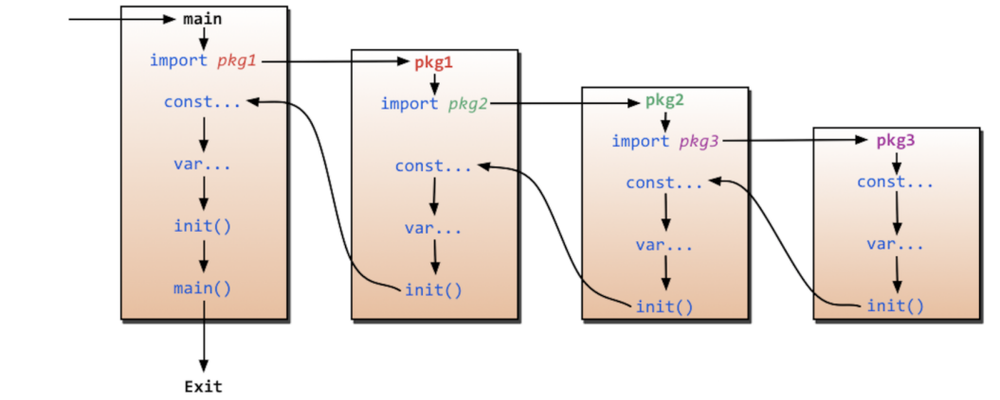

# Go

常用指令

```shell
go mod init <项目名称>

go run ./he.go

go build ./he.go

go build -o h.exe ./he.go
```

## 1、Hello Golang

### 1.1、语法特点：

```go
package main // 程序的包名

import "fmt"

// main函数
func main() { // 函数的{  一定是 和函数名在同一行的，否则编译错误
	// golang中的表达式，加";", 和不加 都可以，建议是不加
	fmt.Println(" hello Go!")
}

```

## 变量

### 全局\局部变量的声明

```go
var a int //方法一：声明一个变量 默认的值是0
var b int = 100 //方法二：声明一个变量，初始化一个值
var c = 100 // 方法三：在初始化的时候，可以省去数据类型，通过值自动匹配当前的变量的数据类型
e := 100 //方法四：(常用的方法) 省去var关键字，直接自动匹配
```

⽅法四不⽀持全局

```go
package main

import (
	"fmt"
)

// := 只能够用在 函数体内来声明
a := 10

func main() {

	fmt.Println("a = ", a)
	fmt.Printf("type of a = %T\n", a)
}

```

```bug
[Running] go run "d:\.github\GolangStudy\2-var\test.go"
# command-line-arguments
2-var\test.go:7:1: syntax error: non-declaration statement outside function body
```

### 多变量的声明

#### 单行写法

```go
var xx, yy int = 100, 200
var kk, ll = 100, "Aceld"
```

#### 多行写法

```go
var (
    vv int  = 100
    jj bool = true
)
```

## 常量 \ iota

```go
const a int = 10
// const 来定义枚举类型
const (
	// 可以在const() 添加一个关键字 iota， 每行的iota都会累加1, 
    // 第一行的iota的默认值是0
	a, b = iota+1, iota+2	 //iota = 0
    c, d				  
	e, f
	g, h = iota * 2, iota *3  
	i, k	
)

// 常量(只读属性)
// 不允许修改的。
// iota 只能够配合const() 一起使用， iota只有在const进行累加效果。
const length int = 10
```

## 多返回值

匿名

```go
// 返回多个返回值，匿名的
func foo2(a string, b int) (int, int) {
	fmt.Println("a = ", a)
	fmt.Println("b = ", b)
	return 666, 777
}

```

有形参名

```go
// 返回多个返回值， 有形参名称的
func foo3(a string, b int) (r1 int, r2 int) {
	fmt.Println("---- foo3 ----")
	fmt.Println("a = ", a)
	fmt.Println("b = ", b)
	// r1 r2 属于foo3的形参，  初始化默认的值是0
	// r1 r2 作用域空间 是foo3 整个函数体的{}空间
	fmt.Println("r1 = ", r1)
	fmt.Println("r2 = ", r2)
	// 给有名称的返回值变量赋值
	r1 = 1000
	r2 = 2000
	return
}

// 类型相同可以省略
func foo4(a string, b int) (r1, r2 int) {
	fmt.Println("---- foo4 ----")
	fmt.Println("a = ", a)
	fmt.Println("b = ", b)


	//给有名称的返回值变量赋值
	r1 = 1000
	r2 = 2000

	return
}
```

## init函数与import导包



```go
package main

import "fmt"

func changeValue(p *int) {
	*p = 10
}

func main() {
	var a int = 1
	changeValue(&a)
	fmt.Println("a =", a) // a = 10
}

```

```go
package main

import "fmt"

func changeValue(p int) {
	p = 10
}

func main() {
	var a int = 1
	changeValue(a)
	fmt.Println("a =", a) // a = 1
}

```
