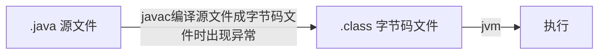

# Java 基础

[(29条消息) 最全java面试题及答案（208道）_十一技术斩的博客-CSDN博客](https://blog.csdn.net/uuqaz/article/details/123502779)

## Java 语言的三种技术架构

JavaEE：企业版、jsp、servlet等。

JavaME：小型版本，是为开发电子消费产品和嵌入式设备提供的解决方案。手机

JavaSE：Java标准版，集合、多线程、面向对象啊等。

## 标识符命名规则

可以由数字、字母、下划线（_)、$进行组合，不能够以数字作为开头合法的命名：a1、_abc(不推荐)、abc$

## 什么是强制类型转换、隐式类型转换？

将大的数据类型赋值小的数据类型称之为强制类型转换，会出现精度的损失

## native 修饰符是什么意思？

native 代表 java 访问其他语言编写的代码。

## 谈一谈面向对象思想

面向对象是相对于面向过程而言的，面向过程强调的是功能，面向对象强调的是将功能进行封装。

面向对象的 3 大基本特征：封装(private)、继承(extends)、多态

## 面向对象的三个基本特征？

继承： 继承就是子类继承父类的属性和方法。

封装：隐藏部分对象的属性和实现细节，对数据的访问只能通过外公开的接口。

多态：对于同一个行为，不同的子类对象具有不同的表现形式。

多态存在的3个条件：

* 继承；
* 重写；
* 父类引用指向子类对象。

```java
父类类型 对象 = new 子类对象();	// 改变子类对象
对象.get\set();
```

## 什么是编译时异常？什么是运行时异常？



## 一个Java文件里可以有多个类吗（不含内部类）？

1. 一个java文件内可以有多个类，但最多只有一个被 public 修饰的类
2. 这个文件包含public 修饰的类，这个类名必须与java文件名一致

## Set里的元素是不能重复的，那么用什么方法来区分重复与否呢？是用==还是equals()?

set 元素是不能重复的，可以用`equals()`​来判断！

## abstract class 和 interface 有什么区别？

abstract class 和 interface 都不能实例化。

abstract class 拥有自己的成员变量，interface 默认 static final 修饰

abstract class 方法可以私有化，非抽象方法，必须实现；interface 不能有私有的，默认是 public abstract

实现方式不同：abstract class 需要 extends，interface 要用 implement

## abstract 的 method 是否可同时是static？是否可同时是native？是否可同时是synchronized？

abstract 的方法可以同时是 static ！

abstract 的方法不能同时是native的！

native本身就和abstract冲突，他们都是方法的声明，只是一个把方法实现移交给子类，另一个是移交给本地操作系统。如果同时出现，就相当于既把实现移交给子类，又把实现移交给本地操作系统，那到底谁来实现具体方法呢！

abstract 的 方法可同时是 synchronized

## 静态变量和成员变量的区别

1. 调用方式：静态变量也称之为类变量，可以直接通过类名来调用。也可以通过对象名来调用
2. 存储位置：静态变量存储在方法区中的静态区域；成员变量存储在堆内存中
3. 生命周期：静态变量随着类的加载而存在，随着类的消失而消失，生命周期很长；

    成员变量随着对象的创建而存在，当对象消失时成员变量随之消失
4. 与对象的相关性：静态变量是所有对象共享的数据；成员变量是每个对象特有的

---

## 成员变量与局部变量的区别？

成员变量：直接放置在类中的变量称之为成员变量，与方法是平级关系。

局部变量：在方法体中声明的变量

1. 作用域：成员变量针对整个类有效；局部变量在某个范围内有效(方法、循环体)
2. 存储位置：成员变量随着对象的创建而存在，对象消失时成员变量就会消失，存储在堆内存中；局部变量在方法被调用，或者语句被执行的时候存在，存储在栈内存中。
3. 初始值：成员变量有默认的初始值(类类型的初始值为 Null，基本数据类型有各自特有的默认值)

## this关键字与 static 关键字

this 关键字：==代表的是本类对象的一个引用，谁调用 this所在的方法，this 就代表的是谁==

```java
    public void test1() { System.out.println(this); }
    public static void main(String[] args) { new Demo1().test1(); }
```

Static 关键字：用来修饰成员变量与成员方法

静态的特点：

1. 随着类的加载而加载
2. 优先与对象存在
3. 对所有的对象共享
4. 可以被类名直接调用

‍
