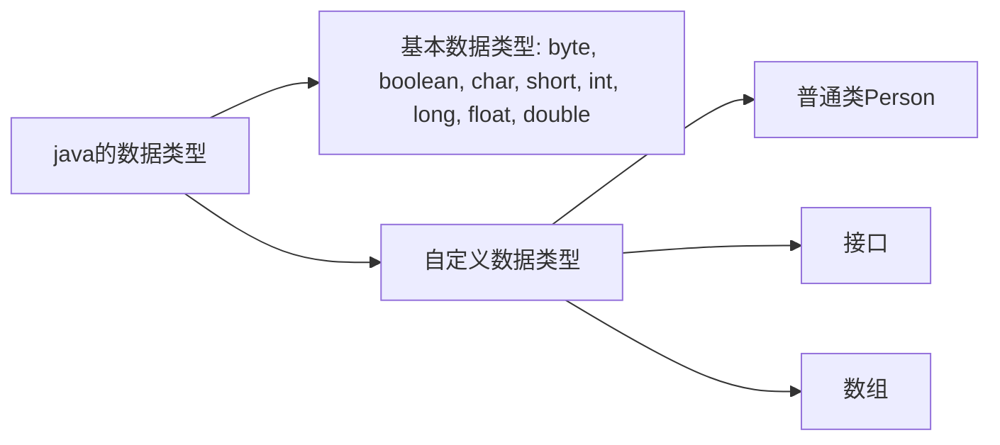

# String 属于基础的数据类型吗？

String 不属于基础类型，基础类型有 8 种：byte、boolean、char、short、int、float、long、double，而 String 属于对象。

## Java 中的数据类型

```mermaid
graph LR;
a[java的数据类型] --> b[基本数据类型: byte, boolean, char, short, int, long, float, double]
a --> c[自定义数据类型] --> 普通类Person
c --> 接口
c --> 数组
```

‍
