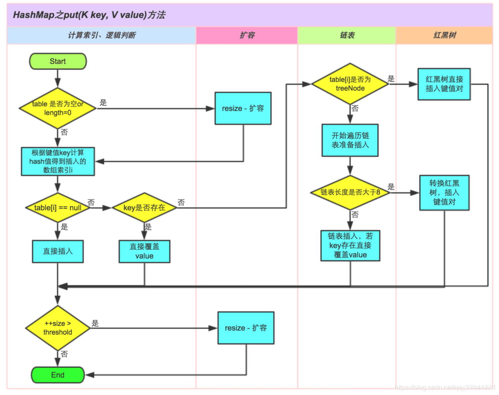

# 集合

[(33条消息) HashMap 详解_与忘_的博客-CSDN博客_hashmap](https://blog.csdn.net/shi_xiansheng/article/details/117792691)

[HashMap面试题及答案（2022版） - Java团长 - 博客园 (cnblogs.com)](https://www.cnblogs.com/java1024/p/13488714.html)

‍

# HashMap

## HashMap 的实现原理

数据机构：数组 + 链表 + 红黑树

HashMap 基于*​ ​*​*<u>Hash table</u>*（哈希表） 的 Map 接口实现，是以 `key-value`​ 存储键值对。`key-value`​ 都可以为 *null，*意味着它不是线程安全的。可以通过 `put(key, value)`​ 存储，`get(key)`​ 来获取。

当传入 key 时，HashMap 会根据 `key.hashCode()`​ 计算出的哈希码值，已存在的哈希码值进行 equals() 方法进行比较，hash 相等数据存放在链表反之数据存放在数组。

当链表长度大于或等于阈值（默认为 8）的时候，且当前数组的长度大于64时，此时索引位置上的所有数据改为使用红黑树存储。同样，后续如果由于删除或者其他原因调整了大小，当红黑树的节点小于或等于 6 个以后，又会恢复为链表形态。

链表转红黑树时，会判断阈值大于8当数组长度小于64，此时并不会将链表转为红黑树。而是选择数组扩容。

## HashMap的节点

HashMap是一个集合，键值对的集合,源码中每个节点用Node<K,V>表示

​​

```java
static class Node<K,V> implements Map.Entry<K,V> {
   final int hash;
   final K key;
   V value;
   Node<K,V> next;
}
```

Node是一个内部类，这里的key为键，value为值，next指向下一个元素，可以看出HashMap中的元素不是一个单纯的键值对，还包含下一个元素的引用。

## map.put(k, v)实现原理

​​

* ### put方法

  ```java
      static final int TREEIFY_THRESHOLD = 8;

      public V put(K key, V value) {
          return putVal(hash(key), key, value, false, true);

      }

      final V putVal(int hash, K key, V value, boolean onlyIfAbsent, boolean evict) {
          Node<K, V>[] tab;
          Node<K, V> p;
          int n, i;
          //如果当前map中无数据，执行resize方法。并且返回n
          if ((tab = table) == null || (n = tab.length) == 0) n = (tab = resize()).length;
          //如果要插入的键值对要存放的这个位置刚好没有元素，那么把他封装成Node对象，放在这个位置上即可
          if ((p = tab[i = (n - 1) & hash]) == null) tab[i] = newNode(hash, key, value, null);
              //否则的话，说明这上面有元素
          else {
              Node<K, V> e;
              K k;
              //如果这个元素的key与要插入的一样，那么就替换一下。
              if (p.hash == hash && ((k = p.key) == key || (key != null && key.equals(k)))) e = p;
                  //1.如果当前节点是TreeNode类型的数据，执行putTreeVal方法
              else if (p instanceof TreeNode) e = ((TreeNode<K, V>) p).putTreeVal(this, tab, hash, key, value);
              else {
                  //还是遍历这条链子上的数据，跟jdk7没什么区别
                  for (int binCount = 0; ; ++binCount) {
                      if ((e = p.next) == null) {
                          p.next = newNode(hash, key, value, null);
                          //2.完成了操作后多做了一件事情，判断，并且可能执行treeifyBin方法
                          if (binCount >= TREEIFY_THRESHOLD - 1) // -1 for 1st
                              treeifyBin(tab, hash);
                          break;
                      }
                      if (e.hash == hash && ((k = e.key) == key || (key != null && key.equals(k)))) break;
                      p = e;
                  }
              }
              if (e != null) { // existing mapping for key
                  V oldValue = e.value;
                  if (!onlyIfAbsent || oldValue == null) //true || --
                      e.value = value;
                  //3.
                  afterNodeAccess(e);
                  return oldValue;
              }
          }
          ++modCount;
          //判断阈值，决定是否扩容
          if (++size > threshold) resize();
          //4.
          afterNodeInsertion(evict);
          return null;
      }
  ```

第一步首先将k,v封装到Node对象当中（节点）。第二步它的底层会调用K的hashCode()方法得出hash值。第三步通过哈希表函数/哈希算法，将hash值转换成数组的下标，下标位置上如果没有任何元素，就把Node添加到这个位置上。如果说下标对应的位置上有链表。此时，就会拿着k和链表上每个节点的k进行equals()比较。如果所有的equals方法返回都是false，那么这个新的节点将被添加到链表的末尾。如其中有一个equals返回了true，那么这个节点的value将会被覆盖。

## map.get(k)实现原理

第一步：先调用k的hashCode()方法得出哈希值，并通过哈希算法转换成数组的下标。第二步：通过上一步哈希算法转换成数组的下标之后，在通过数组下标快速定位到某个位置上。重点理解如果这个位置上什么都没有，则返回null。如果这个位置上有单向链表，那么它就会拿着参数K和单向链表上的每一个节点的K进行equals，如果所有equals方法都返回false，则get方法返回null。如果其中一个节点的K和参数K进行equals返回true，那么此时该节点的value就是我们要找的value了，get方法最终返回这个要找的value。  

## HashMap存储元素的过程

```java
Map<String,String> map = new HashMap<>();
map.put("刘德华","张惠妹");
map.put("张学友","大S");
```

# ArrayList

‍
