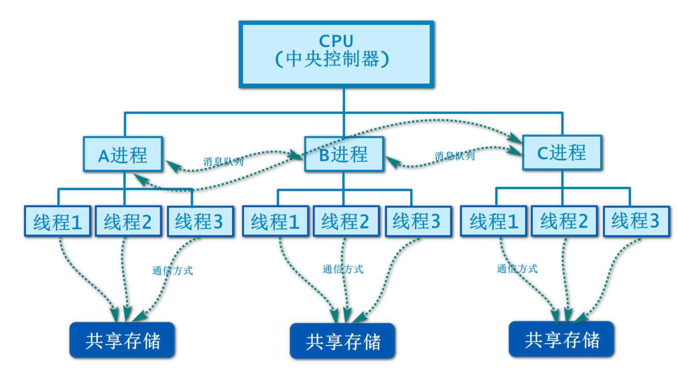

# 程序进程线程

**程序 (program)：**为完成特定任务、用某种语言编写的一组指令的集 合。即指一段静态的代码，静态对象。

**进程 (process)：**程序的一次执行过程，或是正在运行的一个程序。 是一个动态的过程：有它自身的产生、存在和消亡的过程。——生命周期。 ·如：运行中的 QQ，运行中的 MP3 播放器程序是静态的，进程是动态的。 ·进程作为资源分配的单位，系统在运行时会为每个进程分配不同的内存区 域。

**线程 (thread)：**进程可进一步细化为线程，是一个程序内部的一条执 行路径。 ·若一个进程同一时间并行执行多个线程，就是支持多线程的。 ·线程是调度和执行的单位，每个线程拥有独立的运行栈和程序计数器 (pc)， 线程切换的开销小。 ·一个进程中的多个线程共享相同的内存单元 / 内存地址空间—》它们从同 一堆中分配对象，可以访问相同的变量和对象。这就使得线程间通信更简便、 高效。但多个线程操作共享的系统资源可能就会带来安全的隐患。

# 进程与线程

线程是操作系统调度的最小单元，它可以让一个进程并发地处理多个任务，也叫轻量级进程。所以，在一个进程里可以创建多个线程，这些线程都拥有各自的计数器、堆栈、局部变量，并且能够共享进程内的资源。由于共享资源,处理器便可以在这些线程之间快速切换,从而让使用者感觉这些线程在同时执行。 总的来说，操作系统可以同时执行多个任务，每个任务就是一个进程。进程可以同时执行多个任务，每个任务就是一个线程。一个程序运行之后至少有一个进程，而一个进程可以包含多个线程，但至少要包含一个线程。 

​​

# 守护线程是什么？

守护线程是运行在后台的一种特殊进程。它独立于控制终端并且周期性地执行某种任务或等待处理某些发生的事件。在 Java 中垃圾回收线程就是特殊的守护线程。

# 线程和协程的区别

得分点 地址空间、开销、并发性、内存 标准回答 进程和线程的主要差别在于它们是不同的操作系统资源管理方式。

1. 进程有独立的地址空间,线程有自己的堆栈和局部变量,但线程之间没有单独的地址空间；
2. 进程和线程切换时,需要切换进程和线程的上下文,进程的上下文切换时间开销远远大于线程上下文切换时间,耗费资源较大,效率要差一些；
3. 进程的并发性较低,线程的并发性较高；
4. 每个独立的进程有一个程序运行的入口、顺序执行序列和程序的出口,但是线程不能够独立执行,必须依存在应用程序中,由应用程序提供多个线程执行控制；
5. 系统在运行的时候会为每个进程分配不同的内存空间；而对线程而言,除了 CPU 外,系统不会为线程分配内存（线程所使用的资源来自其所属进程的资源）,线程组之间只能共享资源；
6. 一个进程崩溃后,在保护模式下不会对其他进程产生影响,但是一个线程崩溃整个进程都死掉。所以多进程要比多线程健壮。

# 进程间通信有哪几种方式？

[(32条消息) 进程间通信有哪几种方式？进程间通信的方法详解_qq_43519025的博客-CSDN博客_进程间通信的几种方法](https://blog.csdn.net/qq_43519025/article/details/120798727)

进程间通信（IPC，Interprocess communication）是一组编程接口，让程序员能够协调不同的进程，使之能在一个操作系统里同时运行，并相互传递、交换信息。这使得一个程序能够在同一时间里处理许多用户的要求。因为即使只有一个用户发出要求，也可能导致一个操作系统中多个进程的运行，进程之间必须互相通话。IPC接口就提供了这种可能性。每个IPC方法均有它自己的优点和局限性，一般，对于单个程序而言使用所有的IPC方法是不常见的。

进程间通信的8种方法：

1. 无名管道通信

    无名管道（ pipe ）：管道是一种半双工的通信方式，数据只能单向流动，而且只能在具有亲缘关系的进程间使用。进程的亲缘关系通常是指父子进程关系。

2. 高级管道通信

    高级管道（popen）：将另一个程序当做一个新的进程在当前程序进程中启动，则它算是当前程序的子进程，这种方式我们成为高级管道方式。

3. 有名管道通信

    有名管道 （named pipe） ： 有名管道也是半双工的通信方式，但是它允许无亲缘关系进程间的通信。

4. 消息队列通信

    消息队列（ message queue ） ： 消息队列是由消息的链表，存放在内核中并由消息队列标识符标识。消息队列克服了信号传递信息少、管道只能承载无格式字节流以及缓冲区大小受限等缺点。

5. 信号量通信

    信号量（ semophore ） ： 信号量是一个计数器，可以用来控制多个进程对共享资源的访问。它常作为一种锁机制，防止某进程正在访问共享资源时，其他进程也访问该资源。因此，主要作为进程间以及同一进程内不同线程之间的同步手段。

6. 信号

    信号 （ sinal ） ： 信号是一种比较复杂的通信方式，用于通知接收进程某个事件已经发生。

7. 共享内存通信

    共享内存（ shared memory ） ：共享内存就是映射一段能被其他进程所访问的内存，这段共享内存由一个进程创建，但多个进程都可以访问。共享内存是最快的 IPC 方式，它是针对其他进程间通信方式运行效率低而专门设计的。它往往与其他通信机制，如信号两，配合使用，来实现进程间的同步和通信。

8. 套接字通信

    套接字（ socket ） ： 套接口也是一种进程间通信机制，与其他通信机制不同的是，它可用于不同机器间的进程通信。

# 并行和并发有什么区别？

* 并行：多个处理器或多核处理器同时处理多个任务。
* 并发：多个任务在同一个 CPU 核上，按细分的时间片轮流(交替)执行，从逻辑上来看那些任务是同时执行。

‍
