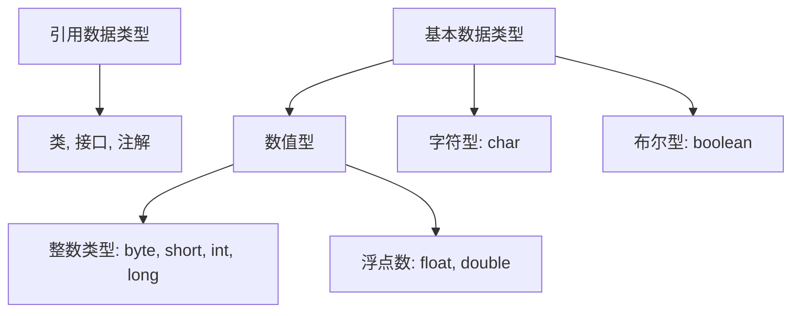

# String 是 Java 基本数据类型吗

答：不是。`Java`​ 中的基本数据类型只有8个：

```mermaid
graph TD;
g[引用数据类型] --> u[类, 接口, 注解]
b[基本数据类型] --> c[数值型] -->e[整数类型: byte, short, int, long]
c[数值型] -->f[浮点数: float, double]
b[基本数据类型] --> a[字符型: char]
b[基本数据类型] --> d[布尔型: boolean]
```

基本数据类型：数据直接存储在栈上

引用数据类型：数据存储在堆上，栈上只存储引用地址

‍
