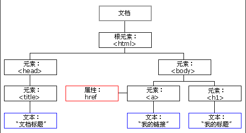

## JavaScript 语言

也称为js，是我们整个前端基础的重点内容，只有了解了JavaScript语言，我们才能了解前端如何与后端交互。

JavaScript与Java没有毛关系，仅仅只是名字中包含了Java而已，跟Java比起来，它更像Python，它是一门解释型语言，不需要进行编译，它甚至可以直接在浏览器的命令窗口中运行。

它相当于是前端静态页面的一个补充，它可以让一个普通的页面在后台执行一些程序，比如我们点击一个按钮，我们可能希望执行某些操作，比如下载文件、页面跳转、页面弹窗、进行登陆等，都可以使用JavaScript来帮助我们实现。

我们来看看一个简单的JavaScript程序：

```js
const arr = [0, 2, 1, 5, 9, 3, 4, 6, 7, 8]

for (let i = 0; i < arr.length; i++) {
    for (let j = 0; j < arr.length - 1; j++) {
        if(arr[j] > arr[j+1]){
            const tmp = arr[j]
            arr[j] = arr[j+1]
            arr[j+1] = tmp
        }
    }
}

window.alert(arr)
```

这段代码实际上就是实现了一个冒泡排序算法，我们可以直接在页面的头部中引用此js文件，浏览器会在加载时自动执行js文件中编写的内容：

```html
<script src="test.js"></script>
```

我们发现JS的语法和Java非常相似，但是它还是和Java存在一些不同之处，而且存在很多阴间语法，那么我们来看看JS的语法。


### JavaScript基本语法

在js中，定义变量和Java中有一些不同，定义一个变量可以使用`let`关键字或是`var`关键字，IDEA推荐我们使用`let`关键字，因为`var`存在一定的设计缺陷（这里就不做讲解了，之后一律使用let关键字进行变量声明）：

```js
let a = 10;
a++;
window.alert(a)
```

上面的结果中，我们得到了a的结果是11，也就是说自增和自减运算在JS中也是支持的，并且JS每一句结尾可以不用加分号。

js并不是Java那样的强类型语言（任意变量的类型一定是明确的），它是一门弱类型语言，变量的类型并不会在一开始确定，因此我们在定义变量时无需指定变量的确切类型，而是在运行时动态解析类型：

```js
let a = 10;
a = "HelloWorld！"
console.info(a)
```

我们发现，变量a已经被赋值为数字类型，但是我们依然在后续能将其赋值一个字符串，它的类型是随时可变的。

很多人说，这种变态的类型机制是JS的一大缺陷。

世界上只有两种语言：一种是很多人骂的，一种是没人用的。

我们接着来看看，JS中存在的基本数据类型：

* Number：数字类型（包括小数和整数）
* String：字符串类型（可以使用单引号或是双引号）
* Boolean：布尔类型（与Java一致）

还包括一些特殊值：

* undefined：未定义 - 变量声明但不赋值默认为undefined

* null：空值 - 等同于Java中的null

* NaN：非数字 - 值不是合法数字，比如：

  ```js
  window.alert(100/'xx')
  ```

我们可以使用`typeof`关键字来查看当前变量值的类型：

```js
let a = 10;
console.info(typeof a)
a = 'Hello World'
console.info(typeof a)
```


### JavaScript逻辑运算和流程控制

我们接着来看看js中的关系运算符，包括如下8个关系运算符：大于（>）,小于（<）,小于等于（<=）,大于等于（>=）,相等（==），不等（!=），全等（===），不全等（!==）

其实关系运算符大致和Java中的使用方法一致，不过它还可以进行字符串比较，有点像C++的语法：

```js
console.info(666 > 777)
console.info('aa' > 'ab')
```

那么，相等和全等有什么区别呢？

```java
console.info('10' == 10)
console.info('10' === 10)
```

我们发现，在Java中，若运算符两边是不同的基本数据类型，会直接得到false，而JS中却不像这样，我们发现字符串的10居然等于数字10，而使用全等判断才是我们希望的结果。

`==`的比较规则是：当操作数类型一样时，比较的规则和恒等运算符一样，都相等才相等，如果两个操作数是字符串，则进行字符串的比较，如果里面有一个操作数不是字符串，那两个操作数通过Number()方法进行转换，转成数字进行比较。

因此，我们上面进行的判断实际上是运算符两边都进行了数字转换的结果进行比较，自然也就得到了true，而全等判断才是我们在Java中认识的相等判断。

我们接着来看逻辑运算，JS中包括&&、||、&、|、?:等，我们先来看看位运算符：

```js
console.info(4 & 7)
console.info(4 | 7)
```

实际上和Java中是一样的，那么我再来看看逻辑运算：

```js
console.info(true || false)
```

对于boolean变量的判断，是与Java一致的，但是JS也可以使用非Boolen类型变量进行判断：

```js
console.info(!0)
console.info(!1)
```

和C/C++语言一样，0代表false，非0代表true，那么字符串呢？

```js
console.info(!"a")
console.info(!"")
```

我们发现，空串为false，非空串为true，我们再来看看：

```js
console.info(true || 7)
console.info(7 || true)
```

我们发现，前者得到的结果为true，而后者得到的结果却是是7，真是滑天下之大稽，什么鬼玩意，实际上是因为，默认非0都是true，而后者又是先判断的7，因此会直接得到7而不是被转换为true

那么我们再来看看几个特殊值默认代表什么：

```js
console.info(!undefined)
console.info(!null)
console.info(!NaN)
```

最后来使用一下三元运算符，实际上和Java中是一样的：

```js
let a = true ? "xx" : 20
console.info(a)
```

得益于JS的动态类型，emmm，三元运算符不一定需要固定的返回值类型。

JS的分支结构，实际上和Java是一样的，也是使用if-else语句来进行：

```js
if("lbwnb"){   //非空串为true
    console.info("!!!")
} else {
    console.info("???")
}
```

同理，多分支语句也能实现：

```js
if(""){
    console.info("!!!")
} else if(-666){
    console.info("???")
} else {
    console.info("O.O")
}
```

当然，多分支语句也可以使用switch来完成：

```js
let a = "a"
switch (a){
    case "a":
        console.info("1")
        break
    case "b":
        console.info("2")
        break
    case "c":
        console.info("3")
        break
    default:
        console.info("4")
}
```

接着我们来看看循环结构，其实循环结构也和Java相差不大：

```js
let i = 10
while(i--){
    console.info("100")
}
```

```js
for (let i = 0; i < 10; i++) {
    console.info("??")
}
```


### JavaScript函数定义

JS中的方法和Java中的方法定义不太一样，JS中一般称其为函数，我们来看看定义一个函数的格式是什么：

```js
function f() {
    console.info("有一个人前来买瓜")
}
```

定义一个函数，需要在前面加上`function`关键字表示这是一个函数，后面跟上函数名称和`()`，其中可以包含参数，在`{}`中编写函数代码。我们只需要直接使用函数名+`()`就能调用函数：

```js
f();
```

我们接着来看一下，如何给函数添加形式参数以及返回值：

```js
function f(a) {
    console.info("得到的实参为："+a)
    return 666
}

f("aa");
```

由于JS是动态类型，因此我们不必指明参数a的类型，同时也不必指明返回值的类型，一个函数可能返回不同类型的结果，因此直接编写return语句即可。同理，我们可以在调用函数时，不传参，那么默认会使用undefined：

```js
function f(a) {
    console.info("得到的实参为："+a)
    return 666
}

f();
```

那么如果我们希望不传参的时候使用我们自定义的默认值呢？

```js
function f(a = "6666") {
    console.info("得到的实参为："+a)
    return 666
}

f();
```

我们可以直接在形参后面指定默认值。

函数本身也是一种类型，他可以被变量接收，所有函数类型的变量，也可以直接被调用：

```js
function f(a = "6666") {
    console.info("得到的实参为："+a)
    return 666
}

let k = f;
k();
```

我们也可以直接将匿名函数赋值给变量：

```js
let f = function (str) {
    console.info("实参为："+str)
}
```

既然函数是一种类型，那么函数也能作为一个参数进行传递：

```js
function f(test) {
    test();
}

f(function () {
    console.info("这是一个匿名函数")
})
```

对于所有的匿名函数，可以像Java的匿名接口实现一样编写lambda表达式：

```js
function f(test) {
    test();
}

f(() => {
    console.info("可以，不跟你多bb")
})
```

```js
function f(test) {
    test("这个是回调参数");
}

f(param => {
    console.info("接受到回调参数："+param)
})
```


### JavaScript数组和对象

JS中的数组定义与Java不同，它更像是Python中的列表，数组中的每个元素并不需要时同样的类型：

```js
let arr = [1, "lbwnb", false, undefined, NaN]
```

我们可以直接使用下标来访问：

```js
let arr = [1, "lbwnb", false, undefined, NaN]
console.info(arr[1])
```

我们一开始编写的排序算法，也是使用了数组。

数组还可以动态扩容，如果我们尝试访问超出数组长度的元素，并不会出现错误，而是得到undefined，同样的，我们也可以直接往超出数组长度的地方设置元素：

```js
let arr = [1, "lbwnb", false, undefined, NaN]
arr[5] = "???"
console.info(arr)
```

也可以使用`push`和`pop`来实现栈操作：

```js
let arr = [1, "lbwnb", false, undefined, NaN]
arr.push("bbb")
console.info(arr.pop())
console.info(arr)
```

数组还包括一些其他的方法，这里就不一一列出了：

```js
let arr = [1, "lbwnb", false, undefined, NaN]
arr.fill(1)
console.info(arr.map(o => {
    return 'xxx'+o
}))
```

我们接着来看对象，JS中也能定义对象，但是这里的对象有点颠覆我们的认知：

```js
let obj = new Object()
let obj = {}
```

以上两种写法都能够创建一个对象，但是更推荐使用下面的一种。

JS中的对象也是非常随意的，我们可以动态为其添加属性：

```js
let obj = {}
obj.name = "伞兵一号"
console.info(obj)
```

同理，我们也可以给对象动态添加一个函数：

```js
let obj = {}
obj.f = function (){
    console.info("我是对象内部的函数")
}

obj.f()
```

我们可以在函数内使用this关键字来指定对象内的属性：

```js
let name = "我是外部变量"
let obj = {}
obj.name = "我是内部变量"
obj.f = function (){
    console.info("name属性为："+this.name)
}

obj.f()
```

**注意：**如果使用lambda表达式，那么this并不会指向对象。

除了动态添加属性，我们也可以在一开始的时候指定对象内部的成员：

```js
let obj = {
    name: "我是内部的变量",
  	f: function (){
        console.info("name属性为："+this.name)
    }
}

obj.f()
```

注意如果有多行属性，需要在属性定义后添加一个`,`进行分割！


### JavaScript事件

当我们点击一个页面中的按钮之后，我们希望之后能够进行登陆操作，或是执行一些JS代码来实现某些功能，那么这个时候，就需要用到事件。

事件相当于一个通知，我们可以提前设定好事件发生时需要执行的内容，当事件发生时，就会执行我们预先设定好的JS代码。

事件有很多种类型，其中常用的有：

* onclick：点击事件
* oninput：内容输入事件
* onsubmit：内容提交事件

那么如何为事件添加一个动作呢？

```html
<input type="password" oninput="console.info('正在输入文本')">
```

我们可以直接为一个元素添加对应事件的属性，比如`oninput`事件，我们可以直接在事件的值中编写js代码，但是注意，只能使用单引号，因为双引号用于囊括整个值。

我们也可以单独编写一个函数，当事件发生时直接调用我们的函数：

```js
function f() {
    window.alert("你输入了一个字符")
}
```

```html
<input type="password" oninput="oninput()">
```

仅仅了解了事件，还不足以实现高度自定义，我们接着来看DOM。


### Document对象

当网页被加载时，浏览器会创建页面的文档对象模型（*D*ocument *O*bject *M*odel），它将整个页面的所有元素全部映射为JS对象，这样我们就可以在JS中操纵页面中的元素。




比如我现在想要读取页面中某个输入框中的内容，那么我们就需要从DOM中获取此输入框元素的对象：

```js
document.getElementById("pwd").value
```

通过document对象就能够快速获取当前页面中对应的元素，并且我们也可以快速获取元素中的一些属性。

比如现在我们可以结合事件，来进行密码长度的校验，密码长度小于6则不合法，不合法的密码，会让密码框边框变红，那么首先我们先来编写一个css样式：

```css
.illegal-pwd{
    border: red 1px solid !important;
    box-shadow: 0 0 5px red;
}
```

接着我们来编写一下js代码，定义一个函数，此函数接受一个参数（元素本身的对象）检测输入的长度是否大于6，否则就将当前元素的class属性设定为css指定的class：

```js
function checkIllegal(e) {
    if(e.value.length < 6) {
        e.setAttribute("class", "illegal-pwd")   
    }else {
        e.removeAttribute("class")
    }
}
```

最后我们将此函数绑定到`oninput`事件即可，注意传入了一个this，这里的this代表的是输入框元素本身：

```html
<input id="pwd" oninput="checkIllegal(this)" type="password">
```

现在我们在输入的时候，会自动检查密码是否合法。

既然oninput本身也是一个属性，那么实际上我们可以动态进行修改：

```js
document.getElementById("pwd").oninput = () => console.info("???")
```

那么，我们前面提及的window对象又是什么东西呢？

实际上Window对象范围更加广阔，它甚至直接代表了整个窗口，当然也包含我们的Document对象，我们一般通过Window对象来弹出提示框之类的东西。


### 发送XHR请求

JS的大致内容我们已经全部学习完成了，那么如何使用JS与后端进行交互呢？

我们知道，如果我们需要提交表单，那么我们就需要将表单的信息全部发送给我们的服务器，那么，如何发送给服务器呢？

通过使用XMLHttpRequest对象，来向服务器发送一个HTTP请求，下面是一个最简单的请求格式：

```js
let xhr = new XMLHttpRequest();
xhr.open('GET', 'https://www.baidu.com');
xhr.send();
```

上面的例子中，我们向服务器发起了一次网络请求，但是我们请求的是百度的服务器，并且此请求的方法为GET请求。

我们现在将其绑定到一个按钮上作为事件触发：

```js
function http() {
    let xhr = new XMLHttpRequest();
    xhr.open('GET', 'https://www.baidu.com');
    xhr.send();    
}
```

```html
<input id="button" type="button" onclick="http()">
```

我们可以在网络中查看我们发起的HTTP请求并且查看请求的响应结果，比如上面的请求，会返回百度这个页面的全部HTML代码。

实际上，我们的浏览器在我们输入网址后，也会向对应网站的服务器发起一次HTTP的GET请求。

在浏览器得到页面响应后，会加载当前页面，如果当前页面还引用了其他资源文件，那么会继续向服务器发起请求，直到页面中所有的资源文件全部加载完成后，才会停止。