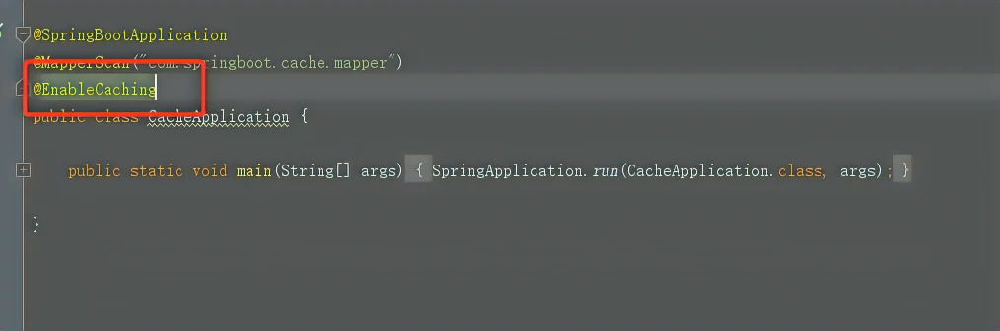
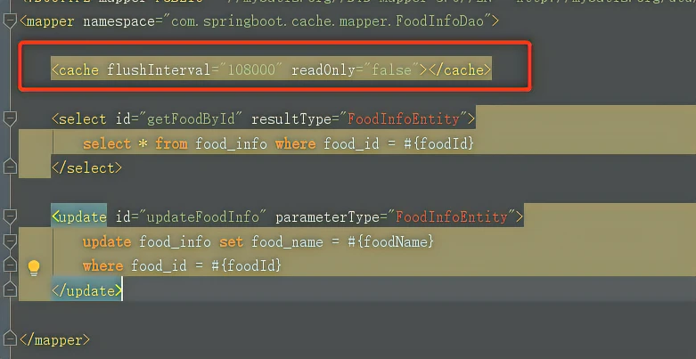
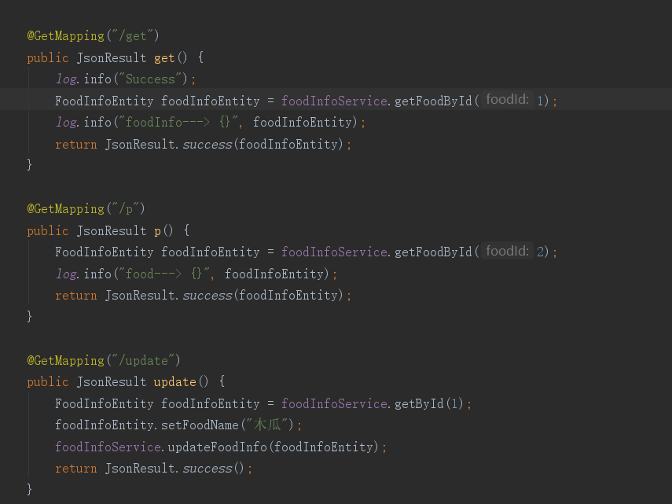
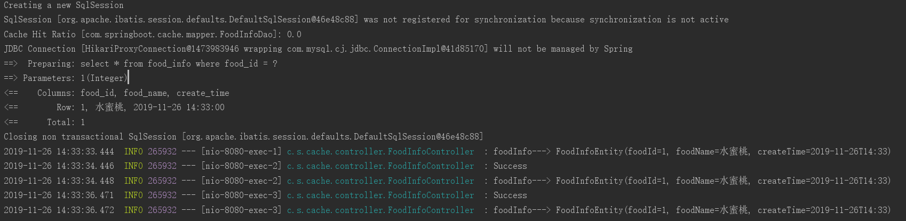
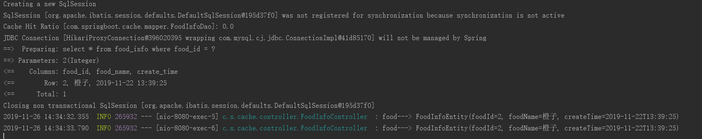
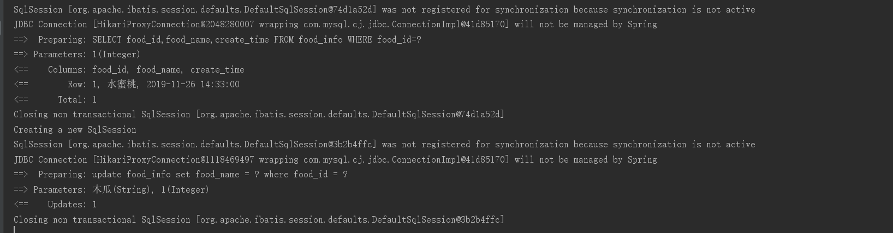
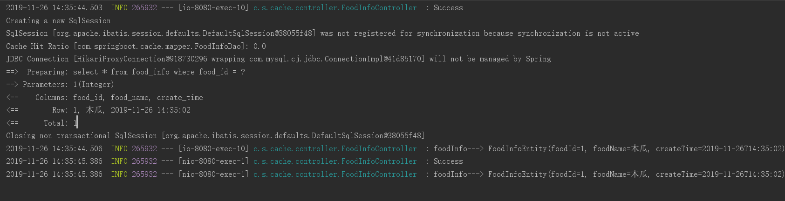

# MybatisPlus 二级缓存

参考文档：

[Mybatis MybatisPlus 二级缓存实践 代码生成器_哔哩哔哩_bilibili](https://www.bilibili.com/video/BV1jF411n7VH/?spm_id_from=333.999.0.0&vd_source=9bfc54d2ed901f1eab04708cc346c2f5)

[MybatisCache缓存体系探究 (altitude.xin)](https://www.altitude.xin/blog/home/#/chapter/baf6de8cfd2db86a9decd1226e2a8e4f)

[(37条消息) Mybatis-plus 开启二级缓存_mybatisplus cache-enabled_Csea_的博客-CSDN博客](https://blog.csdn.net/qq_38494341/article/details/103382757)

---

**Ehcache、Redis比较**

* **Ehcache ​**是直接在 JVM 虚拟机中缓存，速度快，效率高；但是共享缓存麻烦，在分布式下显得功能弱；

* **Redis ​**是通过 socket 访问到缓存服务，效率比 **Ehcache ​**低，但是比访问数据库快；在处理分布式下共享缓存很方便，并且机制成熟。

 单体应用可以采用**Ehcache ​**，在大型应用场景下，分布式要求就采用**Redis ​**。

 补充：**Ehcache ​**也是有共享缓存的方案，但是是通过RMI或Jgroup多广播方式进行广播缓存和通知刷新，这样缓存复杂，维护不方便，简单缓存还是可以的，但是涉及恢复或数据量大的情况下，显得功能弱，不适合。  

**Ehcache简介：**EhCache 是一个纯Java的进程内缓存框架，具有快速、精干等特点，是Hibernate中默认CacheProvider。 Ehcache是一种广泛使用的开源Java分布式缓存。主要面向通用缓存,Java EE和轻量级容器。它具有内存和磁盘存储，缓存加载器,缓存扩展,缓存异常处理程序,一个gzip缓存servlet过滤器,支持REST和SOAP api等特点。

 Spring 提供了对缓存功能的抽象：即允许绑定不同的缓存解决方案（如Ehcache），但本身不直接提供缓存功能的实现。它支持注解方式使用缓存，非常方便。  

**[全局配置](https://www.altitude.xin/blog/home/#/chapter/baf6de8cfd2db86a9decd1226e2a8e4f?id=_1%E3%80%81%E5%85%A8%E5%B1%80%E9%85%8D%E7%BD%AE)**

```yml
mybatis:
  configuration:
    cache-enabled: true						# 开启二级缓存
    log-impl: org.apache.ibatis.logging.stdout.StdOutImpl	# 输出日志
```

2.在启动类上添加：@EnableCaching

​​

 3.在xml文件中添加标签，并添加相应的sql执行语句

 **mybatis-plus版本必须低于2.0.9才可以使用二级缓存，否则MP自带的一些方法就算配置了二级缓存也不起作用。**

​​

4.在Mapper、Service层添加相应方法之后，在Service的方法上配置缓存，key应该是不同的，不同id的对应不同的数据。

​​

 ①Cacheable：根据方法的请求参数对其结果进行缓存，多用于查询

 ②CachePut：执行方法，并缓存结果

 ③CacheEvict：清空缓存

 ④Caching：能够同时应用多个缓存注解功能

 ⑤CacheConfig：用于抽取缓存的公共配置（类级别）

 5.我这里添加了3个接口用来做测试  
​

运行第一个接口时，控制台输出只有一次去打开数据库去获取数据，其他几次都是去缓存中获取。

‍

​​

同理第二个接口也是跟第一个接口一样

​​​

当我执行更新方法之后，控制台会打印输出：

​​

此时我们再去执行第一个接口时，又会去打开数据库取获取数据，并且数据更新了（key的关键作用就是指定那条数据）

​​

‍

### 2、[Mapper层配置](https://www.altitude.xin/blog/home/#/chapter/baf6de8cfd2db86a9decd1226e2a8e4f?id=_2%E3%80%81mapper%E5%B1%82%E9%85%8D%E7%BD%AE)

```java
@Mapper
@CacheNamespace
public interface LabelMapper extends BaseMapper<Label> {

}
```

‍
