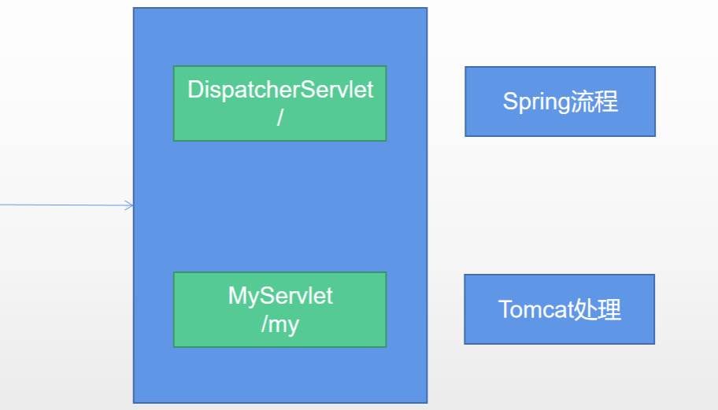

# Web原生组件注入（Servlet、Filter、Listener）

**使用Servlet API**

* @ServletComponentScan(basePackages = "com.atguigu.admin") :指定原生Servlet组件都放在那里

* @WebServlet(urlPatterns = "/my")：效果：直接响应，没有经过Spring的拦截器？

* @WebFilter(urlPatterns={"/css/*&quot;,&quot;/images/*"})

* @WebListener

推荐可以这种方式；

扩展：DispatchServlet 如何注册进来

* 容器中自动配置了  DispatcherServlet  属性绑定到 WebMvcProperties；对应的配置文件配置项是 spring.mvc。
* 通过 ServletRegistrationBean<DispatcherServlet> 把 DispatcherServlet  配置进来。
* 默认映射的是 / 路径。

​​

**Tomcat-Servlet；**

多个Servlet都能处理到同一层路径，精确优选原则

​A： /my/

B： /my/1

**使用RegistrationBean**

​`ServletRegistrationBean`​, `FilterRegistrationBean`​, and `ServletListenerRegistrationBean`​

```java
@Configuration
public class MyRegistConfig {

    @Bean
    public ServletRegistrationBean myServlet(){
        MyServlet myServlet = new MyServlet();

        return new ServletRegistrationBean(myServlet,"/my","/my02");
    }

    @Bean
    public FilterRegistrationBean myFilter(){

        MyFilter myFilter = new MyFilter();
//        return new FilterRegistrationBean(myFilter,myServlet());
        FilterRegistrationBean filterRegistrationBean = new FilterRegistrationBean(myFilter);
        filterRegistrationBean.setUrlPatterns(Arrays.asList("/my","/css/*"));
        return filterRegistrationBean;
    }

    @Bean
    public ServletListenerRegistrationBean myListener(){
        MySwervletContextListener mySwervletContextListener = new MySwervletContextListener();
        return new ServletListenerRegistrationBean(mySwervletContextListener);
    }
}
```

‍

‍

‍
